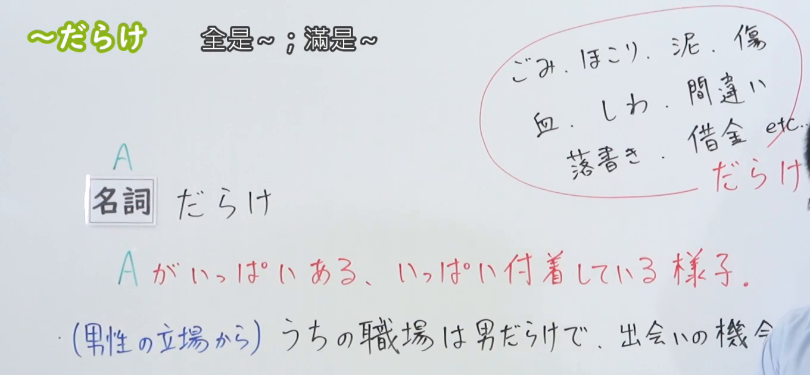

---
{
  "draft_id": "draft-20260911-n3-g-0031",
  "confirmed": false,
  "created_at": "2026-09-11",
  "proposal": {
    "id": "N3-G-0031",
    "kind": "grammar",
    "level": "N3",
    "title": "～だらけ：满是……、净是……",
    "status": "draft",
    "card_revision": 1,
    "source": {
      "lesson": "N3 第31个语法",
      "material": "出口日語日语讲解、0:01板书与两份独立日文教学资料复核",
      "video": "https://www.youtube.com/watch?v=XA_CEir1-3s",
      "screenshot": "assets/grammar/n3/N3-G-0031-0001.png",
      "screenshot_seconds": 1,
      "screenshot_crop": {"x": 0, "y": 0, "width": 1360, "height": 630}
    },
    "tags": ["大量存在", "附着", "负面语感", "N3"],
    "confusions": ["名词直接接续", "だらけの", "名词性质与说话人评价", "たくさん"]
  }
}
---

# N3 第31课｜～だらけ（待确认）

# 视频学习资料整理

根据学习者指定的出口日語第31课整理。学习者尚未提供本课个人理解或例句，以下内容不作为学习者原始输出。待审核确认后再入库。

来源：[出口日語第31课，0:01](https://www.youtube.com/watch?v=XA_CEir1-3s&t=1s)。实际时间 00:01.000；原帧 1920×1080，固定左上角，将右下角收至 (1360, 630)，裁去底部空白和右侧多余画面，保留接续及可见板书，未重绘。

[打开裁切截图](../assets/grammar/n3/N3-G-0031-0001.png)

# 核心与接续

**名词＋だらけ：满是……、净是……。**

表示某种东西大量存在，或某物上面沾满了某种东西，通常带有不理想、令人不快的语气。[原课程](https://www.youtube.com/watch?v=XA_CEir1-3s)与[日本語NET](https://nihongokyoshi-net.com/2018/04/03/jlptn3-grammar-darake/)对此一致。

| 类型 | 接续规则 | 示例 |
|---|---|---|
| 名词 | 名词＋だらけ | ごみだらけ／まちがい(間違い)だらけ |

**名词与「だらけ」之间不加「の」。**

- ○ 間違いだらけ
- × 間違いのだらけ

后面继续接句子或名词时：

| 用途 | 形式 | 示例 |
|---|---|---|
| 句末普通体／礼貌体 | 名词＋だらけ＋だ／です | 傷だらけだ／傷だらけです |
| 过去 | 名词＋だらけ＋だった／でした | ごみだらけだった／ごみだらけでした |
| 修饰名词 | 名词＋だらけ＋の＋名词 | 泥だらけの靴 |
| 连接后句 | 名词＋だらけ＋で、B | 間違いだらけで、読みにくいです |

注意「の」的位置：○ 傷だらけの机 ／ × 傷だらけな机。以上展开形式与[日本語NET的例句](https://nihongokyoshi-net.com/2018/04/03/jlptn3-grammar-darake/)核对。

# 语义边界

1. **不只表示表面附着。** 可以是泥、灰尘、伤痕，也可以是错误、矛盾、债务等抽象内容。
2. **不必严格理解为百分之百全是。** 常用于强调“很多、到处都是”。
3. **前面的名词不一定本身就是坏东西。** 视频用「男だらけ」说明：名词本身可以中性，而说话人认为当前情况不理想。因此，不应记成“只能接表示坏东西的名词”。
4. **不宜作为中性的“很多”任意替换。** 只想客观说明数量或表达赞美时，先用「たくさんあります」等。

前两项与常见搭配见[毎日のんびり日本語教師](https://mainichi-nonbiri.com/grammar/n3-darake/)；中性名词的边界由原课程及[日本語NET备注](https://nihongokyoshi-net.com/2018/04/03/jlptn3-grammar-darake/)交叉支持。

# 课程例句

以下按原视频日语字幕校正标点，保留原意：

> このシャツはアイロンをかけていないので、しわだらけだ。
>
> 这件衬衫没有熨过，所以满是褶皱。

这里「しわ＋だらけ＋だ」描述褶皱很多的状态。「だらけ」并不表示皱纹或褶皱是某种动作。

# 自然例句（自拟）

> この作文は間違いだらけなので、もう一度直します。
>
> 这篇作文错误很多，所以我要再修改一次。

> 泥だらけの靴は、玄関で脱いでください。
>
> 请在玄关脱下沾满泥的鞋子。

> 引っ越したばかりで、部屋は段ボール箱だらけです。
>
> 刚搬完家，房间里到处都是纸箱。

第三句的纸箱本身并非坏东西，但「だらけ」突出过多、占满空间的感觉。

# 易混项与 JLPT 考点

| 表达 | 区别 |
|---|---|
| 箱がたくさんあります | 说明箱子数量多，语气可以中性 |
| 箱だらけです | 强调到处都是箱子，常带过多、杂乱等感觉 |

- 接续考点：名词＋だらけ；后接名词时用「だらけの＋名词」。
- 判断对象是“某物很多／沾满某物”，不要把它误记成“经常做某动作”。
- 常见搭配：ごみ、ほこり、泥、傷、しわ、間違い、借金。搭配与语气参照[毎日のんびり日本語教師](https://mainichi-nonbiri.com/grammar/n3-darake/)。
- 不把“通常有负面语感”扩大成“所有场合都绝对禁止中性或正面表达”；本课优先掌握典型用法。

# 来源与复核记录

核对日期：2026-09-11。复用已获取的同课视频材料，本次重新阅读、重新成稿，没有恢复已删除的试点草稿。

| 来源 | 核对内容 |
|---|---|
| [出口日語原课程](https://www.youtube.com/watch?v=XA_CEir1-3s) | 日语讲解、名词接续、数量与附着两种情况、中性名词的说明、课程例句 |
| [日本語NET：〜だらけ](https://nihongokyoshi-net.com/2018/04/03/jlptn3-grammar-darake/) | 名词直连、后接「の／で／だった」的实际用例，名词不一定是坏东西 |
| [毎日のんびり日本語教師：～だらけ](https://mainichi-nonbiri.com/grammar/n3-darake/) | 日文接续表、常见名词搭配及负面语感 |

- 原字幕把「名詞」识别成「名刺」；已由实际板书及两份外部接续表确认并纠正。
- 写完后重新核对名词直连、「だらけの」位置、例句词形与中文译文，未发现阻止交付的关键接续疑点。
- 0:01 画面已目视检查，左侧「名詞＋だらけ」清晰；老师遮挡部分右侧例句，不影响接续确认。没有声称逐帧检查完整视频。
- 当前为未确认草稿，不设置复习日期。现有 iPad 阅读器图片支持已回滚，本文保存标准 Markdown 图片引用；可直接打开原图查看，不为本课修改阅读器。
