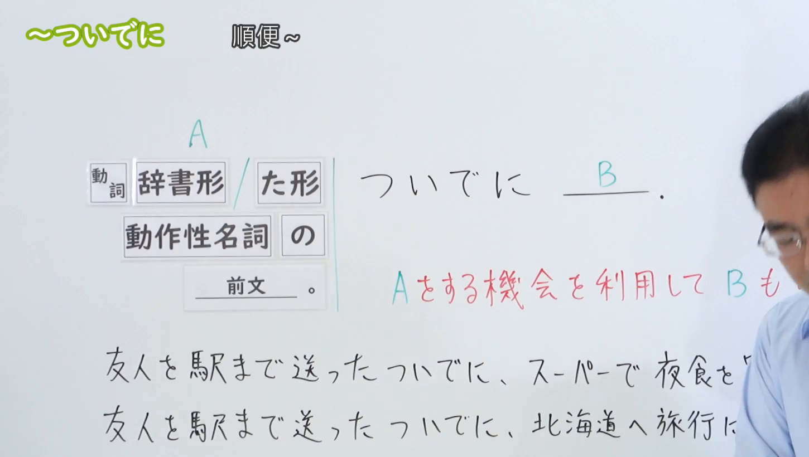

---
{
  "draft_id": "draft-20260911-n3-g-0032",
  "confirmed": false,
  "created_at": "2026-09-11",
  "proposal": {
    "id": "N3-G-0032",
    "kind": "grammar",
    "level": "N3",
    "title": "～ついでに：顺便……",
    "status": "draft",
    "card_revision": 1,
    "source": {
      "lesson": "N3 第32个语法",
      "material": "出口日語日语字幕、0:01接续板书、4:20例句画面及独立日文教学资料复核",
      "video": "https://www.youtube.com/watch?v=smV9kXG8T8o",
      "screenshot": "assets/grammar/n3/N3-G-0032-0001.png",
      "screenshot_seconds": 1,
      "screenshot_crop": {
        "x": 0,
        "y": 0,
        "width": 1450,
        "height": 820
      }
    },
    "tags": [
      "顺便",
      "附带行为",
      "N3"
    ],
    "confusions": [
      "辞书形与た形",
      "动作性名词加の",
      "主要行为与附带行为",
      "～ときに"
    ]
  }
}
---

# N3 第32课｜～ついでに（待确认）

# 视频学习资料整理

根据学习者指定的出口日語第32课整理。学习者尚未提供本课个人理解或例句，以下内容不作为学习者原始输出。待审核确认后再入库。

[原视频 0:01](https://www.youtube.com/watch?v=smV9kXG8T8o&t=1s)：三种接续及句首用法的板书清晰，右侧部分说明和下方例句被老师遮挡。原帧1920×1080，固定左上角，将右下角收至(1450, 820)，裁去底部空白及右侧多余画面，保留接续与可见板书，未重绘或补字。

[打开裁切截图](../assets/grammar/n3/N3-G-0032-0001.png)

# 核心与接续

**A＋ついでに、B：利用做A的机会，顺便做B。**

A是主要事情，B是借这个机会附带做的事情。

| 类型 | 接续规则 | 示例 |
|---|---|---|
| 动词辞书形 | 动词辞书形＋ついでに、B | 行くついでに／作るついでに |
| 动词た形 | 动词た形＋ついでに、B | 行ったついでに／送ったついでに |
| 动作性名词 | 动作性名词＋の＋ついでに、B | 買い物のついでに／出張のついでに |

三种接续与原视频板书及[日本語教師たのすけ的接续表](https://tanosuke.com/tsuideni/)一致。

**动作性名词**指表示行为、活动的名词，例如「買い物」「散歩」「出張」；可以用「買い物する／散歩する／出張する」帮助理解。

- ○ 買い物のついでに
- ○ 買い物をするついでに
- × 買い物をしますついでに

前文已说清主要事情时，也可以另起一句：**前句。ついでに、B。** 原视频明确介绍了这一形式。

# 语义边界

1. **A为主，B为辅。** B应当是能借A的机会顺便完成的事；通常相对省事、无需另做大量准备。不能只因两件事先后发生，就用「ついでに」。这是原课程及[日本語教師のまる得](https://blognihongo.com/n3/grammar_tsuideni/)共同强调的重点。
2. **主次取决于具体情境。** 不把B机械理解为“客观上一定很小的事”。视频将“送朋友到车站后买夜宵”与“送朋友后去北海道旅游”对比：前者可以顺便做，后者在所给情境中需要另行准备，不适合当作附带行为。
3. **不要求两个动作严格同时进行。** 可以借外出、办事的机会顺路做，也可以借准备材料的机会一起做。た形常把A作为已做的事情来叙述；辞书形常用于计划、习惯，也能出现在过去的叙述里，不要记成“过去的句子只能接た形”。参照[たのすけ的时间关系说明](https://tanosuke.com/tsuideni/)及[まる得的辞书形／た形用例](https://blognihongo.com/n3/grammar_tsuideni/)。
4. **先掌握动作性名词＋の的完整形式。** 口语可见「買い物ついでに」等省略；语境能补出动作时，也会出现非动作性名词。这些是补充用法，不将其扩展成“任何名词都能随意接”。参照[まる得的补充说明](https://blognihongo.com/n3/grammar_tsuideni/)。
5. **典型用法中，两件事由同一行动者完成。** 请求别人顺便做B时，A也是对方要做的事。不能把自己做A、无关的另一人做B，仅凭同时发生就连接起来。参照[まる得的主语说明](https://blognihongo.com/n3/grammar_tsuideni/)。

# 课程例句

以下两句已对照[视频末段4:20的例句画面](https://www.youtube.com/watch?v=smV9kXG8T8o&t=260s)核对；日文保留画面写法，中文为整理译文。

> 子供を車で駅まで送ったついでに、図書館で本を借りてきた。
>
> 开车送孩子到车站后，顺便去图书馆借了书回来。

「送った＋ついでに」：主要事情是送孩子，借书是利用这次外出的机会附带做的事。

> 買い物のついでに、郵便局で切手を買って来てください。
>
> 请在买东西时，顺便去邮局买些邮票回来。

「買い物＋の＋ついでに」：动作性名词加「の」；后句可以提出请求。

# 自然例句（自拟）

> スーパーへ行くついでに、銀行に寄ります。
>
> 去超市时，顺便去一下银行。

> 台所を掃除したついでに、冷蔵庫の中もきれいにしました。
>
> 打扫厨房后，顺便也清理了冰箱内部。

> A：コンビニに行ってきます。
> B：ついでに、牛乳も買ってきてください。
>
> A：我去一趟便利店。
> B：请顺便也买些牛奶回来。

第三例中，前文已交代去便利店，B可以用「ついでに」承接；去便利店和买牛奶都是A要做的事。

# 易混项与 JLPT 考点

| 表达 | 重点 |
|---|---|
| Aついでに、B | A是主要事情，B借此机会附带完成 |
| Aときに、B | 说明做B的时间，本身不表示“顺便”或主次关系 |

- 动词用辞书形或た形；动作性名词用「の」连接。
- 不写成「行くのついでに」；「の」用于本课的名词接续。
- 辞书形不等于“只表示将来”，た形也不是整句过去时的唯一标志。
- 选择后句时检查B能否利用A的机会完成，以及是否仍是附带行为。
- 「ついでに」可以独立放在下一句开头，不必在同一句重复A。

# 来源与复核记录

核对日期：2026-09-11。本次复用原视频、播放列表及已保存的检索正文，重新成稿；未恢复已删除的第32课试点草稿。

| 来源 | 核对内容 |
|---|---|
| [出口日語第32课](https://www.youtube.com/watch?v=smV9kXG8T8o) | 日语字幕、0:01三种接续与句首用法、主次关系；另检查4:20末段例句画面 |
| [日本語教師のまる得：～ついでに](https://blognihongo.com/n3/grammar_tsuideni/) | 复读已保存正文：辞书形／た形、动作性名词＋の、主次关系、主语及名词省略补充 |
| [日本語教師たのすけ：～ついでに](https://tanosuke.com/tsuideni/) | 本次重新获取正文：接续表、主要与附带行为、动作的时间关系 |

- 播放列表缓存第32项的视频ID为「smV9kXG8T8o」，标题与本课吻合；资料库未发现本课正式卡或确认事件。
- 字幕中的「竹」「動作正明氏」等误识别，已根据实际接续板书校正为「た形」「動作性名詞」。
- 原课程用“小事／简单的事”讲解后项，卡片保留这一典型倾向，并结合独立资料写成具体情境中的附带行为，不作脱离语境的绝对大小判断。
- 写完后逐项复核三种接续、名词「の」的位置、两句课程原文及译文、自拟例句的主次关系；接续未发现阻止交付的关键疑点。
- 0:01接续完整，因此无需替换截图；4:20仅用于例句核对，不冒充接续截图。截图已裁切并目视检查，遮挡限制已在图片说明中标出。
- 当前为未确认草稿，不设置复习日期。图片保存为标准Markdown引用；现有iPad阅读器暂不显示图片，可通过图片文件链接查看。
