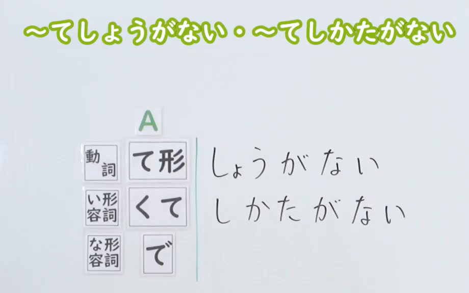

---
{
  "draft_id": "draft-20260912-n3-g-0036",
  "confirmed": false,
  "created_at": "2026-09-12",
  "proposal": {
    "id": "N3-G-0036",
    "kind": "grammar",
    "level": "N3",
    "title": "～てしょうがない／～てしかた(仕方)がない：……得不得了",
    "status": "draft",
    "card_revision": 1,
    "source": {
      "lesson": "N3 第36个语法",
      "material": "出口日語日语自动字幕、原视频接续及例句画面、独立日文教学正文",
      "video": "https://www.youtube.com/watch?v=cqkc0yJGQx4",
      "screenshot": "assets/grammar/n3/N3-G-0036-0001.png",
      "screenshot_seconds": 1,
      "screenshot_crop": {
        "x": 0,
        "y": 0,
        "width": 920,
        "height": 575
      }
    },
    "tags": [
      "程度强调",
      "强烈感受",
      "感情与感觉",
      "N3"
    ],
    "confusions": [
      "い形容词くて",
      "な形容词で",
      "愿望たくて",
      "近义表达搭配",
      "第三人称"
    ]
  }
}
---

# N3 第36课｜～てしょうがない／～てしかた(仕方)がない（待确认）

# 视频学习资料整理

根据学习者指定的出口日語第36课整理。学习者未提供个人理解或例句，以下为课程资料整理，不作为学习者原始输出。尚未确认入库，不设置复习日期。

已从保存的播放列表原始提取记录核对第36项，视频ID为「cqkc0yJGQx4」，标题与本课一致；整理前未发现该编号正式卡、草稿或确认事件。

采用[原视频00:01](https://www.youtube.com/watch?v=cqkc0yJGQx4&t=1s)的实际画面，三类核心接续完整清楚。原帧1920×1080，固定左上角，裁切区域为(0, 0, 920, 575)，保留标题与完整接续表，去除右侧人物、被遮挡的补充说明及下方例句区域。未拼接、重绘或补写文字；补充说明与例句另外通过字幕和后段画面核对。

[打开接续截图](../assets/grammar/n3/N3-G-0036-0001.png)

# 核心与接续

**～てしょうがない／～てしかた(仕方)がない：……得不得了；非常……；……得无法控制。**

主要用于强烈的感情、身体感觉或欲望，也可表示某种状况过度而令人困扰。两种表达核心意义相同，「しょうがない」更口语化。

| 类型 | 接续规则 | 示例 |
|---|---|---|
| 动词 | 动词て形＋しょうがない／しかたがない | 気になる→気になってしょうがない／喉が渇く→喉が渇いてしかたがない |
| い形容词 | い形容词去い＋くて＋しょうがない／しかたがない | 眠い→眠くてしょうがない／嬉しい→嬉しくてしかたがない |
| な形容词 | な形容词词干＋で＋しょうがない／しかたがない | 心配→心配でしょうがない／残念→残念でしかたがない |
| 愿望表达 | 动词ます形去ます＋たくて＋しょうがない／しかたがない | 会います→会いたい→会いたくてしかたがない |

动词て形已含「て／で」，不再加「て」；な形容词用「で」，不用「な」。○ 心配でしかたがない／× 心配なしかたがない。名词不是本课通用接续。

「しかたがない」中的「が」可省略为「しかたない」。礼貌句末可用「しょうがありません／しかたがありません」，也可用「しょうがないです／しかたがないです」。过去用「しょうがなかった／しかたがなかった」。

# 语义边界

1. **是程度强调，不要逐字译成“没有办法”。** 「嬉しくてしょうがない」是“高兴得不得了”，不是“不知道该怎样高兴”。
2. **正面和负面感受都可以。** 「嬉しい／楽しい／好き」和「暑い／眠い／心配」都能搭配。
3. **接续形式允许动词，不等于任意动词都自然。** 优先掌握「気になる」「喉が渇く」「腹が立つ」等表示感受的搭配。想强调“非常想去”，用「行きたくてしょうがない」，不要把「行ってしょうがない」当作同义表达。
4. **也可以描述过度、难以控制而令人困扰的情况。** 原课程「時間がかかってしょうがない」就是“太费时间了”，不要求前项本身一定是感情词。
5. **描述他人的内心，通常交代判断依据。** 可用「～ようだ／～らしい／～と言っている」。这是避免无依据断言的常用表达方式，不是所有第三人称叙述都必须加「ようだ」。
6. **“自然产生”与“强烈到受不了”有重叠。** 课程用「気になってしかたがない」说明自然而然在意的感受；不要据此把所有「気になってたまらない」判错。具体搭配和语境比“自发动词一律禁用”的标签更重要，见下方复核记录。

# 课程例句

以下四句对照[原视频05:10例句画面](https://www.youtube.com/watch?v=cqkc0yJGQx4&t=310s)和日语自动字幕逐句核对。日文保留画面写法，中文为整理译文。

> 一つ一つ手作業でやっていたら、時間がかかってしょうがない。
>
> 如果一个个手工做，实在太费时间了。

这句是“情况过度而令人困扰”的用法。

> SNSでの自分の投稿にどんな反応が返ってくるか気になってしかたがない。
>
> 特别在意自己在社交媒体上发的内容会收到怎样的回应。

> 眠くてしょうがないから、ちょっと横にならせてください。
>
> 我困得不得了，请让我躺一会儿。

「横にならせてください」是请求让自己躺下。

> 小学生のころ、マラソン大会や運動会が嫌で嫌でしょうがなかった。
>
> 上小学时，我特别讨厌马拉松比赛和运动会。

重复「嫌で」加强语气，「しょうがなかった」表示过去的感受。

# 自然例句（自拟）

> 試験の結果が心配でしかたがありません。
>
> 我非常担心考试结果。

> 久しぶりに家族に会えるので、嬉しくてしょうがないです。
>
> 终于能见到久别的家人，我高兴得不得了。

> この小説の続きが読みたくてしかたがない。
>
> 我特别想接着读这本小说。

> 妹は明日の旅行が楽しみでしかたがないようです。
>
> 妹妹似乎特别期待明天的旅行。

# 易混项与JLPT考点

| 表达 | 重点 |
|---|---|
| ～てしょうがない／～てしかたがない | 强烈感受；也能用于某些过度、令人困扰的情况 |
| ～てたまらない | 感受、欲望强烈到难以忍受或抑制，与本课大量重叠 |
| ～てならない | 常突出某种感受、念头不由自主地产生；具体词语搭配需单独判断 |
| ～てもしかたがない／～てもしょうがない | 即使做了也没用，如「今さら後悔してもしかたがない」 |
| 独立的「しかたがない」 | 没办法、无可奈何，如「雨だからしかたがない」 |

- 接续重点：动词て形／い形容词「くて」／な形容词「で」／愿望「たくて」。
- 不把「ない」理解成前项感受不存在；「楽しくてしょうがない」是在加强“快乐”。
- 区分「て」和「ても」：「心配でしかたがない」是非常担心；「心配してもしかたがない」是担心也没用。
- 「しょうがない」比「しかたがない」更随意；正式表达时根据语境选择。
- 近义表达不能只按主观强弱做唯一答案判断，也不能把一切动词都机械接入。

# 来源与复核记录

核对日期：2026-09-12。

| 来源 | 核对内容 |
|---|---|
| [出口日語第36课](https://www.youtube.com/watch?v=cqkc0yJGQx4) | 三类基本接续、强烈感受、正负感受均可、自发用法的课程说明及05:10四句例句 |
| [日本語教師のまる得：～てしかたがない／～てしょうがない](https://blognihongo.com/n3/grammar_teshikataganai_tesyoganai/) | 接续、愿望表达、语体、第三人称、重复强调及过度情况用法 |
| [毎日のんびり日本語教師：～てしょうがない](https://mainichi-nonbiri.com/grammar/n3-teshouganai/) | 三类接续、程度强调、正面用法、省略「が」及重复形式 |
| [日本語教師のまる得：～てたまらない](https://blognihongo.com/n3/grammar_tetamaranai/) | 近义项动词搭配存在接受度差异；开头明确提及「気になる」可接的判断 |

- 已阅读两份独立日文教学正文，按原视频板书纠正字幕中的「同市のて系」「低床がない」等错识；接续为动词て形、い形容词くて、な形容词で。
- 课程将自发用法与「たまらない」作二分；外部资料自身也出现先承认「気になる」可接、后又统一禁止的矛盾。本卡将差异限于具体搭配与语义，不照抄“一律不能”，也不据此设计唯一答案题。核心接续与含义没有冲突。
- まる得正文一处「暑くしかたがない」漏「て」，与其接续表及原视频不符，未沿用该笔误。
- 引用研究的旧链接未取得论文正文，本卡不声称已读论文、不引用统计数值。以上判断只归属于实际查阅的教学正文。
- 已检查四句课程例句、译文、形容词变形、愿望接续、第三人称表述及与「てもしかたがない」的区别。

- 获取记录：视频通过yt-dlp下载为本机缓存，使用ffmpeg从00:01提取原帧，再按上述区域裁切。日语自动字幕为`.firecrawl/cqkc0yJGQx4.ja.vtt`；教学正文为`.firecrawl/n3-36-check.json`。视频网页抓取未返回有效字幕，因此课程依据采用下载的日语字幕与实际视频画面。缓存不作为正式学习资料提交。
- 截图已目视检查，链接指向长期资料目录；草稿仍为未确认状态，没有正式卡或复习日期。现有iPad阅读器暂不显示正文图片，可直接打开图片文件查看。
