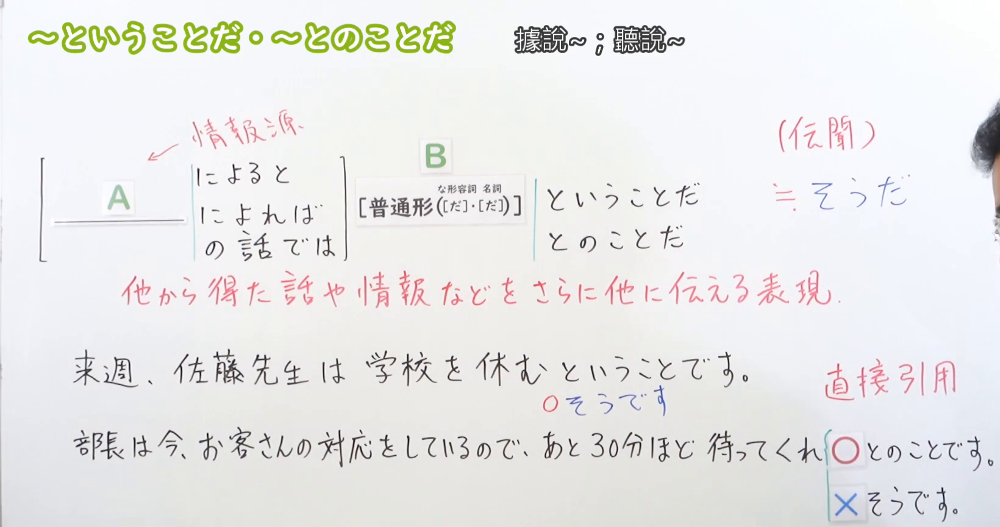

---
{
  "draft_id": "draft-20260912-n3-g-0038",
  "confirmed": false,
  "created_at": "2026-09-12",
  "proposal": {
    "id": "N3-G-0038",
    "kind": "grammar",
    "level": "N3",
    "title": "～ということだ・～とのことだ：据说；听说（传闻）",
    "status": "draft",
    "card_revision": 1,
    "source": {
      "lesson": "N3 第38个语法",
      "material": "出口日語日语自动字幕、原视频接续及例句画面、独立日文教学正文",
      "video": "https://www.youtube.com/watch?v=O7b7SlKA8YM",
      "screenshot": "assets/grammar/n3/N3-G-0038-0420.png",
      "screenshot_seconds": 260,
      "screenshot_crop": { "x": 0, "y": 0, "width": 1640, "height": 865 }
    },
    "tags": ["传闻", "信息转述", "引用", "N3"],
    "confusions": ["传闻そうだ", "名词与な形容词的だ", "命令句引用", "ということだ的结论用法"]
  }
}
---

# N3 第38课｜～ということだ・～とのことだ（待确认）

# 视频学习资料整理

根据学习者指定的出口日語第38课整理。本次只处理第38课，不包含第39课。学习者未提供个人理解或例句，以下是视频资料整理，不作为学习者原始输出。尚未确认入库，不启动复习周期。

已对照保存的播放列表原始提取记录：第38项标题为「【Ｎ３文法】～ということだ・～とのことだ」，视频ID为「O7b7SlKA8YM」。整理前未发现同编号正式卡、草稿或复习记录。

截图采用[原视频04:20](https://www.youtube.com/watch?v=O7b7SlKA8YM&t=260s)的实际画面。00:01老师遮住右侧例句，因此改选板书遮挡更少的时点。原帧1920×1080，固定左上角，裁切区域为(0, 0, 1640, 865)。保留信息来源、普通形接续、名词／な形容词的「だ」括注、传闻含义、两句板书例句，以及与「そうだ」的正误对比；裁去底部空白及绝大部分人像。右边缘仍有少量头部轮廓，但未遮挡教学文字。未拼接、重绘、抹除人像或补写文字。

[打开板书截图](../assets/grammar/n3/N3-G-0038-0420.png)

# 核心与接续

## **【普通形（[だ]，[だ]）】＋ということだ／とのことだ**

两个「[だ]」依次对应**な形容词、名词的现在肯定形**，表示「だ」可以保留，也可以省略：如「元気だ／元気」「休みだ／休み」。这不是所有普通形都能省略词尾的规则。

**～ということだ／～とのことだ：据说……；听说……；对方的意思是……（转述）。**

把从他人、通知、新闻等处获得的信息传给别人。本课核心是「伝聞」，不是根据现象自行推断。两者在本课传闻用法中基本同义，比传闻「そうだ」更郑重，常见于通知、商务和新闻。礼貌说法为「ということです／とのことです」；「こと」通常写平假名。

下表的后接形式均可用「ということだ／とのことだ」。

| 类型 | 接续规则 | 示例 |
|---|---|---|
| 动词 | 动词普通形＋ということだ／とのことだ | 行く・行かない・行った・行かなかった＋とのことだ |
| い形容词 | い形容词普通形＋ということだ／とのことだ | 高い・高くない・高かった・高くなかった＋ということだ |
| な形容词 | な形容词普通形＋ということだ／とのことだ；现在肯定形为词干＋（だ），「だ」可省略；否定与过去为词干＋ではない／だった／ではなかった | 元気（だ）とのことだ／元気ではないとのことだ／元気だったということだ |
| 名词 | 名词普通形＋ということだ／とのことだ；现在肯定形为名词＋（だ），「だ」可省略；否定与过去为名词＋ではない／だった／ではなかった | 休み（だ）ということだ／休みではないとのことだ／休みだったということだ |

- 表中的（だ）表示现在肯定时可以有「だ」，也可以省略；不是改接「な」或「の」。省略规则不能机械套用到过去、否定词尾。
- 常见结构：**信息来源＋によると／によれば／の話では，信息内容＋ということだ／とのことだ**。来源已清楚时可以不明说；「によりますと」是较郑重的说法。
- 引用范围不限于上表的普通陈述句：还可转述命令、请求等原话，如「待ってくれとのことです」。这是引用，不是把命令形称作普通形。引用内容仍须符合原话与语境，不能理解成任意词尾都能乱接。

# 语义边界与适用条件

1. **传达来源中的内容。** 可以转述过去、现在或将来的消息，不因用了「ということだ」就表示消息已被说话人亲自核实，也不等于“不可靠的谣言”。
2. **传话中的命令不等于说话人直接下命令。** 「待ってくれとのことです」是在转述对方“再等一下”的要求。使用礼貌句尾也不会把被引用的「くれ」本身变成敬语。
3. **两种形式不是所有用法都互换。** 本课讲传闻；「ということだ」另外能表示总结、解释或结论，例如自拟句「残りはあと一問です。つまり、もうすぐ終わるということです。」这里是“也就是说快结束了”，不能只换成「とのことです」仍保持同样的推论义。
4. **「とのこと、～」是常见书信／祝贺表达。** 如听说对方有喜事，再接祝贺语；这里不必把「だ」补回逗号前。

# 课程例句

以下取自本课板书及片尾例句页，已对照原视频画面校正字幕；中文为整理译文。

## 板书中的重点对比

1. 来週、佐藤先生は学校を休むということです。
   - 听说佐藤老师下周不来学校。
   - 可换成「学校を休むそうです」；这里的「そうです」是传闻，不是样态。
2. 部長は今、お客さんの対応をしているので、あと30分ほど待ってくれとのことです。
   - 部长现在正在接待客人，传话说请再等三十分钟左右。
   - 原话中的「待ってくれ」可以保留。不能用「待ってくれそうです」来表达这一传闻；若改用「そうです」，可把内容改成「待ってほしいそうです」。

## 片尾例句（05:32画面核对）

1. A社からの回答は、これ以上の値下げは難しいということです。
   - A公司的答复是，很难再降价了。
2. 友人の話では、柴田さんは卒業後、カナダに留学に行ったとのことだ。
   - 据朋友说，柴田毕业后去加拿大留学了。
3. 息子さんが大学に合格したとのこと、たいへんおめでとうございます。
   - 听说您儿子考上了大学，衷心祝贺您。
4. 警察の発表によりますと、今回の事故でけが人はいなかったということです。
   - 据警方通报，这次事故没有人受伤。

# 自然例句（自拟）

1. 学校からのメールによると、明日の授業はオンラインで行うということです。
   - 据学校邮件通知，明天在线上课。
2. 受付に確認したところ、予約の変更は可能とのことです。
   - 向前台确认后得知，可以更改预约。这里的「可能」是な形容词词干，省略了「だ」。
3. 田中さんから、資料を先に送ってほしいとのことです。
   - 田中传话说，希望先把资料发过去。

# 易混项与JLPT考点

- **与传闻「そうだ」：** 都可报告听来的信息。「休みだそうだ」中的「だ」不能按本课规则随意省略；「休み（だ）とのことだ」则两种均可。命令形也不能机械加上传闻「そうだ」。
- **与样态「そうだ」：** 「雨が降るそうだ」是听说会下雨；「雨が降りそうだ」是看起来要下雨。先辨传闻／样态，再选接续。
- **与「らしい」：** 「らしい」也可表示传闻或有根据的推测；本课两种形式突出转述来源。不要把所有中文“听说”题都只认一个答案，要看接续、来源和语体。
- **与结论义「ということだ」：** 看到「つまり」「ということは」等线索，要判断是在归纳含义，还是在转述消息；「とのことだ」不能作为结论义的机械替换。
- **句子排序：** 先找信息来源，再找被转述的完整内容，最后接「ということだ／とのことだ」。嵌入的过去或否定属于消息内容，不要漏掉。
- **常见误接：** ×「元気なとのことだ」、×「休みのということだ」；应为「元気（だ）とのことだ」「休み（だ）ということだ」。

# 来源与复核记录

核对日期：2026-09-12。

1. [出口日語第38课原视频](https://www.youtube.com/watch?v=O7b7SlKA8YM)：核对自动日语字幕全文、00:01及多个前中段原帧、04:20完整板书和05:32例句页。本课实际聚焦传闻；结论用法仅作为外部补充的易混边界。
2. [日本語教師たのすけ：ということだ／とのことだ（伝聞）](https://tanosuke.com/n3-toiukotoda)：阅读正文，核对信息转述、较郑重语体、信息来源搭配、引用短语与「とのこと、」祝贺表达，并确认其单独区分结论义。
3. [日本語教師のN1et：とのことだ・ということだ](https://jn1et.com/tonokotoda/)：阅读正文，重点交叉核对名词／な形容词「だ」可有可无、传闻与结论／解释义的区分。
4. [日本語教育ナビ：伝聞を表す「ということだ」](https://japanese-language-education.com/for-overseas-learners/toiukotoda-denbun/)：阅读语义和用法正文，交叉核对四类普通形及引用命令、推量的接续。

具体处理：

- 按学习者反馈追加检索「ということだ とのことだ 接続 名詞 だ 省略」，并重读已保存的N1et传闻用法正文，其接续表明确列出「元気(だ)」「雨(だ)」，与原课程一致，支持本课两种表达前的现在肯定「だ」可有可无。新增搜索结果涉及结论义的视频及未明确列出省略规则的页面，不作为本课传闻接续的主要证据。检索缓存：`.firecrawl/n3-38-da-recheck.json`。总接续改用二级标题加粗显示，并将表格“类型”统一为词类名称，时态及例外放在“接续规则”中。
- 自动字幕把「普通形」「な形容詞」「伝聞」「直接引用」等识别成同音错字，已按板书与上下文恢复；片尾字幕的「e 社」据05:32画面校正为「A社」，「たいへん」按画面保留平假名。未将错误自动字幕当作学习者原文。
- 一些资料只概括为「普通形＋」，不明列省略「だ」。本卡按原课程括注和N1et具体接续表展开，避免把“通常形式”写成“必须带だ”。
- N1et关于传闻使用频率的概括与另外资料的新闻／正式场景说明侧重点不同；本卡不采用“传闻很少使用”这一泛化频率判断，仅记录适用语体与场景。
- 已逐项检查接续、转述与推论边界、原课／自拟例句标识和译文；已目视检查最终裁图同时保留接续、含义和例句／对比，没有为了去人像裁断主要板书。最终图片路径与元数据一致。
- 可追溯缓存：`.firecrawl/n3-playlist-items.json`、`.firecrawl/O7b7SlKA8YM.ja.vtt`、`.firecrawl/n3-38-check.json`及同视频原始下载／抽帧。缓存不纳入正式学习资料提交。
- 图片可从本Markdown链接打开；现有阅读器尚不支持正文截图显示，本次不修改阅读器。卡片仍为待确认状态，无正式确认日期和复习日期。
