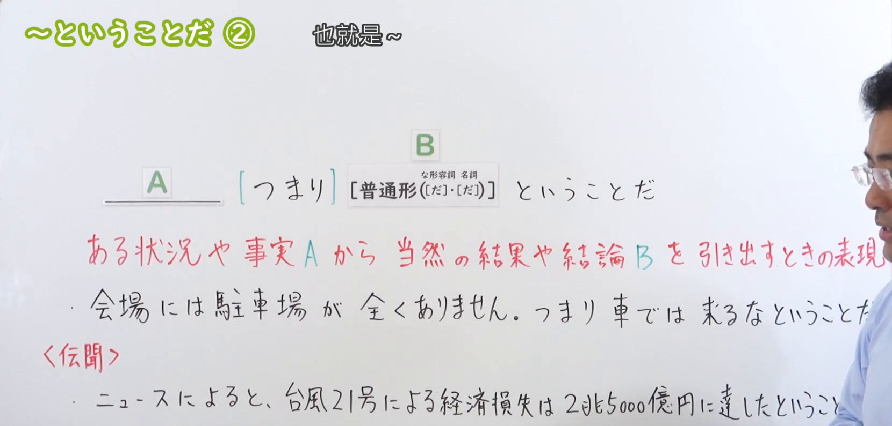
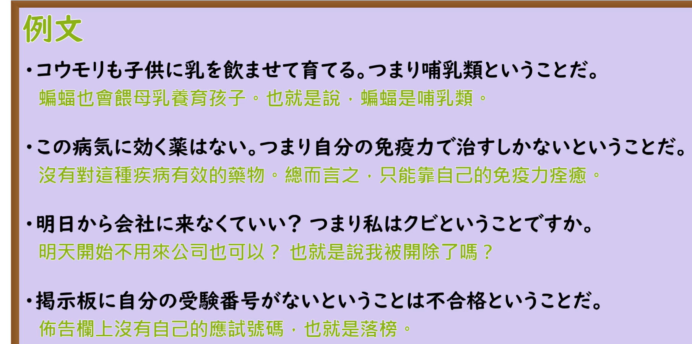

---
{
  "draft_id": "draft-20260912-n3-g-0039",
  "confirmed": false,
  "created_at": "2026-09-12",
  "proposal": {
    "id": "N3-G-0039",
    "kind": "grammar",
    "level": "N3",
    "title": "～ということだ②：也就是说；意味着（结论）",
    "status": "draft",
    "card_revision": 1,
    "source": {
      "lesson": "N3 第39个语法",
      "material": "出口日語日语自动字幕、原视频板书与例句画面、独立日文教学正文",
      "video": "https://www.youtube.com/watch?v=bB_xNOl6c9U",
      "screenshot": "assets/grammar/n3/N3-G-0039-0115.png",
      "screenshot_seconds": 75,
      "screenshot_crop": {
        "x": 0,
        "y": 0,
        "width": 1660,
        "height": 795
      }
    },
    "tags": [
      "结论",
      "解释含义",
      "N3"
    ],
    "confusions": [
      "传闻ということだ",
      "とのことだ",
      "というわけだ"
    ]
  }
}
---

# N3 第39课｜～ということだ②（待确认）

# 视频学习资料整理

根据学习者指定的出口日語课程整理。未提供个人理解或例句，不虚构学习者原始输出。已从保存的播放列表第39项核对标题及视频ID「bB_xNOl6c9U」；整理前未发现同编号正式卡、草稿或确认事件。本卡尚未确认入库，不安排复习日期。

接续板书取自[原视频01:15](https://www.youtube.com/watch?v=bB_xNOl6c9U&t=75s)。原帧1920×1080，固定左上角裁为(0, 0, 1660, 795)，裁去底部空白及大部分人像，保留接续、含义说明和板书例句。00:01遮挡较多，检查多个前中段时点后换用此图。右缘仍有少量脸部和身体，板书例句末尾有遮挡；核心接续清楚，句尾结合日语讲解核实。不以裁图恢复遮挡内容，不重绘、拼接或抹除人物。

另附[原视频03:50例句页](https://www.youtube.com/watch?v=bB_xNOl6c9U&t=230s)，原帧1920×1080，固定左上角裁为(0, 0, 1810, 900)，保留四句日文及中文，去除底部装饰和多余边缘，无人像。两张截图各自独立，例句页不替代接续板书。

# 核心与接续

## **【普通形（[だ]，[だ]）】＋ということだ**

两个「[だ]」依次对应な形容词、名词的现在肯定形，表示「だ」可有可无；不是「な・の」，也不能把过去、否定词尾随意删去。

**也就是说……；这意味着……。** 根据前面的事实、情况或对方的话，概括其含义、推出结论，或确认自己的理解。礼貌形式为「ということです」。

| 类型 | 接续规则 | 示例 |
|---|---|---|
| 动词 | 动词普通形＋ということだ | 行く／行かない／行った／行かなかった＋ということだ |
| い形容词 | い形容词普通形＋ということだ | 寒い／寒くない／寒かった／寒くなかった＋ということだ |
| な形容词 | 普通形＋ということだ；现在肯定为词干＋（だ），「だ」可省略；否定、过去用ではない／だった／ではなかった | 静か（だ）＋ということだ／静かだった＋ということだ |
| 名词 | 普通形＋ということだ；现在肯定为名词＋（だ），「だ」可省略；否定、过去用ではない／だった／ではなかった | 休み（だ）＋ということだ／休みではなかった＋ということだ |

- 常用结构：A。（つまり）Bということだ；Aということは、Bということだ。「つまり」可以不出现。
- 除普通陈述句外，还能引用命令、禁止等内容来解释意思，如「車では来るなということだ」。这是引用式表达，不是把禁止形归为普通形。
- 确认理解时可用「ということですか／ということですね」；口语可见「ってことだ」。

# 语义边界与适用条件

1. 本课不是报告听来的消息，而是说明“前述内容意味着什么”。判断需要上下文，不能只看同样的句尾。
2. 结论是说话人根据语境作出的理解，不保证客观上必然正确。原课把“没有停车场”理解成“不要开车来”，这是情境中的解读，不是任何地点都成立的逻辑定律。
3. 「ということですか」可能带惊讶、追问或确认语气，并不都表示已经接受结论。
4. 结论义不能机械替换成「とのことだ」或传闻「そうだ」；替换后会变成“听说如此”。

# 课程例句

以下取自原课程，中文为整理译文。

1. 会場には駐車場が全くありません。つまり車では来るなということだね。
   - 会场完全没有停车场。也就是说，不要开车来吧。
   - 板书例句，右端结合日语讲解核对；「来るな」是禁止形。
2. コウモリも子供に乳を飲ませて育てる。つまり哺乳類ということだ。
   - 蝙蝠也用乳汁喂养幼崽，也就是说，它是哺乳类。
3. この病気に効く薬はない。つまり自分の免疫力で治すしかないということだ。
   - 没有对这种病有效的药。也就是说，只能靠自身免疫力治愈。
   - 仅作为原课语法例句，不作为疾病或治疗建议，也不能推广成一般医学结论。
4. 明日から会社に来なくていい？つまり私はクビということですか。
   - 明天起不用来公司了？也就是说，我被开除了？
5. 掲示板に自分の受験番号がないということは不合格ということだ。
   - 公告栏上没有自己的准考证号，就意味着没有考上。
   - 语境默认公告栏公布的是合格者名单。

# 自然例句（自拟）

1. 一箱に六個入っていて、二箱あります。つまり、全部で十二個あるということです。
   - 每盒六个，有两盒，也就是说总共十二个。
2. この券で何度でも入場できるんですね。つまり、再入場も可能ということですか。
   - 这张票可以多次入场吧。也就是说，也能再次入场吗？
3. 返事がまだ来ていないということは、予定はまだ決まっていないということですね。
   - 还没有收到回复，也就是说，安排还没定下来吧。
   - 这是语境中的理解，可能需要向对方确认。

# 易混项与JLPT考点

- 与第38课传闻义：来源＋によると常提示转述；つまり／Aということは常提示解释或结论，但不是机械判定规则。
- 与「というわけだ」：两者都可说明结论；「わけだ」常突出由理由得到的理解、恍然大悟。根据语境有重合，不能仅凭中文译文判断唯一答案。
- 注意「Aということは、Bということだ」前后结构；A提供依据，B概括意义或结论。
- 名词／な形容词现在肯定可省略「だ」：哺乳類（だ）ということだ、可能（だ）ということだ；不改成「の／な」。
- 区分句尾礼貌体与引用内容：「ということです」不要求前面的普通形变成「です／ます」。

# 来源与复核记录

核对日期：2026-09-12。

1. [出口日語第39课](https://www.youtube.com/watch?v=bB_xNOl6c9U)：日语字幕全文、多个前中段原帧、01:15板书及03:50例句页；确认本课为结论义及与传闻义的对照。
2. [日本語教師たのすけ：ということだ（結論）](https://tanosuke.com/toiukotoda)：正文明确列普通形接续及な形容词／名词「だ」可省略，支持总结、确认对方话意、非普通形引用。
3. [日本語教育ナビ：結論を表す「ということだ」](https://japanese-language-education.com/for-overseas-learners/toiukotoda-ketsuron/)：正文支持从事实引出结论、四类接续、命令／禁止引用。其附录活用表含明显排字错误，本卡未照抄，过去否定统一正确写作「ではなかった」。

校对记录：自动字幕的「普通系」「な兄を1名刺」「便分」「首」等，按板书、例句画面和上下文校正为「普通形」「な形容詞・名詞」「伝聞」「クビ」。原课“当然的结果”按语境理解，不写成逻辑上的绝对保证。两份独立正文的主规则一致；「だ」省略由たのすけ具体说明与原课双重核对。

成稿复核：已检查四类接续与括号顺序、现在肯定例外、过去否定形式、语义边界、课程／自拟例句标识及译文；逐张目视核对最终裁图的文字保留和遮挡情况。图片引用位于“视频学习资料整理”，现有阅读器尚不显示正文截图，可在Markdown中打开，本次不修改阅读器。

可追溯缓存：`.firecrawl/n3-playlist-items.json`、`.firecrawl/bB_xNOl6c9U.ja.vtt`、`.firecrawl/n3-39-check.json`及原视频／抽帧。缓存不提交。元数据保持未确认，无正式确认日期、复习日期或确认事件。
