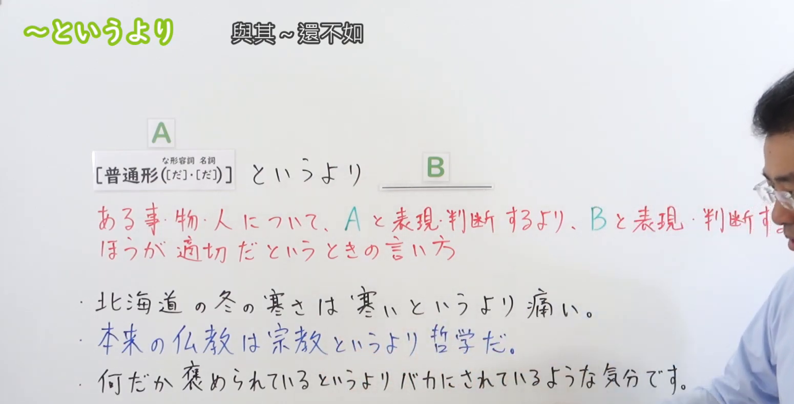
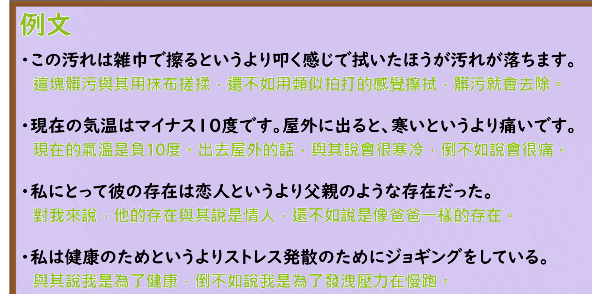

---
{
  "draft_id": "draft-20260912-n3-g-0040",
  "confirmed": false,
  "created_at": "2026-09-12",
  "proposal": {
    "id": "N3-G-0040",
    "kind": "grammar",
    "level": "N3",
    "title": "～というより：与其说……，不如说……",
    "status": "draft",
    "card_revision": 1,
    "source": {
      "lesson": "N3 第40个语法",
      "material": "出口日語日语自动字幕、原视频板书与例句画面、独立日文教学正文",
      "video": "https://www.youtube.com/watch?v=pkq_IlcD5TA",
      "screenshot": "assets/grammar/n3/N3-G-0040-0140.png",
      "screenshot_seconds": 100,
      "screenshot_crop": {
        "x": 0,
        "y": 0,
        "width": 1550,
        "height": 790
      }
    },
    "tags": [
      "表达修正",
      "比较判断",
      "N3"
    ],
    "confusions": [
      "より",
      "というよりは",
      "むしろ",
      "名词与な形容词接续"
    ]
  }
}
---

# N3 第40课｜～というより（待确认）

# 视频学习资料整理

根据学习者指定的出口日語课程整理。未提供个人理解或例句，不虚构学习者原始输出。已从保存的播放列表第40项核对标题及视频ID「pkq_IlcD5TA」；整理前未发现同编号正式卡、草稿或确认事件。本卡尚未确认入库，不安排复习日期。

接续板书取自[原视频01:40](https://www.youtube.com/watch?v=pkq_IlcD5TA&t=100s)。原帧1920×1080，固定左上角裁为(0, 0, 1550, 790)，裁去底部空白及大部分人像，保留接续、含义说明和板书例句。00:01遮挡较多，检查多个前中段时点后换用此图。三句板书例句均可读，右缘仍有脸部／衣袖，红字说明末尾有遮挡；含义结合日语讲解与独立正文核实。不以裁图恢复遮挡内容，不重绘、拼接或抹除人物。

另附[原视频03:00例句页](https://www.youtube.com/watch?v=pkq_IlcD5TA&t=180s)，原帧1920×1080，固定左上角裁为(0, 0, 1810, 900)，保留四句日文及中文，去除底部装饰和多余边缘，无人像。两张截图各自独立，例句页不替代接续板书。

# 核心与接续

## **【普通形（[だ]，[だ]）】＋というより**

两个「[だ]」依次对应な形容词、名词的现在肯定形，表示「だ」可以保留或省略，不改成「な／の」。

**AというよりB：与其说是A，不如说是B；说B更贴切。** 对同一事物、人物或情况，修正原先的说法或判断，突出B比A更准确。不是单纯比较两个对象谁更好。

| 类型 | 接续规则 | 示例 |
|---|---|---|
| 动词 | 动词普通形＋というより | 行く／行かない／行った／行かなかった＋というより |
| い形容词 | い形容词普通形＋というより | 寒い／寒くない／寒かった／寒くなかった＋というより |
| な形容词 | 普通形＋というより；现在肯定为词干＋（だ），「だ」可省略；否定、过去用ではない／だった／ではなかった | 静か（だ）＋というより／静かだった＋というより |
| 名词 | 普通形＋というより；现在肯定为名词＋（だ），「だ」可省略；否定、过去用ではない／だった／ではなかった | 休み（だ）＋というより／休みではなかった＋というより |

- 名词／な形容词也常用不带「だ」的形式，如「友達というより」「静かというより」。
- 原课说明能接被比较的引用内容；不局限于一个单词，也可接较长短语，如「健康のためというより」。普通形是核心速记，不是排除所有引用短语的绝对限制。
- 可用「というよりは」加强对照，也可用「というより、むしろ～」。后项按自身句子结构收尾，不固定接「だ」。

# 语义边界与适用条件

1. A和B是在描述同一个对象或同一情况的两个角度。B可以修正分类、程度、原因或感受，不一定与A完全相反。
2. A不一定全部错误。说“与其说是工作，不如说是兴趣”，不等于否认它也是工作，只是突出更贴切的一面。
3. 不把中文“与其……不如……”一律套用本课：若是在选择行动方案，应先判断是否只是普通比较、偏好或建议。
4. 本课「いう」是提出说法，不要求真的有人先说过A。可以修正他人的说法，也可以修正自己的表述。

# 课程例句

以下取自原课板书及03:00例句页，中文为整理译文。

1. 北海道の冬の寒さは寒いというより痛い。
   - 北海道冬天的寒冷，与其说是冷，不如说是刺痛。
2. 何だか褒められているというよりバカにされているような気分です。
   - 总觉得与其说是在被夸奖，不如说像是在被嘲弄。
3. この汚れは雑巾で擦るというより叩く感じで拭いたほうが汚れが落ちます。
   - 这处污渍，与其用抹布搓擦，不如以轻拍的感觉擦拭，更容易去掉。
   - 「というより」修正动作的描述；建议语气同时来自后面的「たほうが」。
4. 現在の気温はマイナス10度です。屋外に出ると、寒いというより痛いです。
   - 现在气温零下十度。到了室外，与其说冷，不如说痛。
5. 私にとって彼の存在は恋人というより父親のような存在だった。
   - 对我而言，他与其说是恋人，不如说是父亲般的存在。
6. 私は健康のためというよりストレス発散のためにジョギングをしている。
   - 我慢跑与其说是为了健康，不如说是为了释放压力。

# 自然例句（自拟）

1. この部屋は狭いというより、物が多すぎるんです。
   - 这个房间与其说小，不如说东西太多了。
2. 彼は静かというより、話す前によく考える人です。
   - 他与其说安静，不如说是开口前会认真思考的人。
3. これは会議というより、気軽な情報交換の場です。
   - 这与其说是会议，不如说是轻松交流信息的场合。

# 易混项与JLPT考点

- 「AよりB」可比较对象、程度或偏好；「AというよりB」重点是描述／判断的修正。例如“咖啡比茶更喜欢”是偏好，不是把同一饮品从茶重新描述成咖啡。
- 「というよりは」与「というより」核心意义相同，「は」使对照更突出；不是必须出现。
- 「むしろ」可帮助突出B；不能因此误记为「というより」后必须有「むしろ」。
- 排序时找A、というより、B：B才是说话人认为更恰当的表达。A和B可长可短，不要求都只是名词。
- な形容词／名词现在肯定「だ」可有可无；不能误接「静かなというより」「友達のというより」。
- 「寒いというより痛い」是程度／感受修正，不是在转述“听说很冷”。

# 来源与复核记录

核对日期：2026-09-12。

1. [出口日語第40课](https://www.youtube.com/watch?v=pkq_IlcD5TA)：日语字幕全文、多个前中段原帧、01:40板书及03:00例句页；核对普通形、可省略「だ」及“B比A的表述更恰当”。
2. [日本語の例文：というより](https://j-nihongo.com/toiuyori/)：正文的四类接续表明确列な形容词词干／名词＋（だ），并说明修正前项、后项给出更恰当说法；例句支持「というよりは」。
3. [日本語教師たのすけ：というより](https://tanosuke.com/toiuyori-2)：正文以“取り上げる言葉”说明接续范围，支持词语引用、B更恰当以及名词／な形容词不带「だ」的实例。

校对记录：字幕中的「普通系」「禁酒地形」「米分」「というように」等按语境及板书校正，不把自动转写当作准确原文。片尾「擦る」「叩く」「拭いたほうが」按原画面核对。原板书还有宗教与哲学的判断性例句；它仅为教师选取的表述比较，不作为宗教事实结论，本卡未将其列为核心例句。来源接续描述“普通形”与“取り上げる言葉”并不冲突，分别是核心概括与引用范围补充。搜索结果中另有教师视频标为N2，本卡等级沿指定N3课程，不把网站分级当成官方固定文法清单。

成稿复核：已检查四类接续与括号顺序、现在肯定例外、过去否定形式、语义边界、课程／自拟例句标识及译文；逐张目视核对最终裁图的文字保留和遮挡情况。图片引用位于“视频学习资料整理”，现有阅读器尚不显示正文截图，可在Markdown中打开，本次不修改阅读器。

可追溯缓存：`.firecrawl/n3-playlist-items.json`、`.firecrawl/pkq_IlcD5TA.ja.vtt`、`.firecrawl/n3-40-check.json`、`.firecrawl/n3-40-extra.json`及原视频／抽帧。缓存不提交。元数据保持未确认，无正式确认日期、复习日期或确认事件。
