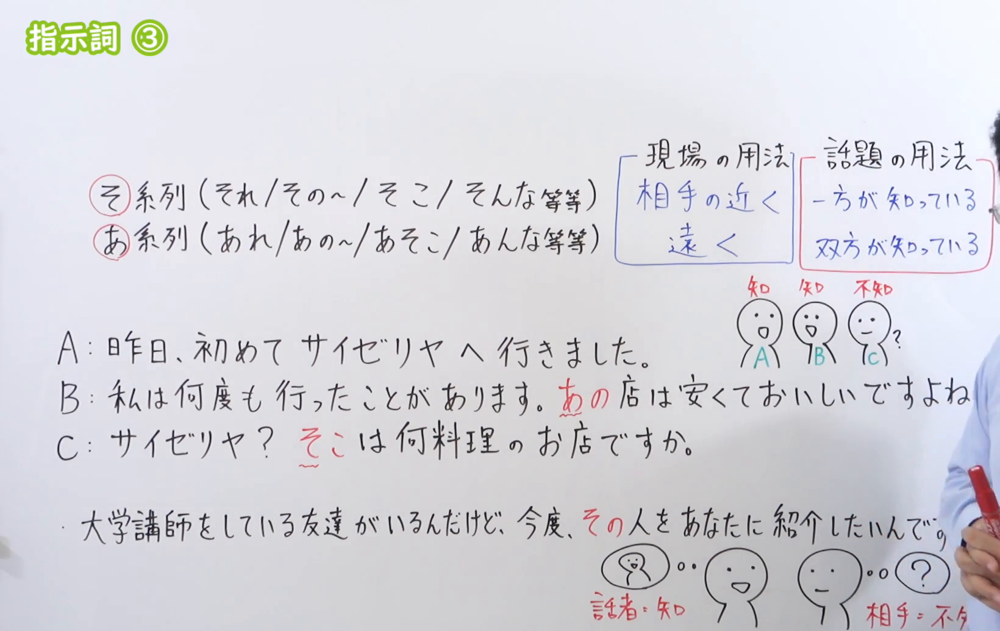
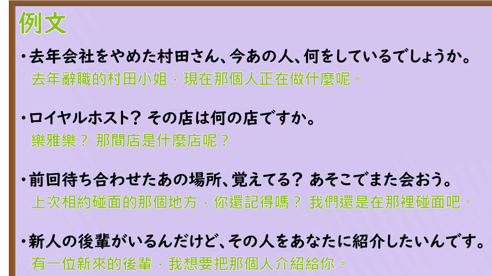

---
{
  "draft_id": "draft-20260912-n3-g-0042",
  "confirmed": false,
  "created_at": "2026-09-12",
  "proposal": {
    "id": "N3-G-0042",
    "kind": "grammar",
    "level": "N3",
    "title": "指示詞③：话题中的そ系列与あ系列",
    "status": "draft",
    "card_revision": 1,
    "source": {
      "lesson": "N3 第42个语法",
      "material": "出口日語日语自动字幕、原视频板书与例句画面、独立教学正文",
      "video": "https://www.youtube.com/watch?v=ueBNkMb14Fc",
      "screenshot": "assets/grammar/n3/N3-G-0042-0400.png",
      "screenshot_seconds": 240,
      "screenshot_crop": {
        "x": 0,
        "y": 0,
        "width": 1640,
        "height": 1035
      }
    },
    "tags": [
      "指示词",
      "共同认知",
      "N3"
    ],
    "confusions": [
      "现场指示",
      "文脉指示",
      "こ系列"
    ]
  }
}
---

# N3 第42课｜しじし（指示詞）③（待确认）

# 视频学习资料整理

根据学习者指定的出口日語课程整理，未提供个人理解或例句，不虚构学习者原始输出。从保存的播放列表第42项核对标题「指示詞③」及视频ID「ueBNkMb14Fc」；整理前未发现同编号正式卡、草稿或确认事件。本卡未确认入库，不启动复习。

主图取自[原视频04:00](https://www.youtube.com/watch?v=ueBNkMb14Fc&t=240s)。原帧1920×1080，固定左上角裁为(0, 0, 1640, 1035)。00:01右侧规则和例句被挡，检查前中段多个时点后换用此图；保留そ／あ系列、现场与话题用法对照、三人对话及介绍朋友的例句。已裁掉大部分人像；右缘仍有少量头部、衣袖和手，B的句末标点、最下方例句末尾及“相手：不知”末端存在遮挡，结合其他原帧和日语讲解核实。顶部空白受固定左上角规则限制保留，不重绘、抹除或拼接。

补充[原视频05:20例句页](https://www.youtube.com/watch?v=ueBNkMb14Fc&t=320s)，原帧1920×1080，裁为(0, 0, 1600, 900)，完整保留四句日文及中文，裁去多余右边缘和底部装饰，无人像。

# 核心与接续

## **【その／あの＋名词；それ／あれ；そこ／あそこ】**

**话题中的“那个／那里”：重点看双方是否已有共同认知，而不只是物理距离。** 本课是指示词的选择，不是接在普通形后面的句型，因此不使用「普通形（な・の）」。

| 类型 | 接续规则 | 示例 |
|---|---|---|
| 连体词 | その／あの＋名词；不再加の或な | その人／あの店；不是「そのの店」 |
| 代名词 | それ／あれ可独立代替事物或内容，再接助词等 | それは初めて聞きました／あれを覚えていますか |
| 代名词 | そこ／あそこ代替地点，再接に／で／へ等 | そこで会う／あそこへ行く |
| 连体词 | 补充：そんな／あんな＋名词，指那样的性质、状态 | そんな話／あんな店 |

「その／あの」后面需要名词；「それ／あれ」本身能充当名词性成分，不能把「それ店」当作「その店」。本课用「その人／あの人」指人，不把それ／あれ当作一般礼貌人称。

| 会话中的典型情境 | 通常选择 | 理解方式 |
|---|---|---|
| 说话人认识，对方不认识；承接刚提到的人物 | そ系列 | 我刚说的那个人 |
| 说话人不熟悉，正在询问对方提到的对象 | そ系列 | 你说的那个地方 |
| 说话人认为双方都能凭原有认知辨认同一对象 | あ系列 | 我们都知道的那个人／那个地方 |

# 语义边界与适用条件

1. 原课“只有一方知道用そ，双方知道用あ”是入门判断，适用于本课对话，不是所有指示词用法的绝对定律。
2. **“刚听到名字”不等于已经具备共同认知。** 对方刚说有位朋友，你能听懂在指谁，但还不认识那个人，接着说「その人」很自然。
3. 「あ」重在说话人把对象作为双方能够辨认的既有对象来提起；“双方知道”也不要求他们必须一起见过，分别熟悉同一家店也可以。
4. 外部补充：「そ」也能指双方都没有直接接触、但话语中已提出的对象，或假设中的对象，不能限定为“一定恰好一方知道”。
5. 回忆、独白或想不起名称时，即使听者不知道，也可以说「あの店、よかったなあ」「あれ、何だっけ」。这是「あ」的记忆用法，不应据此否定本课的基本对照。
6. 外部补充：「こ」也可把刚提到的信息当作眼前关注的话题，如「この話は秘密です」。所以“只一方知道”不表示所有场合都只能用そ。
7. 现场指示要另看双方的位置与心理领域：对方手里的物品用「それ」，远离双方的用「あれ」是典型场景；不能把本课共同认知规则硬套到所有眼前实物。
8. 阅读文章时，还要分析指示对象在前文还是后文、指代的是名词还是整段内容；不只靠“两个人是否知道”判断。

# 课程例句

以下取自原课程，中文为整理译文。

1. A：昨日、初めてサイゼリヤへ行きました。
   B：私は何度も行ったことがあります。あの店は安くておいしいですよね。
   C：サイゼリヤ？そこは何料理のお店ですか。
   - A：昨天我第一次去了萨莉亚。B：我去过很多次，那家店便宜又好吃吧。C：萨莉亚？那里是卖什么料理的店？
   - 板书对话：A、B已有去店里的经历，用「あの店」；C不熟悉，承接话题询问，用「そこ」。
2. 去年会社をやめた村田さん、今あの人、何をしているでしょうか。
   - 去年离开公司的村田，现在在做什么呢？
   - 本课预设双方认识村田。截图中文写“小姐”，但日文「さん」本身不标明性别，译文不擅自补性别。
3. ロイヤルホスト？その店は何の店ですか。
   - Royal Host？那是什么店？
   - 询问者不熟悉对方所说的店，使用その。
4. 前回待ち合わせたあの場所、覚えてる？あそこでまた会おう。
   - 还记得上次约见的那个地方吗？再在那里见吧。
   - 共同经历帮助双方辨认地点，不是根据地点现在离他们多远。
5. 新人の後輩がいるんだけど、その人をあなたに紹介したいんです。
   - 有一位新来的后辈，我想把那个人介绍给你。
   - 说话人认识，对方尚不认识，用その承接刚提到的人。

# 自然例句（自拟）

1. A：昨日、「みどり」という喫茶店に行ったよ。
   B：その店、どこにあるの？
   - A：昨天去了家叫“绿”的咖啡店。B：那家店在哪里？
   - B没有去过，也不了解该店，承接刚听到的信息。
2. A：去年一緒に泊まったホテル、覚えてる？
   B：うん。あのホテルは朝ご飯がおいしかったね。
   - A：还记得去年一起住过的酒店吗？B：记得，那家酒店早餐很好吃。
3. 東京に友達が一人いるんですが、その人はまだあなたに会ったことがありません。
   - 我有位朋友在东京，那个人还没有见过你。
   - 自己认识、听者不认识，也能由说话人自己使用その。

# 易混项与JLPT考点

- 不见到「あそこ」就机械翻译为“远处”：回忆中的地点也能用あそこ。
- 「その人／あの人」都译成“那个人”，中文一样不代表日文可以无条件互换。
- 先确定指代对象，再判断说话人与听话人的认知；同一段三人对话中，说话者改变，选词也可能改变。
- 「その＋名词」与「それ」区分；地点「そこ／あそこ」与性质「そんな／あんな」区分，不能只看そ／あ而忽略词形。
- 有共同经历时「あ」是典型选择，但孤立一句往往无法排除所有其他解释；做题需看完整上下文。

# 来源与复核记录

核对日期：2026-09-12。

1. [出口日語第42课](https://www.youtube.com/watch?v=ueBNkMb14Fc)：日语字幕全文、00:01及多个前中段板书、04:00主图和05:20例句页；确认本课话题用法、双方认知与三人对话。
2. [日本語教師の広場：指示詞「こ・そ・あ・ど」文脈指示](https://www.tomojuku.com/blog/kosoado/)：日文正文支持共享知识用あ、承接对方信息用そ、说话人也可用そ指刚提出的熟人；说明独白的あ以及こ／そ的视角差异。
3. [日本語教育・応用言語学：日本語の「こ・そ・あ」の用法](https://www.nihongo-appliedlinguistics.net/wp/archives/9830)：日文正文区分现场、文章、会话；明确そ可用于任一方或双方没有直接认知的对象，あ还用于回忆和独白，且以说话人的认知判断为准。

分歧处理：课程板书是典型对话的简化表，两份独立正文给出更广范围，并非核心结论冲突。本卡保留基本对照，但补上“双方都未直接知道也可用そ”“独白可用あ”“こ也有话题用法”的边界；没有写成双方一听见同一名字就必须用あ。外部资料提及的文法书仅作其参考文献，未假称本次直接阅读那些书。

字幕校对：「支持し」「養蜂」「高層あああド」等按板书校正为「指示詞」「用法」「こ・そ・あ・ど」；萨莉亚名称按画面写「サイゼリヤ」，例句中的村田不擅自加性别。

成稿复核：已核对指示词结构、认知条件、规则与例外、原课／自拟例句及译文；目视检查两张最终裁图，右侧残余遮挡如上披露，关键そ／あ对照完整可读。图片位于视频学习资料整理，现有阅读器尚不显示正文截图，可在Markdown中打开，本次不修改阅读器。

缓存：`.firecrawl/n3-playlist-items.json`、`.firecrawl/ueBNkMb14Fc.ja.vtt`、`.firecrawl/n3-42-check.json`及原视频／抽帧。缓存不提交。等待学习者明确确认入库。
