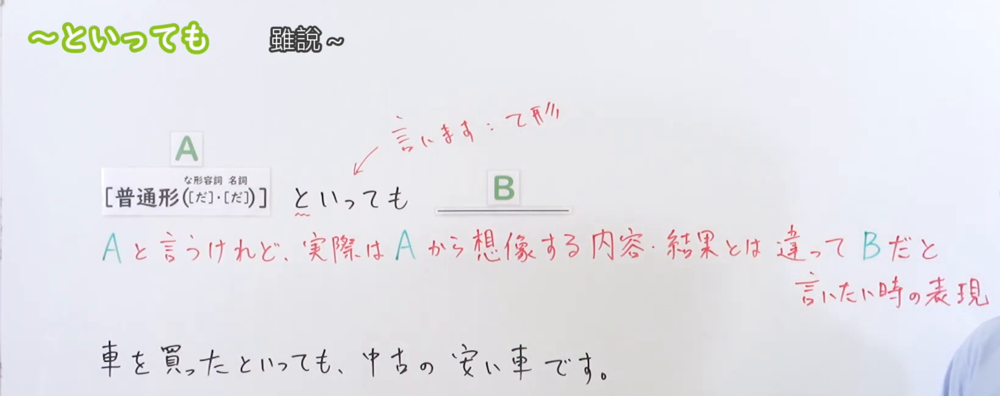
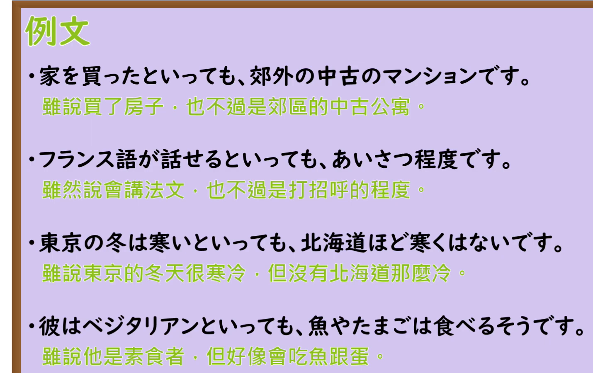

---
{
  "draft_id": "draft-20260912-n3-g-0043",
  "confirmed": false,
  "created_at": "2026-09-12",
  "proposal": {
    "id": "N3-G-0043",
    "kind": "grammar",
    "level": "N3",
    "title": "～といっても：虽说……但实际上……",
    "status": "draft",
    "card_revision": 1,
    "source": {
      "lesson": "N3 第43个语法",
      "material": "出口日語日语自动字幕、原视频板书与例句画面、独立教学正文",
      "video": "https://www.youtube.com/watch?v=sqeZl12X6cs",
      "screenshot": "assets/grammar/n3/N3-G-0043-0210.png",
      "screenshot_seconds": 130,
      "screenshot_crop": {
        "x": 0,
        "y": 0,
        "width": 1640,
        "height": 650
      }
    },
    "tags": [
      "修正印象",
      "让步",
      "N3"
    ],
    "confusions": [
      "けれども",
      "からといって",
      "といえば"
    ]
  }
}
---

# N3 第43课｜～といっても（待确认）

# 视频学习资料整理

根据学习者指定的出口日語课程整理；本次未提供个人理解或例句，不虚构学习者原始输出。已从保存的播放列表第43项核对标题「～といっても」及视频ID「sqeZl12X6cs」，整理前未发现同编号正式卡、草稿或确认事件。本卡未确认入库，不启动复习。

主图取自[原视频02:10](https://www.youtube.com/watch?v=sqeZl12X6cs&t=130s)。原帧1920×1080，固定左上角裁为(0, 0, 1640, 650)。00:01含义说明右端被人物遮挡；比较01:00、01:10、01:20、01:30、01:45、02:00后，选用02:10，完整保留接续、含义和买车例句。已裁去大部分人像和底部空白，仅右下角有少量衣袖，不遮教学文字；顶部留白受固定左上角规则限制保留。未重绘、抹除或拼接。

补充[原视频02:40例句页](https://www.youtube.com/watch?v=sqeZl12X6cs&t=160s)，原帧1920×1080，裁为(0, 0, 1430, 900)。保留四句日文及原图中文，裁去多余右侧与底部装饰，无人像。原图中文的传闻表达在下文单独校对。

# 核心与接续

## **【普通形（[だ]・[だ]）】＋といっても（と言っても）**

**虽说……，但实际上……。** 先承认或提出A，再用B修正听者容易从A产生的印象、程度或范围。

括号内依次对应な形容词、名词的现在肯定形；「[だ]」表示だ可保留，也可省略，不是改成な／の。动词、い形容词照普通形接续。

| 类型 | 接续规则 | 示例 |
|---|---|---|
| 动词 | 普通形＋といっても | 話せるといっても／買ったといっても／行かないといっても |
| い形容词 | 普通形＋といっても，不加だ | 寒いといっても／高くないといっても／安かったといっても |
| な形容词 | 现在肯定：词干＋（だ）＋といっても；否定、过去用普通形 | 元気（だ）といっても／暇ではないといっても／静かだったといっても |
| 名词 | 现在肯定：名词＋（だ）＋といっても；否定、过去用普通形 | 学生（だ）といっても／休みではないといっても／子供だったといっても |

「普通形」并非只指辞书形；这里也能接过去、否定。可省略的是现在肯定形的だ，不能把「だった／ではない」也一律删掉。「いっても」来自「いいます（言います）」的て形＋も，写作平假名或「と言っても」均可。

# 语义边界与适用条件

1. 重点是否定由A引出的过度想象或不准确印象，通常不否定A本身。例如「車を買ったといっても、中古の安い車です」仍然买了车，只是没有听者想象的那么豪华。
2. 后项常见「だけ／程度／ほど～ない」等，说明规模、能力或程度有限；这些不是必需词，也不是固定必须用否定句。
3. 不限于谦虚或“实际更差”：如自拟「古いといっても、まだ十分使えます」修正的是“旧就不能用”的想象。
4. 不要求真的先有人说出A；说话人可以在同一句里提出A并主动补充。也能承接前句：「フランス語が話せます。といっても、あいさつ程度です」。
5. 本课是修正印象的用法；「何度言っても、聞いてくれない」里的「言っても」是动词“说”的让步表达，结构和本课不同。
6. 与普通的「けれども」相比，本课更突出“A这个说法容易造成的印象”与事实之间的落差；不要只凭中文“虽然”选择。

# 课程例句

以下日文取自原课板书或例句页；中文为整理译文。

1. 車を買ったといっても、中古の安い車です。
   - 虽说买了车，但只是辆便宜的二手车。
   - 板书例句。买车属实，修正“新车、高级车”的想象。
2. 家を買ったといっても、郊外の中古のマンションです。
   - 虽说买了房子，但只是郊区的一套二手公寓。
3. フランス語が話せるといっても、あいさつ程度です。
   - 虽说会说法语，也只是打招呼的程度。
4. 東京の冬は寒いといっても、北海道ほど寒くはないです。
   - 虽说东京冬天冷，但没有北海道那么冷。
5. 彼はベジタリアンといっても、魚やたまごは食べるそうです。
   - 虽说他是素食者，但听说他会吃鱼和蛋。
   - 原图中文写“好像会吃”；这里「食べるそうです」是传闻，应译“听说会吃”。这是原课对人物称呼与实际饮食的修正，不把“素食者通常吃鱼”当作定义；本句保留原课说法。

# 自然例句（自拟）

1. 旅行といっても、近くの温泉に一泊するだけです。
   - 虽说是旅行，也只是去附近的温泉住一晚。
2. この部屋は静かだといっても、朝は車の音が少し聞こえます。
   - 虽说这个房间安静，早晨还是会听到一点车声。
3. 忙しいといっても、メールを返す時間ぐらいはあります。
   - 虽说忙，回封邮件的时间还是有的。

# 易混项与JLPT考点

- 接续辨析：寒いといっても，不是寒いだといっても；学生（だ）といっても，不是学生のといっても。
- 意义辨析：「といっても」修正印象；「からといって」常反驳“仅因A就能推断B”的推论；「といえば」引出联想或话题。
- 后项选择：优先找与前项可能引发的想象有落差、但仍能合理承认前项的内容。
- 句子排序：普通形＋といっても＋实际情况；不要把と误接在后面的名词上。
- 阅读时分清“事实被否定”和“程度／范围被限制”，尤其注意だけ、程度、ほど～ない。

# 来源与复核记录

核对日期：2026-09-12。

1. [出口日語第43课](https://www.youtube.com/watch?v=sqeZl12X6cs)：日语自动字幕全文、00:01及多个讲解时点、02:10板书和02:40例句页。确认普通形、两类だ可省略、修正想象的含义及课程例句。
2. [ゆーじ@日本語904：といっても教案](https://note.com/yy46/n/ne9da748dd1a1)：日文正文明确「V普通形・いA・なA(だ)・N(だ)」，并支持修正一般印象、可置于句首及具体例句。
3. [日本語NET：といっても](https://nihongokyoshi-net.com/2018/11/28/jlptn3-grammar-toittemo/)：日文正文支持想象与实际不一致、四类接续与能力／规模限制例句。其表格写Nだ，但正文有「お金持ちといっても」；结合原课与上一来源，不把だ解释为一律必需。
4. [日本語教師たのすけ：といっても](https://tanosuke.com/toittemo/)：补充核对普通形、后项修正程度、な形容词保留だ的实际例句。

来源等级标注有N3／N2差异，按本项目所学出口日語N3第43课归档，不据网页分级变更编号。对近义表达只保留本课需要的区别，不声称它们在所有语境都可以互换。

字幕校对：「普通系／現在恒星系／内容提示の幸」等按板书和讲解校正为普通形、现在肯定形、引用助词と；原例句用字以画面为准，不把自动字幕的同音误识别当语法术语。

成稿复核：核对四类接续、だ省略范围、前后项关系、否定与过去形式、课程／自拟例句及译文；目视检查两张最终裁图，关键教学文字完整可读。图片放在视频学习资料整理，使用可解析的相对链接；现有阅读器尚不显示正文截图，可在Markdown中打开。

缓存：`.firecrawl/n3-playlist-items.json`、`.firecrawl/sqeZl12X6cs.ja.vtt`、`.firecrawl/n3-43-search.json`及视频／原帧。缓存不提交。等待学习者明确确认入库。
