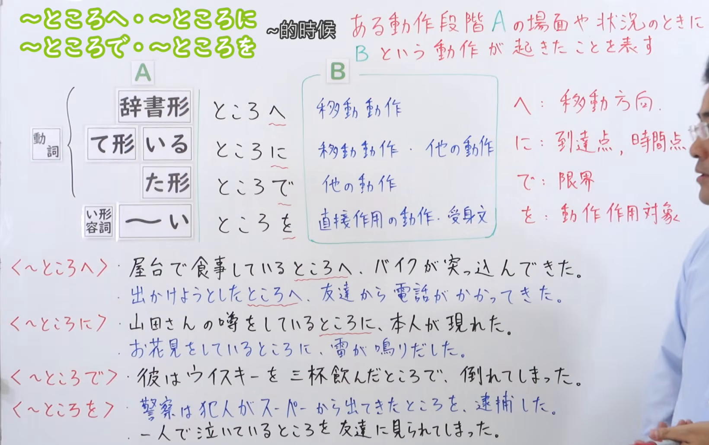
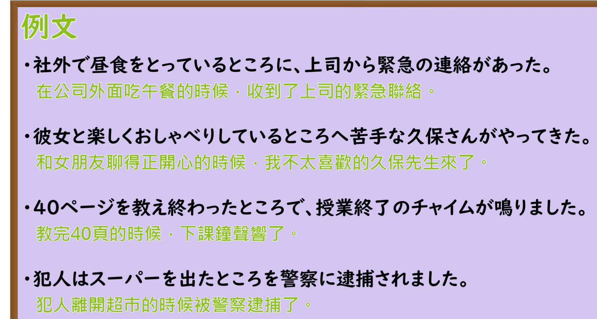

---
{
  "draft_id": "draft-20260912-n3-g-0045",
  "confirmed": false,
  "created_at": "2026-09-12",
  "proposal": {
    "id": "N3-G-0045",
    "kind": "grammar",
    "level": "N3",
    "title": "～ところへ／に／で／を：动作阶段与后项关系",
    "status": "draft",
    "card_revision": 1,
    "source": {
      "lesson": "N3 第45个语法",
      "material": "出口日語日语自动字幕、原视频板书与例句画面、独立教学正文",
      "video": "https://www.youtube.com/watch?v=DfbwUOXyNAc",
      "screenshot": "assets/grammar/n3/N3-G-0045-0500.png",
      "screenshot_seconds": 300,
      "screenshot_crop": {
        "x": 0,
        "y": 0,
        "width": 1640,
        "height": 1030
      }
    },
    "tags": [
      "动作阶段",
      "助词",
      "N3"
    ],
    "confusions": [
      "ところで让步",
      "ところを礼貌",
      "ところだ"
    ]
  }
}
---

# N3 第45课｜～ところへ・～ところに・～ところで・～ところを（待确认）

# 视频学习资料整理

根据学习者指定的出口日語课程整理，未提供个人理解或例句，不虚构学习者原始输出。已从保存的播放列表第45项核对标题及视频ID「DfbwUOXyNAc」；整理前未发现同编号正式卡、草稿或确认事件。本卡未确认入库，不启动复习。

主图取自[原视频05:00](https://www.youtube.com/watch?v=DfbwUOXyNAc&t=300s)。原帧1920×1080，固定左上角裁为(0, 0, 1640, 1030)。00:01右侧助词说明、下方例句末尾被人物遮挡；比较05:05、05:10、07:00、07:20、07:30后，选用05:00，保留接续、顶部含义、四类后项与完整板书例句。右缘仍有少量面部、衣袖和手；教学文字可读，不为裁去人像截断顶部含义或右侧助词说明。未重绘、抹除或拼接。

补充[原视频08:00例句页](https://www.youtube.com/watch?v=DfbwUOXyNAc&t=480s)，原帧1920×1080，裁为(0, 0, 1680, 900)，保留四句日文与中文，裁去右侧、底部多余区域，无人像。

# 核心与接续

## **【动词辞书形／て形＋いる／た形／い形容词（～い）】＋ところ（所）＋へ／に／で／を**

**正要……／正在……／刚……的时候，或处于某种状况时，发生了另一件事。** 「ところ」把动作的某个阶段或某种状况作为场面或时点提出，后面的助词取决于后项怎样与该场面发生关系。这里的四种助词不是任意互换，也不是把接续表横向逐行一一配对。

| 类型 | 接续规则 | 示例 |
|---|---|---|
| 动词 | 辞书形＋ところ＋助词：动作开始前的阶段 | 出かけるところを見られた |
| 动词 | て形＋いる＋ところ＋助词：正在进行；叙述过去场面也可用ていた | 食事しているところへ／歩いていたところを |
| 动词 | た形＋ところ＋助词：刚完成或到达某个节点；时间用法ところで尤其常见此形式 | 飲んだところで／出たところを |
| い形容词 | ～い＋ところ＋助词：保留词尾い，表示某种状况；具体助词按语境选择 | いいところに来ましたね／お忙しいところをすみません |

「て形＋いる」如食べて＋いる，不重复添加て。板书明确列有「い形容词（～い）＋ところ＋助词」，不应缩减为只允许「いい」。这表示某种状况，不是动词的开始前／进行中／完成后三阶段；也不表示任意い形容词都能与四种助词自由组合。「いいところに／へ」表示来得正好；「お忙しいところを」表示体谅对方忙碌的处境，其礼貌用法见下文。

**板书例句的扩展结构：动词意向形＋とした＋ところ＋助词。** 图片下方原句是「出かけようとしたところへ、友達から電話がかかってきた」（正要出门时，朋友打来了电话）。应拆为「出かけよう＋とした＋ところへ」，整体以「した」的た形接ところ，表示正要开始；不是「意向形＋ところ」，不能写成「出かけようところへ」，也不表示已经出门。

| 表达 | 场面与后项的关系 | 常见后项 |
|---|---|---|
| ところへ | 人、物、消息进入前项场面，突出“朝这里来” | やってくる／突っ込んでくる／電話がかかってくる |
| ところに | 恰在该时点发生事情，或有人／事物来到该场面 | 現れる／連絡がある／雷が鳴り出す |
| ところで | 以动作的某一节点、告一段落处为界，发生后续变化 | 終わる／チャイムが鳴る／倒れる |
| ところを | 该场面或其中的人被看到、发现，或受到直接作用 | 見る／見られる／逮捕する／呼び止める／助ける |

# 语义边界与适用条件

1. 「ところに／へ」常可替换，例如谈论某人时本人出现；へ的方向性更强。单纯在那个时点打雷等情形，に更容易表达，不把“に与へ总能互换”当规则。
2. 后项常是意外的介入，但不一定是不好的事；有人前来帮忙同样可以。「ところを」也不限于逮捕或受害，帮助、拍照、看见都可用。
3. ところを后面常有被动句，但不强制被动：「警察は犯人が出てきたところを逮捕した」就是主动句。
4. 原课把で解释为“界限”；更具体地说，是动作进展到某个节点、场面发生转变，不限于人的体力极限。国際交流基金重点说明た形＋ところで；其他教学例句还有ていた等场面表达，所以正文写“尤其常见た形”，不写“只允许た形”。
5. 本课时间用法「書き終わったところで、ベルが鳴った」与让步「急いだところで、間に合わない」（即使着急也赶不上）不同；判断前项是真实阶段还是假设、后项是否表达徒劳等。
6. 句首「ところで、明日の予定は？」是“话说／对了”的转换话题用法；「問い合わせたところ、締切がわかった」是做了之后发现结果，也不等同于本课四种助词。
7. 「お忙しいところを、ありがとうございます」涉及体谅对方处境的礼貌用法，另作易混提示，不以本课“被看见／被制止”解释全部ところを。

# 课程例句

以下日文取自原课例句页，中文为整理译文。

1. 社外で昼食をとっているところに、上司から緊急の連絡があった。
   - 正在公司外吃午饭时，收到了上司的紧急联系。
2. 彼女と楽しくおしゃべりしているところへ苦手な久保さんがやってきた。
   - 正和女朋友开心地聊天时，我不太擅长应付的久保来了。
   - 原图译为“不太喜欢的久保先生”；苦手强调不擅长相处、应付起来不自在，不必等于讨厌。此处彼女按原课中文语境理解为女朋友。
3. 40ページを教え終わったところで、授業終了のチャイムが鳴りました。
   - 刚讲完第40页，下课铃就响了。
   - 这里按教材页码理解；单独的「40ページ」也可能按上下文指40页的量，原句未明示更多背景。
4. 犯人はスーパーを出たところを警察に逮捕されました。
   - 犯人刚走出超市，就被警察逮捕了。

原课板书补充：

- 屋台で食事しているところへ、バイクが突っ込んできた。
  - 正在路边摊吃饭时，一辆摩托车冲了过来。
- お花見をしているところに、雷が鳴りだした。
  - 正在赏花时，响起了雷声。
- 一人で泣いているところを友達に見られてしまった。
  - 独自哭泣时，被朋友看见了。

# 自然例句（自拟）

1. 夕飯を作っているところへ、友達が野菜を届けに来ました。
   - 正在做晚饭时，朋友来送蔬菜了。
2. ちょうどいいところに来ましたね。この箱を運ぶのを手伝ってくれませんか。
   - 你来得正好，能帮我搬一下这个箱子吗？
3. 発表が終わったところで、司会者が質問を受け付けました。
   - 报告结束后，主持人开始接受提问。
4. 帰ろうとしたところを、先生に呼び止められました。
   - 正要回去时，被老师叫住了。

# 易混项与JLPT考点

- 助词选择看后项：本人“来了”→に／へ；“被本人听见”→を，不能只凭前项都是“正在说话”选择。
- で突出节点或转变；を突出现场成为观察、捕捉或直接作用的对象。相同场景可能允许不同描写角度，不人为制造没有语境依据的唯一答案。
- 辞书形、ている、た形分别指开始前、进行中、完成后；意向形＋とした是“正要”，不等于已经完成前项动作。
- 区分「たところで」时间与让步、句首ところで的话题转换；読み取り时先判断前后项关系。

# 来源与复核记录

学习者审核原话：「45的图片中我没有看到动词意向形+ところ+助词这个语法，我看到有い形容词+ところ+助词，为什么你没有写」

审核修正：重新目视核对05:00截图，将板书中的い形容词接续补入大号总接续及主表；原稿只列「いい」作为补充，未完整呈现课程接续。将「意向形＋とした」移至板书例句解析，明确不能省略「とした」。保留未确认状态。

核对日期：2026-09-12。

1. [出口日語第45课](https://www.youtube.com/watch?v=DfbwUOXyNAc)：日语字幕全文、00:01及多个讲解画面、05:00主图与08:00例句页，确认核心接续、四种助词、电话的方向性、雷声的时间点及いいところに。
2. [国際交流基金：文法を楽しく「ところ」（1）](https://www.jpf.go.jp/j/project/japanese/teach/tsushin/grammar/201106.html)：日文正文详细解释で的阶段节点、に／へ的到来、を的直接作用及观察用法；提供ていた、意向形＋とした、主动与被动的实例，是助词区别的主要独立依据。
3. [ヤトモンキー先生：ところに／へ／で／を](https://yatomonkey-nihongo.com/entry/jlpt-n3-41)：日文教学正文支持阶段接续、后项倾向、帮助／拍照、いいところに／へ；其ところで例句含ていた，帮助避免把基础た形写成唯一可能形式。
4. [なに日本語：ところに／へ／で／を](https://nani-blog.com/jlpt-grammar-tokoronihedewo/)：中文补充资料，提供同一场景按后项选助词的对照，及时间ところで与让步、礼貌ところを的区分；不作为替代日本教学正文的唯一证据。

分歧处理：国際交流基金从“在一个告一段落的状况下”解释で，课程用“界限”帮助记忆，二者重点不同而不冲突；不把所有ところで都解释成人的能力上限。例句时间关系与前置形式需整体判断。

字幕校对：「所得／女子／同市／補足」等依板书与讲解校正为ところへ、助词、动词、捕捉；自动字幕遗漏的を按画面补回，不能照抄「ところ警察に」。

成稿复核：核对阶段接续、四种助词与后项、に／へ替换边界、主动被动、时间／让步／礼貌用法区别、例句译文；目视检查最终裁图，关键教学内容可读。截图放在视频学习资料整理，Markdown图片链接有效；现有阅读器尚不显示正文截图。

缓存：`.firecrawl/n3-playlist-items.json`、`.firecrawl/DfbwUOXyNAc.ja.vtt`、`.firecrawl/n3-45-search.json`及视频／原帧。缓存不提交。等待学习者明确确认入库。
