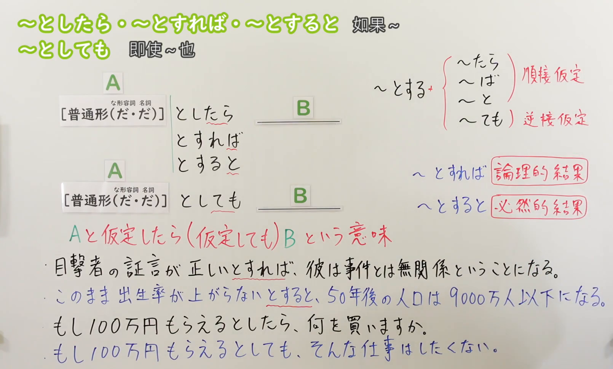

---
{
  "draft_id": "draft-20260912-n3-g-0046",
  "confirmed": false,
  "created_at": "2026-09-12",
  "proposal": {
    "id": "N3-G-0046",
    "kind": "grammar",
    "level": "N3",
    "title": "～としたら／とすれば／とすると／としても：假设与让步",
    "status": "draft",
    "card_revision": 1,
    "source": {
      "lesson": "N3 第46个语法",
      "material": "出口日語日语自动字幕、原视频板书与例句画面、独立教学正文",
      "video": "https://www.youtube.com/watch?v=3CvjuUYsW98",
      "screenshot": "assets/grammar/n3/N3-G-0046-0405.png",
      "screenshot_seconds": 245,
      "screenshot_crop": {
        "x": 0,
        "y": 0,
        "width": 1610,
        "height": 970
      }
    },
    "tags": [
      "假设",
      "推论",
      "让步",
      "N3"
    ],
    "confusions": [
      "といっても",
      "たら",
      "身份としても"
    ]
  }
}
---

# N3 第46课｜～としたら・～とすれば・～とすると・～としても（待确认）

# 视频学习资料整理

根据学习者指定的出口日語课程整理，未提供个人理解或例句，不虚构学习者原始输出。已从保存的播放列表第46项核对标题及视频ID「3CvjuUYsW98」；整理前未发现同编号正式卡、草稿或确认事件。本卡未确认入库，不启动复习。

主图取自[原视频04:05](https://www.youtube.com/watch?v=3CvjuUYsW98&t=245s)。原帧1920×1080，固定左上角裁为(0, 0, 1610, 970)。00:01右侧区别及例句末尾被人物遮挡；比较03:20、03:50、04:00、04:10、04:20、05:00后，选用04:05，保留接续、顺接／逆接、推论倾向和四个板书例句。已裁去人像及底部空白，右下缘有少量衣袖，不遮文字。未重绘、抹除或拼接。

补充[原视频06:00例句页](https://www.youtube.com/watch?v=3CvjuUYsW98&t=360s)，原帧1920×1080，裁为(0, 0, 1760, 900)，保留四句日文及中文，去除右侧和底部多余区域，无人像。

# 核心与接续

## **【普通形（だ・だ）】＋としたら／とすれば／とすると**

**假如……；假定……的话。** 将A作为假设或推理前提，再考虑B。

## **【普通形（だ・だ）】＋としても**

**即使假定……，也……。** 即使A成立，B这一结论、意愿或安排仍不改变。

括号内依次对应な形容词、名词的现在肯定形：本课标准接续保留だ，不改成な／の，也不沿用第43课的「[だ]」省略标记。动词和い形容词用普通形，不额外加だ。

| 类型 | 接续规则 | 示例 |
|---|---|---|
| 动词 | 普通形＋四种表达之一，可用肯定、否定、过去 | 行くとしたら／来ないとすると／合格したとしても |
| い形容词 | 普通形＋四种表达之一 | 正しいとすれば／高くないとしたら／安かったとしても |
| な形容词 | 现在肯定：词干＋だ＋四种表达之一；其他形式照普通形 | 安全だとしたら／静かではないとすると／元気だったとしても |
| 名词 | 现在肯定：名词＋だ＋四种表达之一；其他形式照普通形 | 本当だとすれば／休みではないとしたら／学生だったとしても |

「とする」有“假定为……”的作用，再接たら／ば／と／ても。注意分清**前项的时态**与**表达内部的したら／すれば／すると／しても**：「合格したとしたら」中两个した各有作用，不能因重复看起来奇怪就删掉。

# 四种表达的区别

| 表达 | 主要作用与常见倾向 | 示例要点 |
|---|---|---|
| としたら | 把某种情形作为假设，口语常见；后项可问意愿、作打算、推测 | もらえるとしたら、何を買いますか |
| とすれば | 在该前提下作推论、判断、估算 | 証言が正しいとすれば、無関係ということになる |
| とすると | 从该前提推导结果，常偏客观归结；不宜机械接说话人的意志或命令 | 出生率が上がらないとすると、人口は…になる |
| としても | 让步假设：即使接受A，B仍成立 | もらえるとしても、その仕事はしたくない |

前三种之间有重叠；「とすれば＝只能逻辑结果」「とすると＝只能必然结果」都过于绝对。原课讲解也明确说“较常如此，不是全部”。「としても」是顺接与让步关系的改变，不能当成前三种的同义替换。

# 语义边界与适用条件

1. 假设不等于绝不可能，也不表示A已经发生；可以是尚未确定的信息、未来可能性、反事实想象，或暂时接受对方说法来推论。
2. 前项用了た形也不一定指已经发生的过去事实：「明日の試験に合格したとしたら」仍可假设明天考试合格；结合时间词和上下文。
3. 与普通「たら」相比，「としたら」明确提出假设，不能代替表示单纯先后顺序的全部たら用法。日常“刷完牙就睡觉”不必改为“假如刷牙的话”。
4. 「としても」后项不必是否定句：「結婚するとしても、仕事を続けたい」是肯定意愿；重点在即使前项成立，后项仍然如此。
5. 「たとえ／仮に」常与としても共现，但并非必需。「もし」也能与假设表达搭配，不能只看到もし就排除としても。
6. 「教師としても働いている」可以是“也作为教师工作”，是名词＋として＋も的身份用法；「教師だとしても」才是“即使假定是教师”。需结合接续和句意判断。
7. 本课假设用法的基本接续保留名词、な形容词的だ；如看到「ということだとすると」「のだとしたら」，要分析外层说明或引用结构，不直接把原名词的だ随意省掉。

# 课程例句

以下取自原课例句页，中文为整理译文。

1. 私とあなたのお母さんが溺れていたとしたら、どっちを助ける？
   - 假如我和你妈妈都溺水了，你会救谁？
2. 彼の話が本当だとすれば、彼は加害者じゃなくて被害者ということになる。
   - 假如他说的是真的，那他就是受害者，而不是加害者。
3. 将来結婚するとしても、私は仕事を続けたいです。
   - 即使将来结婚，我也想继续工作。
4. 高い給料をもらえるとしても、その仕事はしたくないです。
   - 即使能拿高薪，我也不想做那份工作。

原课板书中的对照：

- もし100万円もらえるとしたら、何を買いますか。
  - 假如能拿到100万日元，你会买什么？
- もし100万円もらえるとしても、そんな仕事はしたくない。
  - 即使能拿到100万日元，我也不想做那种工作。
- このまま出生率が上がらないとすると、50年後の人口は9000万人以下になる。
  - 假如出生率继续不上升，50年后人口将降至9000万人以下。
  - 这是原课程说明假设推论的例句；数字未作为当前人口预测核实。语法上的归结不保证现实预测正确，人口变化也不能只由当前人口与出生率简单相乘得出。

# 自然例句（自拟）

1. 一週間休みが取れるとしたら、どこへ行きたいですか。
   - 假如能休一周假，你想去哪里？
2. 参加者が二十人だとすれば、この部屋で十分でしょう。
   - 假如参加者有20人，这个房间应该够用吧。
3. 一個二百円だとすると、五個で千円になります。
   - 假定一个200日元，五个就是1000日元。
4. たとえ今回失敗したとしても、もう一度挑戦します。
   - 即使这次失败，我也会再挑战一次。

# 易混项与JLPT考点

- 四类接续：本当だとすれば、安全だとしても、正しいとすれば；不能写「本当のとすれば」「正しいだとすれば」。
- 顺接与让步：假如有高薪“会做什么”与即使有高薪“仍不做”关系不同；优先判断前后逻辑，再比较细微语气。
- とすると常用于从前提推论；询问个人选择或愿望时，としたら通常更合适。近义表达有重叠，试题不能只凭模糊的主观／客观标签判唯一答案。
- た形不自动等于真实过去；注意未来时间词、反事实与假设前提。
- 身份として＋も与假设だとしても分开；与第43课“修正印象”的といっても也不要混淆。

# 来源与复核记录

核对日期：2026-09-12。

1. [出口日語第46课](https://www.youtube.com/watch?v=3CvjuUYsW98)：日语字幕全文、00:01及多个讲解时点、04:05板书、06:00例句页，确认普通形（だ・だ）、顺接／让步、后项常见倾向及课程例句。
2. [日本語教師のN1et：としたら／とすれば／とすると](https://jn1et.com/tositara/)：日文正文支持普通形与な形容词、名词保留だ，强调假设与单纯动作先后有别。
3. [日本語教師たのすけ：三种假设的区别](https://tanosuke.com/toshitara-tosureba-tosuruto)：日文正文支持三者有重叠、としたら常用于设想、其他两者的推论倾向；也说明可根据已知情况继续推论。其とすると小节混入若干となると例句，未把这些当作とすると的例句证据；末尾关于意志表达的概括较简略，本卡不扩展成绝对禁令。
4. [日本語教師のN1et：としても](https://jn1et.com/tositemo/)：日文正文逐类列出接续，支持让步假设、たとえ搭配、后项既可意愿也可事实，以及与身份としても的区别。
5. [日本語NET：としても／としたって](https://nihongokyoshi-net.com/2019/06/02/jlptn3-grammar-toshitemo/)：独立日文正文支持前项成立也不改变后项、普通形、名词だ、未来假设也可出现た形及肯定后项例句。

分歧处理：检索的Bunpro页面接续表把だ放括号，但说明正文明确要求名词／な形容词后接だ；按原课板书与日本教师正文保留标准だ接续，不据含糊括号推导可任意省略。三种顺接假设的差异按使用倾向呈现，不把“必然”理解为现实上绝对可靠。不同资料的N3／N2标注不改变本项目课程编号。

字幕校对：「通したら／当スレ罵倒すると／家庭／加害者がなくて」等依板书、例句页与上下文校正为としたら／とすれば／とすると、仮定、加害者じゃなくて；不把自动字幕混词当作正式形式。

成稿复核：核对四类接续与だ、前项时态、顺接／让步、后项意愿与否定的范围、课程／自拟例句和译文；目视检查两张最终裁图，教学内容完整可读。截图放在视频学习资料整理，Markdown图片链接有效；现有阅读器尚不显示正文截图。

缓存：`.firecrawl/n3-playlist-items.json`、`.firecrawl/3CvjuUYsW98.ja.vtt`、`.firecrawl/n3-46-search.json`、`.firecrawl/n3-46-tositemo.md`、`.firecrawl/n3-46-temo-search.json`及视频／原帧。搜索中的转载学习词表未计为独立来源；课程核对使用日语字幕与原画面，未以检索返回的中文视频转录代替。缓存不提交。等待学习者明确确认入库。
