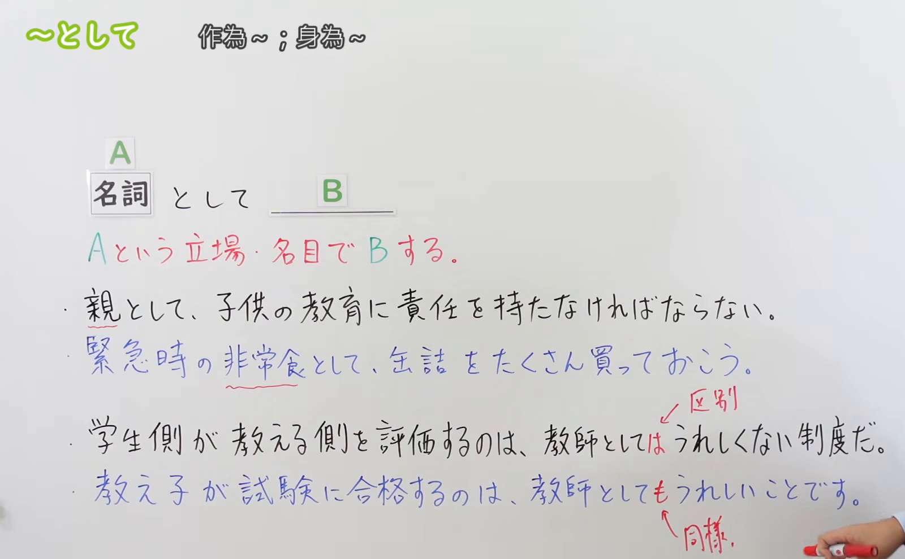
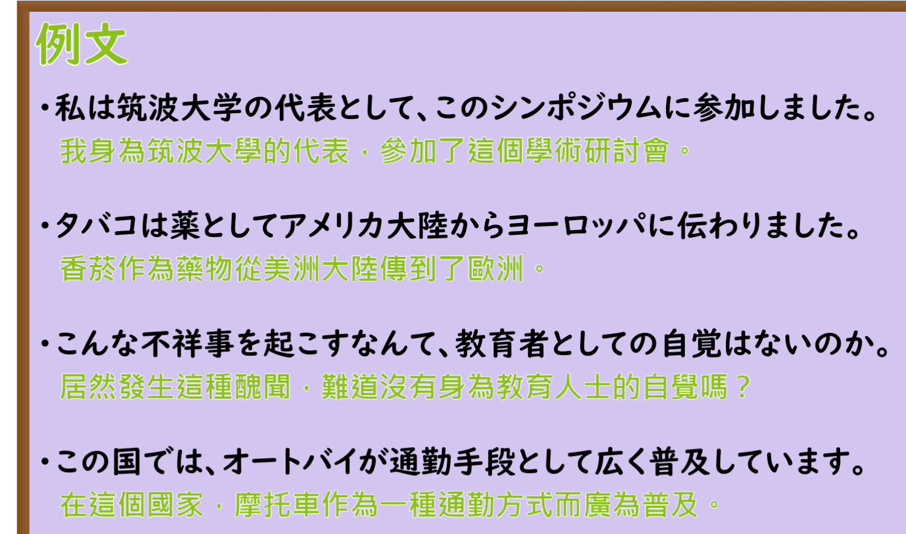

---
{
  "draft_id": "draft-20260912-n3-g-0047",
  "confirmed": false,
  "created_at": "2026-09-12",
  "proposal": {
    "id": "N3-G-0047",
    "kind": "grammar",
    "level": "N3",
    "title": "～として：作为……；以……的身份或用途",
    "status": "draft",
    "card_revision": 1,
    "source": {
      "lesson": "N3 第47个语法",
      "material": "出口日語日语自动字幕、原视频板书与例句画面、独立教学正文",
      "video": "https://www.youtube.com/watch?v=cD6f8YKnUnQ",
      "screenshot": "assets/grammar/n3/N3-G-0047-0310.png",
      "screenshot_seconds": 190,
      "screenshot_crop": {
        "x": 0,
        "y": 0,
        "width": 1600,
        "height": 990
      }
    },
    "tags": [
      "身份",
      "立场",
      "用途",
      "N3"
    ],
    "confusions": [
      "だとしても",
      "にとって",
      "としての"
    ]
  }
}
---

# N3 第47课｜～として（待确认）

# 视频学习资料整理

根据学习者指定的出口日語课程整理，未提供个人理解或例句，不虚构学习者原始输出。已从保存的播放列表第47项核对标题「～として」及视频ID「cD6f8YKnUnQ」；整理前未发现同编号正式卡或草稿。本卡未确认入库，不启动复习。

主图取自[原视频03:10](https://www.youtube.com/watch?v=cD6f8YKnUnQ&t=190s)。原帧1920×1080，固定左上角裁为(0, 0, 1600, 990)。00:01例句末尾被人物遮挡；检查01:30、02:30、03:10、03:20、03:30后选用03:10，完整保留名词接续、含义、四句板书和「区別／同様」说明。裁去面部和身体，右下角仍有少量手部、衣袖，不遮教学文字；顶部空白因固定左上角规则保留。未重绘、抹除或拼接。

补充[原视频04:00例句页](https://www.youtube.com/watch?v=cD6f8YKnUnQ&t=240s)，原帧1920×1080，固定左上角裁为(0, 0, 1540, 910)，保留四句完整日文和中文，裁去右侧及底部多余区域，无人像。

# 核心与接续

## **【名词】＋として**
## **【名词】＋としては／としても；【名词】＋としての＋名词**

**作为……；以……的身份、立场、资格、名目或用途。** 「AとしてB」说明以什么身份做B，或把某物当作什么使用、评价。课程主接续只列名词，不套用普通形四类通用规则。

| 类型 | 接续规则 | 示例 |
|---|---|---|
| 名词 | 名词＋として：不加だ、の | 親として／非常食として |
| 名词 | 名词＋としては：提出或区分某一立场、评价角度 | 教師としてはうれしくない |
| 名词 | 名词＋としても：追加同样成立的身份、立场或用途 | 教師としてもうれしい／辞書としても使える |
| 名词 | 名词＋としての＋名词：修饰后面的名词，须加の | 教育者としての自覚／教師としての責任 |

「としては／としても」在原课板书和讲解中出现；「としての」在原课例句页出现，均纳入本课接续。此处「として」不需变为「とします」；礼貌程度由句末「働きます／使えます」等表达。

# 语义边界与适用条件

1. **身份、立场**：親として、代表として，后项是与该身份有关的行动、责任、判断或评价。一个人可以同时有多个身份，句子选取当前相关的一种。
2. **用途、名目**：非常食として、通勤手段として，不限于人的身份。「名目」在这里不必是虚假借口，也可指款项、物品的名义或用途。
3. **作为某类事物的评价**：「歌手として有名だ」说明以歌手身份出名；「観光地として人気がある」说明作为旅游地受欢迎。
4. **としては**：は可突出某一立场，并与其他立场形成对照；不必每句都明说另一方，也不强制接负面评价。「教師としてはうれしい」同样可以成立。
5. **としても**：本课的も表示“也”。可以是同一个人的另一种身份，也可以是不同人的立场都同样成立。原课「教え子が…教師としてもうれしい」指学生本人开心，身为教师也开心，不要求同一人兼任学生和教师。
6. **としての**：用于名词修饰。「教師として働く」后面是动词；「教師としての仕事」后面是名词，不能漏掉の。

# 课程例句

以下日文按原视频例句页记录，中文为整理译文。

1. 私は筑波大学の代表として、このシンポジウムに参加しました。
   - 我以筑波大学代表的身份参加了这次研讨会。
2. タバコは薬としてアメリカ大陸からヨーロッパに伝わりました。
   - 烟草曾作为药物从美洲大陆传到欧洲。
   - 保留原课的历史叙述，用于理解「薬として」的名目／用途；本卡未独立考证烟草传播史。「タバコ」在此译为烟草，比原图“香菸”更贴合历史语境。
3. こんな不祥事を起こすなんて、教育者としての自覚はないのか。
   - 居然闹出这种丑闻，难道没有身为教育者的自觉吗？
   - 「起こす」指引发、造成，不只表示事情自行发生；「教育者としての」修饰「自覚」。
4. この国では、オートバイが通勤手段として広く普及しています。
   - 在这个国家，摩托车作为通勤工具得到广泛普及。

原课板书：

- 親として、子供の教育に責任を持たなければならない。
  - 作为父母，必须对孩子的教育负责。
- 緊急時の非常食として、缶詰をたくさん買っておこう。
  - 多买些罐头，作为紧急情况下的储备食品吧。
- 学生側が教える側を評価するのは、教師としてはうれしくない制度だ。
  - 由学生评价授课方，这对教师这一方来说，是个让人不太高兴的制度。
  - 这是原课用来说明立场差异的观点示例，不表示所有教师都这样想。
- 教え子が試験に合格するのは、教師としてもうれしいことです。
  - 学生通过考试，作为老师也感到高兴。

原课会话要点（核对04:30画面）：员工从自身立场评价远程办公，以「社員としては」提出“不必乘通勤电车、可以在家工作”的好处，随后谈到容易分心。这里的は突出员工立场，不是让步假设。

# 自然例句（自拟）

1. 来月から、日本語教師としてこの学校で働きます。
   - 从下个月起，我将在这所学校担任日语教师。
2. この部屋は、普段は書斎として使っていますが、客室としても使えます。
   - 这个房间平时用作书房，也能用作客房。
3. 親としては、子供の希望を尊重したいです。
   - 站在父母的立场，我想尊重孩子的意愿。
4. 彼は研究者としての経験を授業に生かしています。
   - 他把作为研究者积累的经验运用到了教学中。

# 易混项与JLPT考点

| 对照 | 含义与判断方法 |
|---|---|
| 教師としても、学ぶことは多いです。 | 作为教师，也有很多需要学习的东西。名词＋として＋も，追加立场。 |
| 教師だとしても、すべての質問に答えられるわけではありません。 | 即使是教师，也不意味着能回答所有问题。第46课的普通形＋としても，名词现在肯定形保留だ。 |
| 私にとって、この辞書は大切です。 | 对我来说，这本词典很重要。にとって以某人为评价基准，不表示词典的用途。 |
| このアプリを辞書として使います。 | 将这个应用用作词典。として标明用途。 |

- 接续选择：本课为名词＋として，不能写「教師だとして働く」来表达“作为教师工作”。
- 修饰名词时选「としての」；「教育者としての自覚」是本课原例句的重点。
- は看特定立场或对比；も看追加、同样成立，不把所有「としても」都译成“即使”。
- 「として」与「にとって」在部分评价句里都能出现，但关注点不同；不能据此推定处处可换。
- 阅读时先认清A代表身份、用途还是评价类别，再判断后项与A的关系。

# 来源与复核记录

核对日期：2026-09-12。

1. [出口日語第47课](https://www.youtube.com/watch?v=cD6f8YKnUnQ)：日语自动字幕全文、00:01及多个讲解画面、03:10板书、04:00例句和04:30会话，确认名词接续、身份／名目、は的区分、も的同样成立及としての。
2. [ヤトモンキー先生：N3文法「として」](https://yatomonkey-nihongo.com/entry/jlpt-n3-19)：已读日文正文；支持名词接续、身份、用途／功能、评价三类及としては／としても实例。
3. [日本語NET：文法・例文「〜として」](https://nihongokyoshi-net.com/2020/01/06/jlptn3-grammar-toshite/)：已读日文教学正文及例句；支持立场、资格、名目，名词接续和评价、身份追加。正文中的「ひらなが」为来源笔误，本卡未采用该句。
4. [日本語 to 旅：N3文法「〜として」](https://www.youtube.com/watch?v=uEuiHupgID0)：已读教学说明栏及检索返回的讲解字幕，补充核对としての＋名词、作为母亲的立场、は的对比与も的追加；未将自动字幕错字作为接续依据。

资料处理：原课把非常食归入“名目”，独立资料还单列用途／功能，二者可相容；本卡将具体用途明确写出。两份日文网站与原课程在关键接续上无冲突。第46课让步用法的对照沿用已确认卡。

字幕校对：自动字幕的「通して／投資体／名刺／女子／通勤芸者」按板书或例句画面校正为として、名词、助词、通勤電車。原课例句与自拟例句分开标注。

成稿复核：对照截图检查名词接续与としては／も／の无遗漏，检查も与让步的区别、名词修饰、译文与例句来源。两张最终裁图已目视检查，教学文字完整可读，Markdown图片链接有效。仅创建待确认卡，不设置复习日期。截图在Markdown中提供；现有阅读器的正文截图显示限制沿用项目说明。

缓存：`.firecrawl/n3-playlist-items.json`、`.firecrawl/n3-47-search.json`、`.firecrawl/cD6f8YKnUnQ.ja.vtt`及原视频／原帧。缓存不提交。等待学习者明确确认入库。
