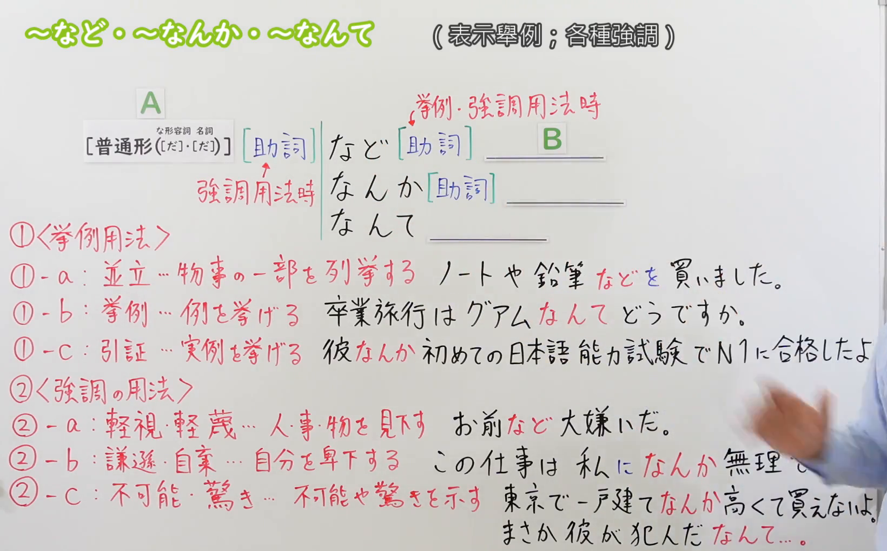
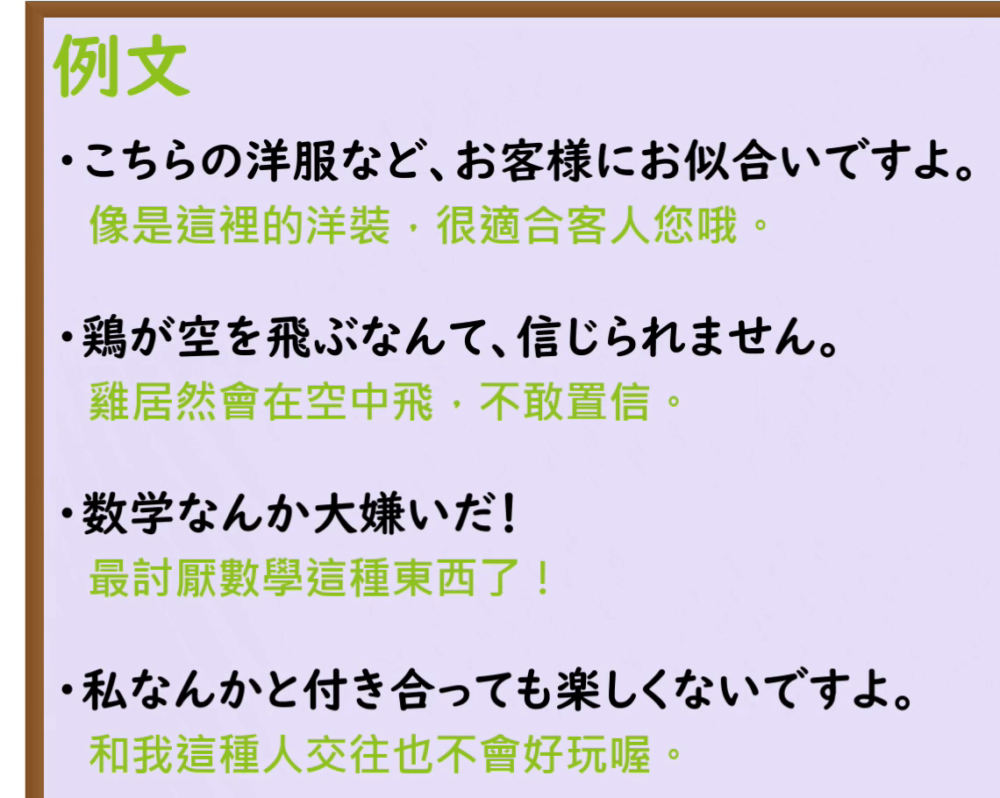

---
{
  "draft_id": "draft-20260912-n3-g-0048",
  "confirmed": false,
  "created_at": "2026-09-12",
  "proposal": {
    "id": "N3-G-0048",
    "kind": "grammar",
    "level": "N3",
    "title": "～など／なんか／なんて：举例、轻视、自谦与惊讶",
    "status": "draft",
    "card_revision": 1,
    "source": {
      "lesson": "N3 第48个语法",
      "material": "出口日語日语自动字幕、原视频板书与例句画面、独立日文教学正文",
      "video": "https://www.youtube.com/watch?v=bq38A3YlCJg",
      "screenshot": "assets/grammar/n3/N3-G-0048-0810.png",
      "screenshot_seconds": 490,
      "screenshot_crop": {"x": 0, "y": 0, "width": 1640, "height": 1020}
    },
    "tags": ["举例", "轻视", "自谦", "惊讶", "N3"],
    "confusions": ["なんて与なんか的替换", "助词位置", "名词举例与普通形惊讶", "とは", "なんか与なにか"]
  }
}
---

# N3 第48课｜～など・～なんか・～なんて（待确认）

# 视频学习资料整理

根据学习者指定的出口日語课程整理；未提供个人理解或例句，不虚构学习者原始输出。已核对保存的播放列表第48项、原视频标题及视频ID「bq38A3YlCJg」。整理前未发现本课正式卡、草稿或确认事件。本卡未确认入库，不启动复习。

主图取自[原视频08:10](https://www.youtube.com/watch?v=bq38A3YlCJg&t=490s)，原帧1920×1080，固定左上角裁为(0, 0, 1640, 1020)。00:01多句右端被人物遮挡；检查01:30、04:00、05:00、05:30、05:50、06:30、06:40、07:30、08:00及08:05—08:15附近画面，选用08:10，保留接续、助词位置、六类含义及板书例句。已裁去面部和大部分身体；右侧手臂仍遮住「この仕事は…」句末的一部分，完整句结合08:00画面和日语讲解核对，正文单独列出。没有把画面缩成只有接续的小块，也未抹除、重绘或拼接。

补充[原视频08:55例句页](https://www.youtube.com/watch?v=bq38A3YlCJg&t=535s)，原帧1920×1080，固定左上角裁为(0, 0, 1140, 910)。四句日文及中文完整，无人像，裁去右侧和底部多余空白。

# 核心与接续

## **【名词】＋など／なんか／なんて**
## **【普通形（[だ]・[だ]）】＋なんて／など（整句引用、惊讶等）**

**举例：“……等／……之类”；带态度地提出对象：“……这种东西／像我这样的人”；对事情感到意外：“竟然……”。** 「など」较正式；「なんか」「なんて」多用于口语。具体含义由语境决定，不是看到「なんか」就一定有贬义。

原课总接续把三者放在「普通形（[だ]・[だ]）」后。这里将常见用法分开：**名词举例、轻视时用名词本身；提出整件事情表示惊讶时，以普通形＋なんて为重点。** 两个「[だ]」依次对应な形容词、名词的现在肯定形，表示这一整句用法中可有可无，不代表三种表达在所有句子里都能自由替换。

| 类型 | 接续规则 | 示例 |
|---|---|---|
| 名词 | 名词＋など／なんか／なんて，举例或提出评价对象，不加の | 本など／私なんか／旅行なんて |
| 动词 | 普通形＋なんて／など；惊讶时常用なんて | 合格したなんて／約束を忘れるなんて |
| い形容词 | 普通形＋なんて／など，不因本课而给普通形加だ | こんなに高いなんて／寒かったなんて |
| な形容词 | 词干＋（だ）＋なんて；否定、过去用相应普通形 | こんなに静か（だ）なんて／簡単ではないなんて |
| 名词 | 名词＋（だ）＋なんて；否定、过去用相应普通形 | 彼が犯人（だ）なんて／昨日が締め切りだったなんて |

「なんか」的典型接续是名词；对于「彼が合格したなんて！」这类对整件事实的惊讶，不能机械换成「なんか」。原课「一戸建てなんか高くて買えない」则是名词＋なんか，突出“买不起这种房子”的态度，结构不同。

原课还提到命令形、禁止形、意向形、て形等也能出现在前面。这涉及把话语作为内容提出，例如（自拟）「『帰れ』なんて言わないでください」。应按引用内容理解，不据此记成“任意词形＋任意一种表达都成立”。普通形后的「だなんて」也可能含有引用、强调作用；不把它当作动词或い形容词普通形本身带だ的证据。

# 助词位置与替换边界

| 用法 | 常见形式 | 注意点 |
|---|---|---|
| 列举一部分 | ノートや鉛筆などを買う／鉛筆なんかを買う | 本课的举例结构中，を、に、で等接在など／なんか后 |
| 提出建议 | グアムなんてどうですか | 这里不用追加が、を等；也可用など／なんか |
| 轻视、自谦等强调 | 私になんか無理です／私なんかには無理です | 助词可在前或在后，但不能任意重排；需保留句子的格关系 |
| なんて后的连接 | こんな本なんて読まない | 本课的なんて不照搬「などを」写成「なんてを」，也不照搬「なんかは」写成「なんては」 |
| 修饰名词 | 野菜などの食材／田中なんて人 | 前者是举例＋の；后者相当于“叫田中的人”，是相关引用用法，不能统一套成なんての |

助词规则针对本课这些结构，不是说日语中「なんて」后绝对不能出现任何助词或引用形式。例如「『帰れ』なんて言わないで」的「言う」前已经由なんて承担引用作用，不再照搬「などと言う」添加と。

# 语义边界与适用条件

1. **举例与列举**：提出同类事物的一部分，暗示还有其他项；「ノートや鉛筆など」不是只买了这两样。
2. **举例建议**：「グアムなんてどうですか」是提出一种候选，不是在贬低关岛。店员推荐衣服、领带也可这样说。
3. **引证实例**：「彼なんか、初めての試験で…」可用某人的经历支持前面的说法。是否轻视，须看上下文，不能只看用了彼なんか。
4. **轻视、轻蔑**：把对象视为不重要、不值得考虑或不愿接受；后项常有否定，但「ひらがななんて簡単だ」是肯定句，照样能表达“这点东西很容易”的态度。
5. **自谦、自嘲**：对象是自己时，可表达“像我这样的人还不行”。语境也可能带消沉或自我贬低，不是任何场合都必须使用的礼貌表达。对他人使用同类贬低语气可能很失礼。
6. **不可能、惊讶**：既能突出“这种事做不到”的感觉，也能表示没想到的事实；惊讶可以是高兴、羡慕、失望或难以相信，不限定负面。
7. **句末なんて**：「まさか彼が犯人だなんて…」可省略“真不敢相信”等后文而保留惊讶。三者中不能在这个句末位置直接换成など／なんか。不是说它们在所有别的语境里都不能出现在句末。

# 课程例句

以下日文按08:55原课例句页记录，中文为整理译文。

1. こちらの洋服など、お客様にお似合いですよ。
   - 比如这件衣服，就很适合您。
   - 举例推荐，不是“衣服之类不值得一提”。
2. 鶏が空を飛ぶなんて、信じられません。
   - 鸡竟然能在空中飞，真不敢相信。
   - 保留原课用来表达惊讶的情境；不据此推断鸡完全没有短距离飞行能力。
3. 数学なんか大嫌いだ！
   - 我最讨厌数学这种东西了！
   - 表达排斥、轻视的语气；不作为对数学价值的客观判断。
4. 私なんかと付き合っても楽しくないですよ。
   - 和我这样的人交往，也不会有趣的。
   - なんか后接と，对自己带有贬低、自嘲。

原课板书的分类例句：

- ノートや鉛筆などを買いました。
  - 买了笔记本、铅笔等东西。
- 卒業旅行はグアムなんてどうですか。
  - 毕业旅行去关岛之类的地方，怎么样？
- 彼なんか初めての日本語能力試験でN1に合格したよ。
  - 比如他，第一次参加日语能力考试就通过了N1。
  - 原课用此句举成功实例，不保证每个人努力一次就能通过。
- お前など大嫌いだ。
  - 我最讨厌你这样的人了。
  - 强烈冒犯的原课示例，用于识别语气。
- この仕事は私になんか無理です。
  - 这份工作，像我这样的人做不来。
- 東京で一戸建てなんか高くて買えないよ。
  - 在东京，独栋房子太贵，我可买不起。
- まさか彼が犯人だなんて…。
  - 真没想到，他竟然是犯人……。

原课09:20会话中，店员以「こちらのネクタイなんていかがですか」推荐领带；这是举例建议，和「数学なんか大嫌いだ」的情绪不同。

# 自然例句（自拟）

1. 週末は、映画なんかどうですか。
   - 周末看个电影之类的，怎么样？
2. 私なんか、まだ一人ではできません。
   - 像我这样的人，还不能独立完成呢。
3. こんなに早く返事が来るなんて、うれしいです。
   - 竟然这么快就收到回复，我很高兴。
4. 明日が休みだなんて、知りませんでした。
   - 我还不知道明天竟然放假。

# 易混项与JLPT考点

- **名词举例与整句惊讶**：旅行なんてどう？是举例；明日から旅行（だ）なんて、うらやましい是对事情的反应。不要把名词举例全部加だ。
- **など／なんか／なんて**：意思常有重叠，但助词位置、引用结构、句末位置限制不同；四选项判断需结合结构，不能只看译文。
- **とは**：意外用法中「彼が来るとは」与「彼が来るなんて」可接近，なんて更口语；其他用法的とは不能一概互换。
- **なんか与なにか(何か)**：「何か食べたい」是“想吃点什么”；「パンなんか食べたい」是“想吃面包之类的”。「なんか変だ」是“总觉得有点怪”的口语用法，不是本课的名词后助词接续。
- **肯定与否定**：轻视用法并非后项必须否定；惊讶也不必是坏事。
- **阅读语气**：区分中性举例、建议、举实例、自谦和攻击性表达，不把全部翻译成“等等”。

# 来源与复核记录

核对日期：2026-09-12。

1. [出口日語第48课](https://www.youtube.com/watch?v=bq38A3YlCJg)：已读日语自动字幕全文并对照原视频多时点、08:55例句页和09:20会话，核对普通形括号中的だ、六类板书、助词位置及句末なんて。
2. [日本語教師のN1et：なんか・なんて・など](https://jn1et.com/nanka-nante-nado/)：已读日文提案、轻视接续及例句，支持名词接续、建议表达、なんて不照搬后接助词的结构、自谦及“买不起昂贵物品”的语气。文中关于「でも」只能用于共同动作等旁支概括过强，未采用；不把其名词接续说明扩展到惊讶用法。
3. [日本語教師たのすけ：なんて](https://tanosuke.com/n3-nante)：已读三个用法正文；支持轻视／自谦用名词、惊讶用普通形、名词（だ）なんて、句末省略和肯定评价。
4. [日本語NET：なんて](https://nihongokyoshi-net.com/2018/06/06/jlptn2-grammar-nante/)：已读接续与例句，补充普通形、名词だ及句末惊讶。页面标N2，不改变本项目第48课的N3课程归属。
5. [毎日のんびり日本語教師：など／なんか／なんて](https://mainichi-nonbiri.com/grammar/n3-nado/)：已读日文接续、三类解说及例句，支持名词前后助词、列举和惊讶；指出整句惊讶时なんか难用。该页“動ます形”概括与其「合格したなんて」例句不一致，本卡采用已交叉确认的普通形，不将此句作为ます形去ます的依据。
6. [日本語教師のN1et：なんて・とは](https://jn1et.com/nante-towa/)：已读逐词类接续，补充な形容词／名词（だ）、句末惊讶与引用式だなんて；不把引用性だ扩展成所有动词、い形容词的普通形规则。

分歧处理：原课把三者合并讲解，独立教学资料常按名词提案／轻视和普通形惊讶拆开。两者讲解粒度不同，本卡保留课程总写法并具体限制适用范围；不写“三者完全相同”或“任何词形都随便接”。

字幕校对：「虚礼／協調／女子／名刺／普通系／には鳥」等分别按板书和例句画面核对为挙例、強調、助詞、名詞、普通形、鶏。原课图中「挙例」按中文含义整理为“举例”，未修改原图文字。搜索结果中的原课中文转录没有替代日语字幕核对。

成稿复核：对照原图检查两大类六个分项、助词顺序、だ的适用范围、なんか与なんて的边界、原课及自拟例句。两张裁图已目视检查；主图局部遮挡已注明，接续和核心分类清晰，完整例句页无人像。图片链接有效。仅创建待确认卡，不设置复习日期；现有阅读器正文图片显示限制沿用项目说明。

缓存：`.firecrawl/n3-playlist-items.json`、`.firecrawl/bq38A3YlCJg.ja.vtt`、原视频及原帧、`.firecrawl/n3-48-search.json`、`.firecrawl/n3-48-surprise-search.json`。补充检索`.firecrawl/n3-48-nante-search.json`未命中合适的原始教学正文，未计为独立证据。缓存不提交。等待学习者明确确认入库。
