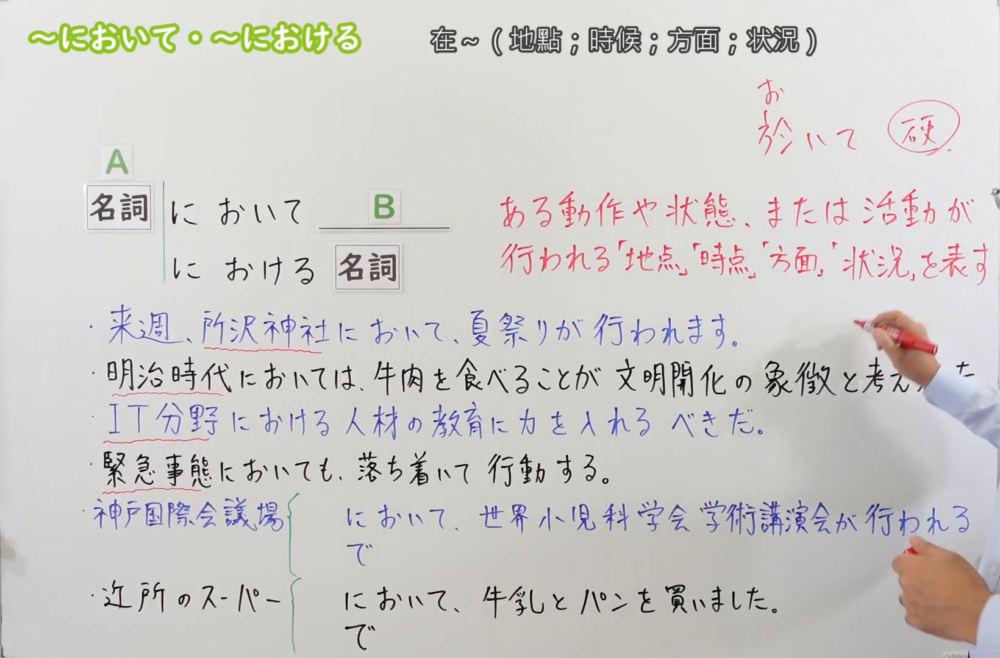
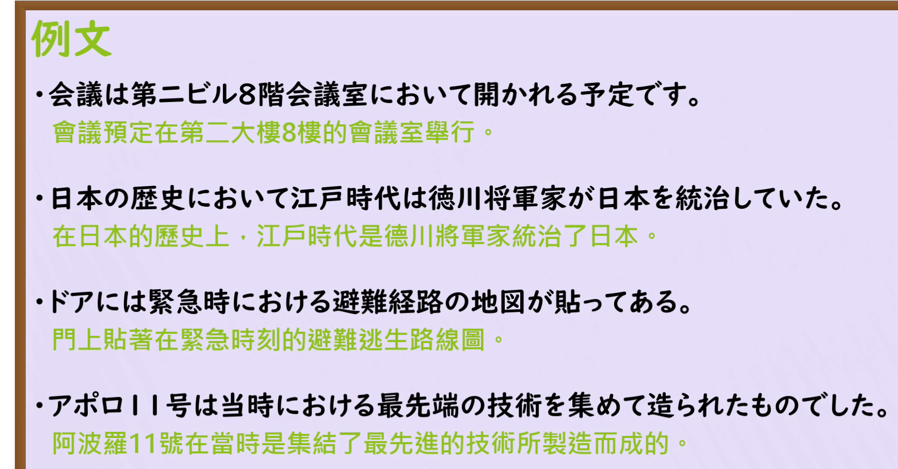

---
{
  "draft_id": "draft-20260912-n3-g-0049",
  "confirmed": false,
  "created_at": "2026-09-12",
  "proposal": {
    "id": "N3-G-0049",
    "kind": "grammar",
    "level": "N3",
    "title": "～において／における：在……地点、时期、领域或状况下",
    "status": "draft",
    "card_revision": 1,
    "source": {
      "lesson": "N3 第49个语法",
      "material": "出口日語日语自动字幕、原视频板书与例句画面、独立日文教学正文",
      "video": "https://www.youtube.com/watch?v=H8yE5PpHEA8",
      "screenshot": "assets/grammar/n3/N3-G-0049-0250.png",
      "screenshot_seconds": 170,
      "screenshot_crop": {"x": 0, "y": 0, "width": 1640, "height": 1080}
    },
    "tags": ["地点", "时期", "领域", "状况", "正式表达", "N3"],
    "confusions": ["で", "における与において", "について", "にとって", "にて"]
  }
}
---

# N3 第49课｜～において・～における（待确认）

# 视频学习资料整理

根据学习者指定的出口日語课程整理；未提供个人理解或例句，不虚构学习者原始输出。已核对保存的播放列表第49项、原视频标题及视频ID「H8yE5PpHEA8」。整理前未发现本课正式卡、草稿或确认事件。本卡未确认入库，不启动复习。

主图取自[原视频02:50](https://www.youtube.com/watch?v=H8yE5PpHEA8&t=170s)，原帧1920×1080，固定左上角裁为(0, 0, 1640, 1080)。00:01含义说明和多句右端被人物遮挡；检查00:30、01:00、01:30、01:50、02:10、02:20、02:25、02:40、02:46—02:54、03:00、03:20、03:40和03:55，选用02:50，保留名词接续、地点／时点／方面／状况定义和板书。已裁去绝大部分人像；右缘仍有少量眼镜、手和衣袖，手臂挡住明治时代例句末段的部分字，完整内容通过01:00画面及日语字幕交叉核对。下方「で」对照延伸至画面底端，因此不再裁短高度。未抹除、重绘或拼接。

补充[原视频04:20例句页](https://www.youtube.com/watch?v=H8yE5PpHEA8&t=260s)，原帧1920×1080，固定左上角裁为(0, 0, 1740, 910)。保留四句完整日文及中文，裁去右侧和底部多余区域，无人像。

# 核心与接续

## **【名词】＋において／においては／においても**
## **【名词】＋における＋名词**

**在……地点、时期、领域、方面或状况下。** 指明动作、活动发生的场所，或某种状态、判断成立的范围与背景。是较正式的表达，常见于公告、新闻、报告、论述和正式发言。

| 类型 | 接续规则 | 示例 |
|---|---|---|
| 名词 | 名词＋において，不加だ、の | 会議室において開かれる |
| 名词 | 名词＋においては，突出某个范围或形成对比 | 明治時代においては／この分野においては |
| 名词 | 名词＋においても，追加范围或表示“即使在这种情况下也……” | 緊急事態においても |
| 名词 | 名词＋における＋名词，用于修饰名词 | IT分野における人材／緊急時における避難経路 |

「において／における」通常写平假名；对应汉字为「に於いて／に於ける」。原视频00:30另有字幕纠正老师手写的字形，正确汉字是「於」。不把本课的「おける」解释为「置く」的可能形。

本课先掌握「において＋后续叙述」与「における＋名词」这组对应。补充阅读中也能见到「においての＋名词」，但原课主接续为「における＋名词」；不能直接写成「会議において発言」来表达“会议上的发言”这一名词短语。

# 四类含义与原课板书

| 范围 | 原课例句 | 整理译文 |
|---|---|---|
| 地点 | 来週、所沢神社において、夏祭りが行われます。 | 下周将在所泽神社举行夏日祭。 |
| 时期 | 明治時代においては、牛肉を食べることが文明開化の象徴と考えられた。 | 在明治时代，吃牛肉被认为是文明开化的象征。 |
| 领域、方面 | IT分野における人材の教育に力を入れるべきだ。 | 应该着力培养IT领域的人才。 |
| 状况 | 緊急事態においても、落ち着いて行動する。 | 即使在紧急情况下，也要沉着行动。 |

这些分类是在说明背景范围，不是四种互不相关的接续。明治时代例句保留原课历史叙述，仅用于理解时期用法，本卡不另作历史考证。

# 语义边界与适用条件

1. **正式语体**：适合说明会议在哪里举行、某时代的社会状况、某领域的发展等。日常说自己买东西、吃饭时通常用で；机械改成において会显得不自然或故意郑重。
2. **日常动作的限制与语境有关**：原课用“去超市买牛奶和面包”说明语体不合适；不能反过来推成只要出现吃、买、学习等动词，就在任何正式报告中都禁止使用。
3. **并非所有で都能替换**：本课对应场所、范围、背景意义。工具、手段、原因、数量合计等で不能直接改成において，例如「ペンで書く」不能据此改成「ペンにおいて書く」。
4. **时间是时期或背景**：当時、明治時代、現代等自然；不要把日常“明天三点见”里的「三時に」机械替换为「三時において」。
5. **存在地点不自动适用**：「机の上に本がある」的に标记存在位置，不宜一律换成において。「この分野において問題がある」则可以成立，因为它说明问题存在的领域。
6. **における不决定时态**：它修饰后面的名词，具体时间由当時、現代等及整句决定；「当時における技術」可以说明过去的技术，不需要为了过去改成「におけた」。
7. **は／も不固定正负**：は可以突出或对比，も可以追加；「緊急事態においても」中的“即使”来自不利状况与后项不变的关系，不是所有においても都等于让步。

# 与で的原课对照

原视频03:55画面已显示下列正误标记：

- 神戸国際会議場において、世界小児科学会学術講演会が行われる。
  - 将在神户国际会议场举行世界儿科学会学术报告会。
  - 正式活动场所，用において自然；换成で也成立。
- 近所のスーパーにおいて、牛乳とパンを買いました。
  - 原课标为不适合普通日常叙述。自然说法：近所のスーパーで、牛乳とパンを買いました。
  - 我在附近的超市买了牛奶和面包。

# 课程例句

以下日文按04:20原课例句页记录，中文为整理译文。

1. 会議は第二ビル8階会議室において開かれる予定です。
   - 会议预定在第二大楼8楼会议室举行。
2. 日本の歴史において江戸時代は徳川将軍家が日本を統治していた。
   - 在日本历史上，江户时代由德川将军家统治日本。
3. ドアには緊急時における避難経路の地図が貼ってある。
   - 门上贴有紧急情况下的疏散路线图。
4. アポロ11号は当時における最先端の技術を集めて造られたものでした。
   - 阿波罗11号是集当时最先进技术制造而成的。
   - 「当時における」修饰「最先端の技術」，不是动作“能够放置”。

原课05:05新闻式会话使用「縄文時代における生活様式」，即“绳文时代的生活方式”；体现时期名词＋における＋名词，也体现新闻、说明文中的正式语体。

# 自然例句（自拟）

1. 授賞式は、市民会館において行われます。
   - 颁奖仪式将在市民会馆举行。
2. この研究では、現代社会における家族の役割を考えます。
   - 本研究将探讨家庭在现代社会中的作用。
3. 安全面においては、この製品が最も優れています。
   - 在安全性方面，这款产品最出色。
4. 災害時においても、正確な情報を伝えることが大切です。
   - 即使在灾害发生时，传递准确信息也很重要。

# 易混项与JLPT考点

| 表达 | 重点 | 对照 |
|---|---|---|
| において／における | 事情发生或状态成立的场所、范围、背景 | 会議において発表する／会議における発表 |
| について | 谈论、调查等的主题 | 会議について話す：谈论那场会议 |
| にとって | 对某人而言的评价、价值 | 私にとって大切だ：对我来说重要 |
| で | 日常场所表达，也有工具、原因等其他意义 | 会議室で話す；ペンで書く |
| にて | 较正式的表达，部分场所用法重叠 | 会場にて行う；不能把其全部用法套给において |

- 名词接续：○ 日本において；× 日本のにおいて、× 日本だにおいて。
- 修饰名词：○ 日本における教育；不能照搬为「日本において教育」这一名词短语。
- 排序题和阅读中看清「における」修饰哪个名词，以及「において」限定的是地点、时期还是领域。
- 读到「においては／も」时识别对比、追加或语境中的让步，不忽略は／も的作用。
- 不把“较正式的で”记成所有で的万能替换式。

# 来源与复核记录

核对日期：2026-09-12。

1. [出口日語第49课](https://www.youtube.com/watch?v=H8yE5PpHEA8)：已读日语自动字幕全文并对照00:01、多个讲解时点、04:20例句和05:05会话；确认名词接续、における的名词修饰、四类含义与日常超市句的对照。00:30原视频字幕纠正汉字为「於」。
2. [日本語NET：において／における](https://nihongokyoshi-net.com/2018/05/29/jlptn3-grammar-nioite/)：已读日文含义、接续、例句和误用说明；支持场所／领域等范围、正式书面语、名词＋における＋名词及普通日常句宜用で。
3. [日本語教師のN1et：において](https://jn1et.com/nioite/)：已读日文接续与地点／范围两类正文；支持名词不加の、においては／も、江户时代、紧急状况、领域和における。其个别旁支例句有用字或表述问题，未直接搬用；以原课清晰例句和交叉一致的接续为依据。
4. [Bunpro：において・における](https://bunpro.jp/grammar_points/において-における)：已读结构与解说，补充「においての＋名词」作为阅读中可见形式。其部分比较段把手段意义也并入において，不能据此认定所有で都能替换，本卡未采用该泛化；主接续仍按原课和两份日文教师正文。

分歧处理：原课分为地点、时点、方面、状况；N1et合并为地点和范围，分类粒度不同而非接续冲突。日常句“不用において”按一般语体选择解释，不扩大为某些动词在所有语境都不能接。补充においての不取代课程主形式における。

字幕校对：「名刺／辞典・自転／女子の女神」等按板书、句意核对为名詞、時点、助詞の「で」；「造られた」按例句页记录，不沿用自动字幕的「作られた」。

成稿复核：逐项核对名词接续、における的后接名词、四类含义、は／も、で的替换范围和原课／自拟例句。两张裁图已目视检查；主图保留接续及必要板书，局部遮挡已注明，完整例句页清晰无人像。图片链接有效。仅创建待确认卡，不设置复习日期；现有阅读器正文图片显示限制沿用项目说明。

缓存：`.firecrawl/n3-playlist-items.json`、`.firecrawl/H8yE5PpHEA8.ja.vtt`、原视频及原帧、`.firecrawl/n3-49-search.json`、`.firecrawl/n3-49-jn1et.md`。缓存不提交。等待学习者明确确认入库。
