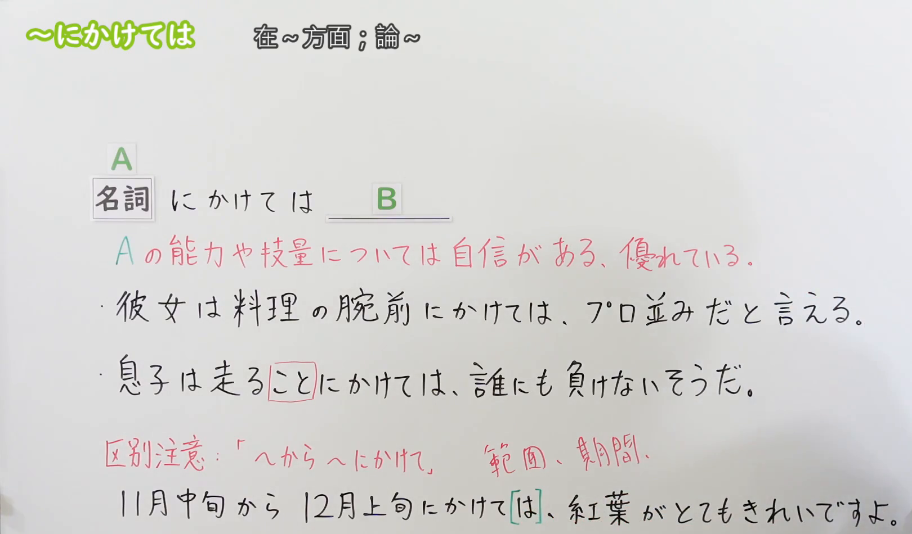
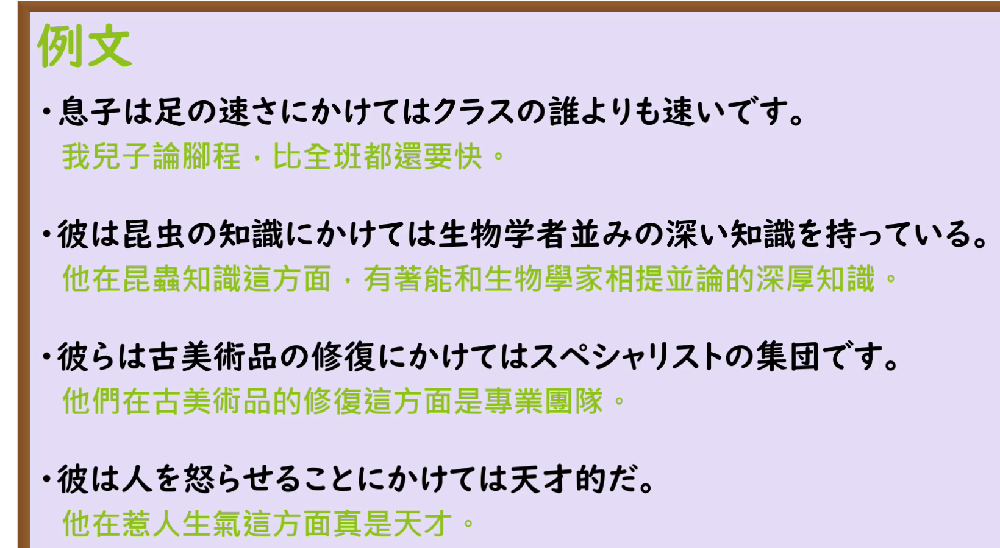

---
{
  "draft_id": "draft-20260912-n3-g-0050",
  "confirmed": false,
  "created_at": "2026-09-12",
  "proposal": {
    "id": "N3-G-0050",
    "kind": "grammar",
    "level": "N3",
    "title": "～にかけては：论某方面的能力或长处",
    "status": "draft",
    "card_revision": 1,
    "source": {
      "lesson": "N3 第50个语法",
      "material": "出口日語日语自动字幕、原视频板书与例句画面、独立日文教学正文",
      "video": "https://www.youtube.com/watch?v=hWZGJGLbwEE",
      "screenshot": "assets/grammar/n3/N3-G-0050-0219.png",
      "screenshot_seconds": 139,
      "screenshot_crop": {"x": 0, "y": 0, "width": 1620, "height": 950}
    },
    "tags": ["能力评价", "长处", "自信", "讽刺", "N3"],
    "confusions": ["から～にかけて", "においては", "については", "に関しては", "动词名词化"]
  }
}
---

# N3 第50课｜～にかけては（待确认）

# 视频学习资料整理

根据学习者指定的出口日語课程整理；未提供个人理解或例句，不虚构学习者原始输出。已核对保存的播放列表第50项、原视频标题「【Ｎ３文法】～にかけては」与视频ID「hWZGJGLbwEE」。整理前未发现本课草稿、正式卡或确认事件。本卡未确认入库，不启动复习。

主图取自[原视频02:19](https://www.youtube.com/watch?v=hWZGJGLbwEE&t=139s)。00:01接续清楚，但人物遮挡例句右端；检查00:30、01:00、01:30、02:00、02:05—02:55多个时点及03:00后，选用老师让开板书的02:19。原帧1920×1080，固定左上角裁为(0, 0, 1620, 950)，保留名词接续、能力评价含义、两句例句及「から～にかけて」的完整对照，裁去人像和底部空白。未抹除、重绘或拼接。

补充[原视频03:25例句页](https://www.youtube.com/watch?v=hWZGJGLbwEE&t=205s)。原帧1920×1080，固定左上角裁为(0, 0, 1640, 900)，保留四句完整日文及中文，裁去右侧和底部多余区域，无人像。

# 核心与接续

## **【名词】＋にかけては**

## **【动词辞书形＋こと】＋にかけては**

**论……方面／说到……本领，特别出色或很有自信。** 提出某项能力、技术、知识或长处，再说明这一方面优于他人、有把握。可以评价自己，也可以称赞别人；不是只要想说“关于……”就能使用。

| 类型 | 接续规则 | 示例 |
|---|---|---|
| 名词 | 名词＋にかけては，不加だ、の | 料理の腕前にかけては／昆虫の知識にかけては |
| 动词 | 辞书形＋こと＋にかけては，先用こと将动作名词化 | 走ることにかけては／人を楽しませることにかけては |

「料理の腕前」里的の连接两个名词，不是「にかけては」要求加の。动词不能照搬成「走るにかけては」。本课接续是名词性成分，不是四类词普通形均可接。

补充：形容词表达的性质可先转成适合评价的名词，例如「速い→速さ」「正確だ→正確さ」，再说「足の速さにかけては」「仕事の正確さにかけては」。这不是「速い＋にかけては」或「正確な＋にかけては」的接续规则，也不表示任何性质名词都适合本用法。

本课先掌握完整形式「にかけては」，不把它拆成动词「かける」的动作来理解。

# 语义边界与后项限制

1. **后项通常评价某方面出色**：常见「自信がある」「優れている」「一番だ」「誰にも負けない」「右に出る者はいない」「プロ並みだ」。不要求一定出现“一番”，也不一定是客观认证的世界第一。
2. **突出的是某一方面**：可以说其他方面普通，但这一项很强；不等于这个人在所有方面都优秀，也不必每句都先写缺点。
3. **否定形式不等于负面评价**：「誰にも負けない」和「右に出る者はいない」虽然有否定词，整体意思却是“谁也比不过”，完全符合本课用法。普通的“能力差、没有自信”不是典型后项。
4. **通常用于自信、称赞；也可借称赞形式表达讽刺**：原课「人を怒らせることにかけては天才的だ」把“惹人生气”说成某人的拿手本领。形式上仍是能力突出，实际是在挖苦，不是在肯定这种行为。不能把“通常正面评价”记成“绝不可能用于坏事”。
5. **不只是中性的事实或数量排名**：单纯说明年龄、身高、某地降雪量，通常用「は」「では」等。若语境明确将某种性质当作引以为豪的长处，适用性可能变化；不能只凭“一番”就判断本表达自然。
6. **对象不限于个人**：也可评价团队、产品或店铺的特长，例如维修技术、性能、味道；仍需有“这一方面出色”的评价，不是中性介绍所在地或营业时间。

# 原课板书例句

以下日文按02:19画面记录，中文为整理译文。

1. 彼女は料理の腕前にかけては、プロ並みだと言える。
   - 论厨艺，可以说她有专业人士的水平。
   - 「腕前」指本领、技艺；「プロ並み」是达到专业人士的水平，不表示她一定以此为职业。
2. 息子は走ることにかけては、誰にも負けないそうだ。
   - 听说儿子在跑步方面谁也不输。
   - 走る＋こと将动作名词化；「そうだ」在这里表示传闻。

# 与「～から～にかけて」的原课对照

> 11月中旬から12月上旬にかけては、紅葉がとてもきれいですよ。
>
> 从11月中旬到12月上旬这段时间，红叶非常漂亮。

这里是「11月中旬から12月上旬にかけて」表示大致时间范围，再加提示、对比的は；不是评价“12月上旬有什么过人的能力”。原课明确指出，即使表面都出现「にかけては」，也是不同用法。范围表达中的は可以按语境不加，不能据此推成应把本课主形式的は一律删掉。

# 课程例句

以下日文按03:25原课例句页记录，中文为整理译文。

1. 息子は足の速さにかけてはクラスの誰よりも速いです。
   - 论跑步速度，我儿子比班上任何人都快。
2. 彼は昆虫の知識にかけては生物学者並みの深い知識を持っている。
   - 在昆虫知识方面，他有堪比生物学家的深厚知识。
3. 彼らは古美術品の修復にかけてはスペシャリストの集団です。
   - 在古美术品修复方面，他们是一支专家团队。
4. 彼は人を怒らせることにかけては天才的だ。
   - 论惹人生气，他简直是个天才。
   - 讽刺用法；「怒らせる」是使役形，意为使别人生气，不是他自己生气。

原课04:10会话中的「実は私、料理の腕前にかけては自信があるの」是说话人对自己厨艺有信心，说明本表达也可用于日常会话，不限于正式书面语。

# 自然例句（自拟）

1. 田中さんは機械の修理にかけては、社内で右に出る者がいません。
   - 论修理机器，公司里没人比得上田中。
2. 私は大勢の前で話すのは苦手ですが、人の話を聞くことにかけては自信があります。
   - 我不擅长在众人面前讲话，但对倾听别人这件事很有信心。
3. この店はパンの味にかけては、近所のどの店にも負けません。
   - 论面包的味道，这家店不输给附近任何一家店。

# 易混项与JLPT考点

| 表达 | 重点 | 对照 |
|---|---|---|
| にかけては | 特别擅长的方面，后接出色、自信等评价 | 修理にかけては誰にも負けない |
| については／に関しては | 提出话题，可说明事实、优缺点，不自带擅长之意 | 修理については、明日説明します |
| においては | 指定地点、时期、领域或判断范围，偏正式，不自带优越评价 | この分野においては、新しい技術が必要だ |
| から～にかけて | 大致时间或空间范围 | 今夜から明日の朝にかけて雨が降る |

- 接续题：○ 料理にかけては；× 料理のにかけては、× 料理だにかけては。
- 动词名词化：○ 歌うことにかけては；× 歌うにかけては。
- 看完整后项意义：「誰にも負けない」是正面能力评价，不因ない误排除。
- 阅读中识别自信、称赞和讽刺；「天才的だ」不保证说话人真的赞同前项行为。
- 区分评价方面与时间范围，不能只按「にかけては」几个字机械套义。
- 与第49课对比：においては可以引出评价，但不自带“这是拿手领域”的语感；两者不是在任何评价句中都互斥。

# 来源与复核记录

核对日期：2026-09-12。

1. [出口日語第50课](https://www.youtube.com/watch?v=hWZGJGLbwEE)：已读日语自动字幕全文，对照00:01及前中段多帧板书、03:25例句页、04:10会话。确认名词接续、动词＋こと、自己／他人评价、范围用法对照和讽刺例句。
2. [日本語NET：にかけては](https://nihongokyoshi-net.com/2019/02/13/jlptn3-grammar-nikaketewa/)：已读日文含义、接续与例句正文；支持名词／辞书形＋こと、能力知识优于他人、评价后项，以及产品、店铺也可作为评价对象。
3. [日本語教師のN1et：にかけては](https://jn1et.com/nikaketeha/)：已读接续、使用条件、常用后项与例句；支持不能只当“非常……”使用、普通事实排名有限制，以及「誰にも負けない」整体为正面评价。其“正面、不用于负面”按典型教学用法理解，并结合原课清晰的讽刺例句补充边界。
4. [日本語教師たのすけ：にかけては](https://tanosuke.com/n2-nikaketeha)：已读接续、注意事项及相似文型比较；支持辞书形＋こと、性质名词化、能力评价和范围表达的区别。该页归为N2，而原课程、日本語NET和N1et归为N3，本卡依指定课程编号保留N3，不把教学网站分级当作官方固定目录。该页关于において的个别绝对正误判断未采用；其名词修饰变体不是本课主项，未扩入主表。

分歧处理：教师资料常将后项简化为正面评价，原课却有「人を怒らせることにかけては天才的だ」。本卡区分“评价能力突出”与“赞同其行为”，把该句明确标为讽刺，不据此放宽成任意负面后项均可。事实排名的限制按语境解释，不概括为所有性质名词一律禁用。

字幕校对：自动字幕中的「に長けては」「名刺」「同市／通し」「カラー／空にかけて」「帰還／機関」分别按标题、板书及句意核对为「にかけては」「名詞」「動詞」「から～にかけて」「期間」；速度例句按画面记录为「速さ／速い」，不沿用字幕的「早い」。

成稿复核：重新核对接续表、こと名词化、典型评价后项、讽刺边界、范围用法、原课／自拟例句及译文。两张裁图已目视检查，主图包含完整接续、含义、例句和易混项，无人像遮挡，例句页文字完整；图片引用另作机械校验。仅创建待确认卡，不设置复习日期；现有阅读器正文图片显示限制沿用项目说明。

缓存：`.firecrawl/n3-playlist-items.json`、`.firecrawl/hWZGJGLbwEE.info.json`、`.firecrawl/hWZGJGLbwEE.ja.vtt`、原视频及原帧、`.firecrawl/n3-50-search.json`。缓存不提交。等待学习者明确确认入库。
