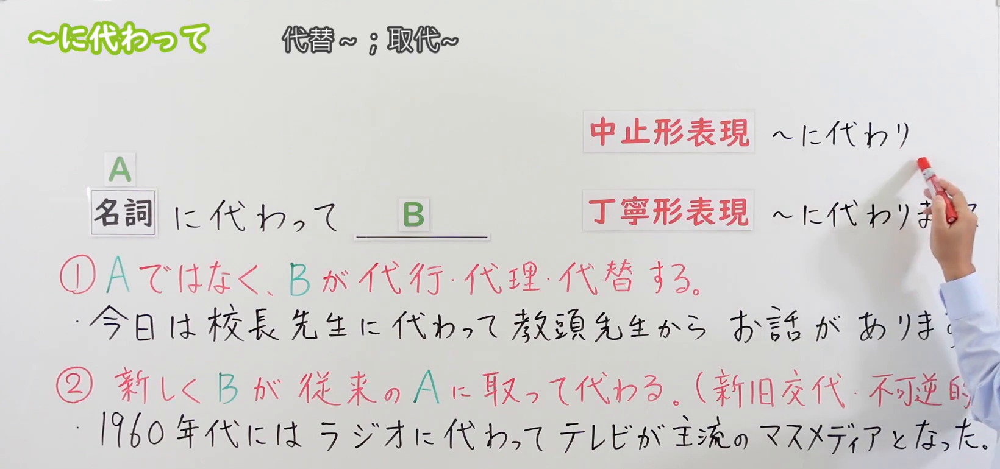
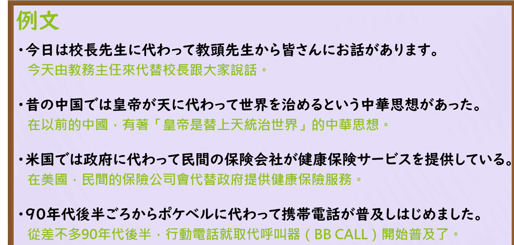

---
{
  "draft_id": "draft-20260912-n3-g-0051",
  "confirmed": false,
  "created_at": "2026-09-12",
  "proposal": {
    "id": "N3-G-0051",
    "kind": "grammar",
    "level": "N3",
    "title": "～にかわって（に代わって）：代理与替代",
    "status": "draft",
    "card_revision": 1,
    "source": {
      "lesson": "N3 第51个语法",
      "material": "出口日語日语自动字幕、原视频板书与例句画面、独立日文教学正文",
      "video": "https://www.youtube.com/watch?v=hMubvUMGjv8",
      "screenshot": "assets/grammar/n3/N3-G-0051-0059.png",
      "screenshot_seconds": 59,
      "screenshot_crop": {"x": 0, "y": 0, "width": 1640, "height": 770}
    },
    "tags": ["代理", "代替", "新旧交替", "N3"],
    "confusions": ["のかわりに", "にかわり", "にかわりまして", "にかわる", "がかわる"]
  }
}
---

# N3 第51课｜～にかわって（に代わって）（待确认）

# 视频学习资料整理

按学习者指定范围整理；未提供个人理解或例句，不虚构学习者原始输出。已核对保存的播放列表第51项及原视频元数据：标题「【Ｎ３文法】～に代わって」、视频ID「hMubvUMGjv8」、时长06:14。整理前未发现本课已有草稿、正式卡或确认事件。本卡未确认入库，不启动复习。

主图来自[原视频00:59](https://www.youtube.com/watch?v=hMubvUMGjv8&t=59s)。先检查00:01：接续可见，但老师遮住右侧变体和例句。再检查00:40、00:59—01:08多个时点及01:15、01:35、02:00、02:30、02:50、03:30、04:00、04:25，选用遮挡较少的00:59。原帧1920×1080，固定左上角裁为(0, 0, 1640, 770)，保留名词接续、两种含义、板书例句及变体区域，裁去大部分人像和底部空白。

限制：老师的手臂仍遮住「に代わりまして」的一部分及第一句句尾；这些内容已结合01:05画面、日语字幕讲解及下方例句页核对。未抹除人物、补写文字或拼接；不声称主图完全无遮挡。

补充[原视频04:40例句页](https://www.youtube.com/watch?v=hMubvUMGjv8&t=280s)。原帧1920×1080，固定左上角裁为(0, 0, 1880, 900)，保留四句完整日文及中文，无人像。第三句较长，保留右侧文字，不为缩窄画面而裁断句子。

# 核心与接续

## **【名词】＋にかわって（に代わって）**

**由另一人或事物代替前项，承担其行动、职责或原有地位。** 主要有“代行／代理”和“新事物取代旧事物”两种用法。

| 类型 | 接续规则 | 示例 |
|---|---|---|
| 名词 | 名词＋にかわって，不加の、だ | 部長にかわって／ラジオにかわって |

「Aにかわって、Bが～」中，**A是被替代的一方，B是接替或代行的一方**。例如「部長にかわって、私が出席する」是我代替部长出席，不是部长代替我。

本课不列动词或形容词的普通形接续。「行くにかわって」「忙しいにかわって」不是本课规则。

## 相关形式（补充，不另列词类规则）

- **N＋にかわり（に代わり）**：较书面、郑重的中止形，如「社長にかわり、ご挨拶申し上げます」。本课的「かわり」来自动词「かわります」去ます。
- **N＋にかわりまして（に代わりまして）**：更礼貌，如「社長にかわりまして、ご挨拶申し上げます」。常用于致辞、正式介绍。
- **N＋にかわる（に代わる）＋名词**：修饰后面的名词，如「彼にかわる人材」（能够替代他的人才）。不要写成「彼にかわっての人材」。这是相关动词的连体形式，不是所有场合都机械替换。

# 语义边界与适用条件

1. **代理、代行**：本应由A做的事由B承担，常见于请假代课、代为出席、代为道歉；可以是临时安排，但“临时”不是所有例句都必须满足的条件。
2. **代表某人或群体**：如代表全体毕业生致辞。不必理解成该群体被取消或消失，也不必每次都因为对方生病、缺席。
3. **新旧替代**：B接替A原有的功能或主流地位。对象不限于人，也可以是技术、产品、媒体、组织等。
4. **替代某种地位，不等于旧事物彻底消失**：原课用「新旧交代・不可逆的」说明第二种典型情境，应理解为区别于一次性的代理。语法本身不保证永远不可逆，也不表示电视成为主流以后收音机便不存在了。
5. **不是任何“换一个”都适用**：仅表达这次不选A而选B，未突出接替角色或功能时，常用「AのかわりにBを～」。例如点饮料说「コーヒーのかわりに紅茶を注文した」更自然。
6. **语体略郑重**：可用于普通说明，也常见于正式场合；不能据此说日常会话完全不能用。后项可以陈述事实或计划，也可以是代为行动的意愿，并非只能接过去发生的事。

# 原课板书例句

日文按板书及讲解核对，中文为整理译文。

1. 今日は校長先生に代わって教頭先生からお話があります。
   - 今天由教头代替校长讲话。
   - 「教頭」是日本学校的管理职务，常译作副校长；不将原课对台湾职务的近似说明当作制度上的完全等同。
2. 1960年代にはラジオに代わってテレビが主流のマスメディアとなった。
   - 到20世纪60年代，电视取代收音机，成为主流大众媒体。
   - 替代的是“主流媒体”的地位。这是课程举例，不据此推断所有国家都在同一时期发生完全相同的变化。

# 课程例句选读

以下日文来自04:40例句页，中文为整理译文。

1. 今日は校長先生に代わって教頭先生から皆さんにお話があります。
   - 今天由教头代替校长向大家讲话。
2. 90年代後半ごろからポケベルに代わって携帯電話が普及しはじめました。
   - 从20世纪90年代后半期前后起，手机逐渐取代寻呼机，开始普及。
   - 「ポケベル」是寻呼机；「普及しはじめました」表示开始普及，不是当时已全部替换完毕。

截图另外两句涉及历史思想和美国医保制度，只作为原课程语句留存，不作为经过本卡核实的历史或政策结论，尤其不能据医保句概括“美国政府不提供任何医疗保障”。本卡聚焦代理与替代的语言用法，不扩展进行专题事实研究。

# 自然例句（自拟）

1. 病気の母にかわって、今日は私が夕食を作ります。
   - 今天由我代替生病的母亲做晚饭。
2. 卒業生全員にかわって、代表の一人が先生方に感謝の言葉を述べました。
   - 一名毕业生代表替全体毕业生向老师们表达了感谢。
3. この工場では、人にかわってロボットが部品を運んでいます。
   - 在这家工厂，机器人代替人搬运零部件。
4. この古いシステムにかわる新しいシステムを開発しています。
   - 正在开发能够替代这套旧系统的新系统。

# 易混项与JLPT考点

| 表达 | 重点 | 对照 |
|---|---|---|
| Nにかわって | 由另一方接替N的行动、功能或地位 | 部長にかわって出席する |
| Nのかわりに | 代理、代用；也可表示选择另一项，适用范围不完全相同 | コーヒーのかわりに紅茶を飲む |
| Nにかわる＋名词 | 修饰名词，表示能接替N的对象 | 部長にかわる人 |
| AがBにかわる | A变成／换成B；这里に标记变化后的对象 | 担当者が田中さんにかわった |

- 接续：○ 校長にかわって；× 校長のにかわって、× 校長だにかわって。
- 「部長にかわって私が行く」与「私にかわって部長が行く」的代行方向相反。
- 「のかわりに」的交换、补偿或对比用法，不能全部替换为「にかわって」。
- 「にかわり」「にかわりまして」仍保留に；不要把主形式误改成「にかわりて」。
- 汉字以「代わって」表示代理／替代；不要受自动字幕中的「変わって」干扰。

# 来源与复核记录

核对日期：2026-09-12。外部资料均阅读相关教学正文，不只看搜索摘要。

- [出口日語原视频](https://www.youtube.com/watch?v=hMubvUMGjv8)：名词接续、に代わり／に代わりまして、代行与新旧替代两用法、与の代わりに的代理用法对照及课程例句。
- [日本語NET：〜に代わって](https://nihongokyoshi-net.com/2019/07/21/jlptn3-grammar-nikawatte/)：名词接续、代理／替代、人和物均可作为对象；正文「彼に代わる人物」支持后接名词时使用にかわる。该页备注简写「〜代わるN」没有明确列出前项助词，本卡依据其完整例句保留に。
- [にほんご部：〜にかわって／にかわり](https://nihongobu.net/n3-nikawatte-nikawari/)：名词接续、代替社长讲话，以及通信方式、媒体的替代例句。
- [たのすけ：〜にかわって](https://tanosuke.com/nikawatte)：代理、代用、代表含义和较郑重语体。该页与かわりに的比较说明中，“しか使えない”的表述与紧接的○×例句不一致，因此不采用该处绝对限制；以角色接替与单纯选择的区别说明常见倾向。

字幕校对：自动字幕中的「名刺」「中止系」「丁寧系」「大対」「新旧後退」等，按原画面与句意核对为「名詞」「中止形」「丁寧形」「代替」「新旧交代」。不直接复制字幕错字。

成稿复核：重新核对名词接续、A/B代行方向、三种相关形式、代表义、替代与消失的区别、原课及自拟例句和译文。两张裁图另作目视检查和链接校验；主图局部遮挡已明示，关键接续及两种核心含义可由原材料与独立来源可靠确认。

缓存：`.firecrawl/n3-playlist-items.json`、`.firecrawl/hMubvUMGjv8.info.json`、日语VTT、原视频、各候选原帧及`.firecrawl/n3-51-search.json`，不提交缓存。待学习者明确确认入库后再创建正式卡及七天复习日期。现有阅读器正文图片显示限制沿用项目说明。
