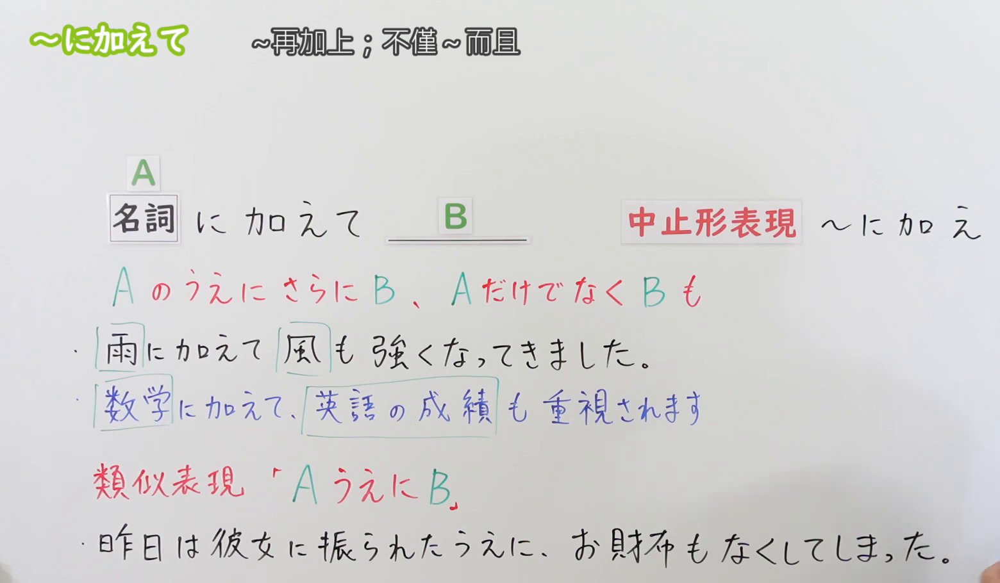
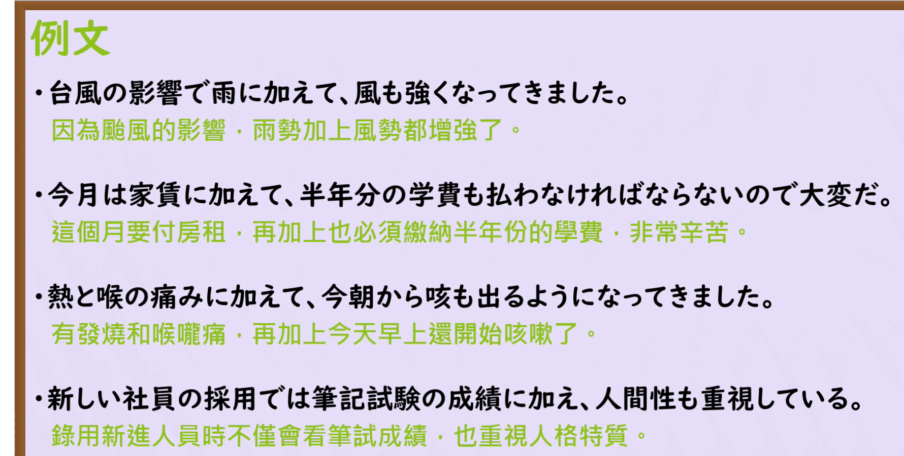

---
{
  "draft_id": "draft-20260913-n3-g-0054",
  "confirmed": false,
  "created_at": "2026-09-13",
  "proposal": {
    "id": "N3-G-0054",
    "kind": "grammar",
    "level": "N3",
    "title": "～にくわえて（に加えて）：在……之外再加上……",
    "status": "draft",
    "card_revision": 1,
    "source": {
      "lesson": "N3 第54个语法",
      "material": "出口日語日语自动字幕、原视频板书与例句页、独立日文教学正文",
      "video": "https://www.youtube.com/watch?v=XZ96IeUZkTI",
      "screenshot": "assets/grammar/n3/N3-G-0054-0230.png",
      "screenshot_seconds": 150,
      "screenshot_crop": {"x": 0, "y": 0, "width": 1560, "height": 910}
    },
    "tags": ["累加", "追加", "书面语", "N3"],
    "confusions": ["うえに", "だけでなく", "はもちろん", "にくわえ", "加える与加わる"]
  }
}
---

# N3 第54课｜～にくわえて（に加えて）（待确认）

# 视频学习资料整理

学习者本次指定继续第54、55课，未提供个人理解或例句，不虚构学习者原始输出。已对照保存的播放列表第54项与本次取得的原视频元数据：标题「【Ｎ３文法】～に加えて」、视频ID「XZ96IeUZkTI」、时长05:03。整理前未发现本课已有草稿、正式卡或复习事件。本卡未确认入库，不启动复习。

主图取自[原视频02:30](https://www.youtube.com/watch?v=XZ96IeUZkTI&t=150s)。先检查00:01，再比较00:30、01:00、02:00、02:30、03:00及03:10；00:01右侧中止形和下方例句有遮挡，02:30完整显示名词接续、含义、两句本课例句及「うえに」的对照。原帧1920×1080，固定左上角裁为(0, 0, 1560, 910)，尽量去掉右侧人物及底部空白。右下缘仍有少量手部，不遮挡主要文字；未抹除、重绘或拼接。

补充[原视频04:00例句页](https://www.youtube.com/watch?v=XZ96IeUZkTI&t=240s)。原帧1920×1080，固定左上角裁为(0, 0, 1780, 900)，保留四句日文及中文，无人物遮挡。

# 核心与接续

## **【名词】＋にくわえて（に加えて）**

**在 A 之外再加上 B；不仅 A，而且 B 也……。** 把 A 作为已有事项，再追加与之相关的 B。常见框架是「Aにくわえて、Bも～」。

| 类型 | 接续规则 | 示例 |
|---|---|---|
| 名词 | 名词＋にくわえて | 雨にくわえて／家賃にくわえて／筆記試験の成績にくわえて |

名词后不加「の」或「だ」：○ 家賃にくわえて；× 家賃のにくわえて；× 家賃だにくわえて。

- **书面变体：にくわえ（に加え）**。这是「くわえます（加えます）」去ます的中止形；比「にくわえて」更正式。不是「にくわえて」后面再加一个「に」。
- **B 后常见「も」，也可用「まで」强调追加的程度**，但「も」不是每句必须出现的固定组成部分。
- **名词化扩展（外部补充）**：动作先名词化再接，如「自分で行動することに加え、周囲の協力も必要だ」（根据外部资料用法自拟）。不能把主规则误记成「动词辞书形＋に加えて」。本课主表保持原视频的名词接续。
- 句末可用礼貌体：「雨にくわえて、風も強くなってきました」。接续部分无需变成「に加えまして」才能配合礼貌句末。

# 语义边界与适用条件

1. **追加的是同一话题下的相关事项**。课程说 A、B “多为同质、同类”，例如天气中的雨与风、考试中的数学与英语。这是理解倾向，不要求两个名词字面上属于完全相同的小类别；成绩与人品也可作为录用时并列考虑的因素。
2. **可以追加好事、坏事或中性事项**：技能增加、症状叠加、费用并列都可以。重点是累加，不是转折；“便宜但质量差”的转折关系不能仅靠「に加えて」表达。
3. **A 也是句子所讨论的一部分**。「家賃に加えて学費も払う」表示房租要付，学费也要付，不是“不付房租，只付学费”。
4. **并不要求两件事有先后顺序或因果关系**。可以是原来就同时存在的两个优点、两种费用，或两项选拔标准；不能统一翻译成“A导致B”。
5. **语体偏正式**，常用于说明、报道和书面语，会话中也可以使用。日常更简单的表达有「～だけでなく、～も」。
6. **与实义动词区分**：「スープに塩を加える」是“往汤里加盐”，属于实际添加；本课「家賃に加えて、学費も……」用来连接追加事项。「加わる（くわわる）」是自动词，不能将本句型换成「に加わって」。

# 原课板书例句

以下按02:30板书与原课日语字幕对应核对，中文为整理译文。

1. 雨に加えて、風も強くなってきました。
   - 除了下雨，风也逐渐变强了。
2. 数学に加えて、英語の成績も重視されます。
   - 除了数学成绩，英语成绩也受到重视。
   - 数学与英语属于同一选拔场景中的科目。

课程另用「昨日は彼女に振られたうえに、お財布もなくしてしまった」对照「うえに」：昨天被女朋友甩了，还把钱包弄丢了。两件事的具体内容不同，但都是说话人眼中的坏事。它是易混项例句，不是「に加えて」的原句。

# 课程例句

以下四句按04:00的原视频例句页核对，中文为整理译文。

1. 台風の影響で雨に加えて、風も強くなってきました。
   - 受台风影响，除了下雨，风也逐渐变强了。
2. 今月は家賃に加えて、半年分の学費も払わなければならないので大変だ。
   - 这个月除了房租，还必须支付半年的学费，因此负担很重。
3. 熱と喉の痛みに加えて、今朝から咳も出るようになってきました。
   - 除了发烧和喉咙痛，今天早上起还开始咳嗽了。
4. 新しい社員の採用では筆記試験の成績に加え、人間性も重視している。
   - 招聘新员工时，除了笔试成绩，也重视人品。
   - 「に加え」与「に加えて」在这里都表示追加；「人間性」不能机械译成外表或人气。

# 自然例句（自拟）

1. この部屋は家賃にくわえて、毎月五千円の管理費がかかります。
   - 这间房除了房租，每月还要交五千日元管理费。
2. 彼女は日本語にくわえて、中国語も話せます。
   - 她除了日语，还会说中文。
3. 今週は通常の業務にくわえ、新人の研修も担当しています。
   - 这周除了日常工作，我还负责新员工培训。

# 易混项与 JLPT 考点

| 表达 | 重点 | 接续对照 |
|---|---|---|
| にくわえて | 在已有事项上追加相关事项 | 名词＋にくわえて |
| うえに（上に） | 同方向评价的累加，常为好上加好或坏上加坏 | 动词・い形容词普通形＋うえに；な形容词现在肯定用な；名词现在肯定常用の／である |
| だけでなく | 不仅……，还……，适用范围广 | 可接名词或谓语表达，不能直接照搬本课名词主表 |
| はもちろん | A当然成立，在此基础上说明B也成立 | 名词＋はもちろん；强调A的理所当然性 |

- **接续**：题干若给「家賃」「成績」，检查名词后是否多加「の／だ」。本课不使用「普通形（な・の）」作为总接续。
- **意义**：从后项的「も／まで」及上下文找累加关系；不要与第53课「にくらべて」的比较关系混淆。
- **书面形式**：「に加え」读作「にくわえ」，「に加えて」读作「にくわえて」；不是「にかえて（に替えて）」的“替代”。
- **阅读**：明确哪一项是原有事项A、哪一项是追加事项B，以及它们共同说明的费用、症状、能力等话题。
- **级别说明**：原课程归入N3，部分独立教学资料归入N2。本库按课程序列保留N3-G-0054；这些分级差异不改变接续规则，也不当作JLPT官方逐条语法清单。

# 来源与复核记录

核对日期：2026-09-13。外部资料通过Firecrawl取得并阅读教学正文；以下为各来源实际支持的要点。

- [出口日語原视频](https://www.youtube.com/watch?v=XZ96IeUZkTI)：名词接续、书面「に加え」、相关事项累加、「うえに」对照、板书与四句例句。
- [日本語NET：〜に加えて](https://nihongokyoshi-net.com/2019/06/15/jlptn2-grammar-nikuwaete/)：名词接续、意义「〜だけでなく、さらに」、追加类似事项及偏正式语体。该页最后一条例句的英文译文重复了上一句，未采用其英文译文。
- [絵でわかる日本語：〜にくわえて](https://www.edewakaru.com/archives/18090188.html)：名词接续、相关事项追加、费用／技能／症状例句，以及「にくわえ」更正式。来源称“名詞［辞書形］”，本卡规范写为“名词”。
- [毎日のんびり日本語教師：～に加えて](https://mainichi-nonbiri.com/grammar/n2-nikuwaete/)：名词主接续、「～も」为常见搭配、书面「に加え」及「自分で行動する事に加え」的名词化实例。

字幕校对：将自动字幕中的「名刺」「同室」「女子されます」结合板书校正为「名詞」「同質」「重視されます」；「中止形表現」以板书用字为准。没有将自动字幕的错误断句直接写入卡片。

成稿复核：已重新核对接续表、三类追加场景、与「うえに」的边界、四句课程例句及译文；将“同类”保留为相关话题下的常见倾向，将「も」保留为常见搭配，不写成绝对要求。图片核对课程、实际时间、裁切与文字完整性；草稿元数据未确认，不含正式复习日期。正文图片引用以本地文件为依据，未进行iPad实机显示验收。

获取记录：复用`.firecrawl/n3-playlist-items.json`核对序号；本次取得原视频、元数据、日语VTT、候选原帧及`.firecrawl/n3-54-search.json`。缓存不提交；草稿与本课两图保留本地Git历史。只有明确“确认入库”后才创建正式卡并从确认日启动七天复习。
