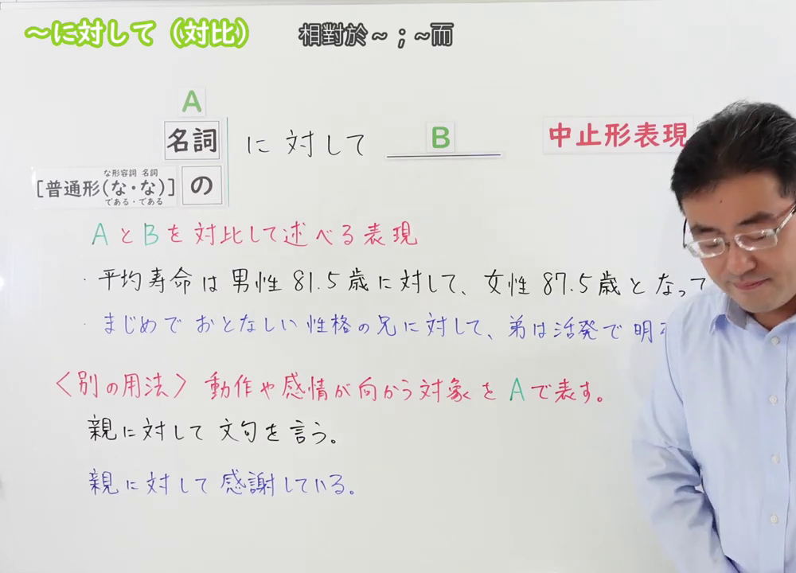
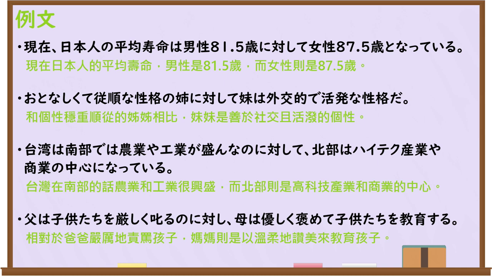

---
{
  "draft_id": "draft-20260913-n3-g-0062",
  "confirmed": false,
  "created_at": "2026-09-13",
  "proposal": {
    "id": "N3-G-0062",
    "kind": "grammar",
    "level": "N3",
    "title": "～に対して（対比）：相对于……；与……相比",
    "status": "draft",
    "card_revision": 1,
    "source": {"lesson":"N3 第62个语法","material":"出口日語原视频板书、日语字幕与独立日文教学正文","video":"https://www.youtube.com/watch?v=5_rJ1okxLpg","screenshot":"assets/grammar/n3/N3-G-0062-0001.png","screenshot_seconds":1,"screenshot_crop":{"x":0,"y":0,"width":1000,"height":720}},
    "tags": ["对比","书面语","对象用法辨析","N3"],
    "confusions": ["に対して（对象）","に比べて","一方で","に反して","にとって"]
  }
}
---

# N3 第62课｜～に対して（対比）（待确认）

# 视频学习资料整理

按指定范围整理；未提供学习者个人输出。已核对播放列表第62项：标题「【Ｎ３文法】～に対して（対比）」、视频ID `5_rJ1okxLpg`、时长06:23。此前未发现本课草稿、正式卡或复习事件；本卡未确认。

主图取自[原视频00:01](https://www.youtube.com/watch?v=5_rJ1okxLpg&t=1s)，原帧1920×1080，裁为(0,0,1000,720)，保留名词／普通形接续、对比说明、对象用法提示和例句，裁去右侧人物及空白。

补充[原视频05:00](https://www.youtube.com/watch?v=5_rJ1okxLpg&t=300s)例句页，保留四句对比例句及中文说明。

# 核心与接续

## **A【普通形（な/である・の/である）】＋の＋に対して，B**

**把 A 与 B 并列对照叙述**，可译为“相对于 A，B……／A……，而 B……”。括号中的前一组「な／である」对应な形容词现在肯定形，后一组「の／である」对应名词现在肯定形；动词和い形容词使用普通形。A、B 可以是人、事、物或地区，不要求正反相反，也不要求一好一坏。

原视频还并列写有名词接续：**A【名词】＋に対して，B**。较正式的中止形为「に対し」。以上接续严格保留原视频的 A、B 和「に対して，B」写法，不在总接续中添加「は」等视频未写出的成分。

| 类型 | 接续规则 | 示例 |
|---|---|---|
| 名词 | 名词＋に対して | 男性81.5歳に対して、女性87.5歳だ。 |
| 动词 | 动词普通形＋の＋に対して | 父は厳しく叱るのに対して、母は優しく褒める。 |
| い形容词 | い形容词普通形＋の＋に対して | 昼は暖かいのに対して、夜はかなり冷える。 |
| な形容词 | 现在肯定：词干＋な／である＋の＋に対して；其他普通形＋の＋に対して | 姉はおとなしいのに対して、妹は活発だ。 |
| 名词 | 现在肯定：名词＋の／である＋の＋に対して；其他普通形＋の＋に対して | 電車は便利であるのに対して、車は荷物を運びやすい。 |

「に対し」是「に対して」的中止形，语体较硬。这里的「の」是形式名词：接谓语普通形时不能省；单纯名词直接用「名词＋に対して」，不写「名词のに対して」。

# 语义边界与易混项

- 对比关系只需有差异或并列，不要求完全相反：男性与女性寿命、南部与北部产业都可用。
- 与“动作／感情所指向的对象”用法区分：親に対して文句を言う、親に対して感謝している中，親是对象，不是对比项。
- 「に比べて」强调比较标准和差距；「に対して」强调 A、B 两项分别叙述。两者有时可译为“相比”，但不可无条件互换。
- 「一方で」常连接两个方面或同时存在的情况；「に反して」带有与预期、规则相反的语气，本课不要求反预期。
- 对比用法后项可以是判断、状态或叙述，不限于好坏评价；但必须能辨认 A 与 B 两项。

# 课程例句

1. 現在、日本人の平均寿命は男性81.5歳に対して女性87.5歳となっている。——目前日本人平均寿命男性81.5岁，而女性为87.5岁。
2. おとなしくて従順な性格の姉に対して、妹は外向的で活発な性格だ。——姐姐性格安静顺从，相比之下妹妹外向活泼。
3. 台湾は南部では農業や工業が盛んなのに対して、北部はハイテク産業や商業の中心になっている。——台湾南部农业和工业兴盛，而北部是高科技产业和商业中心。
4. 父は子どもたちを厳しく叱るのに対し、母は優しく褒めて教育する。——父亲严厉训斥孩子们，而母亲温柔地表扬并教育他们。

# 自然例句（自拟）

- 昼は暖かいのに対して、夜はかなり冷える。——白天暖和，而夜里相当冷。
- 電車は便利であるのに対して、車は荷物を運びやすい。——电车方便，而汽车容易运载行李。

# JLPT 考点

- 看到名词直接接「に対して」；看到谓语接「のに対して」，并检查な形容词现在肯定是否为「な／である」。
- 「に対し」是书面中止形，不要误判为另一个句型。
- 结合上下文判定是对比还是对象：后项若是“抱怨、感谢、说明”等动作／感情指向 A，多为对象用法。

# 来源与复核记录

核对日期：2026-09-13。原视频[出口日語](https://www.youtube.com/watch?v=5_rJ1okxLpg)支持名词／普通形接续、对比不必正反或好坏相反、に対し变体、对象用法对照及四句例句。独立资料：[日本語教師のN1et「に対して」](https://jn1et.com/nitaisite/)复核对象与对比两用法、谓语＋のに対して和名词接续；[日本語NET「〜に対して（対象・対比）」](https://nihongokyoshi-net.com/2018/08/07/jlptn3-grammar-nitaishite/)复核名词／普通形接续、对比例句及与に比べて等辨析。

成稿复核：按00:01板书将总接续修正为「A【普通形（な/である・の/である）】＋の＋に対して，B」，并将表格拆成名词直接接续一行，以及普通形的动词、い形容词、な形容词、名词四行，共五行；表格接续规则不用A、B符号，类型栏也不添加视频未出现的“名词（从句）”。保留视频中的A、B，不添加「は」；另保留视频并列展示的「A【名词】＋に対して，B」。重新核对形式名词「の」、な形容词／名词现在肯定、对比与对象边界及例句译文；截图为原视频00:01接续图和05:00例句图。草稿未确认，不设置正式复习日期。
