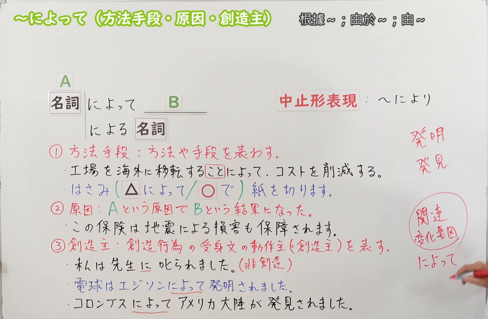
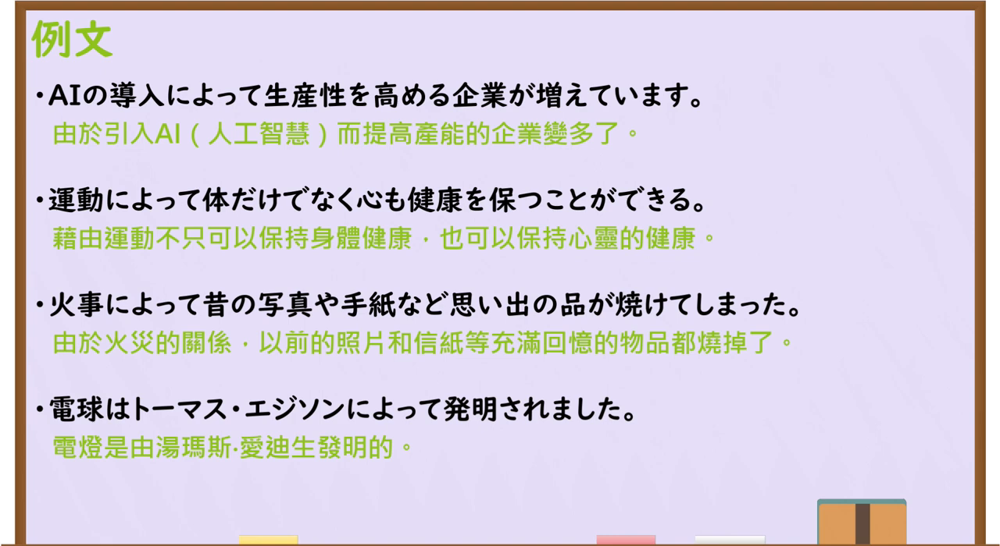

---
{
  "draft_id": "draft-20260913-n3-g-0065",
  "confirmed": false,
  "created_at": "2026-09-13",
  "proposal": {
    "id": "N3-G-0065",
    "kind": "grammar",
    "level": "N3",
    "title": "～によって／～による：通过……；由于……；由……",
    "status": "draft",
    "card_revision": 1,
    "source": {"lesson":"N3 第65个语法","material":"出口日語原视频板书、日语字幕与独立日文教学正文","video":"https://www.youtube.com/watch?v=G_dza9I4ZcI","screenshot":"assets/grammar/n3/N3-G-0065-0315.png","screenshot_seconds":315,"screenshot_crop":{"x":0,"y":0,"width":1100,"height":720}},
    "tags": ["方法手段","客观原因","被动动作主","书面语","N3"],
    "confusions": ["で","ために","により","によると","によって（变化要因）"]
  }
}
---

# N3 第65课｜～によって（方法手段・原因・創造主）（待确认）

# 视频学习资料整理

按指定范围整理；学习者未提供个人原始输出或例句，不虚构理解判断。已核对播放列表第65项：标题「【Ｎ３文法】～によって（方法手段・原因・創造主）」、视频ID `G_dza9I4ZcI`、时长07:21。此前未发现本课草稿、正式卡或复习事件；本卡仍未确认，不启动复习。

先检查[原视频00:01](https://www.youtube.com/watch?v=G_dza9I4ZcI&t=1s)，该时点虽然显示接续和三类用法，但人物遮挡中止形、部分含义说明及多个例句。主图改取[原视频05:15](https://www.youtube.com/watch?v=G_dza9I4ZcI&t=315s)：原帧1280×720，固定左上角裁为(0,0,1100,720)，完整保留名词接续、后接名词形式、中止形、方法手段／原因／创造主三类说明、板书例句及下一课“变化要因”的提示；人物基本裁除，仅右下角保留少量手部，未抹除、重绘或拼接。

例句图取自[原视频05:45](https://www.youtube.com/watch?v=G_dza9I4ZcI&t=345s)，位于视频后半部分的例句页，完整显示四句课程例句及中文说明。原帧1280×720，固定左上角裁为(0,0,1280,700)，仅裁去底部少量边框，未重绘或拼接。

# 核心与接续

## **A【名词】＋によって，B／A【名词】＋による＋名词**

本课集中学习三个用法：以 A 作为完成 B 的**方法或手段**；以 A 作为导致 B 的**客观原因**；在创造、发明、发现等被动句中，以 A 表示该行为的**动作主**。

| 类型 | 接续规则 | 示例 |
|---|---|---|
| 名词 | 名词＋によって，B | 運動によって、心身の健康を保つ。 |
| 名词 | 名词＋による＋名词 | 地震による損害 |
| 名词 | 名词＋により，B | 大雨により、試合は中止された。 |

- 「名词＋により，B」是原视频所列的中止形，比「によって」更硬，常见于公告、新闻和正式说明。
- 动词表达的方法可先用形式名词「こと」名词化，再接「によって」：`动词辞书形＋ことによって`。如「工場を海外に移転することによって、コストを削減する」。
- 本课板书的「創造主」不是指语法形式限定为“造物主”，而是指创造、发明、发现、写作、设计等被动句中产生作品、成果或新发现的动作主。

# 三类用法与语义边界

## 1. 方法、手段

A 是实现 B 所采用的较抽象方法、过程、制度、技术或媒介，可译为“通过……／凭借……”。

- 适合：AIの導入によって、話し合いによって、運動によって、繰り返すことによって。
- 日常中具体使用的工具或交通手段通常直接用「で」：`はさみで紙を切る`、`電車で会社へ行く`。原课把「はさみによって紙を切る」标为不自然倾向，并明确优先使用「で」。

## 2. 原因

A 是使 B 这一结果或状态发生的客观原因，可译为“由于……”。常用于自然现象、事故、社会事件等较客观的说明，后项说明已经发生或形成的结果，不把个人意志、命令或请求当作典型后项。

## 3. 被动句的动作主

在发明、发现、创作、设计等被动句中，用「によって」标出动作主，如「電球はエジソンによって発明された」。普通的人际被动句通常用「に」，如「私は先生に叱られた」；不能因两者都能译成“被／由”就机械替换。

# 原课板书例句与讲解

1. 工場を海外に移転することによって、コストを削減する。——通过把工厂迁往海外来削减成本。（方法、手段。）
2. はさみで紙を切ります。——用剪刀剪纸。（原课以「はさみによって」作不自然对照，具体日常工具优先用「で」。）
3. この保険は地震による損害も補償されます。——这份保险也赔偿地震造成的损失。（原因。板书看似写作「保障」，自动字幕为「補償」；按保险赔付语境校正为「補償」。）
4. 私は先生に叱られました。——我被老师批评了。（普通被动句动作主用「に」的反例。）
5. 電球はエジソンによって発明されました。——电灯泡是由爱迪生发明的。（创造行为的动作主。）
6. コロンブスによってアメリカ大陸が発見されました。——美洲大陆由哥伦布发现。（课程按当时欧洲人的立场说明“发现”；此句用于语法示例，不评价历史叙述。）

# 课程例句

1. AIの導入によって生産性を高める企業が増えています。——通过引入人工智能来提高生产率的企业正在增加。
2. 運動によって体だけでなく心も健康を保つことができる。——通过运动，不仅身体，心理也能保持健康。
3. 火事によって昔の写真や手紙など思い出の品が焼けてしまった。——由于火灾，旧照片、信件等充满回忆的物品都烧毁了。
4. 電球はトーマス・エジソンによって発明されました。——电灯泡是由托马斯·爱迪生发明的。

# 自然例句（自拟）

- オンライン会議を活用することによって、移動時間を減らせます。——通过利用线上会议，可以减少通勤时间。（方法。）
- 台風によって、多くの便が欠航になりました。——由于台风，许多航班停飞了。（原因。）
- この建物は有名な建築家によって設計されました。——这座建筑由一位著名建筑师设计。（被动句动作主。）

# 易混项与 JLPT 考点

| 表达 | 重点 | 对照例 |
|---|---|---|
| によって（本课） | 方法、客观原因或创造类被动句动作主 | 台風によって欠航した |
| で | 日常具体工具、交通手段、场所等 | はさみで切る |
| ために | 表示目的时后项是为实现目的而采取的行动 | 留学するために貯金する |
| によって（第66课） | A 不同，B 的结果或状态也不同 | 国によって習慣が違う |
| によると／によれば | 标示传闻或信息来源 | 天気予報によると、明日は雨だ |

- **接续题**：核心接名词；动词方法要先变为「动词辞书形＋こと＋によって」。
- **形式题**：连接句子用「によって／により」；修饰名词用「による＋名词」。
- **语义题**：先判断 A 与 B 是“方法”“原因”还是“被动动作主”，不要只凭中文的“通过／由于／由”选择。
- **搭配题**：具体日常工具通常选「で」；发明、发现、创作、设计等正式被动句常检查「によって」。

# 来源与复核记录

核对日期：2026-09-13。原视频[出口日語](https://www.youtube.com/watch?v=G_dza9I4ZcI)支持名词接续、后接名词「による」、中止形「により」、方法手段／原因／创造主三类用法、具体工具优先「で」、普通被动动作主用「に」的对照，以及四句课程例句。自动字幕中的「名刺」校正为「名詞」、「同市」校正为「動詞」、「中止系」校正为「中止形」；保险例句依字幕和语境采用「補償」。

独立资料：[たのすけ「～によって」](https://tanosuke.com/niyotte/)复核「名词＋によって／による／により」、原因、方法手段、被动动作主三类用法，日常工具优先「で」，以及发明／发现／写作等产生作品或成果的动词；[ヤトモンキー先生「JLPT N3文法『～によって』」](https://yatomonkey-nihongo.com/entry/jlpt-n3-43)复核客观原因、抽象方法与具体日常工具的边界、书面语倾向及创造类被动句动作主；[毎日のんびり日本語教師「～によって」](https://mainichi-nonbiri.com/grammar/n3-niyotte/)复核名词接续、方法可换为手段格助词「で」、客观原因及历史事实／规定事实中被动动作主的用法。

资料差异处理：外部资料通常把「によって」的多种用法合并讲解，并把动作主范围写得比原课“创造主”更宽；本卡按第65课的三类板书组织核心，同时说明“创造主”是本课教学标签，不把所有普通被动句都改用「によって」。变化要因用法留在第66课，不混入本课大号总接续。

成稿复核：重新核对名词接续、「による／により」形式、三类 A／B 关系、具体工具限制、普通被动句对照、课程例句原文和译文。图片复核确认本卡恰有两张原视频图片：05:15接续图完整保留三类说明、接续、例句与下一课提示；05:45例句图完整显示四句课程例句。草稿未确认，不设置正式复习日期。
