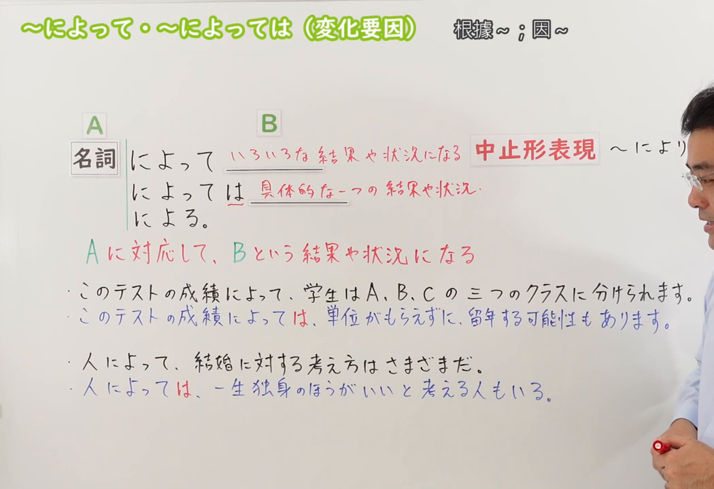

---
{
  "draft_id": "draft-20260913-n3-g-0066",
  "confirmed": false,
  "created_at": "2026-09-13",
  "proposal": {
    "id": "N3-G-0066",
    "kind": "grammar",
    "level": "N3",
    "title": "～によって／～によっては：因……而异；视……而定",
    "status": "draft",
    "card_revision": 1,
    "source": {"lesson":"N3 第66个语法","material":"出口日語原视频板书、日语字幕与独立日文教学正文","video":"https://www.youtube.com/watch?v=lmW8ZLH1gpg","screenshot":"assets/grammar/n3/N3-G-0066-0240.png","screenshot_seconds":240,"screenshot_crop":{"x":0,"y":0,"width":1050,"height":720}},
    "tags": ["变化要因","因情况而异","列举特例","N3"],
    "confusions": ["によって（方法手段・原因・动作主）","に応じて","場合によっては","により","によると"]
  }
}
---

# N3 第66课｜～によって・～によっては（変化要因）（待确认）

# 视频学习资料整理

按指定范围整理；学习者未提供个人原始输出或例句，不虚构理解判断。已核对播放列表第66项：标题「【Ｎ３文法】～によって・～によっては（変化要因）」、视频ID `lmW8ZLH1gpg`、时长05:44。此前未发现本课草稿、正式卡或复习事件；本卡仍未确认，不启动复习。

先检查[原视频00:01](https://www.youtube.com/watch?v=lmW8ZLH1gpg&t=1s)，该时点虽然显示接续和核心含义，但人物遮挡中止形、B 的部分说明及板书例句。主图改取[原视频04:00](https://www.youtube.com/watch?v=lmW8ZLH1gpg&t=240s)：原帧1280×720，固定左上角裁为(0,0,1050,720)，完整保留「によって／によっては／による」、中止形、A／B 关系、两种形式的差别及四句板书例句；尽可能裁去右侧人物，仍保留少量人物区域以避免裁断板书，未抹除、重绘或拼接。

例句图取自[原视频04:30](https://www.youtube.com/watch?v=lmW8ZLH1gpg&t=270s)，位于视频后半部分的例句页，完整显示四句课程例句及中文说明。原帧1280×720，固定左上角裁为(0,0,1280,700)，仅裁去底部少量边框，未重绘或拼接。

# 核心与接续

## **A【名词】＋によって，B／A【名词】＋によっては，B／A【名词】＋による。**

**A 是变化的基准或条件；A 不同，B 的结果、状态、判断或做法也随之不同。** 不带「は」的「によって」通常概括多种差异；「によっては」从这些可能性中提出某一种或某些具体情况，可译为“视……而定，有时……／在某些……情况下”。句末「による」表示“取决于……”。

| 类型 | 接续规则 | 示例 |
|---|---|---|
| 名词 | 名词＋によって，B | 国によって習慣が違う。 |
| 名词 | 名词＋によっては，B | 地域によっては、雪が一メートル以上積もる。 |
| 名词 | 名词＋による | 成功するかどうかは努力による。 |
| 名词 | 名词＋により，B | 地域により、料金が異なります。 |

- 「名词＋により，B」是原视频所列的中止形，比「によって」更正式。
- 「によっては」的「は」带有区分、提示特例的作用。后项常与「こともある、可能性がある、かもしれない、～てもいい」等表达呼应，但这些不是固定接续成分。
- 「による」位于句末时，不是第65课的「による＋名词」；本课表示结果取决于 A，如「人による」「場合による」。

# 语义边界与适用条件

1. **「によって」概括差异。** A 取不同值时，B 可能出现多个结果，常与「違う、異なる、変わる、さまざまだ、いろいろある」等呼应；也可表示根据 A 采取不同做法，不要求句中一定出现“不同”一词。
2. **「によっては」提出具体可能或特例。** 它不是简单地给「によって」加重语气，而是从整体范围中拿出一种或某些情况来说明；因此「場合によっては中止することもある」只说某些情况下可能取消，不表示所有情况都取消。
3. **同一形式要靠关系辨义。**「台風によって電車が止まった」中台风是原因，属于第65课；「天候によって開催方法が変わる」中天气是变化条件，属于本课。
4. **不等于「におうじて(応じて)」。**「人数に応じて部屋を変える」强调主动按照人数作相应调整；「人によって考え方が違う」只是陈述因人而异。两者有时可接近，但焦点不同。
5. **不是传闻来源。**「天気予報によると」表示“根据天气预报所说”，接续和语义都不同。

# 原课板书例句与讲解

1. このテストの成績によって、学生はA、B、Cの三つのクラスに分けられます。——根据这次考试的成绩，学生会被分到A、B、C三个班。（成绩不同，对应多个分班结果。）
2. このテストの成績によっては、単位がもらえずに、留年する可能性もあります。——视这次考试成绩而定，也有可能拿不到学分而留级。（提出一个具体的不利情况。）
3. 人によって、結婚に対する考え方はさまざまだ。——关于婚姻的看法因人而异。（概括多种看法。）
4. 人によっては、一生独身のほうがいいと考える人もいる。——有些人认为终身单身更好。（从人群中提出一种具体看法。）

# 课程例句

1. お金に対する考え方は人によって違います。——对金钱的看法因人而异。
2. あいさつの方法は国によっていろいろあります。——问候方式因国家而有多种不同形式。
3. 条件によっては、その仕事を引き受けてもいいですよ。——视条件而定，那份工作我也可以接受。
4. 場合によっては、嘘をついたほうがいいときもある。——在某些情况下，有时说谎反而更好。

# 自然例句（自拟）

- 季節によって、この公園の景色は大きく変わります。——这个公园的景色因季节而有很大变化。
- 店によっては、クレジットカードが使えないこともあります。——有些店可能不能使用信用卡。
- 参加できるかどうかは、仕事の予定によります。——能否参加取决于工作安排。（使用礼貌体「によります」。）

# 易混项与 JLPT 考点

| 表达 | 重点 | 对照例 |
|---|---|---|
| によって（变化要因） | A 不同，B 也出现多种差异 | 人によって考え方が違う |
| によっては | 提出某一种或某些具体情况 | 人によっては朝食を食べない |
| によって（方法／原因） | A 是手段或导致结果的原因 | 台風によって欠航した |
| におうじて(応じて) | 主动按条件、程度作相应调整 | 人数に応じて席を増やす |
| によると／によれば | 标示信息来源 | ニュースによると、台風が近づいている |

- **接续题**：四种形式都接名词；不要把动词普通形直接放在前面。
- **选择题**：看到「違う・異なる・変わる・さまざまだ」等，优先检查变化要因的「によって」。
- **「は」的辨析**：概括多个结果用「によって」；提出一个具体可能、例外或个别情况时用「によっては」。
- **形式题**：正式连接可用「により」；句末表示“取决于”用「による／によります」。

# 来源与复核记录

核对日期：2026-09-13。原视频[出口日語](https://www.youtube.com/watch?v=lmW8ZLH1gpg)支持名词接续、「によって／によっては」、中止形「により」、句末「による」、A 是变化条件而 B 随之形成结果或状态，以及不带「は」概括多种结果、带「は」提出一个具体情况的教学区分和四句课程例句。自动字幕中的「名刺／明治」校正为「名詞」，「中止系」校正为「中止形」，「ゲッター」依板书和上下文校正为「結果」。

独立资料：[日本語教師のN1et「によって／によっては」](https://jn1et.com/niyotte/)复核「名词＋によって／による／によっては」、因对象或条件而各自不同的含义及「国によって言葉が違う」等搭配；[たのすけ「～によって」](https://tanosuke.com/niyotte/)复核变化要因用法的「名词＋によって／による／により／によっては」、因情况而异以及「違う・異なる・変わる」类例句；[毎日のんびり日本語教師「～によって／によっては」](https://mainichi-nonbiri.com/grammar/n3-niyotte/)复核不同条件产生不同结果、后项常与「違う／異なる」呼应，并明确「によっては」基本用于此类变化要因场景和个别可能。

资料差异处理：外部资料多把变化要因与原因、手段、被动动作主等用法列在同一页；原课程把前三类放在第65课，把变化要因独立为第66课。本卡遵循课程分课，易混项中再说明同形辨义。原课用“多种结果”与“一个具体结果”说明「は」的差别；外部资料还强调个别、例外和可能性，本卡将两者合并为“从整体范围中提出某一种或某些具体情况”，不把“一个”误解成只能有唯一结果。

成稿复核：重新核对名词接续、「によって／によっては／により／による」的分工、A／B 变化关系、四组板书对照、课程例句原文和译文，以及与第65课、`に応じて`、`によると`的边界。图片复核确认本卡恰有两张原视频图片：04:00接续图完整保留接续、两种形式的差别及四句板书例句；04:30例句图完整显示四句课程例句。草稿未确认，不设置正式复习日期。
