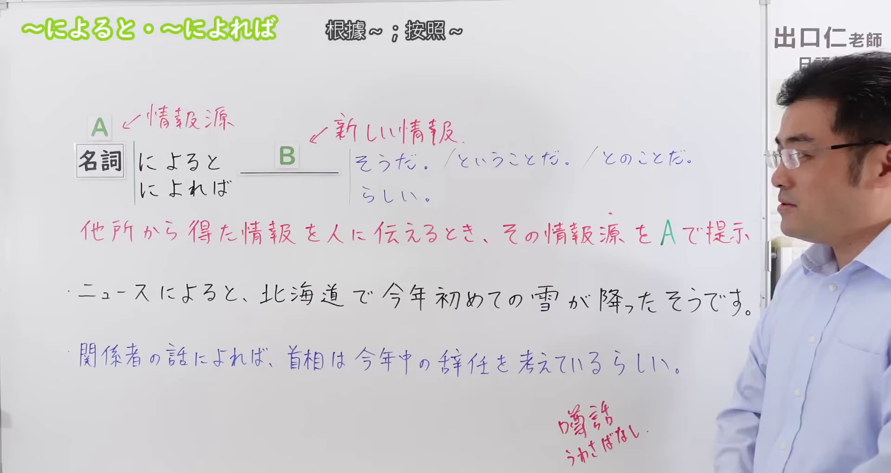
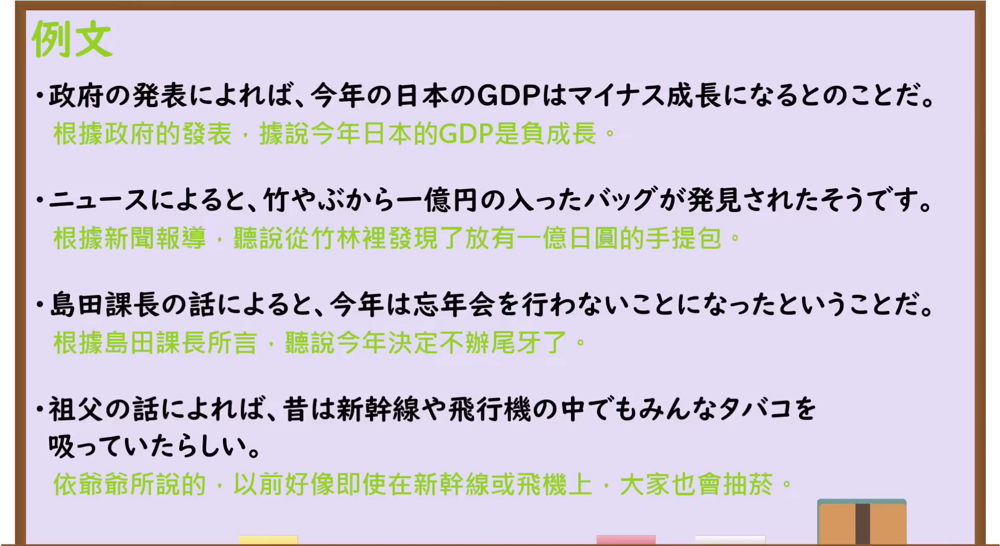

---
{
  "draft_id": "draft-20260913-n3-g-0067",
  "confirmed": false,
  "created_at": "2026-09-13",
  "proposal": {
    "id": "N3-G-0067",
    "kind": "grammar",
    "level": "N3",
    "title": "～によると／～によれば：根据……；据……所说",
    "status": "draft",
    "card_revision": 1,
    "source": {
      "lesson": "N3 第67个语法",
      "material": "出口日語原视频板书、日语字幕与独立日文教学正文",
      "video": "https://www.youtube.com/watch?v=r5faAxFKnjw",
      "screenshot": "assets/grammar/n3/N3-G-0067-0420.png",
      "screenshot_seconds": 260,
      "screenshot_crop": {"x": 0, "y": 0, "width": 1920, "height": 1020}
    },
    "tags": ["信息来源", "传闻", "根据", "N3"],
    "confusions": ["によって", "による", "によると（变化结果）", "そうだ（样态）", "では"]
  }
}
---

# N3 第67课｜～によると・～によれば（待确认）

# 视频学习资料整理

按指定范围整理；学习者未提供个人原始输出或例句，不虚构理解判断。已逐项核对播放列表第67项：标题「【Ｎ３文法】～によると・～によれば」、视频ID `r5faAxFKnjw`、时长06:07。此前未发现本课草稿、正式卡或复习事件；本卡仍未确认，不启动复习。

先检查[原视频00:01](https://www.youtube.com/watch?v=r5faAxFKnjw&t=1s)，该时点人物遮挡 B 的常见句末形式、含义说明及板书例句。接续图改取[原视频04:20](https://www.youtube.com/watch?v=r5faAxFKnjw&t=260s)：原帧1920×1080，固定左上角裁为(0,0,1920,1020)，仅裁去底部少量空白；完整保留标题、名词接续、A／B 标示、四种常见句末、含义说明和两句板书例句。人物仍在画面最右侧，但未遮挡上述关键内容；未抹除、重绘或拼接。

例句图取自[原视频04:41](https://www.youtube.com/watch?v=r5faAxFKnjw&t=281s)，位于视频后半部分的例句页，完整显示四句课程例句及中文说明。原帧1920×1080，固定左上角裁为(0,0,1920,1050)，仅裁去底部少量边框，未重绘或拼接。

# 核心与接续

## **A【名词】＋によると，B／A【名词】＋によれば，B**

从别处获得信息并转告他人时，用 A 指明**信息来源或判断依据**，B 放要传达的新信息。两种形式含义基本相同，可译为“根据……／据……所说”。

| 类型 | 接续规则 | 示例 |
|---|---|---|
| 名词 | 名词＋によると，B | 天気予報によると、明日は雨だそうです。 |
| 名词 | 名词＋によれば，B | 政府の発表によれば、景気は回復するとのことだ。 |

原课在 B 处列出「そうだ／とのことだ／ということだ／らしい」。这些都是典型搭配，不是必须从中选择一个的固定接续：只要语境明确是在根据 A 转述信息或提出有来源的判断，B 也可使用「ようだ」「はずだ」「ことが分かる」等合适表达。

# 语义边界与适用条件

1. **A 是来源，不是原因或手段。**「ニュースによると、明日は雪だ」表示消息来自新闻；「大雪によって電車が止まった」中的大雪是原因，属于另一用法。
2. **B 是根据 A 得到、再向他人传达的信息。** A 常为新闻、天气预报、政府发布、报告、资料、传闻或某人的话；也可以是提供判断根据的记录、记忆等。
3. **句末常带传闻或判断标记。**「そうだ」「らしい」「とのことだ」「ということだ」能明确表示信息并非说话人现场直接确认。原课说明「そうだ」最常见，而「とのことだ／ということだ」较硬，常见于新闻或正式说明。
4. **不能把传闻内容说成自己的亲眼观察。** 若说话人正在根据眼前样子判断，通常使用样态「そうだ」或「ようだ」，不是用「によると」虚构外部来源。
5. **转述信息源本人的发言时要注意表达焦点。**「田中さんによると、会議は中止だ」自然；若重点是精确引用田中本人的承诺或意志，直接用「田中さんは～と言っている」往往更清楚。

# 原课板书例句与讲解

1. ニュースによると、北海道で今年初めての雪が降ったそうです。——据新闻报道，北海道下了今年的第一场雪。（A 是新闻，B 用传闻「そうです」。）
2. 関係者の話によれば、首相は今年中の辞任を考えているらしい。——据有关人士所说，首相似乎正在考虑年内辞职。（来源不公开且内容未完全确定，B 用「らしい」。）

# 课程例句

1. 政府の発表によれば、今年の日本のGDPはマイナス成長になるとのことだ。——根据政府发布的消息，今年日本的GDP将出现负增长。
2. ニュースによると、竹やぶから一億円の入ったバッグが発見されたそうです。——据新闻报道，在竹林里发现了一个装有一亿日元的包。
3. 島田課長の話によると、今年は忘年会を行わないことになったということだ。——据岛田课长所说，今年已经决定不举行年终聚会。
4. 祖父の話によれば、昔は新幹線や飛行機の中でもみんなタバコを吸っていたらしい。——听祖父说，以前大家甚至会在新干线和飞机里吸烟。

# 自然例句（自拟）

- 天気予報によると、台風は今夜九州に近づくそうです。——据天气预报，台风今晚将接近九州。
- この調査によれば、若い世代ほど動画でニュースを見る割合が高いとのことです。——根据这项调查，越年轻的群体，通过视频看新闻的比例越高。
- 先生の話によると、来週の授業はオンラインになるらしいです。——据老师说，下周的课好像会改为线上授课。

# 易混项与 JLPT 考点

| 表达 | 重点 | 对照例 |
|---|---|---|
| によると／によれば（本课） | 标示信息来源或判断依据 | 新聞によると、物価が上がるそうだ |
| によって（原因） | A 导致某结果 | 大雨によって試合が中止になった |
| によって（变化要因） | A 不同，结果也不同 | 人によって考え方が違う |
| では | 可在部分“某信息内容中／按某说法”语境替换，但不能机械替换所有来源名词 | 先生の話では、試験は来週だ |
| そうだ（传闻） | 普通形＋そうだ，转述听来的内容 | 雨が降るそうだ |
| そうだ（样态） | 词干等＋そうだ，根据眼前迹象判断 | 雨が降りそうだ |

- **接续题**：核心直接接名词：`天気予報によると`、`政府の発表によれば`。
- **句末题**：来源表达后常检查「そうだ／らしい／とのことだ／ということだ」等传闻、判断形式。
- **关系题**：先判断 A 是消息来源，还是导致 B 的原因、手段或变化条件；不能只凭中文“根据／由于”猜形式。
- **「そうだ」辨析**：`雪が降ったそうだ`是听说已经下雪；`雪が降りそうだ`是看起来快下雪。

# 来源与复核记录

核对日期：2026-09-13。原视频[出口日語](https://www.youtube.com/watch?v=r5faAxFKnjw)支持名词接续、A 为信息来源、B 为新信息、「によると／によれば」意义相同、B 常用「そうだ／とのことだ／ということだ／らしい」、各句末的语体倾向，以及两句板书例句和四句课程例句。自动字幕中的「名刺」依板书和讲解校正为「名詞」；课程例句文字以清晰例句页为准。

独立资料：[日本語教師のまる得「N3文法 ～によると／～によれば」](https://blognihongo.com/n3/grammar_niyoruto_niyoreba/)复核名词接续、信息源／判断依据、常接传闻或推测句末及使用边界；[日本語NET「〜によると／〜よれば」](https://nihongokyoshi-net.com/2019/06/07/jlptn3-grammar-niyoruto/)复核两形式同义、名词接续、常见「らしい／そうだ／とのことだ」及资料判断例；[日本語教師のN1et「によって／によると」](https://jn1et.com/niyotte/)从多义体系中独立确认本课是“信息源・根拠”用法，接续为「名词＋によれば／によると」，不同于原因、动作主、变化要因和手段。

资料差异处理：原课用四种句末集中说明典型传闻表达；外部资料还列出「ようだ」「はずだ」「ことが分かる」等有来源的判断。本卡严格保留原课总接续和四种课堂句末，并把其他形式列为语义补充，不写入大号总接续。原课未把「によると」解释为原因，本卡也不与第65、66课的「によって」合并。

成稿复核：重新核对播放列表序号、视频ID、名词接续、A／B 信息关系、四种常见句末、六句原课例句及译文，并复查与「によって」和两种「そうだ」的边界。图片复核确认本卡恰有两张原视频图片：04:20接续图完整保留接续、含义、句末形式和板书例句；04:41例句图完整显示四句课程例句。草稿未确认，未设置正式复习日期。
