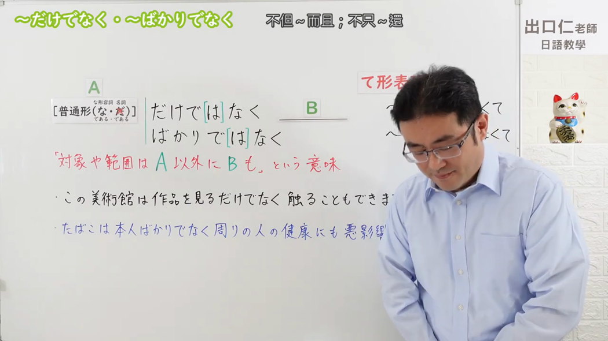
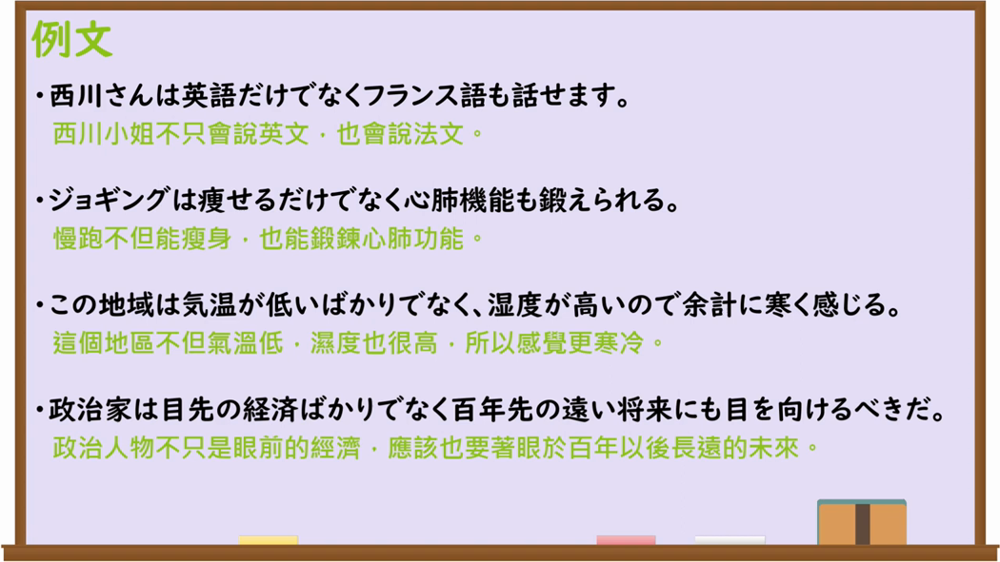

---
{
  "draft_id": "draft-20260913-n3-g-0072",
  "confirmed": false,
  "created_at": "2026-09-13",
  "proposal": {
    "id": "N3-G-0072", "kind": "grammar", "level": "N3",
    "title": "～だけでなく／～ばかりでなく：不仅……而且……",
    "status": "draft", "card_revision": 2,
    "source": {"lesson":"N3 第72个语法", "material":"出口日語原视频板书、日语字幕与独立日文教学正文", "video":"https://www.youtube.com/watch?v=OB_pY2buM7c", "screenshot":"assets/grammar/n3/N3-G-0072-0001.png", "screenshot_seconds":1, "screenshot_crop":{"x":0,"y":0,"width":1050,"height":591}},
    "tags": ["追加", "不仅而且", "N3"],
    "confusions": ["～はもちろん", "～ばかり", "～のみならず"]
  }
}
---

# N3 第72课｜～だけでなく／～ばかりでなく（待确认）

# 视频学习资料整理

已核对播放列表第72项：标题「【N3 Grammar】Not only... but also...」，视频ID `OB_pY2buM7c`，时长约05:11。学习者未提供个人原始输出或例句；本卡未确认，不启动复习。

接续图取原视频00:01，原始帧1280×720，固定左上角缩放为1050×591，保留「普通形（な／である・去だ／である）＋だけではなく／ばかりではなく，B」板书及“不仅A以外B也”的说明。

例句图取原视频04:00（240秒），原始帧1280×720，保留四条例句及中文说明。

# 核心与接续

## **A【普通形（な／である・去だ／である）】＋だけではなく／ばかりではなく，B。**

表示范围或对象不止A，B也包括在内；常译为“不仅A，而且B”。「ばかりではなく」与「だけではなく」意义相同，课程说明前者稍显生硬，实际更常用后者。

| 类型 | 接续规则 | 示例 |
|---|---|---|
| 动词 | 动词普通形＋だけではなく／ばかりではなく | 走るだけでなく、泳ぐこともできる。 |
| い形容词 | い形容词普通形＋だけではなく／ばかりではなく | 安いだけでなく、品質もいい。 |
| な形容词 | な形容词现在肯定形＋な或である＋だけではなく／ばかりではなく；其他时态用普通形 | 便利なだけでなく、速い。／便利であるだけでなく、速い。 |
| 名词 | 名词现在肯定形去だ或＋である＋だけではなく／ばかりではなく；其他时态用普通形 | 学生だけでなく、先生も参加する。／学生であるだけでなく、教師でもある。 |

# 语义边界与适用条件

- A与B是并列追加关系；B通常用「も」或「にも」呼应，但具体助词随句法变化。
- 「普通形（な／である・去だ／である）」表示动词、い形容词用普通形；な形容词的现在肯定形可接「な」或「である」；名词的现在肯定形可去掉「だ」或接「である」；其他时态按普通形变化。
- 「ばかり」在这里不是“只、净是”的限定义，而是固定形式「ばかりではなく」；不可拆作单独的「ばかり」理解。

# 课程例句与自然例句

- 西川さんは英語だけでなくフランス語も話せます。——西川先生不仅会说英语，也会说法语。
- ジョギングは痩せるだけでなく心肺機能も鍛えられる。——慢跑不仅能减肥，还能锻炼心肺功能。
- この地域は気温が低いばかりでなく、湿度が高いので余計に寒く感じる。——这个地区不仅气温低，湿度也高，所以感觉格外寒冷。
- 政治家は目先の経済ばかりでなく、百年先の遠い将来にも目を向けるべきだ。——政治家不仅要关注眼前经济，也应该着眼百年后的遥远未来。

# 易混项及 JLPT 考点

- 「はもちろん」强调A本来就当然；「だけでなく」只强调追加，不含“当然”判断。
- 「ばかり」单独使用可表示限定“净是、只”，必须看到「ではなく」才是“不仅”结构。
- JLPT常考な形容词现在肯定形的「な／である」：便利なだけでなく、便利であるだけでなく；名词现在肯定形的「去だ／である」：英語だけでなく、学生であるだけでなく，不写「英語だだけでなく」。

# 来源与复核记录

核对日期：2026-09-13。原视频00:01板书明确「普通形（な／である・去だ／である）＋だけではなく／ばかりではなく」，并说明A以外B也包括；字幕在约03:00说明两式同义、 「ばかりではなく」较生硬，课程04:00例句页核对四种词类实例。独立资料：[たのすけ「～だけでなく」](https://tanosuke.com/dakedenaku/)用于复核普通形及“不仅而且”用法；[日本語教師のN1et「～ばかりでなく」](https://jn1et.com/bakaridenaku/)复核「ばかりでなく」的接续、追加含义及与「だけでなく」的替换关系。结合课程板书，补明确认な形容词现在肯定形可用「な／である」、名词现在肯定形可用「去だ／である」。图片均为原视频帧，未使用封面或重绘。
