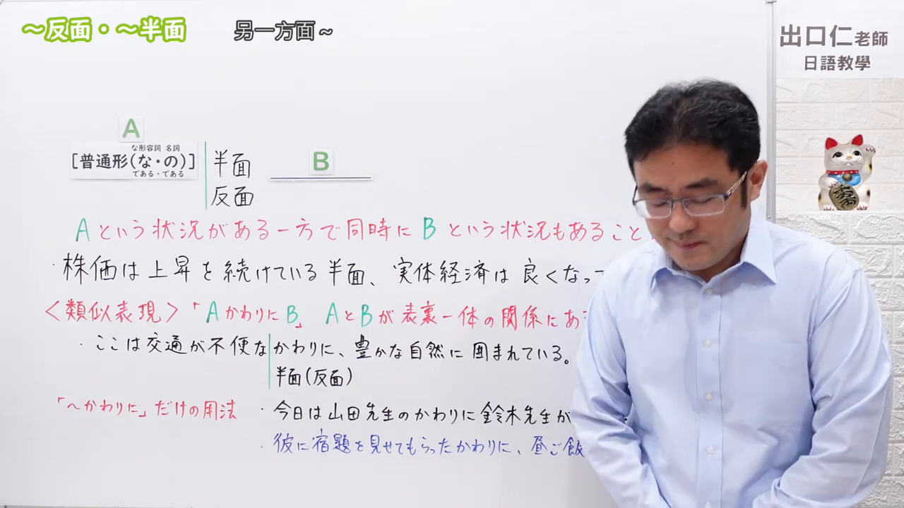
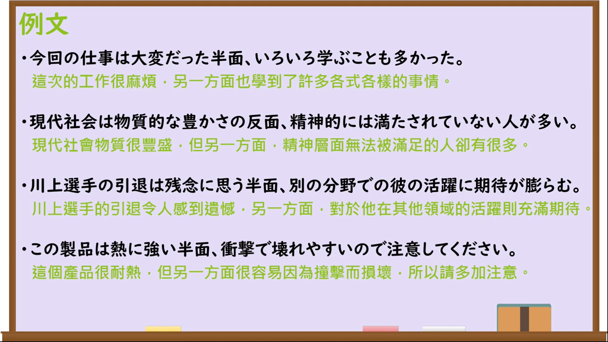

---
{
  "draft_id": "draft-20260913-n3-g-0073",
  "confirmed": false,
  "created_at": "2026-09-13",
  "proposal": {
    "id": "N3-G-0073", "kind": "grammar", "level": "N3",
    "title": "～反面／～半面：另一方面……",
    "status": "draft", "card_revision": 1,
    "source": {"lesson":"N3 第73个语法", "material":"出口日語原视频板书、日语字幕与独立日文教学正文", "video":"https://www.youtube.com/watch?v=1IiJiLgwrYs", "screenshot":"assets/grammar/n3/N3-G-0073-0001.png", "screenshot_seconds":1, "screenshot_crop":{"x":0,"y":0,"width":1280,"height":720}},
    "tags": ["对照", "两面性", "N3"],
    "confusions": ["～一方で", "～かわりに", "～に対して"]
  }
}
---

# N3 第73课｜～反面／～半面（待确认）

# 视频学习资料整理

已核对播放列表第73项：标题「【N3文法】～反面・～半面」，视频ID `1IiJiLgwrYs`，时长约06:24。学习者未提供个人原始输出或例句；本卡未确认，不启动复习。

接续图取原视频00:01，原始帧1280×720，保留标题、四类词总接续、含义、课程例句及与「～かわりに」的比较板书。画面右侧人物遮挡少量文字，未重绘或补写；关键接续由字幕和独立资料复核。

例句图取原视频05:00（300秒），原始帧1280×720，完整保留课程四条例句及中文说明。

# 核心与接续

## **A【普通形（な／である・の／である）】＋反面／半面，B。**

表示同一事物在具有A这一面或性质的同时，也具有与之对照、相反的B这一面；常译为“另一方面……”“但反过来说……”。「反面」与「半面」读音均为「はんめん」，表示对立时通常写「反面」。

| 类型 | 接续规则 | 示例 |
|---|---|---|
| 动词 | 动词普通形＋反面／半面 | 楽しみにしている反面、不安もある。 |
| い形容词 | い形容词普通形＋反面／半面 | この製品は熱に強い反面、衝撃に弱い。 |
| な形容词 | な形容词现在肯定形＋な或である＋反面／半面；其他时态用普通形 | 自由な反面、責任も重い。 |
| 名词 | 名词现在肯定形＋の或である＋反面／半面；其他时态用普通形 | 便利な道具である反面、危険性もある。 |

# 语义边界与适用条件

- A和B原则上描述同一人物、事物或情况的两个对照面，不能随意改换主体。
- 常用于性质、倾向、状态和评价的两面性；不是单纯列举两个互不相反的身份或动作。
- 语体偏书面。若只是并列两项而不强调两面性，「一方で」的适用范围更广。
- 「かわりに」还可以表示代理、交换或补偿；这些用法不能换成「反面」。

# 课程例句与自然例句

- 今回の仕事は大変だった半面、いろいろ学ぶことも多かった。——这次工作虽然很辛苦，但另一方面也学到了很多。
- 現代社会は物質的な豊かさの反面、精神的には満たされていない人が多い。——现代社会物质富足，但另一方面很多人的精神并未得到满足。
- 川上選手の引退は残念に思う反面、別の分野での彼の活躍に期待が膨らむ。——对川上选手退役感到遗憾，同时也更加期待他在其他领域的表现。
- この製品は熱に強い反面、衝撃で壊れやすいので注意してください。——这种产品耐热，但另一方面容易因撞击损坏，请注意。

# 易混项及 JLPT 考点

- 「一方で」可以表示单纯并列或两种不同动作；「反面」更强调同一对象中相反的性质或倾向。
- 「に対して」常把两个不同对象直接对比；「反面」聚焦同一对象的两面。
- JLPT常考な形容词的「な／である」与名词的「の／である」：便利な反面、学生である反面、豊かさの反面。

# 来源与复核记录

核对日期：2026-09-13。原视频00:01板书及字幕明确显示普通形接续，な形容词现在肯定形用「な／である」，名词现在肯定形用「の／である」；A与B是同时存在的对照状况，并与适用范围更广的「～かわりに」比较。独立资料：[たのすけ「～反面」](https://tanosuke.com/hanmen/)支持普通形接续、对立的两面、书面语倾向及与「一方で」的范围差异；[絵でわかる日本語「～反面」](https://www.edewakaru.com/archives/9311151.html)明确列出动词、い形容词、な形容词、名词接续，并强调同一主体和相反性质。两张图片均为原视频独立帧，未使用封面或重绘。
