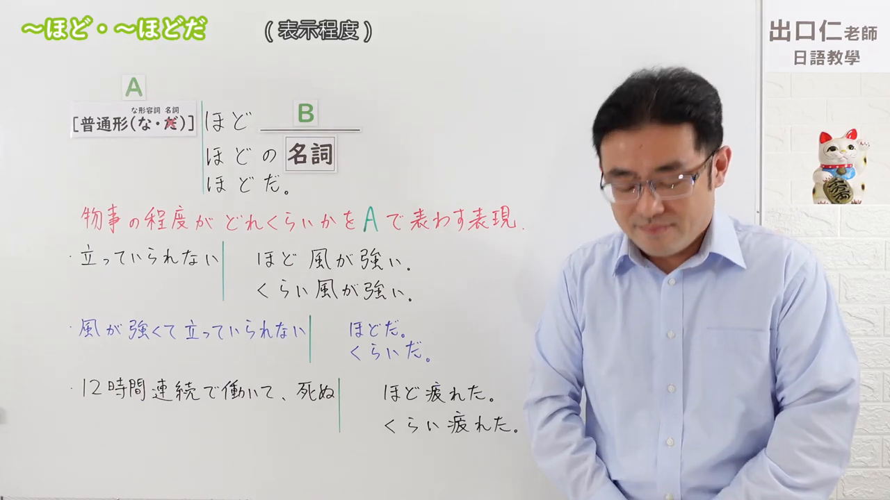
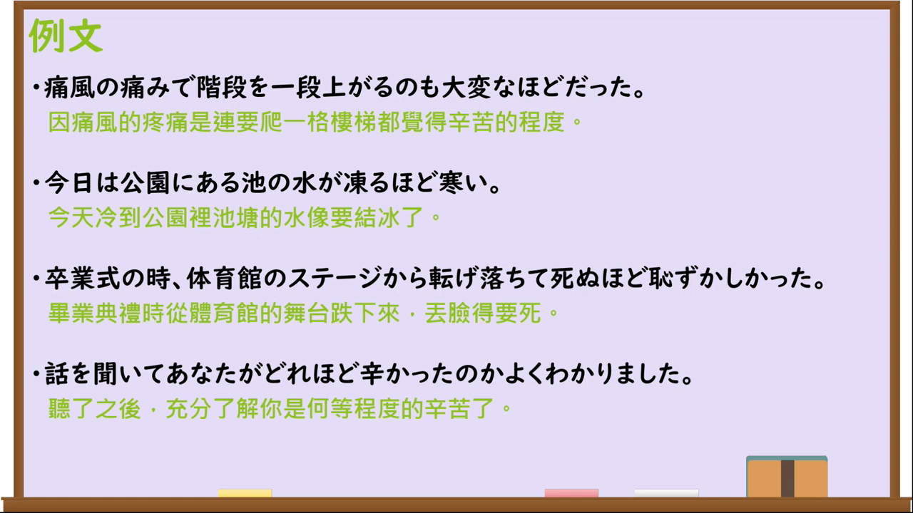

---
{
  "draft_id":"draft-20260913-n3-g-0076","confirmed":false,"created_at":"2026-09-13",
  "proposal":{
    "id":"N3-G-0076","kind":"grammar","level":"N3","title":"～ほど（程度）：达到……程度；……得不得了","status":"draft","card_revision":2,
    "source":{"lesson":"N3 第76个语法","material":"出口日語原视频板书、日语字幕与独立日文教学正文","video":"https://www.youtube.com/watch?v=P23VS3tkPhw","screenshot":"assets/grammar/n3/N3-G-0076-0001.png","screenshot_seconds":1,"screenshot_crop":{"x":0,"y":0,"width":1280,"height":720}},
    "tags":["程度","夸张强调","N3"],"confusions":["～くらい／～ぐらい","～ば～ほど","～ほど（比例）"]
  }
}
---

# N3 第76课｜～ほど（程度）（待确认）

# 视频学习资料整理

已核对播放列表第76项：标题「【N3文法】～ほど・～ほどだ」，视频ID `P23VS3tkPhw`，时长约05:03。学习者未提供个人原始输出或例句；本卡未确认，不启动复习。

接续图取原视频00:01，原始帧1280×720，保留标题、普通形接续、な形容词与名词特殊接续、「ほどの名詞／ほどだ」及程度说明。

例句图取原视频03:40（220秒），原始帧1280×720，完整保留课程四条例句及中文说明。

# 核心与接续

## **A【普通形（な・去だ）】＋ほど，B／A＋ほどの＋名词／A＋ほどだ。**

表示某动作或状态达到A所描述的程度，常用具体事例或夸张表达强调程度；可译为“达到……的程度”“……得不得了”。「ほど」比「くらい／ぐらい」稍正式，程度很高或夸张时尤其自然。

| 类型 | 接续规则 | 示例 |
|---|---|---|
| 动词 | 动词普通形＋ほど | 立っていられないほど風が強い。 |
| い形容词 | い形容词普通形＋ほど | 死ぬほど疲れた。 |
| な形容词 | な形容词现在肯定形＋な＋ほど；其他时态用普通形 | 大変なほど痛かった。 |
| 名词 | 名词直接＋ほど（不带「だ」） | これほど寒い日はない。 |
| 修饰名词 | 普通形＋ほどの＋名词 | 死ぬほどの痛みではない。 |
| 句末 | 普通形＋ほどだ | 階段を上がるのも大変なほどだった。 |

# 语义边界与适用条件

- A是用来说明B程度的具体动作、状态或极端例子，常带程度强调或夸张；不表示真正发生了字面上的极端结果（如「死ぬほど疲れた」通常不是真的死亡）。
- 视频说明动词、い形容词用普通形；な形容词现在肯定形接「な」；名词现在肯定形去掉「だ」后直接接「ほど」。后接名词用「ほどの＋名词」，句末可用「ほどだ」。
- 「ほど」与「くらい／ぐらい」很多场合可互换；课程及资料指出「ほど」较正式，程度很高时更常用「ほど」。
- 本课是程度用法，不是第69课「～ば～ほど」的比例变化用法。

# 课程例句与自然例句

- 痛風の痛みで階段を一段上がるのも大変なほどだった。——因为痛风的疼痛，连上一级台阶都困难到了那种程度。
- 今日は公園にある池の水が凍るほど寒い。——今天冷得公园池塘里的水都结冰了。
- 卒業式の時、体育館のステージから転げ落ちて死ぬほど恥ずかしかった。——毕业典礼时从体育馆舞台上滚落下来，尴尬得不得了。
- 話を聞いて、あなたがどれほど辛かったのかよくわかりました。——听了你的话，我很明白你当时有多么辛苦。

# 易混项及 JLPT 考点

- 「くらい／ぐらい」口语更常见；「ほど」稍正式且适合高程度、夸张表达。
- 「ほど」单独的程度用法与「～ば～ほど」的“越……越……”不同，后者要求前后比例变化。
- JLPT常考な形容词接「なほど」、名词直接接「ほど」、以及「ほどの＋名词」「ほどだ」；不要写成「名词だほど」。

# 来源与复核记录

核对日期：2026-09-13。原视频00:01板书明确普通形接「ほど」，な形容词现在肯定形用「なほど」，名词直接接「ほど」；并列出「ほどの名词」「ほどだ」。课程说明该用法表示事物程度，例句页在约03:35。独立资料：[日本語NET「〜ほど（程度）」](https://nihongokyoshi-net.com/2019/04/16/jlptn3-grammar-hodo-2/)列出V普通形、い形容词普通形、名词＋ほど及程度例句；[たのすけ「～ぐらい／～くらい／～ほど（程度）」](https://tanosuke.com/gurai-hodo-teido)复核普通形接续、な形容词「な」、名词直接接续、夸张程度及与「くらい／ぐらい」的语体差异。两张图片均为原视频独立帧，未使用封面或重绘。
