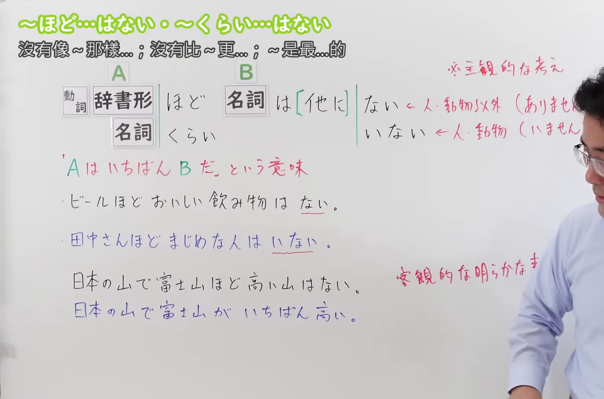
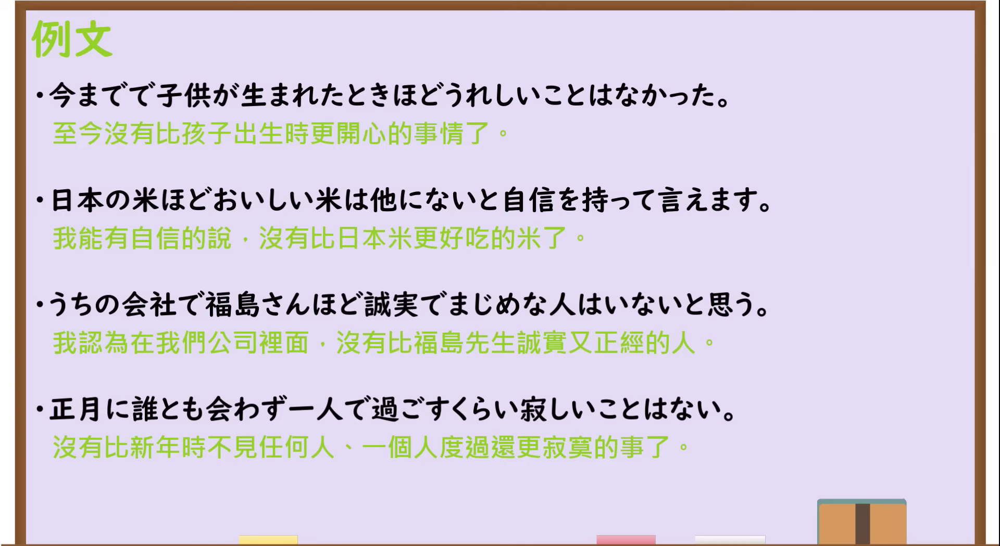

---
{
  "draft_id": "draft-20260913-n3-g-0077",
  "confirmed": false,
  "created_at": "2026-09-13",
  "proposal": {
    "id": "N3-G-0077",
    "kind": "grammar",
    "level": "N3",
    "title": "～ほど…はない／～くらい…はない：没有比……更……的",
    "status": "draft",
    "card_revision": 1,
    "source": {
      "lesson": "N3 第77个语法",
      "material": "出口日語原视频板书、日语字幕与独立日文教学正文",
      "video": "https://www.youtube.com/watch?v=4duXe89L8ZQ",
      "screenshot": "assets/grammar/n3/N3-G-0077-0330.png",
      "screenshot_seconds": 210,
      "screenshot_crop": {"x": 0, "y": 0, "width": 1540, "height": 1020}
    },
    "tags": ["主观最高程度", "强调", "否定形式", "N3"],
    "confusions": ["～ほど～ない（比较）", "～くらい（些细）", "～ほど（程度）", "いちばん", "客观事实"]
  }
}
---

# N3 第77课｜～ほど…はない・～くらい…はない（待确认）

# 视频学习资料整理

按指定范围整理；学习者未提供个人原始输出或例句，不虚构理解判断。已逐项核对播放列表第77项：标题「【Ｎ３文法】～ほど…はない・～くらい…はない」、视频ID `4duXe89L8ZQ`、时长06:19。此前未发现本课草稿、正式卡或复习事件；本卡未确认，不启动复习。

先检查[原视频00:01](https://www.youtube.com/watch?v=4duXe89L8ZQ&t=1s)，再比较00:30、01:00、01:30、02:00、02:30、03:00、03:30和04:35等讲解画面。接续图取自[原视频03:30](https://www.youtube.com/watch?v=4duXe89L8ZQ&t=210s)：原帧1920×1080，固定左上角裁为(0,0,1540,1020)，保留标题、A／B 标示、动词辞书形／名词接续、B 的「は［他に］ない／いない」、主观最高程度说明、两句板书例句及客观事实的正误对照。裁去右侧和底部多余区域；右缘仍保留少量人物，且人物遮住两处括注末尾，但「ありません／いません」可由前段清晰画面、日语讲解和独立资料确认。未抹除、重绘或拼接。

例句图取自[原视频04:55](https://www.youtube.com/watch?v=4duXe89L8ZQ&t=295s)，位于视频后半部分的例句页，完整显示四句课程例句及中文说明。原帧1920×1080，固定左上角裁为(0,0,1920,1050)，仅裁去底部少量边框，未重绘或拼接。

# 核心与接续

## **A【动词辞书形／名词】＋ほど／くらい+B【名词】＋は［他に］ない／いない**

说话者主观地把 A 评价为 B 所表示性质中程度最高的对象，可译为“没有比 A 更……的／A 是最……的”。A 表示比较基准，B 表示被强调的性质或类别；总接续用「+」连接 A 与 B，表示两部分共同构成一个完整句型。

| 类型 | 接续规则 | 示例 |
|---|---|---|
| 动词 | 动词辞书形＋ほど／くらい＋名词＋はない | 一人で過ごすくらい寂しいことはない |
| 名词 | 名词＋ほど／くらい＋名词＋はない／いない | ビールほどおいしい飲み物はない／田中さんほどまじめな人はいない |

- B 所指为人或动物等有生命对象时常用「いない／いません」；事物、事情等用「ない／ありません」。
- 「他に」常与后项一起出现，强调“除此以外没有”，但不是必需成分。
- 本课的「ほど」与「くらい」意义基本相同；外部资料还列出语音变体「ぐらい」，并指出「くらい／ぐらい」更偏口语。总接续仍按原视频写「くらい」，不把外部变体加入板书形式。

# 语义边界与适用条件

1. **这是主观评价，不是客观排名公式。** 说话者是在表达“我认为 A 最……”。原视频将「日本の山で富士山ほど高い山はない」判为不适合，因为富士山最高是可客观核验的事实；直接说「日本の山で富士山がいちばん高い」更自然。
2. **正面、负面评价都可以。** 如「日本の米ほどおいしい米はない」是正面评价；「一人で過ごすくらい寂しいことはない」是负面感受。关键不是褒贬，而是主观地突出最高程度。
3. **否定形式表达最高级意义。** 表面有「ない」，整体不是简单地否定 A，而是说“其他对象没有达到 A 的程度”。
4. **不等于一般比较的「AほどBない」。** 「私は兄ほど背が高くない」只是“我没有哥哥那么高”；本课通常由「B名词＋はない／いない」构成“没有比 A 更 B 的……”的最高程度判断。

# 例句

## 原视频例句

1. 今までで子供が生まれたときほどうれしいことはなかった。
   到目前为止，没有比孩子出生时更让我高兴的事。

2. 日本の米ほどおいしい米は他にないと自信を持って言えます。
   我可以自信地说，没有其他米比日本米更好吃。

3. うちの会社で福島さんほど誠実でまじめな人はいないと思う。
   我觉得我们公司里没有比福岛先生更诚实认真的人。

4. 正月に誰とも会わず一人で過ごすくらい寂しいことはない。
   没有什么比新年不见任何人、独自度过更寂寞的了。

## 补充自然例句

- 私にとって、家族と一緒に食事をすることほど大切な時間はない。
  对我来说，没有比和家人一起吃饭更重要的时光。

- この町では、春の川沿いくらいきれいな景色は他にないと思う。
  我觉得在这座城市里，没有其他景色比春天的河边更美。

# 易混项与 JLPT 考点

- **～ほど～ない（一般比较）**：「電車は飛行機ほど速くない」表示电车没有飞机快，并不表示飞机在所有交通工具中最快。
- **～くらい（些细／最低限）**：第78课的「自分の部屋くらい自分で片付けなさい」把“自己的房间”看作最低限的小事，不表示最高程度。
- **～ほど／～くらい（程度）**：「立っていられないほど疲れた」表示疲劳达到“站不住”的程度，句型后项不是「名词＋はない／いない」。
- **客观事实与主观判断**：若题干是世界最高、人口最多等可核验事实，通常直接使用「いちばん」；若是说话者的喜好、感受、评价，才适合本课句型。
- **「ない／いない」选择**：B 为人时优先检查「いない」；事物、抽象事情用「ない」。

# 来源与复核记录

核对日期：2026-09-13。

- [出口日語原视频](https://www.youtube.com/watch?v=4duXe89L8ZQ)：支持动词辞书形／名词接续、A／B 结构、「ほど／くらい」同义、B 的「は［他に］ない／いない」、主观最高程度、客观事实限制、正误对照及四句课程例句。
- [日本語NET「〜ほど〜はない」](https://nihongokyoshi-net.com/2019/04/17/jlptn3-grammar-hodo-wanai/)：复核“主观地强调最好／最高”、客观事实不适用、动词辞书形＋こと或名词接续、「他に」搭配，以及「ほど」可换成「くらい／ぐらい」。
- [日本語教師のN1et「くらい／ぐらい～はない・ほど～はない」](https://jn1et.com/kurai-hodo-nai/)：复核主观最高程度、正负评价均可、人作 B 时用「いない」、「くらい／ぐらい」较口语，以及与客观事实的区分。

字幕校对：自动字幕中的「名刺」「同市辞書型」「何らにほど」等结合板书与讲解校正为「名詞」「動詞辞書形」「～ほど…はない」。课程例句文字以清晰例句页为准。Firecrawl 检索因账户返回402未能取得结果，之后通过两站的 WordPress 检索接口定位页面并逐页读取正文；未把搜索摘要当作验证依据。

复核结论：视频板书接续与两份独立日文教学资料在本课核心用法上相符。N1et 还列出「くらい／ぐらい」前可出现更广的普通形形式；为严格遵守原视频总接续，本卡主表只列视频明确教授的动词辞书形与名词，外部扩展不混入总接续。成稿已重新检查接续、例句、译文、两张图片的课程归属与实际时间；本卡仍为待确认状态，没有正式卡、确认事件或复习日期。
