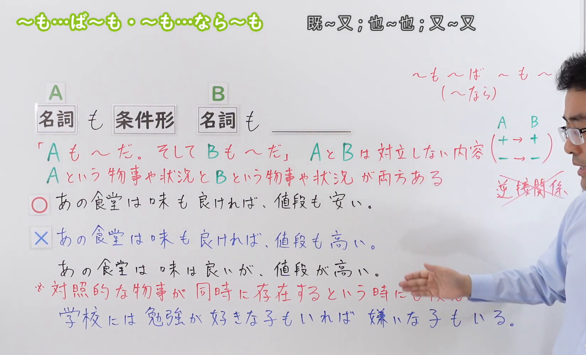
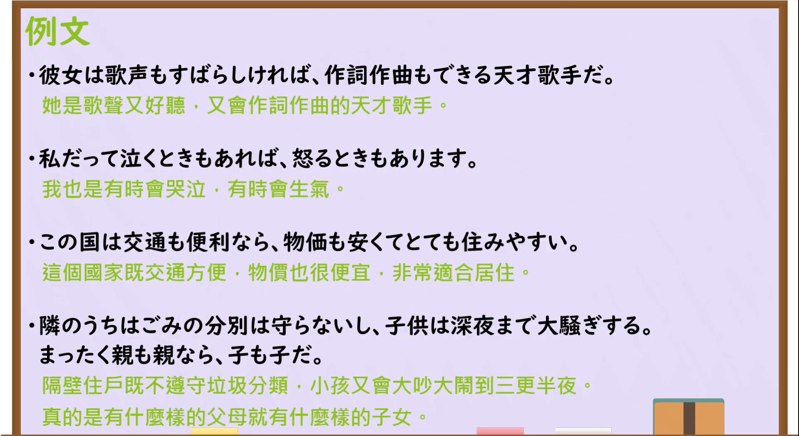

---
{
  "draft_id": "draft-20260914-n3-g-0080",
  "confirmed": true,
  "created_at": "2026-09-14",
  "proposal": {
    "id": "N3-G-0080",
    "kind": "grammar",
    "level": "N3",
    "title": "～も…ば～も／～も…なら～も：两项都……；并列列举",
    "status": "confirmed",
    "card_revision": 1,
    "schema_version": 1,
    "created_at": "2026-09-14",
    "updated_at": "2026-09-14",
    "next_review": "2026-09-21",
    "source": {
      "lesson": "N3 第80个语法",
      "material": "出口日語原视频板书、日语字幕与独立日文教学正文",
      "video": "https://www.youtube.com/watch?v=8OR_bSVFszw",
      "screenshot": "assets/grammar/n3/N3-G-0080-0300.png",
      "screenshot_seconds": 180,
      "screenshot_crop": {
        "x": 0,
        "y": 0,
        "width": 1650,
        "height": 1000
      }
    },
    "tags": [
      "并列列举",
      "两项并存",
      "条件形",
      "同向评价",
      "N3"
    ],
    "confusions": [
      "普通条件句～ば／～なら",
      "～し～し",
      "～だけでなく",
      "～一方で／～反面",
      "～たり～たり",
      "XもXならYもY"
    ]
  }
}
---

# N3 第80课｜～も…ば～も・～も…なら～も（待确认）

# 视频学习资料整理

按指定范围整理；学习者未提供个人原始输出或例句，不虚构理解判断。已逐项核对播放列表第80项：标题「【Ｎ３文法】～も…ば～も・～も…なら～も」、视频ID `8OR_bSVFszw`、时长05:54。此前未发现本课草稿、正式卡或复习事件；本卡未确认，不启动复习。

先检查[原视频00:01](https://www.youtube.com/watch?v=8OR_bSVFszw&t=1s)，再比较02:00、03:00、03:15、03:30、03:40、04:00、04:08和04:15的同一板书。接续图取自[原视频03:00](https://www.youtube.com/watch?v=8OR_bSVFszw&t=180s)：原帧1920×1080，固定左上角裁为(0,0,1650,1000)，保留标题、A／B名词与条件形接续、两项都成立的说明、同向评价的正误例句，以及对照事物并存的补充说明和例句。裁去右侧大部分人物与底部空白；人物的手仍遮住补充说明末尾的一小部分，但关键接续、主要说明和例句可读，且日语讲解与三份独立正文均能补足该处含义。未抹除、重绘或拼接。

例句图取自[原视频04:20](https://www.youtube.com/watch?v=8OR_bSVFszw&t=260s)，位于视频后半部分的例句页，完整显示四句课程例句及中文说明。原帧1920×1080，固定左上角裁为(0,0,1920,1050)，仅裁去底部少量边框，未重绘或拼接。

# 核心与接续

## **～も…ば～も・～も…なら～も**

## **A【名词】も【条件形】、B【名词】も＿＿。**

以上两行严格保留原视频标题与板书总接续。A、B是被并列列举的两个项目；先在A后加「も」，再把A的谓语变成条件形，B后也加「も」，最后说明B的情况。整体表示“A也……，B也……”，不是提出“如果A，就B”的真实条件。

| 类型 | 接续规则 | 示例 |
|---|---|---|
| 动词 | A名词＋も＋动词ば形，B名词＋も＋谓语；否定用「～なければ」 | 野菜も作れば、豚や鶏も育てている。／肉も食べなければ、魚も食べない。 |
| い形容词 | A名词＋も＋い形容词去「い」＋ければ，B名词＋も＋谓语；否定用「～くなければ」 | 味も良ければ、値段も安い。／味も良くなければ、サービスもよくない。 |
| な形容词 | A名词＋も＋な形容词词干＋なら，B名词＋も＋谓语；否定用「～でなければ」 | 交通も便利なら、物価も安い。／場所も静かでなければ、部屋も広くない。 |
| 名词 | A名词＋も＋名词＋なら，B名词＋も＋谓语；否定用「～でなければ」 | 親も親なら、子も子だ。／父も医者でなければ、母も医者ではない。 |

外部资料也常把な形容词和名词的现在肯定条件形写成「ならば」；原视频总接续使用「なら」，所以不把「ば」补进上面的大号板书接续。第二项B不需要机械地再用条件形，可按句意使用普通谓语、て形等，如「物価も安くて」「作詞作曲もできる」。

# 语义边界与适用条件

1. **并列列举两项都成立。** 基本意思是“A也是如此，B也是如此”，用条件形把第一项接到第二项，但句子重点不是假设或条件。
2. **同一对象的评价通常同向。** 列举优点时常是正面＋正面，列举缺点时常是负面＋负面，如「味も良ければ、値段も安い」「味もまずければ、サービスも悪い」。原视频把「味も良ければ、値段も高い」标为不适合本课的典型并列；要直接表现一好一坏的转折，通常改用「が」「一方で」「反面」等。
3. **对照项目可以表示共同存在。** 「泣く時もあれば、怒る時もある」「人生には楽もあれば苦もある」并不是给同一对象作相反方向的单一评价，而是列出两种不同状态、类别或时机都存在。原视频与「にほんごの里」均明确支持这一用法。
4. **「も」标出成对项目。** 两个「も」分别附在A、B名词后；遗漏其中一个，句子的对称列举感会减弱，也容易在接续题中失分。
5. **未必穷尽全部情况。** 本结构强调至少这两项都成立，不表示世界上只有A和B两项。
6. **「XもXなら、YもYだ」常含批评。** 当X、Y是人或组织并重复同一个名词时，常表示双方都不怎么样，如「親も親なら、子も子だ」，不能按普通条件句译成“如果父母是父母……”。

# 例句

## 原视频例句

1. 彼女は歌声もすばらしければ、作詞作曲もできる天才歌手だ。  
   她是歌声动听、又能作词作曲的天才歌手。

2. 私だって泣くときもあれば、怒るときもあります。  
   我也有哭泣的时候，也有生气的时候。

3. この国は交通も便利なら、物価も安くてとても住みやすい。  
   这个国家交通方便，物价也便宜，非常适合居住。

4. 隣のうちはごみの分別は守らないし、子供は深夜まで大騒ぎする。まったく親も親なら、子も子だ。  
   隔壁住户既不遵守垃圾分类，孩子又闹到深夜。真是有什么样的父母，就有什么样的孩子。

## 补充自然例句

- この会社は給料も高ければ、休みも多い。  
  这家公司工资高，假期也多。

- 彼は日本語も話せれば、中国語も読める。  
  他会说日语，也能读中文。

- 旅行中は晴れの日もあれば、雨の日もある。  
  旅行期间既有晴天，也有雨天。

# 易混项与 JLPT 考点

- **普通条件句「～ば／～なら」**：「時間があれば、行きます」是真实条件“如果有时间就去”；本课「味も良ければ、値段も安い」只是列出两个同时成立的性质。
- **～し～し**：「味もいいし、値段も安い」同样能并列理由或性质，口语中很自然；本课形式则要求第一项用条件形，并用两个「も」形成对称列举。
- **～だけでなく**：表示“不仅A，而且B”，有从A扩展到B的焦点；本课更对称地强调A、B两项都成立。
- **～一方で／～反面**：突出同一事物的相反两面；一好一坏的直接对比通常用这些形式，不套用本课的同向评价型。
- **～たり～たり**：列举代表性动作或状态，如「泣いたり怒ったりする」；本课用「泣く時もあれば、怒る時もある」强调两种时机或状态都存在。
- **条件形变化**：动词「話す→話せば」、い形容词「安い→安ければ」、な形容词「便利だ→便利なら」、名词「学生だ→学生なら」。不要写成「便利ければ／学生ければ」。
- **后半形式**：第二项不必重复「ば／なら」；例如「交通も便利なら、物価も安くて……」是正确的课程例句。
- **惯用辨义**：「親も親なら、子も子だ」常是对父母和孩子双方的批评，属于高频语用陷阱。

# 来源与复核记录

核对日期：2026-09-14。

- [出口日語原视频](https://www.youtube.com/watch?v=8OR_bSVFszw)：支持板书「A名词も＋条件形、B名词も＋谓语」、动词／い形容词用「ば」类条件形、な形容词／名词用「なら」、两项都成立、同向评价、对照状态并存，以及「親も親なら、子も子だ」等课程例句。
- [日本語教師のN1et「～も～ば～も」](https://jn1et.com/mobamo/)：复核「名词＋も＋ば形（な形容词／名词＋なら）＋名词＋も」的接续，以及同一评价轴通常采用正面＋正面或负面＋负面的限制。
- [日本語教育ナビ「も～ば、も」](https://japanese-language-education.com/for-overseas-learners/mo-ba-mo/)：逐项复核动词ば形、い形容词「ければ」、な形容词「ならば」、名词「ならば」四种接续，并支持“在前一项上追加同类项目”的并列意义。该页把「性能も良ければ」误放在「ナAならば」的小标题下；本卡没有沿用这个配例错误，接续以其总表、原视频及其他独立资料交叉确认。
- [にほんごの里「～も～ば～も～、～も～なら～も～」](https://nihongonosato.com/jlpt/n2-grammar/n2-mo-ba-mo/)：复核同向正／负评价、对照项目并存、な形容词「なら（ば）」以及「XもXならYもY」表达双方批评的语用。该站把此项编入N2，前两站和原课程编作N3；等级标注差异不影响本卡核对的接续和语义。

网页获取记录：Crawl4AI 0.9.3 成功读取以上三份独立日文教学正文。Yahoo! JAPAN仅用于发现候选网址；Google页面触发验证码后未继续访问，搜索摘要和AI内容均未作为教学依据。

字幕校对：自动字幕把「文型」「名詞」「条件形」「～ば」「～なら」等多处误识为「文系」「名刺」「条件型」「バー」等；已结合清晰板书、日语讲解和例句页校正。课程四条例句以清晰例句页文字为准。

复核结论：原视频与三份独立日文教学正文对核心接续和“两项都成立”的并列意义一致。成稿已重新检查总接续、四类条件形、同向评价与对照并存的边界、惯用批评结构、例句、译文及两张图片的课程归属与实际时间；本卡仍为待确认状态，没有正式卡、确认事件或复习日期。
