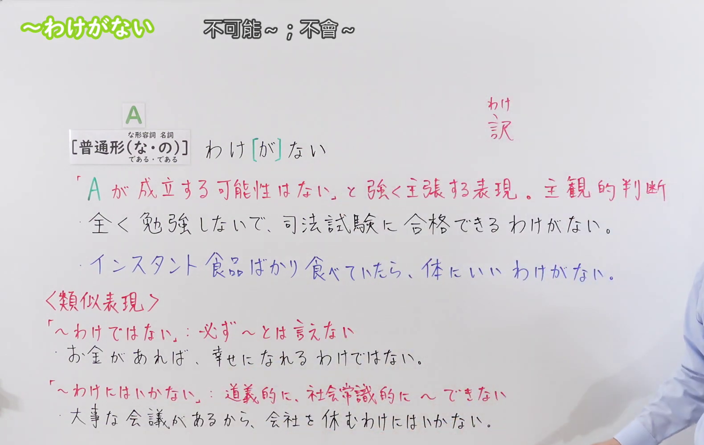
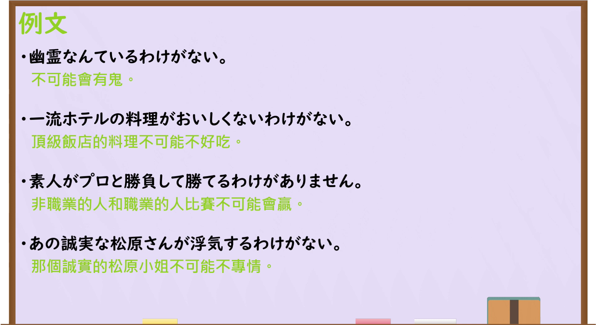

---
{
  "draft_id": "draft-20260914-n3-g-0083",
  "confirmed": true,
  "created_at": "2026-09-14",
  "proposal": {
    "id": "N3-G-0083",
    "kind": "grammar",
    "level": "N3",
    "title": "～わけがない：不可能、强烈否定可能性",
    "status": "confirmed",
    "card_revision": 1,
    "schema_version": 1,
    "created_at": "2026-09-14",
    "updated_at": "2026-09-14",
    "next_review": "2026-09-21",
    "source": {
      "lesson": "N3 第83个语法",
      "material": "出口日語原视频板书、日语字幕与独立日文教学正文",
      "video": "https://www.youtube.com/watch?v=c9luVdzwDpU",
      "screenshot": "assets/grammar/n3/N3-G-0083-0300.png",
      "screenshot_seconds": 180,
      "screenshot_crop": {"x": 0, "y": 0, "width": 1580, "height": 1000}
    },
    "tags": ["不可能", "强烈否定", "主观判断", "双重否定", "N3"],
    "confusions": ["～ものか", "～はずがない", "～っこない", "～わけではない", "～わけにはいかない", "～ないわけがない"]
  }
}
---

# N3 第83课｜～わけがない

# 视频学习资料整理

按指定范围整理；学习者未提供个人原始输出或例句，不虚构理解判断。已逐项核对播放列表第83项：标题「【Ｎ３文法】～わけがない」、视频ID `c9luVdzwDpU`、时长05:04。学习者于2026-09-14确认入库，本卡从确认日开始七天复习周期。

先检查[原视频00:01](https://www.youtube.com/watch?v=c9luVdzwDpU&t=1s)，再比较01:20、02:00、02:40、03:00、03:10和03:20的同一板书。接续图取自[原视频03:00](https://www.youtube.com/watch?v=c9luVdzwDpU&t=180s)：原帧1920×1080，固定左上角裁为(0,0,1580,1000)，保留标题、普通形接续、な形容词与名词的两种现在肯定形式、主观断定“不可能”的说明、两句板书例句，以及「わけではない／わけにはいかない」的区别和例句。裁去右侧大部分人物与底部空白；右缘仍保留少量人物区域，以免裁断主观判断和板书句末。未抹除、重绘或拼接。

例句图取自[原视频03:40](https://www.youtube.com/watch?v=c9luVdzwDpU&t=220s)，位于视频后半部分的例句页，完整显示四句课程例句及中文说明。原帧1920×1080，固定左上角裁为(0,0,1920,1050)，仅裁去底部少量边框，未重绘或拼接。

# 核心与接续

## **A【普通形（な／である・の／である）】＋わけ[が]ない。**

总接续严格依照原视频板书展开：括号内前一组「な／である」对应な形容词的现在肯定形，后一组「の／である」对应名词的现在肯定形；动词和い形容词按普通形接续。`[が]` 表示助词「が」有时会省略；完整形式是「わけがない」，省略后为「わけない」。整体表示说话者强烈断定“A成立的可能性不存在”，常译为“不可能……”“怎么会……”。

| 类型 | 接续规则 | 示例 |
|---|---|---|
| 动词 | 普通形＋わけがない | 素人がプロに勝てるわけがない。 |
| い形容词 | 普通形＋わけがない | そんなに安いわけがない。 |
| な形容词 | 现在肯定形的だ改为な／である＋わけがない；否定、过去等按普通形 | 大丈夫なわけがない／安全であるわけがない |
| 名词 | 现在肯定形的だ改为の／である＋わけがない；否定、过去等按普通形 | 彼が犯人のわけがない／素人であるわけがない |

礼貌形为「～わけがありません」。会话中常省略「が」说成「～わけない」，但正式写作和考试接续优先掌握完整形式「～わけがない」。

# 语义边界与适用条件

1. **强烈否定可能性。** 说话者根据常识、已知事实、对人物的评价或现场情况，断定A不可能成立，不只是“概率有点低”。
2. **属于主观判断。** 原视频明确写「主観的判断」；即使有理由支撑，结论仍是说话者作出的强断言，并不保证客观事实一定如此。
3. **可以否定动作、性质、身份或状态。** 如「勝てるわけがない」「安いわけがない」「大丈夫なわけがない」「犯人のわけがない」。
4. **否定形式接在A内时会形成双重否定。** 「おいしくないわけがない」直译为“不可能不好吃”，即“肯定好吃”；「嬉しくないわけがない」即“不可能不高兴”。先判断A本身是否已是否定形，再决定整句含义。
5. **「わけ」通常写平假名。** 此处已经语法化，不按字面机械翻成“理由”；「理由がない」不是本结构的直接释义。
6. **不是社会规范上的“不能做”。** 「休むわけがない」是断定“不会休息／不可能请假”；「休むわけにはいかない」才是“因为责任、立场等不能请假”。

# 例句

## 原视频例句

1. 幽霊なんているわけがない。  
   鬼怪什么的不可能存在。

2. 一流ホテルの料理がおいしくないわけがない。  
   一流酒店的料理不可能不好吃，也就是肯定好吃。

3. 素人がプロと勝負して勝てるわけがありません。  
   外行和职业选手比赛，不可能获胜。

4. あの誠実な松原さんが浮気するわけがない。  
   那么诚实的松原不可能出轨。

## 补充自然例句

- こんな短い時間で全部終わるわけがない。  
  这么短的时间内不可能全部做完。

- 足を骨折しているのだから、大丈夫なわけがない。  
  因为腿骨折了，怎么可能没事。

# 易混项与 JLPT 考点

- **～ものか**：同为强烈否定，但「～ものか」是反语，常用于当场反驳、愤怒或强烈意志；「～わけがない」更侧重根据情况断定“不可能成立”。
- **～はずがない**：也能表示“不可能”，侧重不符合说话者的预期、知识或计划；不少句子可替换，但本课「わけがない」的断定语气通常更直接。
- **～っこない**：口语性强，只接动词ます形去ます，如「勝ちっこない」；本课接普通形，并可接动词、形容词和名词。
- **～わけではない**：部分否定，表示“并非一定／并不是说……”，如「お金があれば幸せになれるわけではない」；它不等于“绝不可能幸福”。
- **～わけにはいかない**：因道义、责任、社会常识或处境而“不能做”，如「大事な会議があるから、会社を休むわけにはいかない」；并非否定事情发生的可能性。
- **双重否定**：`ない＋わけがない`通常得到强烈肯定，如「一流ホテルの料理がおいしくないわけがない」。这是高频辨义点。
- **接续陷阱**：な形容词用「な／である」，名词用「の／である」；不要把「大丈夫のわけがない」或「犯人なわけがない」当作本课标准接续。

# 来源与复核记录

核对日期：2026-09-14。

- [出口日語原视频](https://www.youtube.com/watch?v=c9luVdzwDpU)：支持普通形（な／である・の／である）接续、会话省略「が」、主观地强烈否定A成立可能性、双重否定例句，以及与「わけではない／わけにはいかない」的区别。
- [日本語教師たのすけ「～わけがない」](https://tanosuke.com/wakeganai/)：复核普通形接续、な形容词现在肯定用「な」、名词用「の」、主观断定不可能、会话「わけない」、双重否定，以及与「っこない」「はずがない」「わけではない」「わけにはいかない」的辨析。
- [日本語教師のN1et「わけ族」](https://jn1et.com/wake-zoku/)：复核普通形（な・の）接续、主观的“绝对不可能”、可与「はずがない」替换，以及「わけではない」的部分否定和「わけにはいかない」的责任／规范限制。

网页获取记录：Crawl4AI 0.9.3 成功读取以上两份独立日文教学正文。Yahoo! JAPAN和站内搜索只用于发现候选网址，Google页面触发验证码后未继续访问，搜索摘要和AI内容均未作为教学依据。

字幕校对：自动字幕把「わけがない」「普通形」「動詞・い形容詞・な形容詞・名詞」「ひらがな」「主観的判断」等误识为「理由がない」「普通系」「同市・ek・お品経・指名」「日魚」「映画成立」；已结合清晰板书、日语讲解和例句页校正。课程四条例句以清晰例句页文字为准。

复核结论：原视频与两份独立日文教学正文对核心接续、主观强烈否定、会话省略和相邻「わけ」结构的区别一致。成稿重新检查了四类词接续、双重否定、相邻语法辨析、例句和译文，以及两张图片的课程归属、实际时间与裁切范围。学习者已于2026-09-14确认入库，下次复习为2026-09-21。
