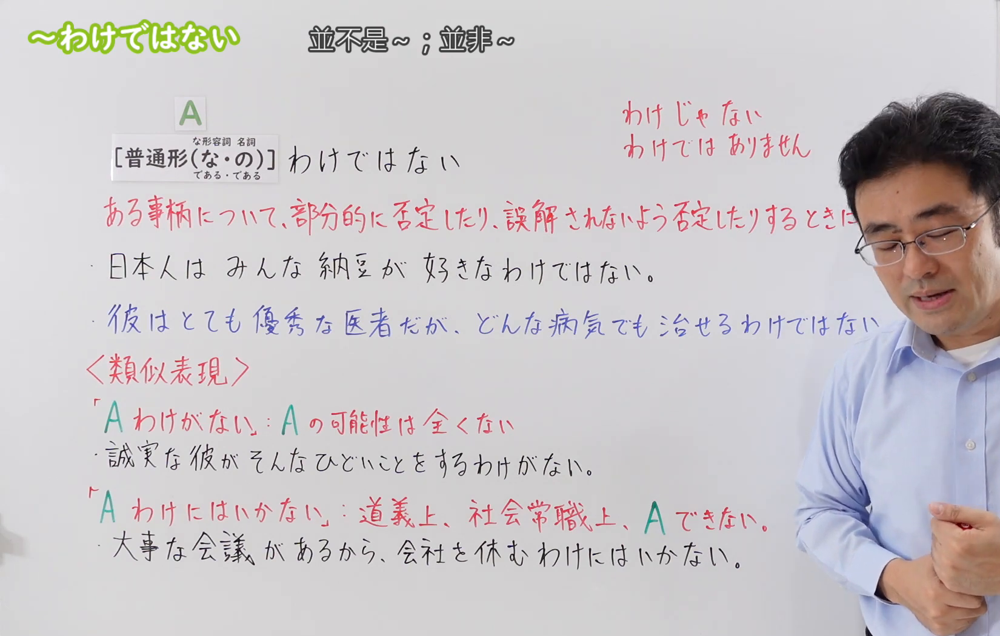
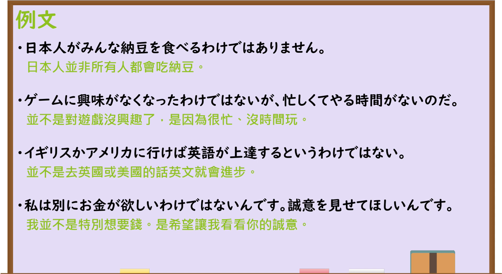

---
{
  "draft_id": "draft-20260914-n3-g-0085",
  "confirmed": true,
  "created_at": "2026-09-14",
  "proposal": {
    "id": "N3-G-0085",
    "kind": "grammar",
    "level": "N3",
    "title": "～わけではない：部分否定与避免误解",
    "status": "confirmed",
    "card_revision": 1,
    "schema_version": 1,
    "created_at": "2026-09-14",
    "updated_at": "2026-09-19",
    "source": {
      "lesson": "N3 第85个语法",
      "material": "出口日語原视频板书、日语字幕与独立日文教学正文",
      "video": "https://www.youtube.com/watch?v=gVoymo5X_gQ",
      "screenshot": "assets/grammar/n3/N3-G-0085-0220.png",
      "screenshot_seconds": 220,
      "screenshot_crop": {
        "x": 0,
        "y": 0,
        "width": 1650,
        "height": 1050
      }
    },
    "tags": [
      "部分否定",
      "避免误解",
      "委婉否定",
      "わけ系列",
      "N3"
    ],
    "confusions": [
      "～わけがない",
      "～とは限らない",
      "～わけにはいかない",
      "～ないわけではない"
    ],
    "next_review": "2026-09-21"
  }
}
---

# N3 第85课｜～わけではない

# 视频学习资料整理

按指定范围整理；学习者未提供个人原始输出或例句，不虚构理解判断。已核对播放列表第85项：标题「【Ｎ３文法】～わけではない」、视频 ID `gVoymo5X_gQ`、时长05:21。此前未发现本课草稿、正式卡或复习事件；学习者于2026-09-14确认入库，本卡从确认日开始七天复习周期。

接续图取自[原视频03:40](https://www.youtube.com/watch?v=gVoymo5X_gQ&t=220s)。原帧1920×1080，固定左上角裁为(0,0,1650,1050)，保留标题、普通形接续、部分否定／避免误解的说明、例句及与「わけがない」「わけにはいかない」的对照；人物遮住右侧少量板书，但关键内容可读，并由日语讲解与独立正文补足。未抹除、重绘或拼接。

例句图取自[原视频04:00](https://www.youtube.com/watch?v=gVoymo5X_gQ&t=240s)。原帧1920×1080，固定左上角裁为(0,0,1920,1050)，完整保留四句课程例句及中文说明，仅裁去底部少量边框，未重绘或拼接。

# 核心与接续

## **～わけではない**

## **A【普通形（な/である・の／である）】わけではない**

以上总接续按视频板书整理。它否定的是由A形成的整体判断，常表达“并不是（所有／完全／必然）A”或“并不是因为A”，用于限制说法、保留例外或纠正对方可能产生的误解。

| 类型 | 接续 | 示例 |
|---|---|---|
| 动词 | 普通形＋わけではない | 毎日運動するわけではない。 |
| い形容词 | 普通形＋わけではない | 値段が安いわけではない。 |
| な形容词 | 词干＋な／である＋わけではない | 暇なわけではない。／特別であるわけではない。 |
| 名词 | 名词＋な／である＋わけではない；视频总板书以「の」提示名词类接续，具体自然表达也常用「名词＋というわけではない」 | 全員が学生であるわけではない。／旅行好きというわけではない。 |

礼貌体是「～わけではありません」；口语常缩约成「～わけじゃない」。较长命题常用「～というわけではない」。

## 用法①：限制过强的概括，表示“并非全都、并非一定”

**说话人的意图：** 对方把一件事说成“所有的人都／总是／一定会这样”，说话人并不想完全否认这件事，只想划出边界，让对方知道还有例外。选用本表达是为了避免把自己的情况当成全体结论，或纠正对方对某一群体的一概而论；它否定的只是“一概成立”，通常保留一部分成立的内容。

**场景演示（自拟场景）：**
社团聚餐时，成员山下以为外国同学都不吃纳豆，担心点菜会失礼，先向韩国交换生金（キム）确认。

山下：外国の人は納豆が苦手ですよね。金さんにこれを出したら失礼かな。 
（外国人不喜欢纳豆吧。给小金上这个会不会失礼。）

金：苦手なわけではありませんよ。韓国にも似た発酵食品がありますから、逆に親しみを感じます。 
（并不是不喜欢。韩国也有类似的发酵食品，反而觉得亲切。）

山下：じゃあ遠慮なく注文しますね。全員が苦手なわけじゃないんですね、失礼しました。 
（那我就不客气地点了。并不是所有人都觉得不行，是我失礼了。）

「苦手なわけではありません」是な形容词词干＋な＋わけではありません的礼貌体，与板书例句「日本人がみんな納豆を食べるわけではありません」同为部分否定，「みんな／全員」这类范围词是判断线索。同一限制也可以否定必然性：「行けば英語が上達するというわけではない」（板书例句3），否定的是“一定如此”，而不是“完全没有这回事”。

## 用法②：先否定对方可能得出的理由或动机，再说明真正情况

**说话人的意图：** 说话人预感到对方会由自己的行为推出负面结论（嫌烦、没兴趣、别有所图），于是先把这个推测明确否定掉，紧接着补上真正的理由。意图是消除误会、维护关系，语气比直接反驳委婉，因此常以「が／けど」带出后半句，也可用「別に」提示。

**场景演示（自拟场景）：**
铃木连续三次取消了和大学好友山内的聚会，山内以为他不想再见面了。

山内：最近ずっと断っているけど、僕と会うのがおっくうになってきたのか。 
（最近你一直在拒绝，是不是觉得跟我见面麻烦了。）

铃木：そんなことはないよ。山内と会うのが嫌になったわけではないけど、今、資格の勉強で土日が全部つぶれていてね。 
（没那么回事。并不是变得讨厌跟你见面，只是现在考证，周末全占满了。）

山内：そうだったのか。遠慮なく言えばいいのに。 
（是这样啊。你直说就好啊。）

「嫌になったわけではないけど」是动词た形＋わけではない，后接逆接「けど」带出真实理由，与板书例句「ゲームに興味がなくなったわけではないが、忙しくてやる時間がないのだ」和「別にお金が欲しいわけではないんです」用途相同。若只说「嫌なわけではない」而不补后面的真实情况，对方仍会追问理由，因此这类说法通常带后半句。

## 用法③：否定词放进A内，构成双重否定的委婉表达

**说话人的意图：** 说话人其实想肯定某件事，但不愿说成“完全懂、非常想去”那样绝对，于是用“也不是不……”保留程度上的余地。意图是在承认对方说法或勉强表示意愿的同时显得客气、不夸大，属于弱肯定而不是强烈同意。

**场景演示（自拟场景）：**
辩论社练习结束后，老师问高桥要不要参加下周的大会；高桥对稿子没信心。

先生：来週の弁論大会、出てみない？準備は結構大変だよ。 
（下周的辩论大会，要不要试试？准备相当辛苦哦。）

高桥：大変なのは分かっています。出たくないわけではないんですけど、自分の原稿にまだ自信がなくて。 
（我知道会很辛苦。并不是不想参加，只是对自己的稿子还没信心。）

先生：じゃあ、まずその原稿を私に見せて。そのうえで決めればいい。 
（那么，先把那份稿子给我看。在那基础上再决定就好。）

「出たくないわけではないんですけど」把否定「ない」放进A内，再加「わけではない」，句末用口语说明形「んですけど」缓和，整句等于“并非不想参加＝有意愿但保留余地”；与本课易混项「～ないわけではない」同一解读方式。判断时先确认「わけ」前的A是否已含「ない」：A已含否定时是委婉部分肯定，A为肯定形时（如「暇なわけではない」）才是限制对方判断的部分否定。

# 语义边界与适用条件

1. **部分否定。** 否定“全部、总是、完全、必然如此”，通常暗示仍有一部分成立或存在例外。
2. **避免误解。** 先否定对方可能推出来的理由、动机或结论，再补充真正情况，常见「～わけではないが／けど、～」。
3. **不是强烈全否定。** 「日本人がみんな納豆を食べるわけではない」不是“日本人都不吃纳豆”，而是“并非每个日本人都吃”。
4. **否定词也可进入A。** 「わからないわけではない」是双重否定，表示“并非不懂＝多少能理解”，语气委婉，不等于完全肯定。
5. **常与范围词搭配。** 「みんな」「必ず」「いつも」「全部」「特に」「別に」「からといって」常提示需要限制过强概括。

# 例句

## 原视频例句

1. 日本人がみんな納豆を食べるわけではありません。  
   并非所有日本人都吃纳豆。

2. ゲームに興味がなくなったわけではないが、忙しくてやる時間がないのだ。  
   并不是对游戏失去兴趣，而是太忙，没有时间玩。

3. イギリスかアメリカに行けば英語が上達するというわけではない。  
   并不是去了英国或美国，英语就一定会进步。

4. 私は別にお金が欲しいわけではないんです。誠意を見せてほしいんです。  
   我并不是特别想要钱，而是希望你表现出诚意。

## 补充自然例句（自拟）

- 甘い物が嫌いなわけではないが、毎日は食べない。  
  我并不是讨厌甜食，只是不会每天吃。
- 忙しい人がみんな不幸だというわけではない。  
  并不是所有忙碌的人都不幸福。

# 易混项与 JLPT 考点

- **～わけがない**：表示说话人断定“绝不可能”，属于强烈全否定；本课是限制某项判断，往往保留一部分可能性。
- **～とは限らない**：表示“未必”，突出不能保证一概成立；「～わけではない」还常用来纠正误解或否定动机。
- **～わけにはいかない**：因道义、人际或社会常识而“不能做”，并非否定命题真假。
- **～ないわけではない**：双重否定，表示“也不是不……／并非完全不……”，常是弱肯定；注意否定范围。
- **接续题重点**：な形容词现在肯定用「な／である」，名词类常见「である／という」；口语「じゃない」和礼貌体「ではありません」只是语体变化。
- **语境题重点**：后句若用「が／けど」补充例外、真正理由或局部成立内容，通常指向本课的部分否定。

# 来源与复核记录

核对日期：2026-09-14。

- [出口日語原视频](https://www.youtube.com/watch?v=gVoymo5X_gQ)：支持普通形接续、部分否定／避免误解、口语「わけじゃない」、礼貌体，以及四句课程例句和「わけ」系列对照。
- [たのすけ「～わけではない」](https://tanosuke.com/wakedehanai/)：复核普通形接续、な形容词「な／である」、名词「の／である」、部分否定，以及「～ないわけではない」的委婉部分肯定。
- [毎日のんびり日本語教師「～わけではない」](https://mainichi-nonbiri.com/grammar/n3-wakedehanai/)：复核不完全否定、暗示例外或可接受部分、逆接后续和口语「～わけじゃない」。

网页获取记录：Crawl4AI 0.9.3 成功读取以上两份独立日文教学正文；搜索页只用于发现候选网址，未作为教学依据。

字幕校对：日语自动字幕存在断句和同音误识；已结合清晰板书、日语讲解和例句页校正。四条课程例句以例句页文字为准。

复核结论：视频与两份独立正文对接续、部分否定和避免误解的核心一致。学习者已于2026-09-14确认入库，下次复习为2026-09-21。

**2026-09-19补充：** 按学习者2026-09-19确认的流程要求，在"核心与接续"补充三组"说话人的意图＋场景演示"（均为自拟场景，接续、语义边界与语体按已核实规则编写，对话未沿用视频原句）。本次补充未改动总接续、接续表、原有例句与来源记录，确认日期和七天复习周期不变。
