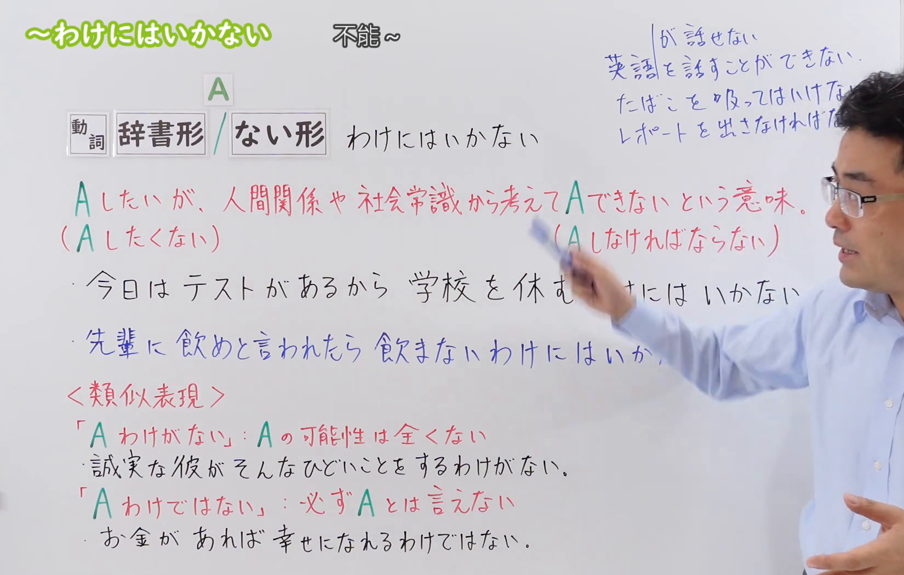
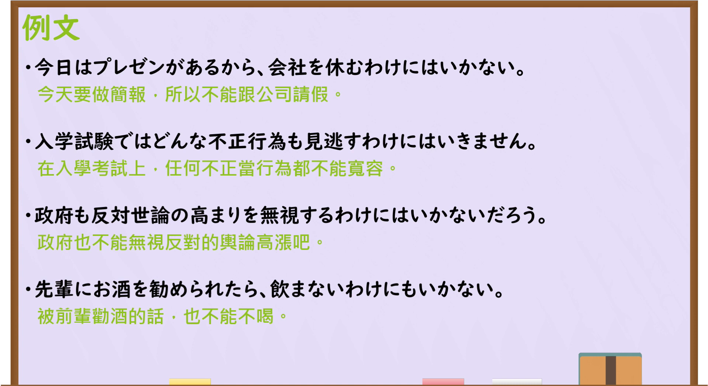

---
{
  "draft_id": "draft-20260914-n3-g-0086",
  "confirmed": true,
  "created_at": "2026-09-14",
  "proposal": {
    "id": "N3-G-0086",
    "kind": "grammar",
    "level": "N3",
    "title": "～わけにはいかない：碍于道义或社会因素不能做",
    "status": "confirmed",
    "card_revision": 1,
    "schema_version": 1,
    "created_at": "2026-09-14",
    "updated_at": "2026-09-19",
    "source": {
      "lesson": "N3 第86个语法",
      "material": "出口日語原视频板书、日语字幕与独立日文教学正文",
      "video": "https://www.youtube.com/watch?v=9gnDhpPLKk8",
      "screenshot": "assets/grammar/n3/N3-G-0086-0300.png",
      "screenshot_seconds": 300,
      "screenshot_crop": {
        "x": 0,
        "y": 0,
        "width": 1650,
        "height": 1050
      }
    },
    "tags": [
      "社会常识",
      "人际关系",
      "道义",
      "心理制约",
      "义务",
      "N3"
    ],
    "confusions": [
      "～られない",
      "～てはいけない",
      "～わけがない",
      "～わけではない",
      "～ないわけにはいかない"
    ],
    "next_review": "2026-09-21"
  }
}
---

# N3 第86课｜～わけにはいかない

# 视频学习资料整理

按指定范围整理；学习者未提供个人原始输出或例句，不虚构理解判断。已核对播放列表第86项：标题「【Ｎ３文法】～わけにはいかない」、视频 ID `9gnDhpPLKk8`、时长06:39。此前未发现本课草稿、正式卡或复习事件；学习者于2026-09-14确认入库，本卡从确认日开始七天复习周期。

接续图取自[原视频05:00](https://www.youtube.com/watch?v=9gnDhpPLKk8&t=300s)。原帧1920×1080，固定左上角裁为(0,0,1650,1050)，保留标题、动词辞书形／ない形接续、人际关系与社会常识造成制约的说明、两种方向及类义表达对照；人物遮住右侧少量文字，但关键接续和例句可读，并由日语讲解与独立正文补足。未抹除、重绘或拼接。

例句图取自[原视频05:20](https://www.youtube.com/watch?v=9gnDhpPLKk8&t=320s)。原帧1920×1080，固定左上角裁为(0,0,1920,1050)，完整保留四句课程例句及中文说明，仅裁去底部少量边框，未重绘或拼接。

# 核心与接续

## **～わけにはいかない**

## **A【动词辞书形／ない形】わけにはいかない**

以上总接续严格保留视频板书。说话人本来可能想做或不做A，也有实际能力选择，但基于人际关系、社会常识、责任、道义、立场或自尊等，主观上认为不能那样选择。

| 形式 | 接续 | 意义 | 示例 |
|---|---|---|---|
| 肯定动作＋わけにはいかない | 动词辞书形＋わけにはいかない | 不能／不便做A | 約束したから、断るわけにはいかない。 |
| 否定动作＋わけにはいかない | 动词ない形＋わけにはいかない | 不能不做A，即必须做A | 約束したから、行かないわけにはいかない。 |

礼貌体是「～わけにはいきません」。口语里助词「は」仍是该句型的一部分，不要误写成「わけにいかない」。

## 用法①：把承诺、职责或立场内化为“我不能做A”

**说话人的意图：** 事情本身做得到，也没有人硬拦着，但说话人认为自己一旦那样选，就会辜负承诺、影响工作或有违应有的做法，于是用本表达向对方说明“不是我不愿意，而是我这个立场不能那样做”。语气比直接说“不行”更把责任揽在自己身上，常用于拒绝对方的期待或解释处境；承担者不一定是说话人自己，教师、政府等因职责与立场也可作主体。

**场景演示（自拟场景）：**
年会前夜，销售佐藤想请假去参加女儿的发表会，被课长拒绝，同事山本劝他再争取一次。

山本：娘さんの発表会、もう一回相談してみたほうがいいんじゃない？ 
（你女儿的发表会，是不是该再找课长商量一次？）

佐藤：昨日もう相談しました。ただ、受付を任されているのは私だけなんです。 
（昨天已经商量过了。只是负责接待的只有我一个人。）

山本：それは厳しいね。当日はもう動けない？ 
（那太难了。当天真的腾不开身吗？）

佐藤：はい。みんなが準備している日に、私だけ休むわけにはいきません。娘には別の日にお礼をします。 
（不行。大家都在准备的那天，不能只有我请假。我改天再向女儿道谢。）

「休むわけにはいきません」是动词辞书形＋わけにはいかない的礼貌体，与板书例句「会社を休むわけにはいかない」「どんな不正行為も見逃すわけにはいきません」同为“做得到，但职责上不该做”。对照：只说「休めません」像在陈述能力或客观上无法请假，丢掉了“我判断自己不该这样做”这层责任；若说话人只是向别人宣布规则，用「当日は休んではいけません」这类禁令说法更自然。

## 用法②：没有硬性规定，但面子上、心理上过不去

**说话人的意图：** 说话人要表达的不是规定禁止，而是自己的自尊、怕难为情或对周围目光的顾虑使某选择不可接受。用本表达可以把“其实是可以的”这层让步保留着，同时强调心理上做不到，因此常出现在带情绪的自我说明或朋友间的劝解里。

**场景演示（自拟场景）：**
社团公开课后，高桥的方案输给了后辈山下。好友铃木劝他去问对方的写法，高桥不肯。

铃木：負けたんだから、山下面的の書き方を聞きに行けばいいのに。 
（既然输了，去问问山下是怎么写的就好了嘛。）

高桥：あいつの前で負けを認めるわけにはいかないよ。自分の案をもう一度出し直す。 
（我不能在他面前承认输了。我要重新交一次自己的方案。）

铃木：そうか。じゃあ、僕が見た範囲のことは教えるよ。 
（这样啊。那我把我看到的部分告诉你。）

高桥：助かる。人にずっと頼るわけにはいかないけど、それだけは遠慮しない。 
（帮大忙了。虽然不能一直依靠别人，但那一点我就不客气了。）

此处没有任何规则禁止高桥去问，制约来自自尊与面子，属于本课语义边界列出的“面子、自尊等心理因素”。若换成「聞きに行ってはいけない」，就变成旁人下达禁令，意思随之改变；这类内心制约不能那样替换。

## 用法③：ない形＋わけにはいかない，双重否定表示“不能不做”

**说话人的意图：** 说话人其实不太想做A，但对方点名、场合或自己的良心使他不能推掉，于是用“不做A是不行的”把义务说出来，同时向对方透出“并非我自愿，而是形势不允许”的勉强感，板书例句4“前辈劝酒，也不能不喝”正属于这一类。

**场景演示（自拟场景）：**
送别会上，一年级的山下被部长点名代表新生致辞。他不擅长在人前讲话，先向同社团的前辈伊藤诉苦。

山下：急に名前を出されて、もう困りました。僕、人前で話すのが得意じゃないんです。 
（突然被点了名，真没办法。我不擅长在人前讲话。）

伊藤：新入生の代表なんだから、みんなの前で断らないわけにはいかないよ。 
（你是新生的代表，在所有人面前不能不答应啊。）

山下：分かってます。だから今、一言だけ考えるところです。 
（我知道。所以我现在正在想那一句说什么。）

伊藤：ありがとうを言えばいいんだ。短くて大丈夫だ。 
（说声谢谢就行。短一点没关系。）

「断らないわけにはいかない」是动词ない形＋わけにはいかない，整句等于“不能不答应＝必须答应”，方向与用法①相反，是本课最常见的考点。板书例句「飲まないわけにもいかない」把「には」换成「にも」，仍是这一类义务，只多了“也”的添加语气。

# 语义边界与适用条件

1. **有外部规范或心理责任。** 制约常来自面子、承诺、职责、道义、人际顾虑、社会常识等，而非物理上完全不可能。
2. **通常存在选择能力。** 说话人理论上做得到，却判断“不可以／不能那样做”。
3. **辞书形与ない形方向相反。** 「休むわけにはいかない」是不能休息；「休まないわけにはいかない」是不能不休息，即必须休息。
4. **不用于单纯能力不足。** 不会说日语应说「日本語が話せない」，不说「話すわけにはいかない」。
5. **不用于单纯身体障碍。** 因牙痛而吃不了应说「食べられない」；若因礼仪或规定判断“不该吃”，才可能用本课句型。
6. **规则禁令需看说话视角。** 纯粹告知规则常用「～てはいけない」；当说话人把规则、职责或立场内化为“我不能那样做”时，才自然使用「～わけにはいかない」。

# 例句

## 原视频例句

1. 今日はプレゼンがあるから、会社を休むわけにはいかない。  
   今天有汇报，所以不能向公司请假。

2. 入学試験ではどんな不正行為も見逃すわけにはいきません。  
   在入学考试中，任何作弊行为都不能放过。

3. 政府も反対世論の高まりを無視するわけにはいかないだろう。  
   政府大概也不能无视日益高涨的反对舆论吧。

4. 先輩にお酒を勧められたら、飲まないわけにもいかない。  
   如果前辈劝酒，也不能不喝。

## 补充自然例句（自拟）

- 大切な約束だから、忘れるわけにはいかない。  
  因为是重要约定，不能忘记。
- みんなが待っているので、行かないわけにはいかない。  
  大家都在等，所以不能不去。

# 易混项与 JLPT 考点

- **～られない／～できない**：表示能力、条件或客观可能性不足；本课表示实际上可能，却受责任或社会／心理因素制约。
- **～てはいけない**：直接表示禁令或规则“不准”；本课更突出说话人基于处境判断“不能那样做”。
- **～わけがない**：表示“绝不可能”，否定可能性；本课并不否定可能性，而是否定选择的妥当性。
- **～わけではない**：对命题作部分否定或纠正误解，不表达道义上的不能。
- **ない形＋わけにはいかない**：双重否定产生义务“不得不／必须”；是最常见的方向判断考点。
- **主语与语境**：常以说话人或承担责任者为判断主体；政府、教师、组织等也可因职责或立场成为主体，并不限于第一人称字面形式。
- **礼貌变化**：「いかない→いきません」，前面的「わけには」不变。

# 来源与复核记录

核对日期：2026-09-14。

- [出口日語原视频](https://www.youtube.com/watch?v=9gnDhpPLKk8)：支持动词辞书形／ない形接续、人际关系和社会常识造成的制约、两种相反方向、与其他「わけ」形式的区分及四句课程例句。
- [たのすけ「～わけにはいかない」](https://tanosuke.com/wakenihaikanai/)：复核“有理由而不能做”，理由属于社会通念、常识、对周围的顾虑或自尊等心理因素，并明确排除单纯能力和个人身体状况。
- [毎日のんびり日本語教師「～わけにはいかない／ないわけにはいかない」](https://mainichi-nonbiri.com/grammar/n3-wakenihaikanai/)：复核辞书形与ない形的双向接续，以及基于常识、社会通念、经验的主观判断、义务感和正义感。

网页获取记录：Crawl4AI 0.9.3 成功读取以上两份独立日文教学正文；搜索页只用于发现候选网址，未作为教学依据。

字幕校对：日语自动字幕存在断句和同音误识，例如把「反対世論」误识为带数字的词串；已结合清晰板书、日语讲解和例句页校正。四条课程例句以例句页文字为准。

复核结论：视频与两份独立正文对接续、社会／心理制约和ない形双重否定的方向一致。学习者已于2026-09-14确认入库，下次复习为2026-09-21。

**2026-09-19补充：** 按学习者2026-09-19确认的流程要求，在"核心与接续"补充三组"说话人的意图＋场景演示"（均为自拟场景，接续、语义边界与语体按已核实规则编写，对话未沿用视频原句）。本次补充未改动总接续、接续表、原有例句与来源记录，确认日期和七天复习周期不变。
