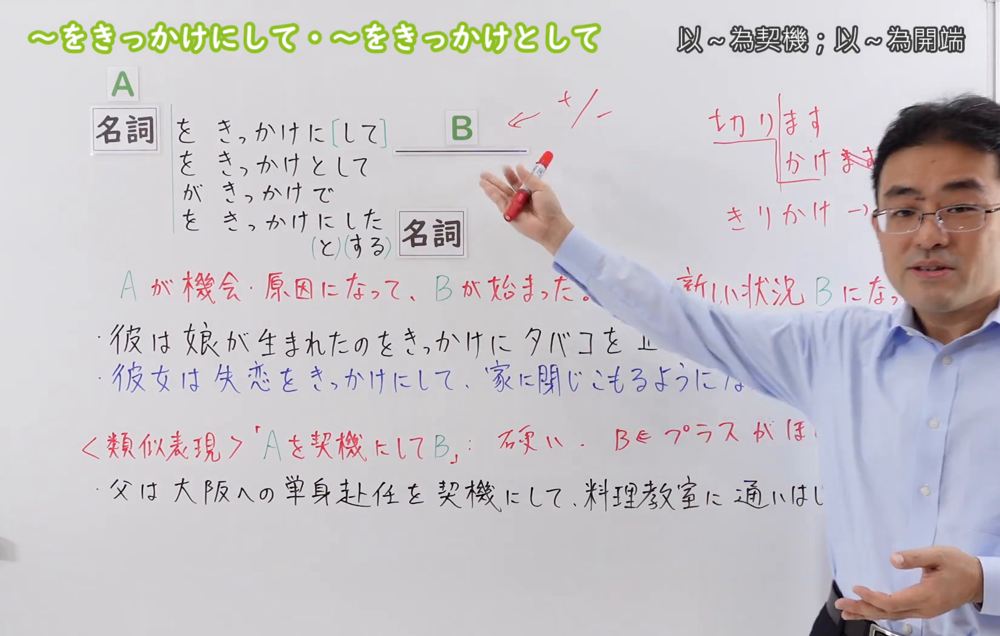
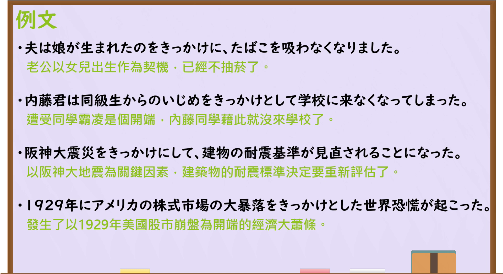

---
{
  "draft_id": "draft-20260914-n3-g-0090",
  "confirmed": true,
  "created_at": "2026-09-14",
  "proposal": {
    "id": "N3-G-0090",
    "kind": "grammar",
    "level": "N3",
    "title": "～をきっかけにして／～をきっかけとして：以A为契机发生B",
    "status": "confirmed",
    "card_revision": 1,
    "schema_version": 1,
    "created_at": "2026-09-14",
    "updated_at": "2026-09-19",
    "source": {
      "lesson": "N3 第90个语法",
      "material": "出口日語原视频板书、日语字幕与独立日文教学正文",
      "video": "https://www.youtube.com/watch?v=bLvkte9dz7A",
      "screenshot": "assets/grammar/n3/N3-G-0090-0240.png",
      "screenshot_seconds": 240,
      "screenshot_crop": { "x": 0, "y": 0, "width": 1650, "height": 1050 }
    },
    "tags": ["契机", "原因", "变化起点", "书面表达", "N3"],
    "confusions": ["～をきっかけに", "～を契機に", "～を機に", "～によって", "～を通じて"],
    "next_review": "2026-09-21"
  }
}
---

# N3 第90课｜～をきっかけにして・～をきっかけとして

# 视频学习资料整理

按指定范围整理；学习者未提供个人原始输出或例句，不虚构理解判断。已核对播放列表第90项：标题「【Ｎ３文法】～をきっかけにして・～をきっかけとして」、视频 ID `bLvkte9dz7A`、时长06:27。此前未发现本课正式卡或复习事件；学习者已于2026-09-14确认入库，本卡从确认日开始七天复习周期。

接续图取自[原视频04:00](https://www.youtube.com/watch?v=bLvkte9dz7A&t=240s)。原帧1920×1080，固定左上角裁为(0,0,1650,1050)，保留标题、四种接续、契机／变化说明及类义表达；裁去右侧人物和底部少量空白，未抹除、重绘或拼接。

例句图取自[原视频05:20](https://www.youtube.com/watch?v=bLvkte9dz7A&t=320s)。原帧1920×1080，固定左上角裁为(0,0,1920,1050)，完整保留四句课程例句及中文说明，仅裁去底部少量边框，未重绘或拼接。

# 核心与接续

## **～をきっかけにして・～をきっかけとして**

## **名词A＋をきっかけに[して]B／をきっかけとしてB／がきっかけでB；名词A＋をきっかけ＋【に／と】＋【した／する】＋名词**

以上总接续按学习者指定方式展开，并保留视频板书的A、B和四类实际形式：①名词Aをきっかけに[して]B（「して」可省略）；②名词AをきっかけとしてB；③名词AがきっかけでB；④名词Aをきっかけ＋【に／と】＋【した／する】＋名词。A是引发B开始、变化或新状况的契机，B是随后发生的结果。

| 类型 | 接续规则 | 示例 |
|---|---|---|
| 名词 | 名词＋をきっかけにして＋谓语 | 娘が生まれたのをきっかけにして、たばこをやめた。 |
| 名词 | 名词＋をきっかけに＋谓语（省略して） | 失恋をきっかけに、生活を変えた。 |
| 名词 | 名词＋をきっかけとして＋谓语 | 阪神大震災をきっかけとして、基準が見直された。 |
| 名词 | 名词＋をきっかけにした＋名词／名词＋をきっかけとした＋名词 | 震災をきっかけにした制度改革。／震災をきっかけとした制度改革。 |
| 名词 | 名词＋がきっかけで＋谓语 | その出会いがきっかけで、勉強を始めた。 |

「きっかけ」本身是名词，表示触发后续变化的“契机、导火线”。「して」在「をきっかけにして」中可省略；后接名词时，独立资料和实际例句稳定支持「をきっかけにした＋名词／をきっかけとした＋名词」。语法上「をきっかけにする／をきっかけとする＋名词」是现在时的修饰从句，但本课视频没有把它作为例句；因此将「する」标为学习者要求的形式，并提醒优先掌握课程中的过去式「した／とした」。

### 场景：要交代某人为什么从此开始一项新行动、某种状况为什么突然出现时，把那个最初触发它的具体事件、经历或决定当成由头说出来——A是「はじめの機会・原因」，B是随后开始、停止或改变的新状况，好坏方向都可以

**场景演示（自拟场景）：**
贸易公司里，入职第三年的山下和同期入职的冈崎在茶水间聊天。冈崎一直以为山下大学就学过日语，顺口问起，两人的话题从各自的经历聊到公司下个月的活动。

岡崎：山下さんって、大学から日本語を勉強してたんですか。 
（山下，你是从大学开始学日语的吗？）

山下：いえ、社会に出てからです。初めて海外出張に行ったことがきっかけで、急に勉強し始めたんです。 
（没有，是工作以后。以第一次出国出差为契机，我突然开始学的。）

岡崎：一つの出張で、ずいぶん変わりますね。私はまだ英語が苦手なので、この教室をきっかけに、来年は海外営業に挑戦したいです。 
（一次出差就变化这么大呢。我英语还不太行，想以这个学习班为契机，明年挑战海外营业。）

山下：うちの大久保さんは、単身赴任をきっかけにして、料理を始めたそうですよ。私は逆に、上司に注意されたのをきっかけに、資料の作り方を全部変えました。 
（我们部门的大久保，听说是以只身赴任为契机开始学做饭的。我相反，以被上司批评的那件事为契机，把资料的做法全改了。）

岡崎：みんな何かのきっかけで変わってるんだな。 
（原来大家都是靠什么契机在改变啊。）

山下：ちょうどいいのがありまして、来月、海外出張をきっかけにした勉強会が開かれるんです。ぜひ一緒に行きましょう。 
（正好有个合适的，下个月要办一场以海外出差为契机开办的学习会。我们一起去吧。）

# 语义边界与适用条件

1. **变化或新行动的起点。** A不是单纯背景，而是促使B开始、停止、改变或形成新状况的事件、经历、决定等。
2. **时间先后通常清楚。** A先发生，B随后发生；不表示A是B持续期间的手段。
3. **契机不一定是唯一原因。** 「きっかけ」指出引发变化的切入口，不保证A是全部或最根本原因。
4. **积极与消极都可用。** 女儿出生、相遇、灾害、失恋、霸凌等都能成为契机，关键是后项发生了变化。
5. **「として」较书面。** 「をきっかけとして」「を契機として」与「をきっかけにして」意义相同，后者更常见、更口语；「を契機に」正式度更高。
6. **与「を通じて」不同。** 「を通じて」是通过某媒介或过程；本课是某事件触发变化。

# 例句

## 原视频例句

1. 夫は娘が生まれたのをきっかけに、たばこを吸わなくなりました。  
   丈夫以女儿出生为契机，戒烟了。
2. 内藤君は同級生からのいじめをきっかけとして、学校に来なくなってしまった。  
   内藤同学以遭受同学欺凌为契机，后来不再来学校了。
3. 阪神大震災をきっかけにして、建物の耐震基準が見直されることになった。  
   以阪神大地震为契机，建筑物的抗震标准被重新审查。
4. 1929年にアメリカの株式市場の大暴落をきっかけとした世界恐慌が起こった。  
   1929年，以美国股市暴跌为导火线，发生了世界经济大恐慌。

## 补充自然例句（自拟）

- その本との出会いをきっかけに、日本語を本格的に勉強し始めた。  
  以遇到那本书为契机，我开始认真学习日语。
- 事故をきっかけとした安全対策が導入された。  
  以那起事故为契机的安全措施被引入了。

# 易混项与 JLPT 考点

- **～を契機に／～を機に**：正式书面表达，意义与「～をきっかけに」近似；「契機」不能误读为普通“机会”。
- **～によって**：表示原因、手段或施事；「きっかけ」强调引发变化的事件起点，不必是唯一原因。
- **～を通じて／～を通して**：表示媒介、渠道或全过程；不能替换事件触发义。
- **～をきっかけにして**中的「して**」可省略；视频明确「～をきっかけに」也成立。
- **后接名词**：课程和独立资料明确有「～をきっかけにした／とした＋名词」。形式上也可说「～をきっかけにする／とする＋名词」，但现在式表示“把A作为契机的（人／行动等）”，实际频率和课程例句明显低于「した／とした」，不要把两者的时间意义混同。
- **接续题重点**：A通常是名词或名词化从句（如「娘が生まれたの」）；后项B必须体现开始、停止或变化，不能只是静态并列。
- **与第89课区分**：第89课是“把A当作B来处理／以B身份”，第90课是“A成为B变化的契机”。

# 来源与复核记录

核对日期：2026-09-14。

- [出口日語原视频](https://www.youtube.com/watch?v=bLvkte9dz7A)：支持「をきっかけにして／をきっかけに／をきっかけとして／がきっかけで／をきっかけにした・とした」接续、契机导致新状况的说明和四句课程例句。
- [日本語教師のN1et「～をきっかけに」](https://jn1et.com/wokikkakeni/)：复核「名词＋をきっかけに（して）」、后项变化限制及「をきっかけとした＋名词」形式。
- [日本語NET「～きっかけ」](https://nihongokyoshi-net.com/2018/07/06/jlptn3-grammar-kikkake/)：复核“以某事为契机发生变化”的N3用法及「きっかけに／として」变体。
- [日本語NET「～きっかけ」正文检索结果]：正文例句与标题结构支持「Nをきっかけにして」及「Nがきっかけで」；未将现在式「をきっかけにする／とする＋名词」列为本课主例，故该形式在卡中标注为语法扩展而非视频例句。
- [毎日のんびり日本語教師「～として」](https://mainichi-nonbiri.com/grammar/n2-toshite/)：仅用于对照「として」的书面性和名词接续；本课核心以原视频、N1et与日本語NET的独立正文为依据。

网页获取记录：Crawl4AI 0.9.3 成功读取以上三份相关日文教学正文；搜索摘要未作为教学证据。候选的无效URL页面未作为来源。

字幕校对：自动字幕把「きっかけ」「契機」「阪神大震災」「耐震基準」等多处误识为同音词；已结合板书、日语讲解和例句页校正。课程例句以清晰画面文字为准。

复核结论：原视频与独立正文对契机触发变化、可省略「して」、以及过去式后接名词「にした／とした」一致；现在式「にする／とする＋名词」按句法可成立但缺少本课独立例句支持，已明确标注限制。学习者已于2026-09-14确认入库，下次复习为2026-09-21。

**2026-09-19补充中文释义分组与场景演示：** 接续图（`assets/grammar/n3/N3-G-0090-0240.png`，原视频04:00）上方中文释义原文「以～為契機；以～為開端」，按「；」拆出初始候选2项；例句图（`assets/grammar/n3/N3-G-0090-0320.png`，原视频05:20）为「例文」页，上方只有“例文”标题、下方是逐句「中譯」，不产生新候选。两项均为板书自释「Aが機会・原因になって、Bが始まった。新しい状況Bになった」的不同中文译法，外部正文亦按同一义项处理——[日本語教師のN1et](https://jn1et.com/wokikkakeni/)意味栏写「Xをはじめの理由として、Y」「何か新しい行動をした時に、その理由を言うときに使う」，并列出「してはあってもなくてもいい」「Xがきっかけで」「動詞と接続する場合はVのをきっかけに」；[日本語教師たのすけ](https://tanosuke.com/wokikkakeni/)「具体的な出来事（行動）を機会に、変わったときや発展したときに使います」；[日本語教師ネット](https://nihongokyoshi-net.com/2018-07-06/jlptn3-grammar-kikkake/)「〜の行動が動機になって」、英译“for the initial reason of”。“はじめ／initial”对应「開端」，“機会・理由・動機”对应「契機」，同一义项内不丢失重要含义或使用差异，故合并为1组；にして／として／省略して／にした・とした＋名词的形式差异、书面度差异与积极・消极取向属同一义项内部差异，按规则不拆组。「開端」易与「～を皮切りに【N1】」（后项须接连发生）混淆，属不同语法项目，不立场景。最终组数1，场景1个（自拟场景），不编写“说话人的意图”，对话后不重复接续分析。

覆盖记录：

| 候选释义或重要要点 | 来源及支持内容 | 最终分组或正文落点 |
|---|---|---|
| 「以～為契機」 | 原视频04:00板书「Aが機会・原因になって」；たのすけ「具体的な出来事（行動）を機会に」 | 与「以～為開端」合并为唯一一组，场景落点「単身赴任をきっかけにして、料理を始めた」「上司に注意されたのをきっかけに、…全部変えました」 |
| 「以～為開端」 | 原视频04:00板书「Bが始まった／新しい状況Bになった」；N1et「Xをはじめの理由として、Y」；日本語NET英译“for the initial reason of” | 同一组内，场景落点「海外出張に行ったことがきっかけで、急に勉強し始めた」「この教室をきっかけに、…挑戦したい」 |
| 四种接续形式 | 板书；N1et接続・使い方；たのすけ接続；日本語NET接続 | 分组前的总接续与接续表，场景中自然出现，不在组内重复讲解 |
| 变化或新行动的起点、时间先后 | 板书；たのすけ「変わったときや発展したとき」；N1et「新しい行動をした時に、その理由を言う」 | 语义边界第1—2条，并在场景两句落地 |
| 契机不必是唯一原因 | 板书「きっかけ→新しい状況」；たのすけ「前件と後件は、別の行為が来る」 | 语义边界第3条；例句图中译第3句作「為關鍵因素」，按已核实规则仍以“切入口”而非“最根本原因”理解，未改正文 |
| 积极与消极都可用 | 板书「＋／−」；たのすけ「～をきっかけに」はプラスでもマイナスでもよい | 语义边界第4条；场景正面（出差、学习班、赴任）与负面（被上司批评）各落地 |
| 「として」「契機に」较书面、规模较大 | 板书并列；N1et「～を契機に」は規模が大きいことに使い、個人的な小さい出来事には使わず；たのすけ「硬めの表現」 | 语义边界第5条与易混项第1条；场景为同事日常会话，只用板书的中性形式 |
| 后接名词「にした／とした＋名词」 | 板书「をきっかけにした・とする＋名詞」；N1et例文「新しい仕事」等 | 接续表与易混项第5条；场景只用过去式「をきっかけにした勉強会」 |
| たのすけ注意事項③「因果関係がはっきりしているものは使えない（腐った肉を食べたのがきっかけで、お腹を壊した×）」 | たのすけ注意事項 | 本次仅记入本复核记录，未改正文；是否补入语义边界第7条待学习者指示 |
| N1et「～を皮切りに【N1】」后项须接连发生；たのすけ「～を機に」含“改变现状的恰当时机” | N1et・たのすけ類似文型 | 同上，是否补入易混项待学习者指示 |
| 视频四句课程例句 | 原视频04:00板书、05:20例文页 | 例句节保持不动 |

网页获取记录（2026-09-19）：Crawl4AI 0.9.3 成功读取日本語教師のN1et、日本語教師たのすけ、日本語教師ネット三份日文正文；原卡所列日本語NET「～きっかけ」页当日复访仍可正常读取，其支持要点未变。Bing检索页只用于发现候选网址，搜索摘要未作为教学依据。

本次补充新增“场景”一节与本记录，未改动总接续、接续表、语义边界、例句、易混项及原有来源记录，确认日期与七天复习周期不变。
