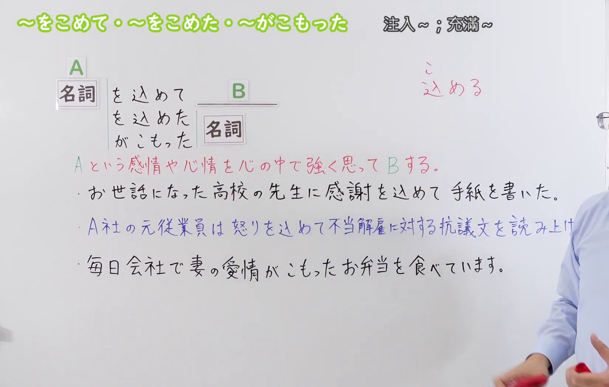
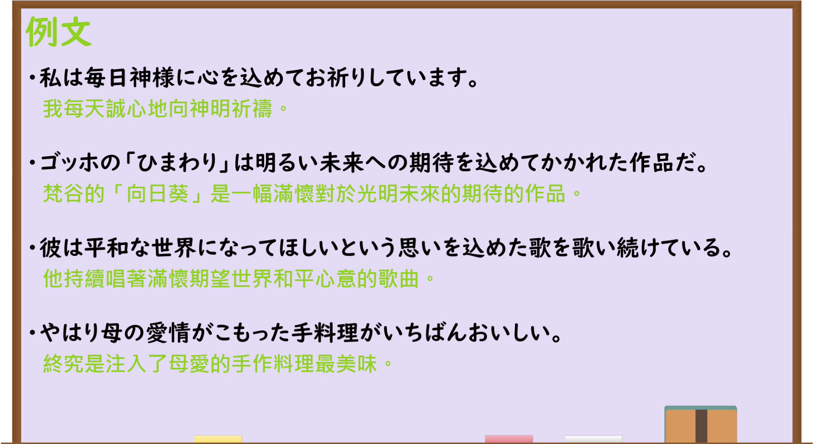

---
{
  "draft_id": "draft-20260914-n3-g-0091",
  "confirmed": true,
  "created_at": "2026-09-14",
  "proposal": {
    "id": "N3-G-0091",
    "kind": "grammar",
    "level": "N3",
    "title": "～をこめて(込めて)／～をこめた(込めた)／～がこもった：倾注、充满某种感情",
    "status": "confirmed",
    "card_revision": 1,
    "schema_version": 1,
    "created_at": "2026-09-14",
    "updated_at": "2026-09-19",
    "next_review": "2026-09-21",
    "source": {
      "lesson": "N3 第91个语法",
      "material": "出口日語原视频板书、日语字幕与独立日文教学正文",
      "video": "https://www.youtube.com/watch?v=m0pJHm6bLzQ",
      "screenshot": "assets/grammar/n3/N3-G-0091-0065.png",
      "screenshot_seconds": 65,
      "screenshot_crop": {"x": 0, "y": 0, "width": 1650, "height": 1050}
    },
    "tags": ["感情", "心意", "倾注", "状态描写", "N3"],
    "confusions": ["～をこめて与～がこもった", "～を通じて", "～をもとに", "こもる的其他用法"]
  }
}
---

# N3 第91课｜～をこめて(込めて)・～をこめた(込めた)・～がこもった

# 视频学习资料整理

按指定范围整理；学习者未提供个人原始输出或例句，不虚构理解判断。已核对播放列表第91项：标题「【Ｎ３文法】～を込めて・～がこもった」、视频 ID `m0pJHm6bLzQ`、时长06:06。本草稿已于2026-09-14确认入库，正式卡与七天复习周期已创建。

先检查[原视频00:01](https://www.youtube.com/watch?v=m0pJHm6bLzQ&t=1s)，该画面中人物遮住语义说明和部分板书例句。接续图因此改取[原视频01:05](https://www.youtube.com/watch?v=m0pJHm6bLzQ&t=65s)：原帧1920×1080，固定左上角裁为(0,0,1650,1050)，保留标题、A／B结构、三种名词接续、核心说明及三句板书例句；右缘仅保留少量人物，以免裁断第二句板书，底部裁去少量空白。未抹除、重绘或拼接。

例句图取自[原视频04:30](https://www.youtube.com/watch?v=m0pJHm6bLzQ&t=270s)，位于视频后半部分的例句页，完整显示四句课程例句及中文说明。原帧1920×1080，固定左上角裁为(0,0,1920,1050)，仅裁去底部少量边框，未重绘或拼接。

# 核心与接续

## **名词A＋をこめて(込めて)，B**

## **名词A＋をこめた(込めた)＋名词**

## **名词A＋がこもった＋名词**

总接续依照原视频板书，保留A、B和三种结构；括号中的汉字是平假名形式对应的常用写法。A是感情、心情、愿望或力量等；说话人把A强烈地倾注到B这一行为或产物中，或描述某个事物中充满A。

| 类型 | 接续规则 | 示例 |
|---|---|---|
| 名词 | 名词＋をこめて(込めて)＋后项谓语 | 感謝をこめて手紙を書く。 |
| 名词 | 名词＋をこめた(込めた)＋名词 | 思いをこめた歌。 |
| 名词 | 名词＋がこもった＋名词 | 愛情がこもった料理。 |

外部资料还列有「名词＋の＋こもった＋名词」，如「心のこもった手紙」。这是常见补充形式，但原视频总接续没有列出，故不加入上面的大号总接续。

### 场景：把强烈的感情或力量投进自己的行为或作品，或指出其中含着这种感情——多为感谢、爱，也可为愤怒或实际力量

**场景演示（自拟场景）：**
下课后的教员室，新入职的佐藤老师带来自制饼干，感谢帮她准备公开试讲的同事们。资深的田中老师和事务室的铃木老师围过来品尝，话题从饼干的味道聊到各自在信件和活动里投入的心意。

佐藤：公開授業の準備ではお世話になりました。感謝の気持ちを込めてクッキーを焼いたので、皆さんどうぞ。 
（准备公开课时承蒙照顾了。我怀着感谢的心情烤了饼干，大家请吃。）

田中：いただきます。うん、このクッキーには佐藤先生の感謝の気持ちがこもっているよ。一枚一枚丁寧に焼かれてるね。 
（我不客气了。嗯，这饼干里充满着佐藤老师的感谢之情呢。每一块都烤得很用心。）

鈴木：本当ですね。私も去年の誕生日に、生徒から一文字一文字心を込めて書いたカードをもらって、今でも宝物にしています。 
（是啊。我去年生日也收到学生一字一句用心写的卡片，到现在还是我的宝贝。）

佐藤：そういう気持ちがこもった作文やカードを読めるのが、教師の幸せですよね。 
（能读到这样充满心意的作文和卡片，就是当老师的幸福吧。）

田中：でも、気持ちを込めるのはいいことばかりじゃないよ。この前の人事評価の不公平には、部の全員で怒りを込めて抗議文を出したばかりだ。 
（不过，倾注感情也不全是好事。前阵子人事评定的不公，我们全部门才怀着愤怒提交了抗议书。）

鈴木：あの時は怖かったですよ。そうそう、うちの息子も今日の大会で力を込めてバットを振ったらホームランが出たと、喜んでいました。 
（那时候可真吓人呢。对了对了，我儿子也说今天比赛时全力挥棒打出了本垒打，高兴坏了。）

佐藤：じゃあ、明日の運動会のリレー、私も力を込めて走ります。今日は本当にありがとうございました。 
（那明天的运动会接力赛，我也全力去跑。今天真的谢谢大家了。）

# 语义边界与适用条件

1. **主动倾注与结果状态。** 「AをこめてB」聚焦行为者怀着A去做B；「Aがこもった＋名词」聚焦成品、话语或行动中能感受到A。
2. **修饰名词时用过去形。** 视频列出「Aをこめた＋名词」，表示“倾注了A的……”。若后面是谓语，则用「Aをこめて，B」。
3. **A多为不能直接看见的内容。** 常见有「心、気持ち、愛情、感謝、思い、願い、祈り、力」等。
4. **不只用于正面感情。** 感谢、爱和愿望很常见，但原视频也使用「怒り」，独立资料另有「恨み」「殺意」等负面搭配。
5. **「力をこめて」可指实际用力。** A不一定是情绪，也可以是力量；核心仍是把某种力量集中投入动作。
6. **不能只按字面理解为放进容器。** 本课重点是抽象的心意、感情或力量被倾注到行为、作品、话语等之中。

# 例句

## 原视频例句

1. 私は毎日神様に心をこめて(込めて)お祈りしています。 
   我每天都诚心向神明祈祷。
2. ゴッホの「ひまわり」は明るい未来への期待をこめて(込めて)かかれた作品だ。 
   梵高的《向日葵》是一幅倾注了对光明未来期待的作品。
3. 彼は平和な世界になってほしいという思いをこめた(込めた)歌を歌い続けている。 
   他一直唱着寄托了希望世界和平这一心愿的歌。
4. やはり母の愛情がこもった手料理がいちばんおいしい。 
   果然还是充满母爱的家常菜最好吃。

## 补充自然例句（自拟）

- 応援してくれた皆さんに、感謝の気持ちをこめて(込めて)この曲を歌います。 
  我怀着对所有支持者的感谢来唱这首歌。
- 一文字ずつ心をこめて(込めて)、カードを書きました。 
  我一字一句用心写了卡片。
- これは職人の思いがこもった作品です。 
  这是凝聚着工匠心意的作品。

# 易混项与 JLPT 考点

- **「をこめて」与「がこもった」**：前者以行为者主动投入A为中心，后者以事物中呈现出的A为中心；助词和句法位置不能互换。
- **「をこめて」与「をこめた＋名词」**：前者连接后项谓语，后者直接修饰名词。接续题常考「感謝をこめて手紙を書く／感謝をこめた手紙」。
- **～を通じて／～を通して**：表示媒介、渠道或全过程，不表示把感情倾注进去。
- **～をもとに**：表示以资料、事实或素材为基础，不强调心意或力量。
- **「こもる」的其他意思**：如「部屋に煙がこもる」「家にこもる」可表示烟气滞留或闭门不出；看到「こもる」要结合名词和语境判断，不都属于本课的感情表达。
- **助词辨析**：○愛情をこめて作る／○愛情がこもった料理；×愛情がこめて作る／×愛情をこもった料理。

# 来源与复核记录

核对日期：2026-09-14。

- [出口日語原视频](https://www.youtube.com/watch?v=m0pJHm6bLzQ)：支持名词A＋「を込めて／を込めた／がこもった」三种接续、倾注感情或心情的说明，以及正面和负面情感的板书例句与四句课程例句。
- [日本語NET「〜を込めて」](https://nihongokyoshi-net.com/2019/06/03/jlptn3-grammar-wokomete/)：复核名词＋を込めて、把感情或力量投入行为的意义，以及「愛、気持ち、心、祈り、恨み、力、願い」等常见搭配。
- [毎日のんびり日本語教師「～を込めて／を込めた／がこもった／のこもった」](https://mainichi-nonbiri.com/grammar/n3-wokomete/)：复核三种视频接续、主动倾注与状态描写的差异、负面感情也可搭配，并补充「のこもった」形式。
- [日本語教師のN1et「を込めて」](https://jn1et.com/wokomete/)：复核只接名词、「愛情・気持ち・感謝・願い・力・心」等搭配，以及「を込めて」连接后项行为的用法。

网页获取记录：Crawl4AI 0.9.3 成功读取以上三份独立日文教学正文；站内搜索页只用于发现网址，搜索摘要未作为教学证据。

字幕校对：自动字幕多次把「こめる(込める)」「こもる」及课程例句误识为同音词或错误断句；接续和例句已以清晰板书、例句页、日语讲解及独立正文交叉校正。

复核结论：原视频与三份独立正文对名词接续、倾注感情／力量的核心一致；「のこもった」仅作为视频外补充，没有混入原视频总接续。本卡已于2026-09-14确认入库，下次复习日期为2026-09-21。

**2026-09-19补充中文释义分组与场景演示：** 接续图（`assets/grammar/n3/N3-G-0091-0065.png`，原视频01:05）上方中文释义原文「注入～；充滿～」，按「；」拆出初始候选2项；例句图（`assets/grammar/n3/N3-G-0091-0270.png`，原视频04:30）为「例文」页，上方仅标题、下方逐句中译，不产生新候选。两项为同一义项的不同中文译法：板书自释仅一句「Aという感情や心情を心の中で強く思ってBする」，视频自身例句中译交叉使用二词（例4「がこもった」译「注入了母愛」，例2・3「を込めて／を込めた」译「滿懷」）；外部正文亦按整条意义处理——[毎日のんびり日本語教師](https://mainichi-nonbiri.com/grammar/n3-wokomete/)意义栏并列「充满…／怀着…／集中／倾注」、解説「愛情や感謝などの感情を物に注ぎ入れ託すことを表します」；[日本語教師ネット](https://nihongokyoshi-net.com/2019/06/03/jlptn3-grammar-wokomete/)「気持ちや力などを入れて何かをするという意味」；[日本語教師たのすけ](https://tanosuke.com/wokomete/)「～を中に入れて…感情などの気持ちを込めるときに使います」；[日本語教師のN1et](https://jn1et.com/wokomete/)意味「を入れて」。主动倾注与状态描写属三种接续式之间的视角差异，已落于语义边界第1条与易混项，非两释义间的义项差异，合并后不丢失，故合并为1组。「力を込めて」的实际用力与「怒り」等负面感情属同一义项内A的内容差异（たのすけ注意事項「気持ちの言葉が来るが、『力』は例外」），不拆组。最终组数1，场景1个（自拟场景），不编写“说话人的意图”，对话后不重复接续分析。

覆盖记录：

| 候选释义或重要要点 | 来源及支持内容 | 最终分组或正文落点 |
|---|---|---|
| 「注入～」 | 原视频01:05板书释义；视频例4中译「注入了母愛」；毎日のんびり意义栏「倾注」；N1et意味「を入れて」 | 与「充滿～」合并为唯一一组；场景落点佐藤「感謝の気持ちを込めて」、田中「怒りを込めて」、佐藤末句「力を込めて」 |
| 「充滿～」 | 原视频01:05板书释义；视频例2・3中译「滿懷」；毎日のんびり意义栏「充满…」及例15「愛がこもった手紙」中译「充满爱意的信」 | 同一组；场景落点田中「感謝の気持ちがこもっている」、鈴木「心を込めて書いたカード」、佐藤「気持ちがこもった作文」 |
| 三种接续形式 | 板书；四份来源接続栏 | 分组前的总接续与接续表；场景中自然出现，组内不重复讲解 |
| 主动倾注与状态描写的视角差异 | 卡语义边界第1条；毎日のんびり例句主动・状态对照 | 语义边界第1条与易混项第1条；场景行为者视角（佐藤做饼干、田中提抗议）与接收者视角（田中评价饼干、佐藤收尾句）各落地 |
| A多为不可见感情及常见搭配 | 板书；N1et「愛(情)・気持ち・感謝・願い・力・心」；日本語教師ネット搭配词 | 语义边界第3条；场景使用感謝・心・気持ち |
| 不只用于正面感情 | 板书例句「怒り」；毎日のんびり「『殺意』『恨み』『怒り』などの良くない語にも稀に結び付く」；たのすけ例「怒りをこめて話している」 | 语义边界第4条；场景落于田中抗议书一句 |
| 「力を込めて」可指实际用力 | たのすけ注意事項「『力』は例外」；日本語教師ネット例「力を込めて精一杯バットを振ったら」 | 语义边界第5条；场景落于铃木儿子本垒打句与佐藤收尾句 |
| 修饰名词用过去形「を込めた＋名词」 | 板书；たのすけ「名詞を修飾するときは、『NをこめたN』『～のこもったN』」 | 接续表与语义边界第2条；场景落于铃木「心を込めて書いたカード」 |
| 外部补充「のこもった」 | 毎日のんびり接続及び例3・4・7 | 保留在接续表后说明段，不混入总接续；场景不另设 |
| 助词辨析○をこめて／○がこもった | 卡易混项；各来源接続 | 易混项；场景各句助词均按核实规则使用 |
| 视频四句课程例句 | 原视频01:05板书、04:30例文页 | 例句节保持不动 |

网页获取记录（2026-09-19）：Crawl4AI 0.9.3 抓取日本語教師のN1et、毎日のんびり日本語教師、日本語教師ネット、日本語教師たのすけ四份日文正文（缓存 `work/fetch-20260919/`，不入库）；与原卡2026-09-14所列来源一致并新增たのすけ。搜索页仅用于发现网址，摘要未作为教学证据。

本次补充新增“场景”一节与本记录，未改动总接续、接续表、语义边界、例句、易混项及原有来源记录，确认日期与七天复习周期不变。
