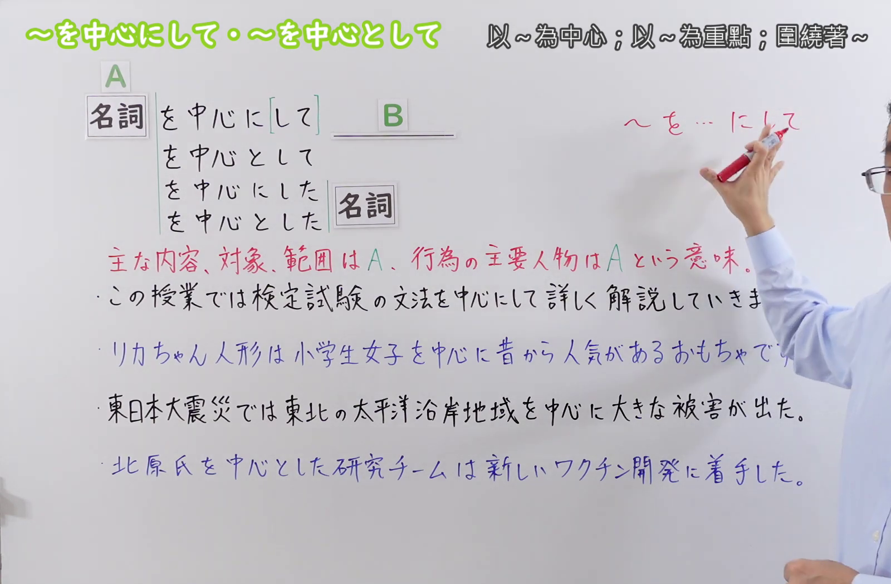
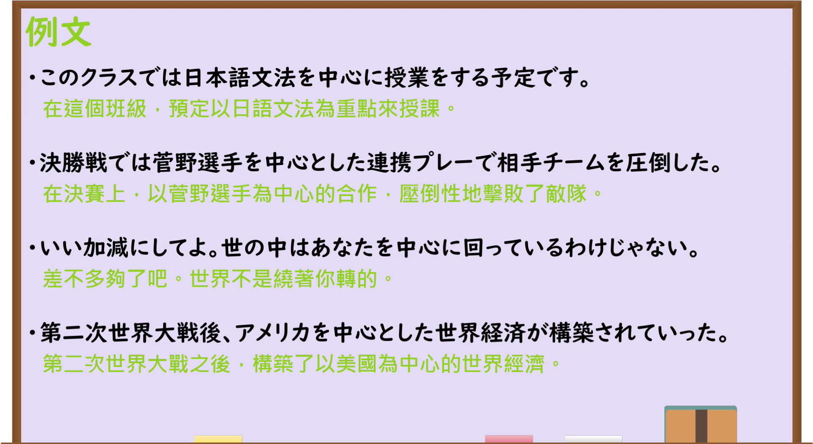

---
{
  "draft_id": "draft-20260914-n3-g-0092",
  "confirmed": true,
  "created_at": "2026-09-14",
  "proposal": {
    "id": "N3-G-0092",
    "kind": "grammar",
    "level": "N3",
    "title": "～をちゅうしんにして(中心にして)／～をちゅうしんとして(中心として)：以……为中心、重点",
    "status": "confirmed",
    "card_revision": 1,
    "schema_version": 1,
    "created_at": "2026-09-14",
    "updated_at": "2026-09-14",
    "next_review": "2026-09-21",
    "source": {
      "lesson": "N3 第92个语法",
      "material": "出口日語原视频板书、日语字幕与独立日文教学正文",
      "video": "https://www.youtube.com/watch?v=qbVQO_tP0Eo",
      "screenshot": "assets/grammar/n3/N3-G-0092-0055.png",
      "screenshot_seconds": 55,
      "screenshot_crop": {"x": 0, "y": 0, "width": 1600, "height": 1050}
    },
    "tags": ["中心", "重点", "主要对象", "范围", "N3"],
    "confusions": ["～をはじめ(として)", "～にかんして(関して)", "～をきてんに(起点に)", "中心に与中心と"]
  }
}
---

# N3 第92课｜～をちゅうしんにして(中心にして)・～をちゅうしんとして(中心として)

# 视频学习资料整理

按指定范围整理；学习者未提供个人原始输出或例句，不虚构理解判断。已核对播放列表第92项：标题「【Ｎ３文法】～を中心にして・～を中心として」、视频 ID `qbVQO_tP0Eo`、时长05:51。本草稿已于2026-09-14确认入库，正式卡与七天复习周期已创建。

先检查[原视频00:01](https://www.youtube.com/watch?v=qbVQO_tP0Eo&t=1s)，该画面中人物遮住部分语义说明和板书例句。接续图因此改取[原视频00:55](https://www.youtube.com/watch?v=qbVQO_tP0Eo&t=55s)：原帧1920×1080，固定左上角裁为(0,0,1600,1050)，保留标题、A／B结构、四种名词接续、核心说明及四句板书例句；右缘保留少量人物和手臂，以免裁断板书，底部裁去少量空白。未抹除、重绘或拼接。

例句图取自[原视频04:30](https://www.youtube.com/watch?v=qbVQO_tP0Eo&t=270s)，位于视频后半部分的例句页，完整显示四句课程例句及中文说明。原帧1920×1080，固定左上角裁为(0,0,1920,1050)，仅裁去底部少量边框，未重绘或拼接。

# 核心与接续

## **名词A＋をちゅうしんに[して](中心に[して])，B**

## **名词A＋をちゅうしんとして(中心として)，B**

## **名词A＋をちゅうしんにした(中心にした)＋名词**

## **名词A＋をちゅうしんとした(中心とした)＋名词**

总接续依照原视频板书，保留A、B、可省略的「して」和四种结构；括号中的汉字是平假名形式对应的常用写法。A是B的主要内容、对象、范围或主要人物，也可以是空间或旋转的中心；B围绕A展开，但通常不表示范围只限于A。

| 类型 | 接续规则 | 示例 |
|---|---|---|
| 名词 | 名词＋をちゅうしんにして(中心にして)＋后项谓语；「して」可省略 | 文法を中心にして復習する。／文法を中心に復習する。 |
| 名词 | 名词＋をちゅうしんとして(中心として)＋后项谓语 | 東京を中心として活動する。 |
| 名词 | 名词＋をちゅうしんにした(中心にした)＋名词 | 若者を中心にした調査。 |
| 名词 | 名词＋をちゅうしんとした(中心とした)＋名词 | 地域住民を中心としたチーム。 |

原视频用方括号标出「して」可省略，因此「名词Aを中心に，B」也是本课的核心形式；后接名词时，视频使用「にした／とした」。

# 语义边界与适用条件

1. **主要内容或重点。** 「文法を中心に授業をする」表示课程重点是语法，但不排除词汇、阅读等其他内容。
2. **主要对象或影响范围。** 「若い世代を中心に人気がある」表示在年轻人中尤其受欢迎，也可能扩展到其他人群。
3. **主要人物。** 团队、活动等围绕某人展开时，可以说「Aさんを中心に進める」。A是核心人物，不等于所有事都由A单独完成。
4. **地域或空间范围。** 「関東地方を中心に雨が降る」以关东为主要范围，影响也可能波及周边。
5. **实际空间或旋转中心。** 「地球は太陽を中心に回る」表示围绕物理中心运动，不是“把太阳当作讨论重点”。
6. **后接名词要改变形式。** 视频列出「を中心にした／を中心とした＋名词」；不能把谓语连接形式原样放在名词前。
7. **「に」和「と」的核心意义相同。** 本课两者都表示以A为中心；考试中应优先根据固定接续和后面是否为名词来选择，不必强行赋予互相排斥的含义。

# 例句

## 原视频例句

1. このクラスでは日本語文法を中心に授業をする予定です。 
   这个班计划以日语语法为重点授课。
2. 決勝戦では菅野選手を中心とした連携プレーで相手チームを圧倒した。 
   决赛中，球队凭借以菅野选手为核心的配合压倒了对手。
3. いい加減にしてよ。世の中はあなたを中心に回っているわけじゃない。 
   适可而止吧。世界又不是围着你转的。
4. 第二次世界大戦後、アメリカを中心とした世界経済が構築されていった。 
   第二次世界大战后，以美国为中心的世界经济逐步建立起来。

## 补充自然例句（自拟）

- 今回の会議では来年度の予算を中心に話し合います。 
  这次会议将重点讨论下一年度的预算。
- 駅前を中心に、新しい店が増えています。 
  以车站前一带为中心，新店正在增多。
- 地域の若者を中心としたボランティア団体が設立されました。 
  一个以当地年轻人为主的志愿者团体成立了。

# 易混项与 JLPT 考点

- **～をはじめ(として)**：从同类事物中举出具有代表性的一项，并暗示还有其他同类项；「～を中心に」强调A是重点、核心或影响最大的范围。
- **～にかんして(関して)**：表示“关于……”这一话题范围，不含某一项比其他项更核心的意思。
- **～をきてんに(起点に)**：强调路线、变化或思考的出发点；「～を中心に」强调核心及其周围展开的结构。
- **范围不是绝对排他。** 「若者を中心に人気がある」通常不是“只在年轻人中受欢迎”；JLPT阅读题常借此考察“主要是A，也可能包括A以外”。
- **后接谓语与后接名词**：中心に[して]／中心として＋谓语；中心にした／中心とした＋名词。
- **固定表达**：「世の中はあなたを中心に回っているわけじゃない」中的「中心に回る」是围绕中心旋转，可引申为“世界不是围着你转”。

# 来源与复核记录

核对日期：2026-09-14。

- [出口日語原视频](https://www.youtube.com/watch?v=qbVQO_tP0Eo)：支持名词A＋「を中心に[して]／を中心として／を中心にした＋名词／を中心とした＋名词」四种接续，以及主要内容、对象、范围、人物和物理中心的用法与四句课程例句。
- [日本語NET「〜を中心に／〜を中心として」](https://nihongokyoshi-net.com/2018/03/31/jlptn3-grammar-chuushinni/)：复核名词接续、“以某项为基点或集中重点”的意义，以及人物、地域、话题重点和旋转中心等语境。
- [毎日のんびり日本語教師「～を中心にして／を中心に／を中心として」](https://mainichi-nonbiri.com/grammar/n3-wochuushinnishite/)：复核名词＋を中心に（して）／を中心として，并支持行为核心、影响最大的范围和旋转中心三类用法。

网页获取记录：Crawl4AI 0.9.3 成功读取以上两份互相独立的日文教学正文；站内搜索页只用于发现网址，搜索摘要未作为教学证据。

字幕校对：自动字幕把「中心」「菅野選手」「東日本大震災」「太平洋沿岸地域」等多处误识为同音词或错误词语；接续和课程例句已以清晰板书、例句页、日语讲解及独立正文交叉校正。

复核结论：原视频与两份独立正文对名词接续、以A为主要内容／对象／范围／人物或物理中心的核心一致；总接续未混入视频外变体。本卡已于2026-09-14确认入库，下次复习日期为2026-09-21。
