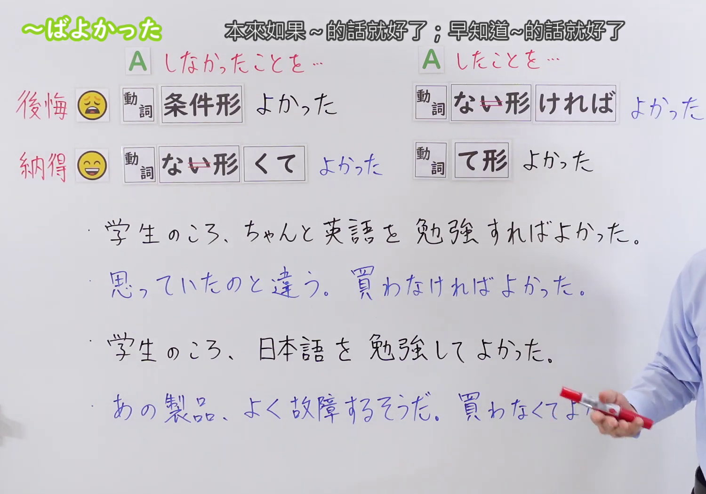
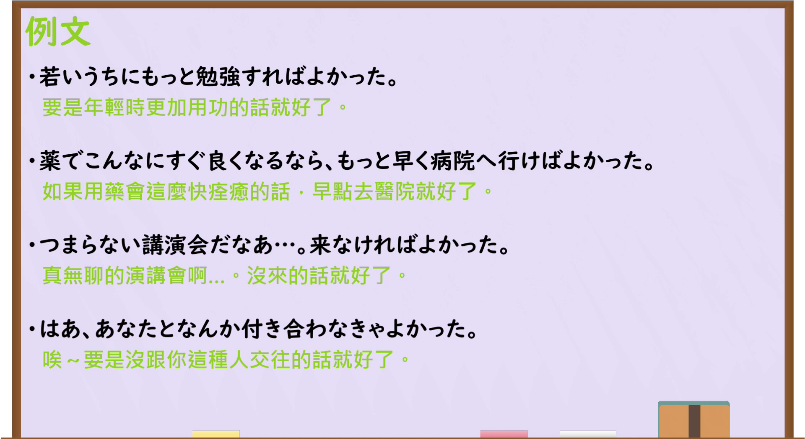

---
{
  "draft_id": "draft-20260914-n3-g-0098",
  "confirmed": true,
  "created_at": "2026-09-14",
  "proposal": {
    "id": "N3-G-0098",
    "kind": "grammar",
    "level": "N3",
    "title": "～ばよかった／～なければよかった／～てよかった／～なくてよかった：后悔与庆幸",
    "status": "confirmed",
    "card_revision": 1,
    "schema_version": 1,
    "created_at": "2026-09-14",
    "updated_at": "2026-09-20",
    "next_review": "2026-09-21",
    "source": {
      "lesson": "N3 第98个语法",
      "material": "出口日語原视频板书、日语字幕与独立日文教学正文",
      "video": "https://www.youtube.com/watch?v=anzUWUSbXVM",
      "screenshot": "assets/grammar/n3/N3-G-0098-0060.png",
      "screenshot_seconds": 60,
      "screenshot_crop": {"x": 0, "y": 0, "width": 1500, "height": 1050}
    },
    "tags": ["后悔", "庆幸", "纳得", "过去事实", "よかった", "N3"],
    "confusions": ["后悔与庆幸的事实方向", "～たらよかった", "～ばいいのに", "～なきゃよかった", "条件形与て形"]
  }
}
---

# N3 第98课｜～ばよかった・～なければよかった・～てよかった・～なくてよかった

# 视频学习资料整理

按指定范围整理；学习者未提供个人原始输出或例句，不虚构理解判断。已核对播放列表第98项：标题「【Ｎ３文法】～ばよかった」、视频 ID `anzUWUSbXVM`、时长06:39。本草稿已于2026-09-14确认入库，正式卡与七天复习周期已创建。

接续图取自[原视频01:00](https://www.youtube.com/watch?v=anzUWUSbXVM&t=60s)：原帧1920×1080，固定左上角裁为(0,0,1500,1050)，保留“后悔／纳得”对照、四种结构及四句板书例句；裁去最右侧人物区域，未抹除、重绘或拼接。

例句图取自[原视频05:40](https://www.youtube.com/watch?v=anzUWUSbXVM&t=340s)，完整显示四句课程例句及中文说明。原帧1920×1080，固定左上角裁为(0,0,1920,1050)，仅裁去底部少量边框，未重绘或拼接。

# 核心与接续

## **A【动词条件形】＋よかった**

## **A【动词ない形去い】＋ければ＋よかった**

## **A【动词て形】＋よかった**

## **A【动词ない形去い】＋くて＋よかった**

总接续依照原视频讲解顺序列出四种形式。前两种表示后悔：条件形表示实际没有做A，事后认为当时应该做A；否定条件表示实际做了A，事后认为当时不该做A。后两种表示对事实感到庆幸或认可（视频称「納得」）：て形表示实际做了A，并认为这样做是对的；「なくて」表示实际没有做A，并认为没有做是对的。

| 类型 | 接续规则 | 示例 |
|---|---|---|
| 动词 | 动词条件形＋よかった | もっと早く予約すればよかった。 |
| 动词 | 动词ない形去「い」＋ければ＋よかった | あんなことを言わなければよかった。 |
| 动词 | 动词て形＋よかった | 日本語を勉強してよかった。 |
| 动词 | 动词ない形去「い」＋くて＋よかった | その商品を買わなくてよかった。 |

### 场景一：对过去事实的后悔（实际未做 A 或做了不理想的选择）

**场景演示（自拟场景）：**
两人聊起昨天的经历和过去的选择。

田中：昨日の会議、資料もっと早く準備すればよかった。 
（昨天的会议，资料要是早点准备就好了。）

佐々木：私も昨日の講演会、来なければよかった。 
（我也是昨天的演讲会，早知道就不来了。）

田中：薬でこんなにすぐ良くなるなら、病院へもっと早く行けばよかった。 
（早知道吃药这么快就好，当时早点去医院就好了。）

佐々木：はあ、あなたとなんか付き合わなきゃよかった。 
（唉，早知道就不该和你这种人交往。）

田中：若いうちにもっと勉強すればよかったなあ。 
（年轻时要是更用功学习就好了啊。）

佐々木：私も学生のころ、ちゃんと英語を勉強すればよかった。 
（我也是学生时代要是好好学习英语就好了。）

### 场景二：对事实的庆幸或认可（实际做了 A 或未做 A 并认为正确）

**场景演示（自拟场景）：**
同事间聊起自己的选择和感受。

山田：日本語を勉強してよかった。 
（学日语真是太好了。）

鈴木：あの製品、よく故障するそうだ。買わなくてよかった。 
（听说那个产品经常出故障。幸好没买。）

山田：海外旅行に行って、世界が広がったのが分かってよかった。 
（去了海外旅行，能明白世界变广阔了真好。）

鈴木：雨降らずに済んで、家にいたままの方がよかった。 
（雨没下成，待在家里更好。）

山田：先生のアドバイス聞いて、失敗しないでよかった。 
（听了老师的建议，没失败真好。）

鈴木：あんな高い物を買わなくてよかった。 
（幸好没买那么贵的东西。）

# 语义边界与适用条件

1. **四种形式由“事实”和“评价”两条轴线组成。** 条件形／否定条件形提出与事实相反的选择，因此表示后悔；て形／なくて陈述实际发生或没有发生的事实，因此表示庆幸、安心或认可自己的选择。
2. **「～ばよかった」与「～てよかった」。** 「勉強すればよかった」表示实际没有学习，并后悔没学；「勉強してよかった」表示实际学习了，并认为学了真好。
3. **「～なければよかった」与「～なくてよかった」。** 「買わなければよかった」表示实际买了，并后悔买了；「買わなくてよかった」表示实际没买，并庆幸没买。否定外形相近，但事实预设和评价完全相反。
4. **后悔表达也可能指责他人。** 主语是对方时，「早く言えばよかった」等说法可能表示“你早说就好了”，带埋怨或非难；需结合语境判断，不一定只是说话人自责。
5. **否定条件常缩约为「～なきゃよかった」。** 如课程例句「付き合わなきゃよかった」。这是「～なければよかった」的口语形式，不能误解为表示庆幸的「～なくてよかった」。
6. **「～たらよかった／～なかったらよかった」是后悔形式的近义表达。** 它们分别对应「～ばよかった／～なければよかった」，不替代表示事实与庆幸的「～てよかった／～なくてよかった」。

# 例句

## 原视频例句

1. 若いうちにもっと勉強すればよかった。 
   年轻时要是更用功学习就好了。
2. 薬でこんなにすぐ良くなるなら、もっと早く病院へ行けばよかった。 
   早知道吃药这么快就会好，当时早点去医院就好了。
3. つまらない講演会だなあ…。来なければよかった。 
   真是无聊的演讲会啊……早知道就不来了。
4. はあ、あなたとなんか付き合わなきゃよかった。 
   唉，早知道就不该和你这种人交往。

## 原视频板书对比例句

1. 学生のころ、ちゃんと英語を勉強すればよかった。 
   学生时代要是好好学习英语就好了。（实际没有好好学，表示后悔。）
2. 思っていたのと違う。買わなければよかった。 
   和原先想的不一样。早知道就不买了。（实际买了，表示后悔。）
3. 学生のころ、日本語を勉強してよかった。 
   学生时代学了日语真是太好了。（实际学了，表示庆幸／认可。）
4. あの製品、よく故障するそうだ。買わなくてよかった。 
   听说那个产品经常出故障。幸好没买。（实际没买，表示庆幸。）

## 补充自然例句（自拟）

- 出かける前に天気予報を確認すればよかった。 
  出门前要是确认一下天气预报就好了。
- あんな高い物を買わなければよかった。 
  早知道就不买那么贵的东西了。
- 分からないことをそのままにせず、先生に聞けばよかった。 
  当时不该把不懂的地方搁着，问老师就好了。

# 易混项与 JLPT 考点

- **条件形与て形**：「～ばよかった」是假设与事实相反的选择并后悔；「～てよかった」确认实际做过的事并感到庆幸。
- **「なければ」与「なくて」**：「～なければよかった」表示实际做了，后悔做了；「～なくてよかった」表示实际没做，庆幸没做。
- **～たらよかった／～なかったらよかった**：与本课两种形式近义，分别表达“当时做了就好／当时没做就好”。
- **～ばいいのに**：多表达当前未实现的愿望、带不满的建议；「～ばよかった」明确回顾已经过去的选择。
- **口语缩约**：「来なきゃよかった」＝「来なければよかった」。不要误解为“没来真好”；后者应是「来なくてよかった」。

# 来源与复核记录

核对日期：2026-09-14。

- [出口日語原视频](https://www.youtube.com/watch?v=anzUWUSbXVM)：支持条件形＋「よかった」、否定条件＋「よかった」的后悔意义，て形＋「よかった」、否定て形＋「よかった」的纳得意义，两组事实方向对照，以及四句课程例句。
- [毎日のんびり日本語教師「～ばよかった」](https://mainichi-nonbiri.com/grammar/n3-bayokatta/)：复核动词ば形、否定「～なければよかった」、对过去行为的后悔、对他人使用时可能含非难，以及口语缩约。
- [にほんご部「～ばよかった／～たらよかった」](https://nihongobu.net/n3-bayokatta-tarayokatta/)：复核「～ばよかった／～なければよかった／～たらよかった／～なかったらよかった」四种反事实后悔表达及自然例句。

网页获取记录：Crawl4AI 0.9.3 成功读取以上两份互相独立的日文教学正文；搜索页只用于发现网址，摘要未作为教学证据。两份外部资料与出口日語课程均把本项列为N3。

字幕校对：自动字幕存在同音字和断句误识；后悔／纳得对照、两种核心接续和四句课程例句均以清晰板书、例句页、日语讲解及独立正文交叉校正。

成稿复核：大号总接续依原视频讲解顺序列出四种形式：条件形、否定条件形、て形、否定て形；接续表按四种实际接续逐行展开。后悔与纳得两组的事实方向、口语缩约、近义「たら」形式以及与第97课的区别均已单列。每张图片来自本课原视频的独立帧，图片引用有效；本草稿已于2026-09-14确认入库，下次复习日期为2026-09-21。

**2026-09-20 补充中文释义分组与场景演示：** 接续图（`assets/grammar/n3/N3-G-0098-0060.png`，原视频 01:00）上方中文释义原文「本来如果～的话就好了；早知道～的话就好了」，有「；」分隔 → 初始候选 2 项；例句图（`assets/grammar/n3/N3-G-0098-0340.png`，原视频 05:40）为「例文」页，逐句中译均为「……就好了」类型，不产生新候选。板书意义为「後悔 😣／納得 🙂」对照及四种结构，属单一语义块的两类用法（后悔 vs 庆幸）。[毎日のんびり日本語教師](https://mainichi-nonbiri.com/grammar/n3-bayokatta/) 意味「要是…的话，就好了 / 要是不…的话，就好了」；解説「過去のことに対して、そのようにするべきだったと後悔する気持ちを表す」。[にほんご部](https://nihongobu.net/n3-bayokatta-tarayokatta/) 意味「後悔している (regret) 気持ちを表す」，覆盖「～ばよかった」「～なければよかった」「～たらよかった」「～なかったらよかった」。「；」前后对应肯定/否定两种后悔形式，但均指向同一核心语义“对过去选择的后悔”；卡语义边界已明确区分后悔（条件形／否定条件形）与纳得/庆幸（て形／なくて）两类，故按板书「後悔／納得」分为 2 组，最终组数 2，场景 2 个（编号 场景一/场景二），不编写“说话人的意图”，对话后不重复接续分析。

覆盖记录：

| 候选释义或重要要点 | 来源及支持内容 | 最终分组或正文落点 |
|---|---|---|
| 「本来如果～的话就好了」 | 接续图 01:00 顶部释义前半；板书「後悔😣」面；mainichi「要是…的话，就好了」；nihongobu「後悔している気持ち」 | 场景一；全部对话落地 |
| 「早知道～的话就好了」 | 接续图 01:00 顶部释义后半；板书「後悔😣」面的否定变体；mainichi「要是不…的话，就好了」 | 场景一；全部对话落地 |
| 庆幸/认可 | 板书「納得🙂」面；卡语义边界第 1、4 条 | 场景二；全部对话落地 |
| 四种接续形式 | 板书四行接续；卡接续表四行 | 接续表与语义边界第 1—5 条；场景一自然出现「準備すれば」「来なければ」「付き合わなきゃ」「行けば」「勉強すれば」，场景二自然出现「勉強して」「買わなくて」「行って」「降らずに済んで」「聞いて」 |
| 口语缩约「～なきゃ」 | 课程例句「付き合わなきゃよかった」；卡语义边界第 5 条 | 语义边界第 5 条；场景一田中第二句自然使用「付き合わなきゃ」 |
| 后悔与庆幸的事实方向 | 卡语义边界第 1—3 条 | 语义边界第 1—3 条；场景一「来なければ」暗示实际来了、「勉強すれば」暗示实际没学，场景二「買わなくて」「買って」暗示实际未买/买了 |
| 视频四句课程例句 | 接续图 01:00 板书、05:40 例文页 | 例句节保持不动 |

网页获取记录（2026-09-20）：Crawl4AI 0.9.3 以 `crwl crawl -o markdown` 读取毎日のんびり日本語教師（`work/fetch-20260919/mainichi-bayokatta.md`）与にほんご部（`work/fetch-20260919/nihongobu-bayokatta.md`）两份日文正文，缓存不入库；场景标题的通用总结取其日文意味／解説栏。两站与出口日語课程均把本项列为 N3。搜索页仅用于发现网址，摘要未作为教学证据。

本次补充新增两个“场景”与本记录，未改动总接续、接续表、语义边界、例句、易混项及原有来源记录，确认日期与七天复习周期不变。