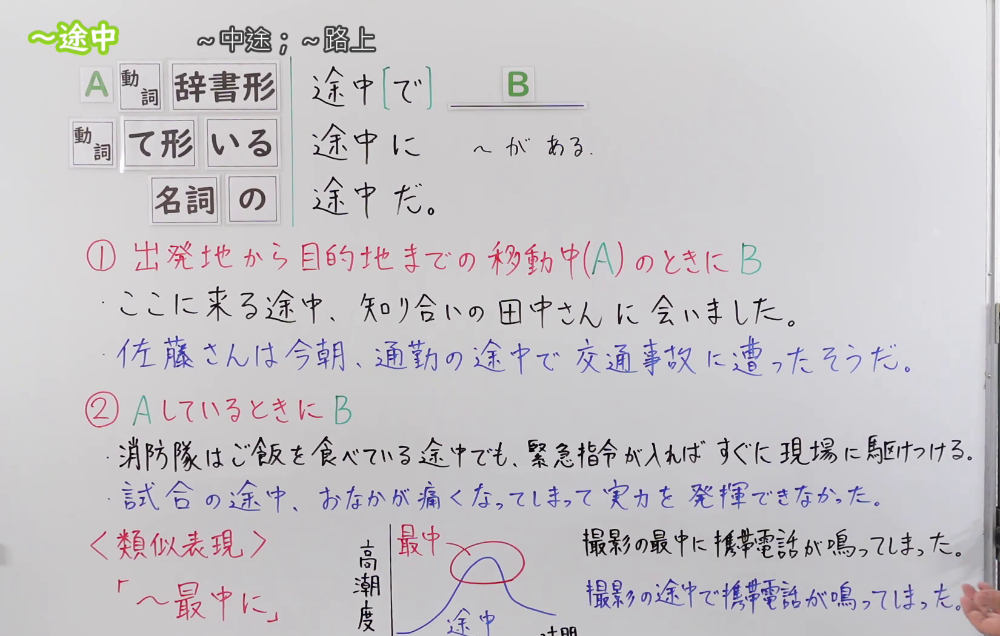

---
{
  "draft_id": "draft-20260914-n3-g-0100",
  "confirmed": false,
  "created_at": "2026-09-14",
  "proposal": {
    "id": "N3-G-0100",
    "kind": "grammar",
    "level": "N3",
    "title": "～途中：在……途中；正在……时",
    "status": "draft",
    "card_revision": 1,
    "schema_version": 1,
    "created_at": "2026-09-14",
    "updated_at": "2026-09-14",
    "source": {
      "lesson": "N3 第100个语法",
      "material": "出口日語原视频板书、日语字幕与独立日文教学正文",
      "video": "https://www.youtube.com/watch?v=7bpiJKNm1jo",
      "screenshot": "assets/grammar/n3/N3-G-0100-0300.png",
      "screenshot_seconds": 300,
      "screenshot_crop": {"x": 0, "y": 0, "width": 1650, "height": 1050}
    },
    "tags": ["途中", "移动过程", "动作进行中", "事件发生", "存在地点", "N3"],
    "confusions": ["～最中に", "途中で与途中に", "途中だ", "动词辞书形与ている", "で的省略"]
  }
}
---

# N3 第100课｜～途中

# 视频学习资料整理

按指定范围整理；学习者未提供个人原始输出或例句，不虚构理解判断。已核对播放列表第100项：标题「【Ｎ３文法】～途中」、视频 ID `7bpiJKNm1jo`、时长07:10。

接续图取自[原视频05:00](https://www.youtube.com/watch?v=7bpiJKNm1jo&t=300s)：原帧1920×1080，固定左上角裁为(0,0,1650,1050)，保留三种前接、三种后续形式、移动途中与动作进行中两类含义，以及和「～最中に」的板书对比；裁去最右侧人物区域及底部少量画面，未抹除、重绘或拼接。

例句图取自[原视频06:00](https://www.youtube.com/watch?v=7bpiJKNm1jo&t=360s)，完整显示四句课程例句及中文说明。原帧1920×1080，固定左上角裁为(0,0,1920,1050)，仅裁去底部少量边框，未重绘或拼接。

# 核心与接续

## **A【动词辞书形】＋途中[で]，B**

## **A【动词て形】＋いる＋途中[で]，B**

## **A【名词】＋の＋途中[で]，B**

## **A【动词辞书形】＋途中に＋名词＋がある**

## **A【动词て形】＋いる＋途中に＋名词＋がある**

## **A【名词】＋の＋途中に＋名词＋がある**

## **A【动词辞书形】＋途中だ。**

## **A【动词て形】＋いる＋途中だ。**

## **A【名词】＋の＋途中だ。**

总接续把原视频板书的三种前接与三种后续形式全部逐行展开，不用斜线合并。「途中[で]，B」中的方括号表示「で」可以省略。前接动作性表达，表示从开始到结束之前的某个阶段：既可指从出发地前往目的地的移动过程，也可指一项动作尚未完成的过程。

| 后续形式 | 主要作用 | 示例 |
|---|---|---|
| 途中[で]，B | 在途中发生B；「で」可省略 | 帰る途中で雨が降り出した。 |
| 途中に＋名词＋がある | 途中某处存在某物 | 駅へ行く途中に郵便局がある。 |
| 途中だ | 句末说明仍在途中／进行中 | 今、レポートを書いている途中だ。 |

# 语义边界与适用条件

1. **移动过程。** 与「行く、来る、帰る、通勤する」等移动表达搭配时，A是从出发地到目的地的路程，B是在这段路上发生的事，如「帰る途中、コンビニに寄った」。
2. **动作尚未完成的过程。** 与「食べている、書いている」或「授業、試合」等动作性表达搭配时，说明A已经开始但还没结束，B在此期间发生。
3. **「途中で」侧重事件发生。** 「で」把途中视为动作或事件发生的场合，如「授業の途中で学生が出て行った」。原视频用方括号标出「で」，表示在这类句子中可省略为「授業の途中、……」。
4. **「途中に」常标记存在地点。** 原视频单列「途中に＋～がある」，如「学校へ行く途中にスズメバチの巣がある」。这里的「に」标示某物存在于路线中的某处；不要机械换成表示事件场合的「で」。
5. **「途中だ」可以句末收束。** 它直接说明主体仍处于A的中途，如「今、準備している途中だ」，不需要再接B。
6. **动词辞书形和「ている」视角不同。** 移动动词常用辞书形表示预定路线中的途中，如「学校へ行く途中」；强调一项动作正持续进行时，常用「ている途中」，如「レポートを書いている途中」。
7. **前接名词通常要有动作或过程性。** 「授業の途中」「試合の途中」「通勤の途中」自然，因为这些名词能够展开成有起点和终点的过程；单纯状态名词通常不适合。
8. **「途中」覆盖的过程比「最中」宽。** 「途中」可以是开始后到结束前的任一阶段；「最中」强调正处于事情进行得最集中、最关键的时刻。课程用「撮影の途中で」与「撮影の最中に」对比这种焦点差异。

# 例句

## 原视频例句

1. パソコンでレポートを書いている途中、停電になってデータが消えた。 
   正在用电脑写报告时停电了，数据也消失了。
2. 授業の途中で教室をこっそり出て行く学生がいる。 
   有学生上课上到一半偷偷离开教室。
3. うちに帰る途中、コンビニに寄って夜食を買ってきた。 
   回家途中顺路去了便利店，买了夜宵回来。
4. 学校へ行く途中にスズメバチの巣があってとても危険です。 
   去学校的路上有虎头蜂窝，非常危险。

## 原视频板书例句

- ここに来る途中、知り合いの田中さんに会いました。 
  来这里的途中遇见了熟人田中先生。
- 佐藤さんは今朝、通勤の途中で交通事故に遭ったそうだ。 
  听说佐藤先生今天早晨上班途中遭遇了交通事故。
- 消防隊はご飯を食べている途中でも、緊急指令が入ればすぐに現場に駆けつける。 
  消防队即使正在吃饭，一旦接到紧急指令也会立刻赶往现场。
- 試合の途中、おなかが痛くなってしまって実力を発揮できなかった。 
  比赛进行到一半时肚子疼了，没能发挥实力。

## 补充自然例句（自拟）

- 駅へ向かう途中で、急に雨が降り出した。 
  去车站的途中突然下起了雨。
- 昼ご飯を食べている途中、会社から電話がかかってきた。 
  正吃午饭时，公司打来了电话。
- 今は引っ越しの準備をしている途中です。 
  现在正在做搬家准备。

# 易混项与 JLPT 考点

- **～最中に**：强调“正在最投入、最高潮的当口”；「途中」只要求处于开始到结束之间，范围更宽。
- **途中で与途中に**：途中发生动作或事件通常用「で」；路线中的某处有某物通常用「に＋名词＋がある」。
- **「で」的省略**：「帰る途中、友達に会った」与「帰る途中で、友達に会った」都成立；方括号「[で]」不是必须原样写入句子。
- **动词前接**：移动过程常见「行く／来る／帰る＋途中」；进行中的动作常见「～ている途中」。要根据句意选择辞书形还是「ている」。
- **途中だ**：题干到句末即可表示“还在……过程中”，不需要强行补出第二事件。
- **动作性名词＋の**：「授業の途中」「会議の途中」「試合の途中」正确；做接续题时不要漏掉「の」。

# 来源与复核记录

核对日期：2026-09-14。

- [出口日語原视频](https://www.youtube.com/watch?v=7bpiJKNm1jo)：支持动词辞书形、动词て形＋いる、名词＋の三种前接，「途中[で]，B」「途中に＋～がある」「途中だ」三种后续，以及移动中、动作进行中和「最中」对比。
- [日本語教師たのすけ「途中で・途中に」](https://tanosuke.com/tochude-tochuni)：复核动词辞书形／名词＋の接续、移动或动作尚未完成时发生另一事件、「で／に」可省略，以及事件发生常用「で」、存在地点常用「に」。
- [日本の言葉と文化「～途中」](https://nihon5-bunka.net/japanese-grammar-intermediate-tochuu/)：复核动词辞书形、名词＋の接续、动作正在进行且尚未结束的意义，以及「帰宅途中に」「準備をしている途中に」等自然用例。

网页获取记录：Firecrawl账户已认证，但当前可用额度显示为负值；依项目工作流改用本机 Crawl4AI 0.9.3，成功读取以上两份互相独立的日文教学正文。搜索页只用于发现网址，摘要未作为教学证据。两份外部资料和出口日語课程均将本项列为N3。

字幕校对：自动字幕存在同音字和断句误识；三种前接、三种后续、两类含义、「途中／最中」对比和四句课程例句均以清晰板书、例句页、日语讲解及独立正文交叉校正。

成稿复核：大号总接续将三种前接与三种后续完整展开为九行；「途中で」的事件场合、「途中に」的存在地点和句末「途中だ」均已单列，并明确了「で」可省略。每张图片来自本课原视频的独立帧，图片引用有效；当前仅为待确认草稿，未创建正式卡或复习事件。
