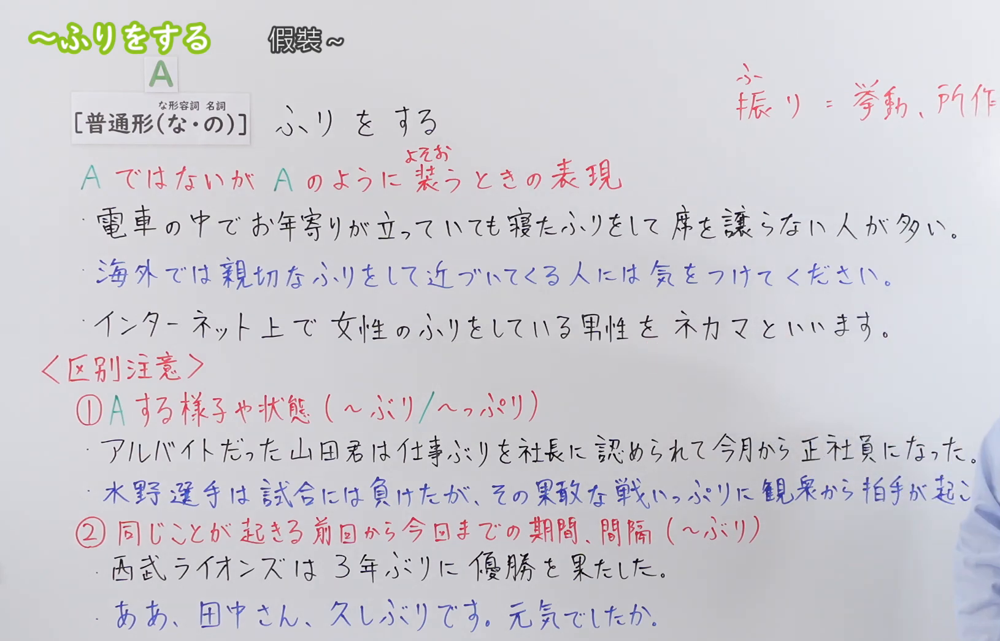
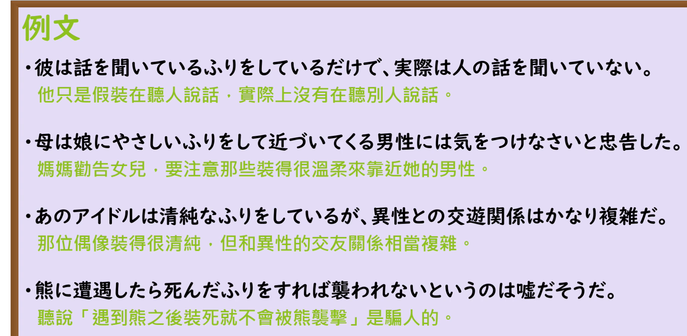

---
{
  "draft_id": "draft-20260920-n3-g-0102",
  "confirmed": false,
  "created_at": "2026-09-20",
  "proposal": {
    "id": "N3-G-0102",
    "kind": "grammar",
    "level": "N3",
    "title": "～ふりをする：假装……",
    "status": "draft",
    "card_revision": 1,
    "schema_version": 1,
    "created_at": "2026-09-20",
    "updated_at": "2026-09-20",
    "source": {
      "lesson": "N3 第102个语法",
      "material": "出口日語原视频板书、日语自动字幕与三份独立日文教学正文",
      "video": "https://www.youtube.com/watch?v=Akx9wWRHuQc",
      "screenshot": "assets/grammar/n3/N3-G-0102-0160.png",
      "screenshot_seconds": 160,
      "screenshot_crop": {"x": 0, "y": 0, "width": 1630, "height": 1045}
    },
    "tags": ["假装", "装样子", "与事实相反", "隐瞒", "N3"],
    "confusions": ["～ぶり", "～っぷり", "～ぶる", "見て見ぬふりをする", "な形容词与名词的だ"]
  }
}
---

# N3 第102课｜～ふりをする（待确认）

# 视频学习资料整理

本次只整理第102课。学习者未提供个人原始输出，不虚构理解判断。2026-09-20通过原播放列表核对第102项：标题「【Ｎ３文法】～ふりをする」、视频 ID `Akx9wWRHuQc`、时长08:17。整理前未发现本课已有草稿、正式卡或复习事件。本卡未确认入库，不启动复习。

接续图取自[原视频02:40](https://www.youtube.com/watch?v=Akx9wWRHuQc&t=160s)：原帧1920×1080，固定左上角裁为(0,0,1630,1045)。保留总接续【普通形(な・の)】ふりをする及其上方「な形容詞　名詞」标注、含义说明「A ではないが A のように装うときの表現」、板书三句例句、〈区别注意〉两栏（～ぶり／～っぷり）及右侧「ふり(振り) = 挙動、所作」，并保留板书中的「A」符号。首选00:01，该时点人物身体遮住板书右侧多行；比较前段、中段的同一板书后改用02:40，此帧人物已让开至画面最右，仅右下角留有少量衣袖，未遮住任何文字，未抹除、重绘或拼接。〈区别注意〉第①栏第二例的句尾在板书边缘被截断，未凭推测补写。

例句图取自视频后半部分的[原视频06:40](https://www.youtube.com/watch?v=Akx9wWRHuQc&t=400s)：原帧1920×1080，固定左上角裁为(0,0,1860,910)。该页为「例文」页，完整保留四句日语例句及课程中文译文，仅裁去右侧、底部多余画面，未重绘或拼接。

# 核心与接续

## **A【普通形（な・の）】＋ふりをする**

板书只有这一行总接续。「A」表示前项内容；「（な・の）」依次对应な形容词和名词的现在肯定形，板书在该括号上方另标注「な形容詞　名詞」，指明括号内的两个特殊接续只涉及这两类词。因此动词、い形容词照普通形直接接「ふりをする」；な形容词现在肯定用「な」，名词现在肯定用「の」，这两类不能用「だ」。

**核心：** 实际并非如此，却装出那种样子给别人看。板书概括为「A ではないが A のように装うときの表現」；「ふり」来自「振り」，板书注明其义为「挙動、所作」。

| 类型 | 接续规则 | 示例 |
|---|---|---|
| 动词 | 动词普通形＋ふりをする | 寝る→寝たふりをする；聞いている→聞いているふりをする；知らない→知らないふりをする |
| い形容词 | い形容词普通形＋ふりをする | 優しい→優しいふりをする |
| な形容词 | な形容词词干＋な＋ふりをする | 親切な→親切なふりをして；清純な→清純なふりをしている |
| 名词 | 名词＋の＋ふりをする | 女性の→女性のふりをしている；お客さんの→お客さんのふりをして |

四种接续都能在原视频中找到用例：「寝たふりをして」（动词た形）、「聞いているふりをしている」（动词ている形）、「親切なふりをして」「清純なふりをしている」（な形容词）、「女性のふりをしている」（名词）、「やさしいふりをして」（い形容词，见例句页）。

「ふり」也可以单独作名词使用，如板书「寝たふり」；后接「をする／をしている／をした／をすれば」等按句意变化，视频例句中就有「死んだふりをすれば」。

### 场景：事实并非如此，却故意装出那副样子给别人看

**场景演示（自拟场景）：**
田中在会议上没听懂上司对新系统的说明，却在同事面前装作全部听懂。散会后，中村在走廊里问起这件事。

田中：さっきの説明、わかったふりをしてしまったけど、実は半分も理解できなかった。 
（刚才的说明，我装作听懂了，其实连一半都没理解。）

中村：えっ、そうだったの？無理にわかったふりをしなくてもよかったのに。 
（诶，是这样吗？其实你不用硬装着听懂啊。）

田中：うん。でも、みんなの前で「わかりません」とは言いにくかったんだ。 
（嗯。可是在大家面前，我实在不好意思说“我不懂”。）

# 语义边界与适用条件

1. **表面与事实相反是核心。** 「～ふりをする」说的是前项的样子与事实不符：「寝たふりをして」表示实际并没有睡，「知らないふりをしている」表示实际知道。不能理解成真的进入了该状态。
2. **「ふり」是“样子、举止”，「ふりをする」就是做出那种样子。** 板书注明它来自「振り」，义为「挙動、所作」；与表示样态或间隔的「～ぶり／～っぷり」同源但不同词，见易混项。
3. **多用于隐瞒、回避或欺骗，少用于好的语意，但不是绝对的贬义词。** 外部资料分别写明「基本的には良い意味で使われることは少ない」「他人を欺くためや、何かを隠すために使われる」。同时也可以只是为对方着想的掩饰，如外部资料例句「美味しそうなふりをした」是为不伤对方而装出好吃的样子；本卡场景中的「わかったふり」则属于回避对自己不利的场面。
4. **接续要点：な形容词用「な」、名词用「の」，不能用「だ」。** 现在肯定形之外，否定、过去、て形等按普通形变化，如「知らないふり」「寝たふり」「聞いているふり」；い形容词现在肯定形本来不带「だ」，直接接续。
5. **后项形式按句意变化。** 本课出现「ふりをする／ふりをしている／ふりをした／ふりをすれば」；「ふり」也可作名词后接其他成分，外部资料例句中还有口语缩约「知らないふりをしてるんじゃないよ」。
6. **惯用表现「見て見ぬふりをする」。** 表示看到却装作没看见，是固定搭配，属外部资料补充，视频未出现。

# 例句与中文译文

## 原视频例句（06:40 例句页）

1. 彼は話を聞いているふりをしているだけで、実際は人の話を聞いていない。 
   他只是假装在听人说话，实际上没有在听别人说话。
2. 母は娘にやさしいふりをして近づいてくる男性には気をつけなさいと忠告した。 
   妈妈劝告女儿，要注意那些装得很温柔来靠近她的男性。
3. あのアイドルは清純なふりをしているが、異性との交遊関係はかなり複雑だ。 
   那位偶像装得很清纯，但和异性的交友关系相当复杂。
4. 熊に遭遇したら死んだふりをすれば襲われないというのは嘘だそうだ。 
   听说“遇到熊之后装死就不会被熊袭击”是骗人的。

## 原视频会話（07:14）

- 「あと、何でも知っているふりをするのはよくないです。わからないことは素直にわからないと認めた方が印象がいいですよ。」 
  “还有，装作什么都懂是不好的。不懂的地方坦率承认自己不懂，给人的印象会更好。”

会話以面试提醒为场景，其中「知っているふりをするのはよくない」与例句页第1句同属“不懂却装作懂”的用法。

# 易混项与 JLPT 考点

| 表达 | 重点 | 判断提示 |
|---|---|---|
| ふりをする | 实际并非如此，装出那种样子 | 现在肯定时な形容词用「な」、名词用「の」 |
| ～ぶり／～っぷり | 动作或状态呈现的样子与程度 | 名词＋ぶり、动词ます形＋っぷり；带浊音／半浊音 |
| ～ぶり（间隔） | 隔了某段时间又做某事 | 时间名词＋ぶり(に)，如「3年ぶりに」「久しぶり」 |
| ～ぶる（N2，外部补充） | 装出某种样子，多含贬义 | 参考来源列为类似文型，如「お金持ちぶっている」 |

- **板书〈区别注意〉的两栏：** ①「A する様子や状態」用「～ぶり／～っぷり」，视频例子为「仕事ぶり」「戦いっぷり」；②「同じことが起きる前回から今回までの期間、間隔」用「～ぶり」，视频例子为「3年ぶりに優勝を果たした」「久しぶりです」。讲解还给出区分方法：「ふり」没有浊点，「ぶり／っぷり」带浊音或半浊音。
- **接续选择：** ○知らないふりをする／×知らないだふりをする；○親切なふりをする／×親切だふりをする；○女性のふりをする／×女性ふりをする。
- **惯用：** 「見て見ぬふりをする」（视而不见、装作没看见）。
- **口语缩约：** 「ふりをしてる」是「ふりをしている」的口语形式，考试中读题时不要误判为不同文型。
- **等级：** 出口日語课程与三份外部正文均把「～ふりをする」列为 N3。

# 来源与复核记录

核对日期：2026-09-20。

- [出口日語原播放列表第102项](https://www.youtube.com/watch?v=Akx9wWRHuQc&list=PLynCeSdpMqxDS6EC0L7vXYUAVCstRHcQR&index=102)：实时核对课程序号、标题「【Ｎ３文法】～ふりをする」、视频 ID `Akx9wWRHuQc` 与时长08:17。原视频板书支持总接续【普通形(な・の)】及「な形容詞 名詞」标注、含义说明、四类词接续的实际用例、〈区别注意〉～ぶり／～っぷり两栏及例句；06:40例句页支持四句课程例句；07:14会話支持面试场景的表达。
- [日本語教師ネット「〜ふりをする」](https://nihongokyoshi-net.com/2019/11/25/jlptn3-grammar-furiwosuru/)：已读取日文正文。接续栏列 V（普通形）／イA（普通形）／ナAな／Nの 四种，与本课板书一致；意味「〜のように振舞う / 〜のように見せる」「実際は違うが、そうであるように振舞う様子を表す」；例句含「見て見ぬふりをする」「知らないふりをしてるんじゃないよ」「わかったふりをした」等；類似文型列「～ぶる」（N2）。
- [毎日のんびり日本語教師「～ふりをする」](https://mainichi-nonbiri.com/grammar/n3-huriwosuru/)：已读取日文正文。接续栏列 名詞＋の／な形容詞＋な／動詞普通形／い形容詞普通形；意味「假装…」「（本当はそうではないけど）わざと～のように装う」；解説「実際はそうではないのにも関わらず、あたかもそうであるかのように振舞うことを表します。基本的には良い意味で使われることは少ないです」；備考列惯用表现「見て見ぬふりをする」。
- [おにぎり君の日本語教室「〜ふりを する」](https://aiueo.cc/pages_v2/ja/grammar/web/255.php)：已读取日文正文。接续为 動詞／形容詞／形容動詞な／名詞の＋ふりをする；说明「実際にはそうではないが、まるでそうであるかのように振る舞う」「他人を欺くためや、何かを隠すために使われる」；其相关文法列「～ぶり」（[期間](https://aiueo.cc/pages_v2/ja/grammar/web/258.php)／[状態・様子](https://aiueo.cc/pages_v2/ja/grammar/web/259.php)），与本课板书〈区别注意〉两栏一致。

**字幕校对：** 自动字幕存在同音字和断句误识（如「動詞」被识别为「同市」、人物例句断句错位）；总接续、含义说明、四类词接续、〈区别注意〉两栏及四句课程例句均以清晰板书、例句页、日语讲解及独立正文交叉校正。

**获取及限制记录：** Crawl4AI 0.9.3 以 `crwl crawl -o markdown` 读取以上三份互相独立的日文正文，缓存放在仓库外临时目录，不入库；搜索页只用于发现网址，摘要未作为教学证据。日本語教師のN1et 的 `/furi/`、`/furiwo/` 与日本語教師のネタ帳、たのすけ 均未找到可读取的「～ふりをする」正文，故未列入来源，也未据其推断内容。

**中文释义分组：** 接续图（`assets/grammar/n3/N3-G-0102-0160.png`，原视频02:40）上方中文释义原文「假装～」，无「；／;」分隔 → 初始候选1项。三份独立正文对「ふりをする」都只给出一项释义（nihongokyoshi「〜のように振舞う／〜のように見せる」、mainichi「假装…」、aiueo「まるでそうであるかのように振る舞う」），没有需要与「假装～」区分开的第二项；「見て見ぬふりをする」「知らないふりをする」等只是同一释义在不同搭配中的实例，按合并判断不另立候选。故最终组数1，场景1个（单组不编号），不编写“说话人的意图”，对话后不重复接续分析。

覆盖记录：

| 候选释义或重要要点 | 来源及支持内容 | 最终分组或正文落点 |
|---|---|---|
| 「假装～」（接续图顶部释义，唯一候选） | 接续图02:40顶部释义；mainichi「假装…」；nihongokyoshi「〜のように振舞う／〜のように見せる」；aiueo「まるでそうであるかのように振る舞う」 | 场景（单组，不编号）；对话三句全部落地 |
| 与事实相反，装出那样子给别人看 | 板书「A ではないが A のように装うときの表現」；nihongokyoshi「実際は違うが、そうであるように振舞う様子」；mainichi 解説「実際はそうではないのにも関わらず、あたかもそうであるかのように振舞う」 | 核心段；语义边界第1、2条；场景 |
| 多用于隐瞒、欺骗或回避，少用于好的语意 | mainichi「基本的には良い意味で使われることは少ない」；aiueo「他人を欺くためや、何かを隠すために使われる」 | 语义边界第3条；场景「わかったふり」即回避不利场面 |
| 四类词接续（动词普通形／い形容词普通形／な形容词＋な／名词＋の） | 板书【普通形(な・の)】及「な形容詞 名詞」标注；nihongokyoshi、mainichi、aiueo 三份接续栏 | 接续表四行；语义边界第4条；易混项“接续选择” |
| 「ふり」作名词及后项形式变化（をする／をしている／をした／をすれば） | 板书三句例句与06:40例句页；nihongokyoshi 例句「知らないふりをしてるんじゃないよ」 | 核心与接续末段；语义边界第5条 |
| 惯用表现「見て見ぬふりをする」 | mainichi 備考；nihongokyoshi 例句（外部补充） | 语义边界第6条；易混项 |
| 板书〈区别注意〉①～ぶり／～っぷり（样子、程度）②～ぶり（间隔） | 板书两栏及四句例句；aiueo 258（〜ぶり 期間）／259（〜ぶり・っぷり 状態・様子） | 易混项；接续图说明 |
| 类似文型「～ぶる」（N2） | nihongokyoshi 類似文型（外部补充） | 易混项 |
| 四句课程例句 | 02:40板书、06:40例句页 | 例句节 |
| 会話「何でも知っているふりをするのはよくない」 | 原视频07:14 | 例句节“原视频会話” |

**成稿复核：** 大号总接续依板书写作一行【普通形（な・の）】并保留「A」符号，说明其对应关系；接续表按动词、い形容词、な形容词、名词四种实际接续逐行展开，未合并词类、未虚构类型。场景按接续图上方唯一中文释义「假装～」定为1组，含中文背景及先日语后括号中文的自拟对话，未编写“说话人的意图”，对话后无接续分析。〈区别注意〉的～ぶり／～っぷり两栏作为易混项单列，处理了板书边缘截断问题。两张图片均来自本课原视频的独立帧，时间与裁切区域如实标注，接续图残余衣袖不遮挡文字；本卡为待确认草稿，未设置正式复习日期。
