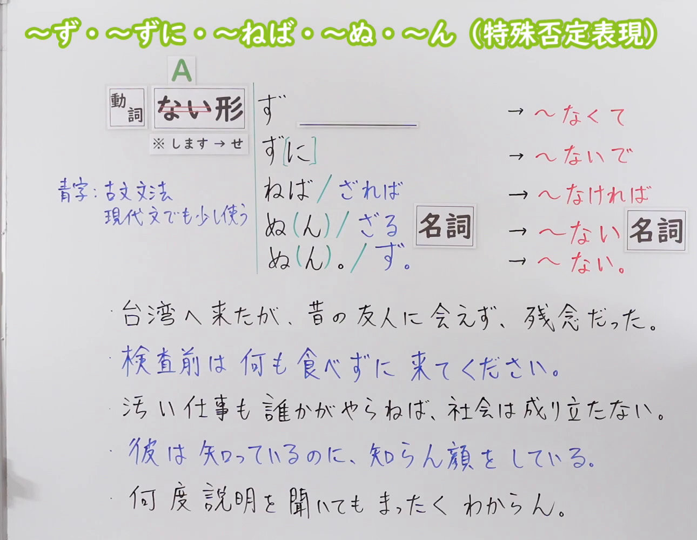
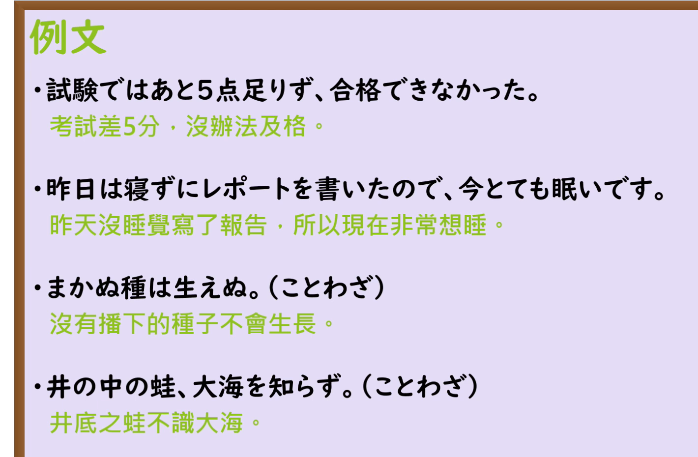

---
{
  "draft_id": "draft-20260920-n3-g-0103",
  "confirmed": false,
  "created_at": "2026-09-20",
  "proposal": {
    "id": "N3-G-0103",
    "kind": "grammar",
    "level": "N3",
    "title": "～ず・～ずに・～ねば・～ぬ(ん)（特殊否定表現）：不……／如果不……",
    "status": "draft",
    "card_revision": 1,
    "schema_version": 1,
    "created_at": "2026-09-20",
    "updated_at": "2026-09-20",
    "source": {
      "lesson": "N3 第103个语法",
      "material": "出口日語原视频板书、日语自动字幕、三份独立日文教学正文及《学研全訳古語辞典》",
      "video": "https://www.youtube.com/watch?v=M3d6ZfPL0Oo",
      "screenshot": "assets/grammar/n3/N3-G-0103-0315.png",
      "screenshot_seconds": 315,
      "screenshot_crop": {
        "x": 0,
        "y": 0,
        "width": 1290,
        "height": 1000
      }
    },
    "tags": [
      "特殊否定表現",
      "ず",
      "ずに",
      "ねば",
      "ざれば",
      "ぬ(ん)",
      "古文文法",
      "N3"
    ],
    "confusions": [
      "～ないで",
      "～なくて",
      "～なければ",
      "～ざるを得ない",
      "～ねばならない／～なければならない",
      "口语「ん」与「の(ん)」"
    ]
  }
}
---

# N3 第103课｜～ず・～ずに・～ねば・～ぬ(ん)（特殊否定表現）｜待确认

# 视频学习资料整理

本次只整理第103课。学习者未提供个人原始输出，不虚构理解判断。2026-09-20通过原播放列表核对第103项：标题「【Ｎ３文法】～ず・～ずに・～ねば・～ぬ・～ん（特殊否定表現）」、视频 ID `M3d6ZfPL0Oo`、时长07:39。整理前未发现本课已有草稿、正式卡或复习事件。本卡尚未确认，不启动复习周期。

接续图取自[原视频05:15](https://www.youtube.com/watch?v=M3d6ZfPL0Oo&t=315s)：原帧1920×1080，固定左上角裁为(0,0,1290,1000)。保留绿色大标题「～ず・～ずに・～ねば・～ぬ・～ん（特殊否定表現）」、板书中的「A」符号、「動詞」「ない形」两框与「※ します → せ」、青字「古文文法／現代文でも少し使う」、五行接续表及其红色现代日语对应列（～なくて／～ないで／～なければ／～ない＋名詞／～ない。），以及下方五句板书例句。该页是白板，**顶部没有中文释义**，只有日语的现代对应列，这一点在“来源与复核记录”中如实记录。首选00:01，该时点五句例句已写完，但「ずに」尚未补上表示可省略的方括号，且教师肩部进入画面右下角；比较前段与中段的同一板书后改用05:15，此帧「ず[に]」已补全、人物已让开至裁切区域之外，未遮住任何文字，未抹除、重绘或拼接。

例句图取自视频后半部分的[原视频06:28](https://www.youtube.com/watch?v=M3d6ZfPL0Oo&t=388s)：原帧1920×1080，固定左上角裁为(0,0,1420,930)。该页为「例文」页，完整保留四句日语例句及课程中文译文，仅裁去右侧、底部多余画面，未重绘或拼接。第3句板书原文作「まかぬ種は生えぬ」（假名），该谚语的标准汉字写法为「蒔かぬ」，本卡照录原视频文字，未改写。

# 核心与接续

## **A【動詞ない形】＋ず**

## **A【動詞ない形】＋ず[に]**

## **A【動詞ない形】＋ねば**

## **A【動詞ない形】＋ざれば**

## **A【動詞ない形】＋ぬ(ん)＋【名詞】**

## **A【動詞ない形】＋ざる＋【名詞】**

## **A【動詞ない形】＋ぬ(ん)。**

## **A【動詞ない形】＋ず。**

板书左侧写「動詞」「ない形」两个方框，下面注「※ します → せ」，这是全课唯一的接续基础；「A」表示前项内容。板书右侧用红笔给出每个形式的现代日语对应：ず→～なくて、ず[に]→～ないで、ねば／ざれば→～なければ、ぬ(ん)／ざる＋名詞→～ない＋名詞、ぬ(ん)。／ず。→～ない。。板书把「ねば／ざれば」「ぬ(ん)／ざる」「ぬ(ん)。／ず。」写成带斜杠的行，本卡按“每个可能形式单独占一行”展开，同时保留板书原有的可省略标注「[に]」与缩约标注「(ん)」。

**核心：** 这些形式都接在动词ない形（去掉「ない」）后表示否定，是日语里「ない」以外的另一套否定手段。按板书右侧的红色对应列，ず（に）相当于「～なくて／～ないで」，ねば／ざれば相当于「～なければ」，ぬ(ん)／ざる／ず相当于「～ない」。板书青字注明它们来自「古文文法」，并且「現代文でも少し使う」；教师讲解也说这一课的来源是「古文の文法」，所以「します」才变成「せず」而不是「しず」。

| 类型 | 接续规则 | 示例 |
|---|---|---|
| 动词 | 动词ない形（去掉「ない」）＋ず／ずに／ねば／ざれば／ぬ(ん)／ざる | 会えない→会えず／食べない→食べずに／やらない→やらねば／わからない→わからん |
| 动词（する） | する→せ＋ず | する→せず／せずに／せねば／せぬ／せん |
| い形容词 | 不能作前项（板书只列「動詞」） | — |
| な形容词 | 不能作前项 | — |
| 名词 | 不能作前项；只作后项，接在「ぬ(ん)／ざる」之后（连体） | 知らない→知らぬ顔／知らん顔 |

板书把「名詞」框放在「ぬ(ん)／ざる」右侧，表示这两种形式是连体用法，后面必须接名词；而「ぬ(ん)。」「ず。」后面跟句号，是结句用法。教师讲解也分别举了例子：连体是「知らん顔をしている」，结句是「まったくわからん」，并说古文里也有用「ず」结句的（「大海を知らず」）。

### 场景1：不……／没……

**场景演示（自拟场景）：**
同一个研究室的李（留学生）和佐藤（日本前辈）。早上李一脸困倦地进研究室，佐藤问起。

佐藤：李さん、眠そうだね。昨日は遅かったの？ 
（小李，你看着好困啊。昨天弄到很晚吗？）

李：はい。レポートが終わらず、夜中までパソコンの前にいました。 
（是的。报告写不完，一直在电脑前待到半夜。）

佐藤：それは大変だったね。朝ごはんは食べた？ 
（那可真辛苦啊。早饭吃了吗？）

李：いいえ、時間がなくて、何も食べずに来ました。昨日の発表会も行けず、本当に残念でした。 
（没有，没时间，什么都没吃就来了。昨天的发表会也没能去，真的很遗憾。）

佐藤：そうか。あの発表は難しかったからね。それに、こんなに寝てないと、頭が働かんよ。ぼくもコーヒーを買ってくる。 
（这样啊。那个发表挺难的。而且，这么缺觉，脑子根本不转。我也去买杯咖啡。）

### 场景2：如果不……就……

**场景演示（自拟场景）：**
李考研失败，决心再挑战一次。他把要寄给家人的信件草稿拿给同研究室的佐藤看。

李：家族に、もう一度挑戦すると伝えようと思っています。手紙の結びはこう書きました。「今度こそ、最後までやり抜かねば。」 
（我打算告诉家人，我要再挑战一次。信的结尾我这样写了：“这次一定要坚持到底。”）

佐藤：いいね。短いけど、強い決意が伝わるよ。 
（不错啊。虽然简短，但能感受到强烈的决心。）

李：それから、先生にもらった言葉も入れました。「努力を惜しまざれば、必ず道は開ける」という言葉です。 
（还有，我把老师给我的话也写进去了。就是“只要不吝惜努力，道路就一定会打开”这句话。）

佐藤：それはいい言葉だね。李さんなら、今度はきっと大丈夫だよ。 
（这话说得好。你的话，这次一定没问题。）

# 语义边界与适用条件

1. **本课所有形式都接在动词ない形上。** 板书只写「動詞」＋「ない形」，下方注「※ します → せ」。「する」变成「せ」而不是「し」，所以是「せず／せずに／せねば／せぬ／せん」，不能说成「しず」。教师讲解这一变化的原因时说，这一课来自「古文の文法」，所以变化方式与现代语稍有不同。
2. **「ず」和「ぬ」是同一个助動詞的不同活用形。** 「ず」用于中顿，「ぬ」用于连体或结句，「ん」是「ぬ」的口语形。外部资料写法一致：每日のんびり「「～ぬ」や「～ん」は動ない形に接続して否定を表すことができる助動詞です。…「～ん」はその口語形です」；日本語教師ネット把「〜ぬ」的接续写作「V（ナイ形）ない + ぬ」。
3. **「ず（に）」在现代日语里最接近「ないで／なくて」，付帯状況与原因理由两种用法都有。** 每日のんびり把「ず」的意味写作「不…就…／因为没有…而…／～しないで～」，并说明「後件には他の動作を表す動詞等が接続され、全体として「～しない状態で～する」という文を作ります。（付帯状況）」。板书例句正对应这两种用法：「会えず、残念だった」＝会えなくて（原因理由）；「何も食べずに来てください」＝何も食べないで（付帯状況）。日本語教師のN1et 也把用法写作「二者択一と付帯状況がある」。
4. **「に」可以省略。** 板书在「ずに」的「に」上加了方括号（「ず[に]」）表示可省略，括号是视频进行中补写上去的。教师讲解也说「この『に』を省略するような言い方もある」。所以「ず」与「ずに」在付帯状況的用法上意思相近，但「ず」出现在句中时更常带出原因理由。
5. **「ねば／ざれば」＝否定条件「なければ」。** 教师说「ねば」是「古い言い方」，只能接动词ない形，现在多用于书面语；「ざれば」是「完全に古文の文法」，「時々現代文でも使われます」，意思同样是「なければ」。板书例句「誰かがやらねば、社会は成り立たない」＝「誰かがやらなければ」。外部资料里每日のんびり写作「「～ねば」は古い言い方で意味も同じですが、動ない形にしか接続できない上に今では書き言葉として用いられます」。口语里最常用的是「なければ」，教师也说「もちろん『なければ』が一番多いです」。
6. **「ざれば」的构成。** 「ざる」是「ず」的连体形，「ざれ」是它的已然形，后接接续助词「ば」构成「ざれば」。《学研全訳古語辞典》的「ず」条把「ざら・ざり・○・ざる・ざれ・ざれ」列为「ず」的補助活用，并注明「連体形の「ざる」」。本课板书与讲解只把「ざれば」当作「なければ」的旧说法，未展开活用，本卡按此处理，不把外部语法细节加进总接续。
7. **「ぬ(ん)」＝「ない」，「ぬ」稍硬，「ん」是口语形。** 板书例句「彼は知っているのに、知らん顔をしている」里的「知らん顔」＝「知らない顔」，指“不知道的表情”，是惯用说法（教师说「これはちょっと慣用句的に使いますね」）。外部资料补充「知らぬが仏」，每日のんびり也写作「不…／～ない」。
8. **「ざる」是连体形，后面必须接名词。** 板书用「名詞」框标出这一点。现代日语里「ざる」多出现在 N2 句型「ざるを得ない」（外部资料补充，视频未出现）。
9. **结句用「ぬ(ん)。」或「ず。」。** 「ず」结句多见于古文（板书例句「井の中の蛙、大海を知らず」），现代口语里更常见、语气更有力的是「ん」（板书例句「まったくわからん」）；教师说「そんなのは知らん」这类说法在口语里反而用得多。
10. **语感：都比「ない」硬。** 每日のんびり写「「ない」よりもやや硬い表現です」；日本語教師ネット写「「〜ないで」と同じ意味だが、「〜ずに」の方が少し硬い」，并把「〜ぬ」的備考写作「古い表現であまり日常生活で使うことはない」。教师讲解也说明这一套是特殊否定表現，日常另有「ない」系统。
11. **谚语里保留得最多。** 板书含「知らん顔」，例句页含「まかぬ種は生えぬ」「井の中の蛙、大海を知らず」，外部资料另有「知らぬが仏」「鳴かぬなら、泣くまで待とうホトトギス」等。

# 例句与中文译文

## 原视频板书例句（05:15 板书）

课程未给出这五句的中文，以下中文为本卡译文，仅作理解参考。

1. 台湾へ来たが、昔の友人に会えず、残念だった。 
   来到了台湾，却没能见到老朋友，很遗憾。（ず＝なくて，原因理由）
2. 検査前は何も食べずに来てください。 
   检查前请什么都不要吃就来。（ずに＝ないで，付帯状況）
3. 汚い仕事も誰かがやらねば、社会は成り立たない。 
   脏活也总得有人干，否则社会就无法运转。（ねば＝なければ）
4. 彼は知っているのに、知らん顔をしている。 
   他明明知道，却装出一副不认识的样子。（ん＋名詞＝知らない顔）
5. 何度説明を聞いても、まったくわからん。 
   不管听几遍说明，还是完全不懂。（ん 结句，口语）

## 原视频例句页（06:28）

1. 試験ではあと5点足りず、合格できなかった。 
   考试差5分，没能及格。
2. 昨日は寝ずにレポートを書いたので、今とても眠いです。 
   昨天没睡觉写了报告，所以现在非常想睡。
3. まかぬ種は生えぬ。（ことわざ） 
   没有播下的种子不会生长。
4. 井の中の蛙、大海を知らず。（ことわざ） 
   井底之蛙不识大海。

第1句是「ず」带出原因理由（足りず＝足りなくて），第2句是「ずに」表付帯状況，第3句同时出现「ぬ＋名詞」与「ぬ。」结句，第4句是「ず。」结句。

## 原视频会話（06:52）

课程会話页围绕中文的「不」字位置开玩笑，其中唯一的目标形式是「わからん」。

男：ああ、もうわからん！どうして「私はあなたと結婚しない」は「我跟你不結婚」じゃないの？ 
（啊～已经搞不懂啦！为什么「私はあなたと結婚しない」不是「我跟你不結婚」？）

女：「我不跟你結婚」ですよ。 
（是「我不跟你結婚」喔。）

男：じゃあ、「結婚しない」は？ 
（那「結婚しない」是？）

女：「不結婚」ですね。 
（是「不結婚」啊。）

男：でしょう？なんで「跟」の前に「不」が出てくるの。中国語は難しいなあ…。 
（对吧？为什么「跟」的前面会出现「不」？中文好难啊…。）

会話以学习中文的日本人为场景，开头「もうわからん」就是板书第5句那种口语的「ん」结句。

# 易混项与 JLPT 考点

| 表达 | 重点 | 判断提示 |
|---|---|---|
| ず／ずに | 动词ない形＋，用于中顿；＝ないで／なくて | する→せず；「に」可省略；比「ないで」硬 |
| ぬ(ん) | 动词ない形＋，连体或结句；＝ない | する→せぬ／せん；「ん」是口语形 |
| ざる | 连体形，后面必须接名词 | する→せざる；N2「ざるを得ない」 |
| ねば | 动词ない形＋，否定条件；＝なければ | 只能接动词；今多用于书面语 |
| ざれば | 同上，古文文法，现代文偶见 | ざれ＋ば |
| ～ないで／～なくて | 现代口语的对应形式 | ないで＝付帯状況；なくて＝原因理由 |
| ～なければ | 现代口语的否定条件 | 口语中最常用，教师说「一番多い」 |

- **接续选择：** ○行かず／×行きず；○会えず／×会えないず；○せず／×しず；○知らぬ／×知らないぬ。
- **「ず」与「ずに」的取舍：** 两者都能表示“不……（就）……”，「ず」在句中更常带出原因理由（会えず、残念だった），「ずに」更明确地表示“在没有做A的状态下做B”（何も食べずに来る）。考试中若后件是表示遗憾、心情的句子，优先考虑「ず」。
- **「ん」的两个来源：** 「わからん」「働かん」的「ん」是否定助動詞「ぬ」的口语形，等于「ない」；而「行くんです」的「ん」是「の」的口语形，跟本课无关，读题时不要混同。
- **「ざる」的现代用例：** 主要在 N2 句型「ざるを得ない」（外部补充），意思与「ないわけにはいかない」相近。
- **等级差异：** 出口日語把这一课整体定为 N3。外部资料并不一致：日本語教師ネット把「〜ずに」列为 N3、把「〜ぬ」列为 N2；毎日のんびり把「～ず（に）」「～ぬ／ん」列为 N3、把「～ざるを得ない」列为 N2；日本語教師のN1et 的「ずに」页面标题印作 N４（该站文章归入 N3 文型）。本卡按出口日語课程归为 N3，考试时以题干给出的形式为准。

# 来源与复核记录

核对日期：2026-09-20。

- [出口日語原播放列表第103项](https://www.youtube.com/watch?v=M3d6ZfPL0Oo&list=PLynCeSdpMqxDS6EC0L7vXYUAVCstRHcQR&index=103)：实时核对课程序号、标题「【Ｎ３文法】～ず・～ずに・～ねば・～ぬ・～ん（特殊否定表現）」、视频 ID `M3d6ZfPL0Oo` 与时长07:39。原视频板书支持总接续八行、红色现代对应列、「※ します → せ」、青字「古文文法／現代文でも少し使う」及五句板书例句；06:28例句页支持四句课程例句与中文译文；06:52会話页支持「わからん」的口语用例。教师讲解支持「ず＝なくて（原因理由）」「ずに＝ないで（付帯状況）」「ねば＝なければ（条件）」「ざれば＝完全に古文、時々現代文でも」「ぬ(ん)＝ない、連体与结句」等说明。
- [毎日のんびり日本語教師「～ず（に）」](https://mainichi-nonbiri.com/grammar/n3-zu/)：已读取日文正文。接続「動詞ない形＋ず（に）」；意味「不…就…／因为没有…而…／～しないで～」；解説「「ず」は動詞ない形に接続して、否定を表します。「ない」よりもやや硬い表現です。後件には他の動作を表す動詞等が接続され、全体として「～しない状態で～する」という文を作ります。（付帯状況）口語では「～ないで」が用いられます。「する」の場合は「しず」ではなく、「せず」になります。」
- [毎日のんびり日本語教師「～ぬ／ん」](https://mainichi-nonbiri.com/grammar/n3-nu/)：已读取日文正文。接続「動ない形＋ぬ／動ない形＋ん」；意味「不…／～ない」；解説「「～ぬ」や「～ん」は動ない形に接続して否定を表すことができる助動詞です。「～ぬ」はやや硬い表現で、「～ん」はその口語形です。※「する」は「せぬ／せん」になります。」；例文含「知らぬが仏」「さっぱり分からんから私に聞かないで」「気にせんでいいよ」。
- [毎日のんびり日本語教師「～なければならない／…／ねばならぬ」](https://mainichi-nonbiri.com/grammar/n3-nakerebanaranai/)：已读取日文正文。列「～ねばならない／～ねば」；解説「「～ねば」は古い言い方で意味も同じですが、動ない形にしか接続できない上に今では書き言葉として用いられます。「する」に接続するときは「せねばならぬ」になります。」
- [毎日のんびり日本語教師「～ざるを得ない」（Ｎ２）](https://mainichi-nonbiri.com/grammar/n2-zaruwoenai/)：已读取日文正文。接続「動ない形＋ざるを得ない」「※「する」は「～せざるを得ない」になります。」；解説「多くは書き言葉として用いられ」。用于说明「ざる」是连体形、现代用例多在该句型。
- [日本語教師ネット「〜ずに」（N3）](https://nihongokyoshi-net.com/2019/02/23/jlptn3-grammar-zuni/)：已读取日文正文。意味「〜しないで」「「〜ないで」と同じ意味だが、「〜ずに」の方が少し硬い。」；接続「V(ない形)~~ない~~ + ずに」，例「行かない→行かずに」「飲まない→飲まずに」「※「する」は「せずに」となる。」；JLPT レベル N3；類似文型「〜ないで」。
- [日本語教師ネット「〜ぬ」（N2）](https://nihongokyoshi-net.com/2019/07/30/jlptn2-grammar-nu/)：已读取日文正文。意味「〜ない」；接続「V（ナイ形）~~ない~~ + ぬ」「※「する」は「せぬ」となる」；JLPT レベル N2；備考「古い表現であまり日常生活で使うことはない」。
- [日本語教師のN1et「ずに」](https://jn1et.com/zuni/)：已读取日文正文。接続「Vナイ＋ずに」；用法「１．二者択一と付帯状況がある／２．ずに＝昔のない形」；比較文型「「ないで」と「ずに」は用法は同じだが、ズニはより硬い表現」；例文「ごはんを食べずにダイエットすると、体に悪い」「噛まずに食べたら太るよ」。
- [Weblio古語辞典（学研全訳古語辞典）「ず」](https://kobun.weblio.jp/content/ず)：已读取日文正文。《接続》活用語の未然形に付く。〔打消〕…ない。…ぬ。；(2)「連体形の「ざる」」；「「ず」の補助活用「ざら・ざり・○・ざる・ざれ・ざれ」」。用于核对「ざる」是连体形、「ざれば」由「ざれ」＋「ば」构成。

**字幕校对：** 自动字幕存在同音字和断句误识（如「動詞」被识别为「同市」、「ない形」被识别为「内径のない」、「ねば」被识别为「ネバー」、「ぬ」被识别为「猫」）。总接续、红色对应列、五句板书例句、四句课程例句与中文译文，均以清晰板书、例句页、会話页和独立正文交叉校正。

**获取及限制记录：** Crawl4AI 0.9.3 以 `crwl crawl -o markdown` 读取以上互相独立的日文正文与《学研全訳古語辞典》，缓存放在仓库外临时目录，不入库；搜索页只用于发现网址，摘要未作为教学证据。**「ざれば」没有找到专门讲解它的现代日语教学正文**：目前的支持来自原视频板书与教师讲解（「完全に古文の文法」「時々現代文でも使われます」「同じようになければという意味」），以及《学研全訳古語辞典》「ず」条所列的補助活用「ざれ」。每日のんびり与日本語教師ネット的检索页均无「ざれば」正文；Bing 检索未取回可读取结果。本卡因此不把「ざれば」的单独立项释义写成外部结论，只按板书与讲解处理。

**中文释义分组：** 接续图（`assets/grammar/n3/N3-G-0103-0315.png`，原视频05:15）是白板，**顶部没有中文释义**，只有绿色大标题「～ず・～ずに・～ねば・～ぬ・～ん（特殊否定表現）」和红笔的现代日语对应列。按规则如实记录“照片没有中文释义”，改以课程讲解与独立正文建立候选项：

- 候选1「不……／没……」：板书红色对应列的「～なくて／～ないで／～ない」；毎日のんびり「～ず（に）」意味「不…就…／因为没有…而…／～しないで～」；毎日のんびり「～ぬ／ん」意味「不…／～ない」；日本語教師ネット「〜ずに」意味「〜しないで」；日本語教師ネット「〜ぬ」意味「〜ない」；日本語教師のN1et「ずに」用法「二者択一と付帯状況」。
- 候选2「如果不……就……」：板书红色对应列的「～なければ」；教师讲解「条件型否定の条件型と同じ」「同じようになければという意味」；毎日のんびり「～ねば」解説。
- 候选3（讨论后不单立）「因为没有……而……」：毎日のんびり把「因为没有…而…」与「不…就…」并列给出。判断：「ず」与「ぬ」是同一个助動詞的不同活用形，「ず／ずに」的差别属于付帯状況与原因理由的用法差异，按「防止过细」（不得按接续或用例切分）并入候选1，其用法差异落到语义边界第3、4条与易混项，不另立组。

最终组数2：组1「不……／没……」对应板书中的ず／ずに／ぬ(ん)／ざる／ず。，组2「如果不……就……」对应板书中的ねば／ざれば。场景2个，分别编号；未编写“说话人的意图”，对话后不重复接续分析。

覆盖记录：

| 候选释义或重要要点 | 来源及支持内容 | 最终分组或正文落点 |
|---|---|---|
| 「不……／没……」（候选1，无照片中文释义时的主释义） | 板书红色对应列～なくて／～ないで／～ない；毎日のんびり「～ず（に）」意味与「～ぬ／ん」意味；日本語教師ネット「〜ずに」「〜ぬ」；N1et 用法 | 总接续八行；接续表；语义边界1—4、7；组1场景 |
| 「不…就…／～しないで～」（付帯状況） | 毎日のんびり 解説「～しない状態で～する」；N1et「二者択一と付帯状況」；板书例句「何も食べずに来てください」 | 语义边界第3、4条；组1场景「何も食べずに来ました」 |
| 「因为没有…而…」（原因理由，讨论后并入候选1） | 毎日のんびり 意味「因为没有…而…」；板书例句「会えず、残念だった」 | 语义边界第3条；不单立组 |
| 「如果不……就……」（候选2） | 板书红色对应列～なければ；教师讲解；毎日のんびり「～ねば」解説 | 组2场景；语义边界第5条 |
| 「ねば」是古い言い方、只接动词ない形、今多用于书面语 | 教师讲解；毎日のんびり「～ねば」解説；板书青字「古文文法／現代文でも少し使う」 | 语义边界第5条；易混项 |
| 「ざれば」＝古文文法，现代文偶见，＝なければ | 板书「ざれば」与红色对应列；教师讲解；《学研全訳古語辞典》補助活用「ざれ」 | 总接续单列一行；语义边界第5、6条；组2场景 |
| 「する」→せず／せぬ／せん | 板书「※ します → せ」；教師講解；毎日のんびり「～ず（に）」「～ぬ／ん」；日本語教師ネット両頁 | 接续表“动词（する）”行；语义边界第1条；易混项接续选择 |
| 「ぬ(ん)」连体与结句两种位置 | 板书「名詞」框与「ぬ(ん)。」；教師講解「知らん顔」「まったくわからん」 | 总接续两行；接续表“名词”行说明；语义边界第2、7、9条 |
| 「ざる」是连体形，后接名词 | 板书「名詞」框；《学研全訳古語辞典》「連体形の「ざる」」；毎日のんびり「～ざるを得ない」（外部补充） | 接续表“名词”行；语义边界第8条；易混项 |
| 「ん」是「ぬ」的口语形，且与「の(ん)」无关 | 毎日のんびり「～ぬ／ん」解説；教師講解口语用例 | 语义边界第2、9条；易混项「ん的两个来源」 |
| 比「ない」硬的书面语语感 | 毎日のんびり「やや硬い表現」；日本語教師ネット「少し硬い」「古い表現であまり日常生活で使うことはない」 | 语义边界第10条 |
| 谚语与惯用（知らぬが仏／まかぬ種は生えぬ／井の中の蛙、大海を知らず／知らん顔） | 板书五句例句；06:28例句页两句谚语；日本語教師ネット与毎日のんびり例句 | 例句节；语义边界第11条 |
| 五句板书例句、四句例句页例句、会話页「わからん」 | 原视频05:15、06:28、06:52 | 例句节三段 |
| 等级不一致（N3／N2／N4） | 出口日語课题；日本語教師ネット；毎日のんびり；N1et 页面标题 | 易混项“等级差异” |

**成稿复核：** 大号总接续按板书逐行展开为八行，每个可能形式单独占一行，保留板书原有的「[に]」可省略标注与「(ん)」缩约标注，未用斜杠把多个形式串在同一行；板书用斜杠写的行在本节文字中说明了对应关系。接续表按动词、动词（する）、い形容词、な形容词、名词逐行列出，未合并词类，并把「名詞」只作后项的事实写明。接续图是白板、没有中文释义，已在“视频学习资料整理”和“中文释义分组”两处如实记录，候选项改为由课程讲解与独立正文建立并逐一注明依据。场景按最终2组各配一个，共2个并编号，含中文背景与先日语后括号中文的自拟对话，未编写“说话人的意图”，对话后无接续分析。「ざれば」缺少专门的外部教学正文，已在“获取及限制记录”中列明。两张图片均来自本课原视频的独立帧，时间与裁切区域如实标注，接续图与例句图均无人遮挡文字。本卡尚未确认，不启动七天复习周期。
