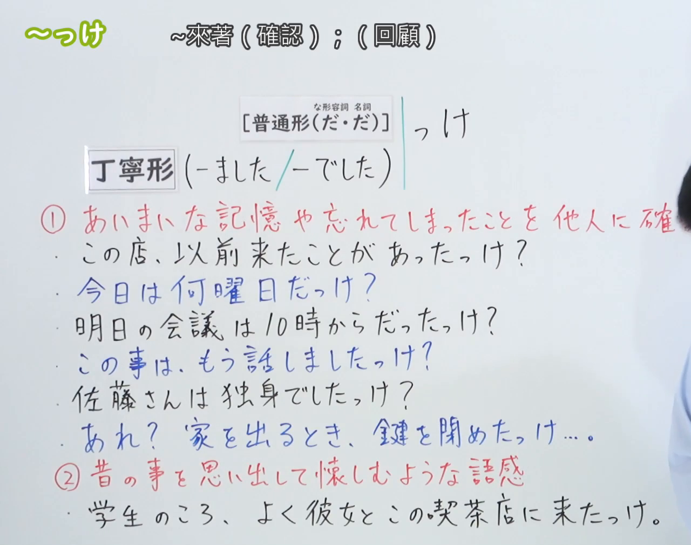

---
{
  "id": "N3-G-0033",
  "kind": "grammar",
  "level": "N3",
  "title": "～っけ：确认记忆；回想往事",
  "status": "confirmed",
  "card_revision": 1,
  "source": {
    "lesson": "N3 第33个语法",
    "material": "出口日語日语字幕、0:01接续板书、6:40例句画面及独立日文教学资料复核",
    "video": "https://www.youtube.com/watch?v=1cKMQnOY1Gw",
    "screenshot": "assets/grammar/n3/N3-G-0033-0001.png",
    "screenshot_seconds": 1,
    "screenshot_crop": {
      "x": 0,
      "y": 0,
      "width": 1280,
      "height": 1010
    }
  },
  "tags": [
    "记忆确认",
    "回想",
    "口语",
    "N3"
  ],
  "confusions": [
    "だっけ与だったっけ",
    "ましたっけ与でしたっけ",
    "い形容词接续",
    "确认与回想"
  ],
  "schema_version": 1,
  "created_at": "2026-09-11",
  "updated_at": "2026-09-11",
  "next_review": "2026-09-18"
}
---

# N3 第33课｜～っけ（已入库）

# 视频学习资料整理

根据学习者指定的出口日語第33课整理。学习者尚未提供本课个人理解或例句，以下内容不作为学习者原始输出。学习者于2026-09-11明确确认入库。

[原视频0:01](https://www.youtube.com/watch?v=1cKMQnOY1Gw&t=1s)：普通形、な形容词／名词的「だ」及「ました／でした」接续清晰。右侧第一项含义说明的末尾被老师遮挡，不影响接续确认。原帧1920×1080，固定左上角，将右下角收至(1280, 1010)，保留接续及可见例句，裁去右侧多余人物区域和底部余白，未重绘或补字。

[打开裁切截图](../../assets/grammar/n3/N3-G-0033-0001.png)

# 核心与接续

**～っけ？：……来着？用于回忆、确认自己记不清的事情。**

**～たっけ。也可回想往事，表达“以前……啊”的感慨。**

确认用法的基本接续是普通形＋っけ。按词类展开：

| 类型 | 接续规则 | 示例 |
|---|---|---|
| 动词 | 动词辞书形／た形＋っけ | 行くっけ？／行ったっけ？ |
| 动词否定 | 动词ない形／なかった形＋っけ | 行かないっけ？／行かなかったっけ？ |
| い形容词 | い形容词普通形＋っけ；常用「い→かった＋っけ」 | 高かったっけ？／高くなかったっけ？ |
| な形容词 | な形容词词干＋だ／だった＋っけ | 静かだっけ？／静かだったっけ？ |
| 名词 | 名词＋だ／だった＋っけ | 休みだっけ？／休みだったっけ？ |

普通形范围依据原视频与[日本語NET](https://nihongokyoshi-net.com/2019/01/23/jlptn3-grammar-kke/)；な形容词、名词的「だ／だった」及い形容词常用「かった」参照[日本語教師たのすけ](https://tanosuke.com/kke/)。

- い形容词普通形也包括「高い／高くない」；口语可接「っけ」，本课例句优先掌握更常见的「高かったっけ／高くなかったっけ」。不加「だ」：× 高いだっけ。
- な形容词、名词的否定用「じゃない／じゃなかった＋っけ」，例如「休みじゃなかったっけ？」。不要写成「静かなっけ」。
- 小「っ」是「っけ」的一部分：「行った＋っけ→行ったっけ」；「休みだった＋っけ→休みだったっけ」。

礼貌体另列，保留视频形式：

| 类型 | 接续规则 | 示例 |
|---|---|---|
| 动词礼貌体 | 动词ました形＋っけ | 話しましたっけ？ |
| な形容词／名词礼貌体 | な形容词词干／名词＋でした＋っけ | 静かでしたっけ？／先生でしたっけ？ |

先掌握「ましたっけ／でしたっけ」，不要把本课规则扩展成任意礼貌体后都能加「っけ」。这些形式见原板书及[絵でわかる日本語的礼貌体补充](https://www.edewakaru.com/archives/7584420.html)。

# 语义边界

1. **确认记忆，而非单纯索取全新信息。** 常用于曾经知道、听说过，现在记不清的事；也可以核对自己已有的记忆，不要求真的完全忘记。可问别人，也可自言自语。参照[日本語NET](https://nihongokyoshi-net.com/2019/01/23/jlptn3-grammar-kke/)与[日本語教師のN1et](https://jn1et.com/kke/)。
2. **「だった／でした」不一定表示事情发生在过去。** 视频用“明天的会议几点开始”说明：说话人是在回想先前知道的安排，所问的事情仍可能在未来。不能仅凭「だったっけ」就把中文译为“以前是……吗”。
3. **回想用法不一定在提问。** 说起旧事、感到怀念时，可以用「昔／子供のころ／よく＋动词た形＋っけ」。此时通常不期待别人给答案，也不要每句都翻成疑问句。原课程及[N1et的回想用法](https://jn1et.com/kke/)均有说明。
4. **属于口语。** 「ましたっけ／でしたっけ」比普通形客气，但仍带会话语气；需要正式、稳妥地询问信息时，可用一般的「～ですか／～ますか」或合适的礼貌问法。参照[絵でわかる日本語](https://www.edewakaru.com/archives/7584420.html)。
5. **语调帮助区分意图。** 问别人确认时常上扬，独自回想时常下降；仍要结合上下文判断，不把自言自语全部归为怀旧。参照[たのすけ](https://tanosuke.com/kke/)及[絵でわかる日本語](https://www.edewakaru.com/archives/7584420.html)。

# 课程例句

以下两句对照[视频末段6:40例句画面](https://www.youtube.com/watch?v=1cKMQnOY1Gw&t=400s)核对，日文保留画面写法，中文为整理译文。

> 上田さんのお兄さんは大学の教授でしたっけ？
>
> 上田先生的哥哥是大学教授来着？

「教授＋でした＋っけ」：以较客气的口语确认记忆；不必理解为问他过去的职业。

> 昔、この公園で友達と暗くなるまで遊んだっけ。
>
> 以前在这个公园里，总和朋友玩到天黑啊。

「遊んだ＋っけ」：回想旧事、带有怀念，并非在问“到底有没有玩过”。

# 自然例句（自拟）

> 明日の集合時間は九時だったっけ？
>
> 明天集合的时间是九点来着？

> あれ、この書類はもう送りましたっけ？
>
> 咦，这份文件我已经发过了吗？

> この店のランチは、そんなに高かったっけ？
>
> 这家店的午餐有那么贵来着？

> あれ、電気を消したっけ……。
>
> 咦，我关灯了没有来着……

最后一句是自言自语地确认刚才做过的事，不是回想值得怀念的旧事。

# 易混项与 JLPT 考点

| 表达 | 重点 |
|---|---|
| ～っけ？ | 回忆、确认已有的信息，带“……来着”的语气 |
| ～ですか？／～ますか？ | 一般询问，本身不表示记忆模糊 |
| 昔、よく～たっけ。 | 回想往事，可以不期待回答 |

- な形容词、名词的现在肯定接「だっけ」，不是「なっけ」；い形容词不加「だ」。
- 礼貌体重点是「ましたっけ／でしたっけ」。
- 「だっけ／だったっけ」在确认现在的信息时可以重叠使用，但不代表所有语境下「だ／だった」都没有时间差异。
- 有「明日」的句子仍可用「だったっけ」，关键是回想先前知道的安排。
- 根据上下文及语调区分确认和回想，不只看有没有问号。

# 来源与复核记录

核对日期：2026-09-11。复用原视频与播放列表缓存，重新检索、阅读日文教学正文并重新成稿，没有恢复已删除的试点草稿。

| 来源 | 核对内容 |
|---|---|
| [出口日語第33课](https://www.youtube.com/watch?v=1cKMQnOY1Gw) | 日语字幕、0:01普通形和礼貌体板书、确认与回想两种用法、6:40例句原文 |
| [日本語NET：～っけ](https://nihongokyoshi-net.com/2019/01/23/jlptn3-grammar-kke/) | 四类词普通形接续、ました／でした、确认记忆及自言自语 |
| [日本語教師たのすけ：っけ](https://tanosuke.com/kke/) | な形容词／名词的だ・だった、い形容词かった、否定例句与口语语调 |
| [日本語教師のN1et：っけ](https://jn1et.com/kke/) | 确认与回想的区分、回想用动词た形、确认并不要求实际忘记 |
| [絵でわかる日本語：〜っけ](https://www.edewakaru.com/archives/7584420.html) | 自问与问他人、口语礼貌体、语调补充 |

- 播放列表缓存第33项的视频ID为「1cKMQnOY1Gw」，标题吻合；成稿前检查本课没有正式卡或确认事件。
- 0:01接续完整，保持该时间；仅右侧含义说明末尾被遮挡。裁切后再次检查，接续与可见例句保留。
- 字幕把「っけ」多次识别为「け／系」、把「普通形」识别为「普通系」；已依板书校正。末段「花たっけ」实际为「払ったっけ」，已由6:40画面确认，未将错字带入课程例句。
- 接续资料详略有别：原视频、日本語NET及N1et给出较宽的普通形范围；たのすけ与絵でわかる日本語重点列い形容词「かった」。卡片保留普通形范围，同时突出「かった」这一常用形式，不把简表误读为其他形式一律错误。
- 原课程用「判明の過去」解释现在／未来也能出现「だった」。卡片以“回想先前知道的信息”说明实际用法，不将所有过去形都归成同一种意义。
- 写完后复核词形、促音「っ」、礼貌体、现在／未来的译文、确认与怀旧的区别及例句来源；没有尚未解决的关键接续疑点。
- 已于2026-09-11确认入库，下次复习为2026-09-18。截图保存为标准Markdown引用；现有iPad阅读器暂不显示图片，可通过图片文件链接查看。
