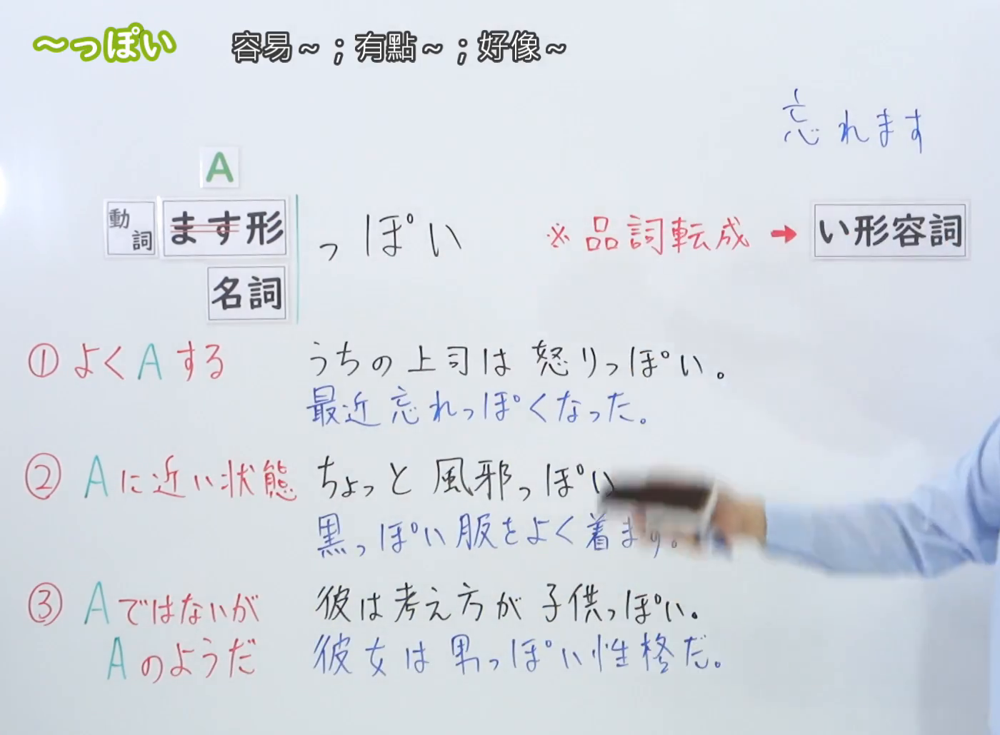

---
{
  "id": "N3-G-0034",
  "kind": "grammar",
  "level": "N3",
  "title": "～っぽい：容易……；有点……；像……",
  "status": "confirmed",
  "card_revision": 1,
  "source": {
    "lesson": "N3 第34个语法",
    "material": "出口日語日语字幕、00:30接续板书、06:10例句画面及独立日文教学资料复核",
    "video": "https://www.youtube.com/watch?v=q9hzJsLMqbk",
    "screenshot": "assets/grammar/n3/N3-G-0034-0030.png",
    "screenshot_seconds": 30,
    "screenshot_crop": {
      "x": 0,
      "y": 0,
      "width": 1400,
      "height": 1030
    }
  },
  "tags": [
    "倾向",
    "近似状态",
    "典型特征",
    "い形容词活用",
    "N3"
  ],
  "confusions": [
    "动词ます形去ます",
    "名词接续",
    "接续后按い形容词活用",
    "～やすい",
    "～らしい",
    "～気味"
  ],
  "schema_version": 1,
  "created_at": "2026-09-12",
  "updated_at": "2026-09-12",
  "next_review": "2026-09-19"
}
---

# N3 第34课｜～っぽい（已入库）

# 视频学习资料整理

根据学习者指定的出口日語第34课整理。学习者尚未提供本课个人理解或例句，以下内容不作为学习者原始输出。学习者于2026-09-12明确确认入库。

0:01画面能看清两种核心接续，但老师遮住了右侧“い形容詞”的部分文字。按照截图遮挡处理流程，改用[原视频00:30](https://www.youtube.com/watch?v=q9hzJsLMqbk&t=30s)：此时“动词ます形去ます／名词＋っぽい”及“接续后按い形容词活用”均完整可见。原帧1920×1080，固定左上角，将右下角收至(1400, 1030)，裁去右侧人物主体和底部空白，保留接续及必要板书，未拼接、重绘或补字。

[打开裁切截图](../../assets/grammar/n3/N3-G-0034-0030.png)

# 核心与接续

**～っぽい：容易……；有点……；带有……的感觉；像……。**

本课先掌握两种核心接续：

| 类型 | 接续规则 | 示例 |
|---|---|---|
| 动词 | 动词ます形去ます＋っぽい | 忘れます→忘れっぽい／怒ります→怒りっぽい／飽きます→飽きっぽい |
| 名词 | 名词＋っぽい | 子供っぽい／黒っぽい／水っぽい |

以上两种接续与原视频板书一致，并由[ヤトモンキー先生の日本語](https://yatomonkey-nihongo.com/entry/jlpt-n3-2)和[日本語NET](https://nihongokyoshi-net.com/2018/05/29/jlptn2-grammar-ppoi/)交叉核对。

外部资料还常列出：

| 补充类型 | 接续规则 | 示例 |
|---|---|---|
| 部分い形容词 | い形容词去い＋っぽい | 安い→安っぽい |

这一接续能使用的词有限，不要把任意い形容词都这样变形。例如「安っぽい」很常见，但一般不说「長っぽい」。词语限制见[毎日のんびり日本語教師](https://mainichi-nonbiri.com/grammar/n2-ppoi/)和[日本語教師のN1et](https://jn1et.com/ppoi/)。

「っぽい」接上去后，整体按い形容词活用：

| 用途 | 形式 | 示例 |
|---|---|---|
| 句末 | ～っぽいです | 子供っぽいです |
| 修饰名词 | ～っぽい＋名词 | 黒っぽい服 |
| 否定 | ～っぽくない | 子供っぽくない |
| 过去 | ～っぽかった | 水っぽかった |
| 连接后句 | ～っぽくて、B | 水っぽくて、おいしくないです |
| 发生变化 | ～っぽくなる | 忘れっぽくなりました |

注意：修饰名词时不加「の」。○ 子供っぽい話し方／× 子供っぽいの話し方。

# 三种主要含义

1. **容易做某事、常有某种倾向。** 多接动词ます形去ます，常用于人的性格或倾向，例如「怒りっぽい」「忘れっぽい」「飽きっぽい」。能搭配的动词有限，不能把所有动词都机械地接上「っぽい」。
2. **接近某种状态，带有某种成分或感觉。** 例如「風邪っぽい」表示感觉有点像感冒，「黒っぽい」表示颜色接近黑色，「水っぽい」表示水分多、味道淡。
3. **本身不是A，但显得像A、具有A的特征。** 例如成人显得幼稚可说「子供っぽい」，中学生显得成熟可说「大人っぽい」。

三种含义对应原视频标题所示的“容易……／有点……／好像……”，也与[ヤトモンキー先生的分类](https://yatomonkey-nihongo.com/entry/jlpt-n3-2)及[日本語NET的分类](https://nihongokyoshi-net.com/2018/05/29/jlptn2-grammar-ppoi/)一致。

# 语义边界

1. **带有说话人的主观判断。** 「黒っぽい」不是精确判定为黑色，而是看起来接近黑色；「子供っぽい」也是说话人根据言行或外表作出的评价。
2. **经常带负面评价，但并非一律负面。** 「安っぽい」「子供っぽい」「水っぽい」常带不满意；「大人っぽい」「春っぽい」在语境中可以中性或正面。不要把“常有负面语感”记成绝对规则。
3. **动词接续有词汇限制。** 「忘れっぽい」「怒りっぽい」「飽きっぽい」「疲れっぽい」「惚れっぽい」较常见；一般的“容易做”不能一律换成「っぽい」，需要使用「动词ます形去ます＋やすい」等形式。
4. **名词接续所表达的关系不完全相同。** 「黒っぽい」是接近某种颜色；「油っぽい／水っぽい」是某种成分或性质较明显；「大人っぽい」是具有大人的样子。要结合前接名词理解。
5. **本课学习的是构词式「～っぽい」。** 现代口语中也能听到普通形后接「っぽい」表示推测，如「雨が降るっぽい」，但这不是原课程板书的核心接续，本卡不把它混入主表。

# 课程例句

以下四句已对照[视频末段06:10的例句画面](https://www.youtube.com/watch?v=q9hzJsLMqbk&t=370s)核对。日文保留画面写法，中文为整理译文。

> 横山さんは怒りっぽい性格で、周りの人たちも困っている。
>
> 横山先生性格容易发怒，周围的人也很困扰。

> 年を取ったせいか、最近忘れっぽくなった気がします。
>
> 不知道是不是因为上了年纪，感觉最近变得有些健忘了。

> 原君はまだ中学生なのに、顔つきも話し方もずいぶん大人っぽい。
>
> 原同学明明还是初中生，长相和说话方式却都很成熟。

> 定食についてくるスープは水っぽくてあまりおいしくないです。
>
> 套餐附带的汤水分太多、味道很淡，不太好喝。

四句分别展示动词倾向、变化形式、名词所示特征以及「っぽくて」的い形容词活用。

# 自然例句（自拟）

> 私は飽きっぽいので、新しい趣味もなかなか長く続きません。
>
> 我很容易厌倦，所以新的爱好也总是很难坚持下去。

> 今日は少し風邪っぽいので、早く寝ます。
>
> 今天感觉有点像感冒，所以我要早点睡。

> 黒っぽい上着を着ている人が田中さんです。
>
> 穿着近黑色外套的人就是田中先生。

> このかばんは値段が高いのに、少し安っぽく見えます。
>
> 这个包明明价格很高，看起来却有点廉价。

# 易混项与JLPT考点

| 表达 | 重点 |
|---|---|
| 怒りっぽい | 表示人的性格或反复倾向，常常容易发怒 |
| 怒りやすい | 更一般地表示容易发怒；「～やすい」可接的动词范围更广 |
| 子供っぽい | 像孩子、孩子气，常含说话人的评价 |
| 子供らしい | 具有符合孩子身份的典型特征，语气常较中性或正面 |
| 風邪っぽい | 主观感觉有类似感冒的症状，口语感较强 |
| 風邪気味 | 表示有一点感冒的状态或倾向，与「風邪っぽい」有重叠 |

- 接续题先区分：动词用ます形去ます，名词直接加「っぽい」。
- 「っぽい」整体按い形容词活用，重点掌握「っぽく／っぽくて／っぽくなる」。
- 小「っ」不能漏写：○ 忘れっぽい／× 忘れぽい。
- 根据上下文判断是“容易发生”“接近某状态”还是“像某类人或事物”。
- 不把「～っぽい」误当成客观、精确的分类判断。

# 来源与复核记录

核对日期：2026-09-12。复用原视频、播放列表和有效缓存资料，并重新检索日文教学网站进行核验；没有恢复已删除的试点草稿。

| 来源 | 核对内容 |
|---|---|
| [出口日語第34课](https://www.youtube.com/watch?v=q9hzJsLMqbk) | 日语字幕、核心接续、三种含义、接续后按い形容词活用、06:10课程例句 |
| [ヤトモンキー先生の日本語：N3文法「っぽい」](https://yatomonkey-nihongo.com/entry/jlpt-n3-2) | 动词ます形去ます、い形容词去い、名词接续、常用搭配和三类含义 |
| [日本語NET：〜っぽい](https://nihongokyoshi-net.com/2018/05/29/jlptn2-grammar-ppoi/) | 名词、部分い形容词及动词ます形接续；近似、成分多、倾向三类含义 |
| [毎日のんびり日本語教師：～っぽい](https://mainichi-nonbiri.com/grammar/n2-ppoi/) | い形容词式活用、词语限制、主观印象及常见例句 |
| [日本語教師のN1et：っぽい](https://jn1et.com/ppoi/) | 词语限制、负面语感的倾向及与「らしい／やすい」的区别 |

- 播放列表缓存第34项的视频ID为「q9hzJsLMqbk」，标题为「【Ｎ３文法】～っぽい」，与本课吻合；成稿前未发现N3-G-0034正式卡或确认事件。
- 0:01的两种核心接续可读，但右侧「い形容詞」被部分遮挡；按流程检查前段后，改用00:30。该画面完整保留接续和品词转换说明，右侧仍有少量人物手臂，不遮挡关键接续。
- 视频自动字幕将「動詞」「名詞」「品詞転成」「い形容詞」等多次误识别；已依据00:30板书和独立接续表校正。
- 视频末段字幕把「原君」「忘れっぽく」「定食」等识别错误；已对照06:10例句画面逐句校正。
- 外部网站对JLPT等级标记存在N2／N3差异；本项目依出口日語N3播放列表将其记为第34课。该等级差异不影响各来源对接续、活用和基本含义的相互支持。
- 外部资料有的还列普通形＋っぽい的现代推测用法；为保持课程范围和主表清楚，本卡只在语义边界说明，不加入本课核心接续。
- 写完后重新核对了接续、词语限制、い形容词活用、三类含义、四句课程原文与译文以及近义项；没有尚未解决的关键疑点。
- 已于2026-09-12确认入库，下次复习为2026-09-19。截图保存为标准Markdown引用；现有iPad阅读器暂不显示图片，可通过图片文件链接查看。
