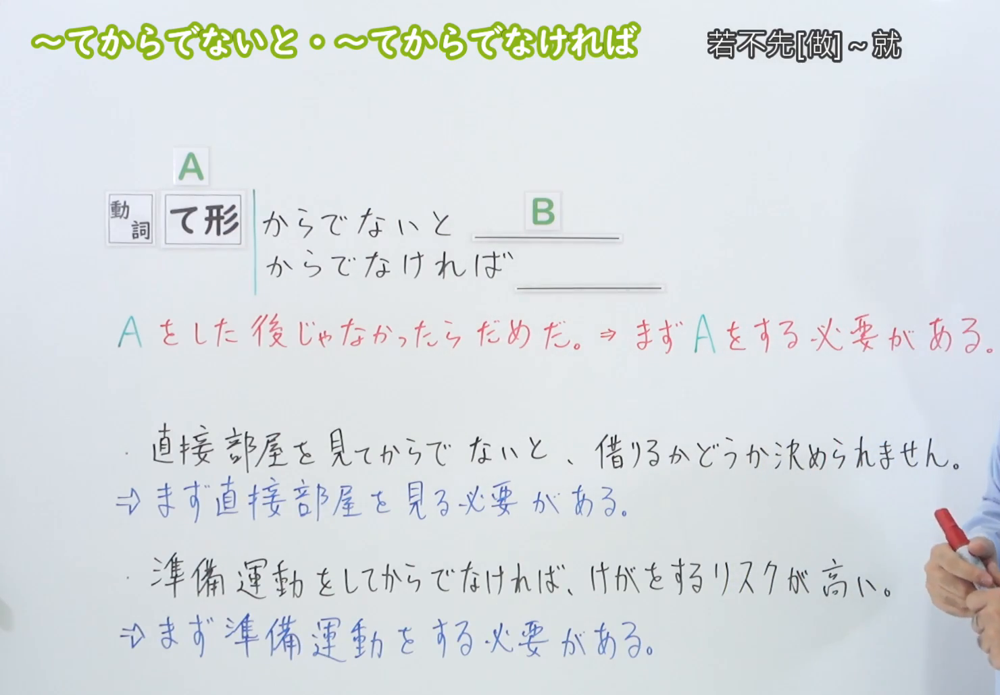

---
{
  "id": "N3-G-0035",
  "kind": "grammar",
  "level": "N3",
  "title": "～てからでないと／～てからでなければ：不先……就……",
  "status": "confirmed",
  "card_revision": 1,
  "source": {
    "lesson": "N3 第35个语法",
    "material": "出口日語日语字幕、00:30原视频板书及独立日文教学资料复核",
    "video": "https://www.youtube.com/watch?v=BNr2aS7Xra0",
    "screenshot": "assets/grammar/n3/N3-G-0035-0030.png",
    "screenshot_seconds": 30,
    "screenshot_crop": {
      "x": 0,
      "y": 0,
      "width": 1480,
      "height": 1030
    }
  },
  "tags": [
    "必要条件",
    "先后顺序",
    "否定或不利结果",
    "N3"
  ],
  "confusions": [
    "て形不重复加て",
    "后项不一定是否定形",
    "～てから",
    "～ないと",
    "～ないことには"
  ],
  "schema_version": 1,
  "created_at": "2026-09-12",
  "updated_at": "2026-09-12",
  "next_review": "2026-09-19"
}
---

# N3 第35课｜～てからでないと／～てからでなければ（已入库）

# 视频学习资料整理

根据学习者指定的出口日語第35课整理。学习者尚未提供本课个人理解或例句，以下为课程资料整理，不作为学习者原始输出。学习者于2026-09-12明确确认入库。

已从保存的播放列表原始提取记录核对：第35项为「【Ｎ３文法】～てからでないと・～てからでなければ」，视频ID为「BNr2aS7Xra0」。本次复用适用的原始视频、截图与教学网站正文缓存，重新整理卡片，没有恢复已删除的旧试点草稿。

0:01的核心接续可读，但老师遮住了右侧语义说明及例句末尾。改用[原视频00:30](https://www.youtube.com/watch?v=BNr2aS7Xra0&t=30s)，此时接续、必要性说明和两句板书例句完整可见。原帧1920×1080，固定左上角，裁切区域为(0, 0, 1480, 1030)，去除右侧多余人物及底部空白；未拼接、重绘或补字。右下仍有少量人物，不遮挡文字。

[打开接续截图](../../assets/grammar/n3/N3-G-0035-0030.png)

# 核心与接续

**～てからでないと／～てからでなければ：不先……就不能……；如果不先……，就会出现不利结果。**

强调先完成A的必要性：A是进行后续事情所需的前提。

| 类型 | 接续规则 | 示例 |
|---|---|---|
| 动词 | 动词て形＋からでないと、B | 見る→見てからでないと／読む→読んでからでないと |
| 动词 | 动词て形＋からでなければ、B | する→してからでなければ／終わる→終わってからでなければ |

て形已经含有「て／で」，不再加一个「て」：○ 読んでからでないと／× 読んでてからでないと。

两种表达的核心意思相同，本课例句中可以互换。日常对话还可用「～てからじゃないと」「～てからじゃなきゃ」等形式，属于外部补充。

# 语义边界与后项限制

1. **强调必要前提，不只是时间先后。** 「確認してから、申し込みます」只是说明先确认再申请；「確認してからでないと、申し込めません」强调没有先确认就不能申请。
2. **后项表达不能、不允许、不愿意、困难或不利结果。** 常见形式有「できない」「分からない」「～てはいけない」「難しい」「無理だ」。不要只盯着句末有没有「ない」。
3. **不利结果可以使用肯定形。** 视频中的「けがをするリスクが高い」意思是不先热身，受伤风险就高；形式是肯定，内容仍然是不利结果。
4. **不能机械地接普通的肯定行动。** 想说“吃完饭再出门”，用「ご飯を食べてから、出かけます」；若要强调“没吃完就不能出去”，才用「ご飯を食べてからでないと、出かけられません」。
5. **A完成不代表后续一定成功。** 「相談してからでないと決められない」强调商量是决定前的必要步骤，并不保证商量后一定作出决定。
6. **前项也可以是状态变化。** 例如「仕事が終わってからでないと」：必须先等工作结束。并不限于说话人主动做的动作。

# 课程例句

以下两句已对照原视频00:30板书和日语字幕核对，日文按板书整理，中文为整理译文。

> 直接部屋を見てからでないと、借りるかどうか決められません。
>
> 不先亲自看房，就无法决定要不要租。

「見る→見て」；「借りるかどうか」表示“是否要租”。重点是先看房这个必要步骤。

> 準備運動をしてからでなければ、けがをするリスクが高い。
>
> 如果不先做热身运动，受伤的风险就高。

「する→して」；「高い」不是否定形，但整句表达不利结果。这句是理解后项限制的关键。

# 自然例句（自拟）

> 説明書を読んでからでないと、この機械は使えません。
>
> 不先读说明书，就无法使用这台机器。

> 先生に確認してからでなければ、正確な日程は分かりません。
>
> 不先向老师确认，就不知道准确的日程。

> 仕事が終わってからでないと、迎えに行けません。
>
> 工作没结束，我就没法去接你。

> 内容をよく確認してからでなければ、契約書にはサインしません。
>
> 不先仔细确认内容，我就不会在合同上签字。

最后一句表示说话人的决定，不是能力上“不能签”。后项不限于可能形的否定。

# 易混项与JLPT考点

| 表达 | 重点 | 对照 |
|---|---|---|
| ～てから | 先A，然后B | 読んでから、使います：读完再用 |
| ～てからでないと | 强调必须先完成A，后项为否定或不利结果 | 読んでからでないと、使えません：不先读就不能用 |
| ～ないと | 更一般的否定条件，“如果不A” | 読まないと、使い方が分かりません：不读就不知道用法 |
| ～ないことには | 强调没有A这个前提，后续无法实现 | 読まないことには、使い方が分かりません：不读就无从知道用法 |

- 接续题看动词て形，尤其「読んで」「終わって」「して」等变化。
- 主表不接名词＋の，也不接动词辞书形。外部资料中的「午後からでないと」是时间名词＋から的相关表达，不要据此扩展成“所有名词都能接本课句型”。
- 后项选择先看语义：否定、不可能、困难或不利结果均可能符合，不能把「難しい／危険がある／リスクが高い」误排除。
- 排序时保留「て形＋から＋でないと／でなければ」的顺序，不漏「で」。
- 翻译重点在“不先A就……”，避免误译成“A做完以后就不能B”。

# 来源与复核记录

核对日期：2026-09-12。以下均阅读了正文或原课程字幕、画面，不以搜索摘要代替验证。

| 来源 | 支持与核对内容 |
|---|---|
| [出口日語第35课](https://www.youtube.com/watch?v=BNr2aS7Xra0) | 动词て形接续；两种形式同义；强调A的必要性；后项为否定或不利内容；00:30两句板书 |
| [日本語904：～てからでなければ](https://note.com/yy46/n/nf79494ec67d3) | て形＋からでなければ；先A是后续前提；后项包括否定、困难及主观不愿意；口语变体 |
| [日本語教師のまる得：～てからでないと／～てからでなければ](https://blognihongo.com/n2/grammar_tekaradenaito_tekaradenakereba/) | 动作完成与后续限制；两式核心意义相同；状态变化例句；时间名词相关表达与核心接续的区分 |
| [日本語教師たのすけ：～てからでないと／～てからでなければ](https://tanosuke.com/tekaradenaito/) | て形接续；后项可以为「無理だ」等非否定形的不利判断 |

- 原始材料位置：播放列表`.firecrawl/n3-playlist-items.json`第35项；视频`.firecrawl/BNr2aS7Xra0.mp4`；字幕`.firecrawl/n3-35.md`；外部完整正文`.firecrawl/n3-35-check-20260912.json`。这些是本机工作缓存，不作为正式学习资料提交。
- 本次整理前未发现N3-G-0035正式卡、草稿或复习记录，无编号冲突。
- 自动字幕中的「同市のて系」「から出なければ」「授業道」等识别错误，分别依据板书与上下文校正为「動詞のて形」「からでなければ」「準備運動」。
- 部分资料将后项简述为“不能做B”，课程给出肯定形的不利结果；结合另外两份资料的“否定性内容／困难／無理だ”，采用语义层面的限制，不误写为“后项必须是否定形”。
- たのすけ把「でないと」描述为语气更强，其他资料侧重同义或使用倾向；本卡不把强弱判断写成固定规则，核心按课程的同义说明处理。
- 网站有N2／N3等级标记差异；本卡沿用出口日語N3课程序号，不将网站分级当作官方固定清单。
- 成稿复核包括：接续不重复加て／で、必要前提与时间先后的区别、后项形式与语义的区别、两句板书原文与译文、自拟例句、来源支持范围，以及图片时间、裁切与链接。
- 已于2026-09-12确认入库，下次复习为2026-09-19。截图提供标准Markdown引用；现有iPad阅读器暂不显示正文图片，可直接打开图片文件查看。
