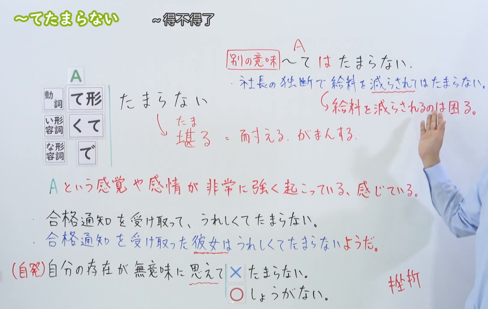

---
{
  "id": "N3-G-0037",
  "kind": "grammar",
  "level": "N3",
  "title": "～てたまらない：……得不得了；……得受不了",
  "status": "confirmed",
  "card_revision": 2,
  "source": {
    "lesson": "N3 第37个语法",
    "material": "出口日語日语自动字幕、原视频接续及例句画面、独立日文教学正文",
    "video": "https://www.youtube.com/watch?v=IckBfBZ5KmM",
    "screenshot": "assets/grammar/n3/N3-G-0037-0615.png",
    "screenshot_seconds": 375,
    "screenshot_crop": {
      "x": 0,
      "y": 0,
      "width": 1625,
      "height": 1030
    }
  },
  "tags": [
    "程度强调",
    "强烈感受",
    "感情与感觉",
    "N3"
  ],
  "confusions": [
    "い形容词くて",
    "な形容词で",
    "愿望たくて",
    "近义表达搭配",
    "第三人称"
  ],
  "schema_version": 1,
  "created_at": "2026-09-12",
  "updated_at": "2026-09-12",
  "next_review": "2026-09-19"
}
---

# N3 第37课｜～てたまらない（已入库）

# 视频学习资料整理

根据学习者指定的出口日語第37课整理。学习者未提供个人理解或例句，以下为课程资料整理，不作为学习者原始输出。学习者于2026-09-12明确确认入库，下次复习为2026-09-19。

已从保存的播放列表原始提取记录核对第37项，视频ID为「IckBfBZ5KmM」，标题与本课一致；整理前未发现该编号正式卡、草稿或确认事件。

按2026-09-12新增截图规则，改用[原视频06:15](https://www.youtube.com/watch?v=IckBfBZ5KmM&t=375s)实际画面，替换原来仅显示接续表的00:01裁图。原帧1920×1080，固定左上角，裁切区域为(0, 0, 1625, 1030)；在保留教学内容的前提下裁去右侧多余人物与底部空白。保留三类接续、词义说明、强烈感受的解释、两句例句、自发用法对比及「てはたまらない」说明。老师主体已裁去，右侧仍有手臂，未遮挡核心接续与主要例句。未拼接、重绘、抹除人物或补写文字。截图中的原课程判断需结合本卡“来源与复核记录”阅读。

[打开板书截图](../../assets/grammar/n3/N3-G-0037-0615.png)

# 核心与接续

**～てたまらない：……得不得了；……得受不了；非常想……。**

表示感情、身体感觉或欲望非常强烈，难以忍受或抑制。「たまらない(堪らない)」有“无法忍受”的意思；语法形式通常用平假名。

| 类型 | 接续规则 | 示例 |
|---|---|---|
| 动词 | 动词て形＋たまらない | 喉が渇く→喉が渇いてたまらない／腹が立つ→腹が立ってたまらない |
| い形容词 | い形容词去い＋くて＋たまらない | 暑い→暑くてたまらない／嬉しい→嬉しくてたまらない |
| な形容词 | な形容词词干＋で＋たまらない | 心配→心配でたまらない／好き→好きでたまらない |
| 愿望表达 | 动词ます形去ます＋たくて＋たまらない | 会います→会いたい→会いたくてたまらない |

动词て形已含「て／で」，本课接续时只加「たまらない」：喉が渇いて＋たまらない。な形容词不是「な＋たまらない」，普通名词也不能任意套用。

| 用途 | 形式 | 示例 |
|---|---|---|
| 礼貌句末 | ～てたまりません／～でたまりません | 痒くてたまりません |
| 过去 | ～てたまらなかった／～でたまらなかった | 会いたくてたまらなかった |
| 推测他人感受 | ～てたまらないようです | 楽しくてたまらないようです |

也可以用「～てたまらないです」。以上列出常见表达，不把它们混同为新的接续类型。

# 语义边界

1. **突出主观感受，而非客观测量。** 「暑くてたまらない」是说话人觉得热得受不了，不是精确描述气温。
2. **不只表示痛苦。** 「嬉しくてたまらない」「好きでたまらない」也自然，表示喜悦或喜爱难以抑制。
3. **动词搭配有限。** 适合「喉が渇く」「腹が立つ」等感受；不能将普通行动换成て形后随意加上它。表示“想吃得不得了”用「食べたくてたまらない」，不是「食べてたまらない」。
4. **他人的感受通常通过观察、转述说明。** 原视频用「彼女は嬉しくてたまらないようだ」。有引用或叙述语境时还可用「～と言っている」等，不将“第三人称必须加ようだ”记为绝对规则。
5. **与第36课大幅重叠，但不能任意换词。** 「嬉しくてしょうがない／嬉しくてたまらない」都可以；「思えてしかたがない」等自发判断类搭配，不宜机械换成「思えてたまらない」。
6. **“自发类一律不能接”属于过度概括。** 课程用「思える」说明差异，可作为本课的典型对照；但「気になってたまらない」表达在意到无法忍受时有实际接受度依据，不能只凭“気になる属于自发”就判错。判断时看具体词语和是否突出强烈感受。

# 课程例句

以下四句已对照[原视频07:00例句画面](https://www.youtube.com/watch?v=IckBfBZ5KmM&t=420s)及日语字幕。日文保留画面写法，中文为整理译文。

> 安宿に泊まったらダニに刺されたようで、手足が痒くてたまりません。
>
> 住了便宜旅馆后，好像被螨虫叮了，手脚痒得受不了。

「痒い→痒くて」，礼貌句末为「たまりません」。

> 留学生活を始めたばかりのころは、家族に会いたくてたまらなかった。
>
> 刚开始留学生活的时候，我特别想见家人。

「会いたい→会いたくて」，「たまらなかった」描述过去的强烈愿望。

> 受験勉強から解放されて、兄は大学生活が楽しくてたまらないようです。
>
> 从备考中解脱出来后，哥哥似乎觉得大学生活快乐极了。

「ようです」说明这是对哥哥感受的判断。

> 洗濯物を干すのはいいけど、たたむのが面倒でたまらない。
>
> 晾衣服倒还好，但叠衣服实在让我觉得麻烦得受不了。

「面倒」在这里按な形容词接「で」。

# 自然例句（自拟）

> 昨日はほとんど寝ていないので、眠くてたまりません。
>
> 昨天几乎没睡，所以现在困得受不了。

> 長い間歩いたので、喉が渇いてたまらない。
>
> 走了很久，渴得受不了。

> 明日の発表が心配でたまらないです。
>
> 我特别担心明天要做的报告。

> 久しぶりに会う友人と、早く話したくてたまりません。
>
> 我迫不及待地想和久别的朋友聊聊天。

# 易混项与JLPT考点

| 表达 | 重点 |
|---|---|
| ～てたまらない | 感受或欲望强到难以忍受、抑制 |
| ～てしょうがない／～てしかたがない | 强烈感受；也用于某些过度而令人困扰的情况 |
| ～てならない | 常突出不由自主产生的感受、念头，具体搭配需判断 |
| ～てはたまらない | 如果发生那种事就受不了、很困扰；与本课不能混同 |

原课程另举「社長の独断で給料を減らされてはたまらない」来说明「ては」的不同含义：如果社长擅自削减工资，那可受不了。此处是对某种事态的拒斥，并非单纯加强前项感受。

自拟对照：

> 暑くてたまらない。
>
> 热得受不了。（强烈感受）
>
> 毎晩こんなに騒がれてはたまらない。
>
> 每晚都这样吵闹的话，实在受不了。（那样做会令人困扰）

- い形容词去い加「くて」，な形容词用「で」，愿望形式是「たくて」。
- 「たまりません」虽是否定形式，整句仍是强调前项感受，不是“不痒／不想见”。
- 用「～ようです」等描述他人内心时，注意整句的判断视角。
- 注意有无「は」会改变结构与含义。
- 近义项的强弱并非固定量表；「嬉しくて～」等语境常有多个自然表达，不宜只靠强弱选唯一答案。

## 第36课与第37课区别对照

这两个语法有很大重叠，区别主要在表达侧重点和具体搭配，不能简单记成固定的强弱等级。

| 对比点 | 第36课：～てしょうがない／～てしかた(仕方)がない | 第37课：～てたまらない |
|---|---|---|
| 核心意思 | ……得不得了；非常…… | ……得不得了；……得受不了 |
| 表达侧重 | 某种感受十分强烈，难以控制；也可强调某种状况过度而令人困扰 | 感情、身体感觉或欲望强烈到难以忍受、抑制 |
| 身体感觉 | 眠くてしょうがない。 困得不得了。 | 眠くてたまらない。 困得受不了。 **此类表达通常都自然。** |
| 正面感情 | 嬉しくてしかたがない。 高兴得不得了。 | 嬉しくてたまらない。 高兴得难以抑制。 **并非只能表达痛苦。** |
| 强烈愿望 | 家族に会いたくてしょうがない。 特别想见家人。 | 家族に会いたくてたまらない。 想见家人想得不得了。 **两者都用「たくて」。** |
| 过度而令人困扰的状况 | 時間がかかってしょうがない。 实在太费时间了。 可直接强调这种状况令人困扰。 | 不宜机械替换成「時間がかかってたまらない」。若强调自身感受，可说「待つのが退屈でたまらない」（等得无聊极了）。 |
| 不由自主产生的判断 | 彼の話がうそに思えてしかたがない。 总觉得他说的是假话。 | 此类「思えて」搭配不宜机械替换成「たまらない」；优先用于明显的强烈感受。 |
| 「気になる」的特殊提醒 | 結果が気になってしかたがない。 特别在意结果。 | 結果が気になってたまらない。 在意结果，在意得受不了。 **不能因为「気になる」带有自发性就一律判错。** |
| 接续 | 动词て形／い形容词「くて」／な形容词「で」＋しょうがない／しかたがない | 动词て形／い形容词「くて」／な形容词「で」＋たまらない；基本接续相同 |
| 语体与礼貌形式 | 「しょうがない」更口语化。 礼貌形式如「しかたがありません」。 | 礼貌形式如「たまりません」。 |
| JLPT辨析重点 | 注意「～てもしかたがない」是“即使……也没用”，不同于程度强调。 | 注意「～てはたまらない」是“如果……就受不了”，不同于单纯强调感受。 |

**记忆提示：**「しょうがない／しかたがない」抓住“非常……，控制不住”；「たまらない」抓住“感受强到受不了、压不住”。遇到「嬉しい、眠い、会いたい」等，两者常可互换，不能只凭“哪个更强烈”选唯一答案。

# 来源与复核记录

核对日期：2026-09-12。

| 来源 | 核对内容 |
|---|---|
| [出口日語第37课](https://www.youtube.com/watch?v=IckBfBZ5KmM) | 动词／い形容词／な形容词接续，强烈感受，第三人称，「思える」对比，「てはたまらない」及07:00例句 |
| [毎日のんびり日本語教師：～てたまらない](https://mainichi-nonbiri.com/grammar/n3-tetamaranai/) | 三类接续、强烈感情与感觉、正负用法、愿望及重复强调 |
| [日本語教師のまる得：～てたまらない](https://blognihongo.com/n3/grammar_tetamaranai/) | 动词接续、身体感觉、愿望、第三人称；具体搭配存在接受度差异 |
| [日本語教師たのすけ：～てたまらない](https://tanosuke.com/n3-tetamaranai) | 基本接续、身体感觉例句、语体与近义项教学对照 |

- 接续表由原视频0:01板书与独立日文正文交叉核对；没有因某些文章笼统说“不能接动词”而删掉动词行。
- 课程强调自发判断「思えて」不能简单换成「たまらない」。まる得同页一方面称「気になる」有较高接受度，另一方面又把它列入禁用清单，存在教学概括不一致；本卡保留典型搭配对照，明确不作所有自发词的绝对禁令。
- たのすけ的比较段将一个「悲しくてたまらない」例句判为不自然，而毎日のんびり列有「悲しくて寂しくてたまらない」。依据两者共同承认的“强烈感情”核心，未采纳“悲しい不能接”的扩大判断。
- 也不采纳某些网站“愿望目标必须已确定”的一刀切限制；本课重点是愿望强度，具体搭配受语境影响。
- 尝试读取教学网站引用的研究旧链接，返回网站页面而非论文正文；不声称完成论文核验，不引用其统计值。资料分歧已按教学简化与具体搭配的不同层次处理，不影响基本接续和核心用法。
- 自动字幕中的「貯まる」按视频板书校正为「堪る」；「て足」按07:00画面校正为「手足」。没有把自动字幕当作准确原文。
- 成稿检查包括三类接续、愿望「たくて」、礼貌与过去形式、第三人称、四句课程原文与译文，以及「ては」的区别。

- 获取记录：视频通过yt-dlp下载为本机缓存，使用ffmpeg从06:15提取原帧，再按上述区域裁切。日语自动字幕为`.firecrawl/IckBfBZ5KmM.ja.vtt`；教学正文为`.firecrawl/n3-37-check.json`及`.firecrawl/n3-37-mainichi.md`。视频网页抓取未返回有效字幕，因此课程依据采用下载的日语字幕与实际视频画面。缓存不作为正式学习资料提交。
- 截图已目视检查，链接指向长期资料目录；已于2026-09-12确认入库，下次复习为2026-09-19。现有iPad阅读器暂不显示正文图片，可直接打开图片文件查看。
