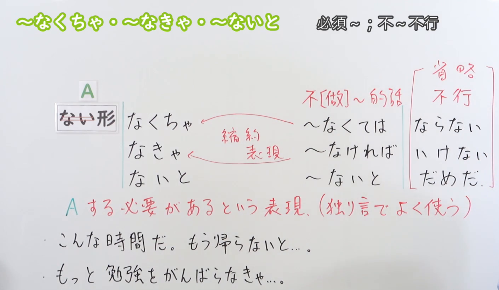
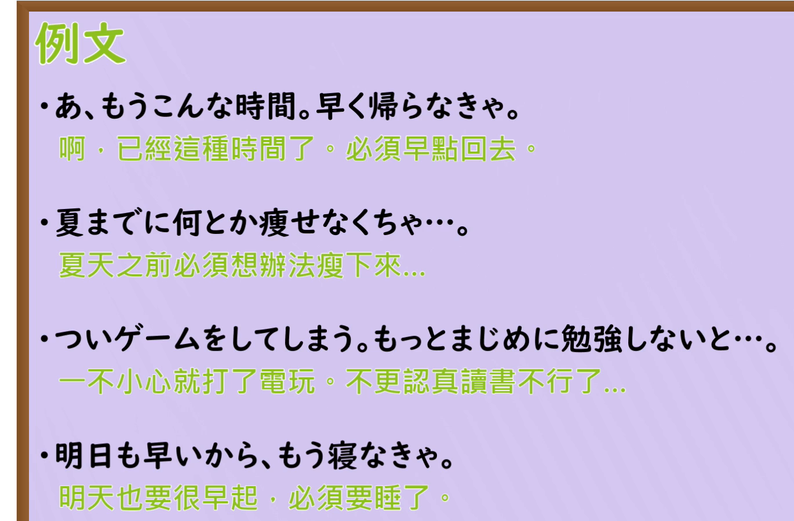

---
{
  "id": "N3-G-0041",
  "kind": "grammar",
  "level": "N3",
  "title": "～なくちゃ・～なきゃ・～ないと：必须；得……（口语省略）",
  "status": "confirmed",
  "card_revision": 1,
  "source": {
    "lesson": "N3 第41个语法",
    "material": "出口日語日语自动字幕、原视频板书与例句画面、独立教学正文",
    "video": "https://www.youtube.com/watch?v=aU8MLusen0g",
    "screenshot": "assets/grammar/n3/N3-G-0041-0235.png",
    "screenshot_seconds": 155,
    "screenshot_crop": {
      "x": 0,
      "y": 0,
      "width": 1410,
      "height": 820
    }
  },
  "tags": [
    "义务",
    "口语缩约",
    "N3"
  ],
  "confusions": [
    "なくてもいい",
    "てはいけない",
    "条件ないと"
  ],
  "schema_version": 1,
  "created_at": "2026-09-12",
  "updated_at": "2026-09-12",
  "next_review": "2026-09-19"
}
---

# N3 第41课｜～なくちゃ・～なきゃ・～ないと（已入库）

# 视频学习资料整理

根据学习者指定的出口日語课程整理，未提供个人理解或例句，不虚构学习者原始输出。从保存的播放列表第41项核对标题及视频ID「aU8MLusen0g」；整理前未发现同编号正式卡、草稿或确认事件。本卡于2026-09-12确认入库，下次复习为2026-09-19。

主图取自[原视频02:35](https://www.youtube.com/watch?v=aU8MLusen0g&t=155s)。原帧1920×1080，固定左上角裁为(0, 0, 1410, 820)。00:01右侧讲解被人物遮挡，比较多个前中段时点后改用此图；完整保留接续、缩约箭头、含义和两句板书，裁去底部空白及几乎全部人像，仅右下角有极少量衣袖。没有重绘或拼接。

补充[原视频03:00例句页](https://www.youtube.com/watch?v=aU8MLusen0g&t=180s)，原帧1920×1080，裁为(0, 0, 1370, 900)，保留四句日文及中文，去除右侧空白、底部装饰，无人像。

# 核心与接续

## **【否定形去ない】＋なくちゃ／なきゃ／ないと**

**必须……；得……；需要……。** 表示动作、状态或身份条件的必要性，是会话中常见的缩约、省略表达，经常用于自我提醒，也能提醒对方。本课不是普通形接续，不套用「な・の」标记。

| 类型 | 接续规则 | 示例 |
|---|---|---|
| 动词 | ない形去ない＋なくちゃ／なきゃ／ないと | 行かない→行かなくちゃ／行かなきゃ／行かないと；食べない→食べなくちゃ／食べなきゃ／食べないと |
| い形容词 | 去い＋く＋なくちゃ／なきゃ／ないと | 安くなくちゃ／安くなきゃ／安くないと |
| な形容词 | 词干＋で／では／じゃ＋なくちゃ／なきゃ／ないと | 静かじゃなくちゃ／静かじゃなきゃ／静かじゃないと |
| 名词 | 名词＋で／では／じゃ＋なくちゃ／なきゃ／ないと | 学生じゃなくちゃ／学生じゃなきゃ／学生じゃないと |

这里的“否定形”指以「ない」结尾的非过去否定形式：行かない、安くない、静かではない、学生じゃない等；不是过去否定「なかった」或礼貌否定「ません」。先去掉末尾ない，再接三种形式，不限于动词。表中后三类为独立资料复核后的补充，原课程以动词例句为主。

な形容词、名词的「で／では／じゃ」必须保留，例如静かでなきゃ、学生じゃなくちゃ；不能写成「静かなきゃ／学生なきゃ」。「じゃ」是「では」的口语缩约，不是单独把「で」缩成「じゃ」。い形容词「いい」用「よくない」变化：よくなきゃ。

「ないと」也可记作“非过去否定形＋と”，两种拆法任选一种，不重复添加ない。

- する→しない→しなくちゃ／しなきゃ／しないと。
- 来る→来ない（こない）→来なくちゃ／来なきゃ／来ないと，三者「来」均读こ。
- 買う→買わない→買わなきゃ；不是「買いなきゃ」。

| 完整结构 | 缩约／省略后的形式 |
|---|---|
| ～なくては＋いけない／ならない／だめだ | ～なくちゃ（いけない等） |
| ～なければ＋いけない／ならない／だめだ | ～なきゃ（いけない等） |
| ～ないと＋いけない／だめだ等 | ～ないと |

前两项既有语音缩约，也可省略后项；「ないと」本身没有同样的语音变化。后项虽省略，必要性的意思仍保留。正式说明可用「～なければなりません／～ないといけません」等完整表达。

# 语义边界与适用条件

1. 「帰らなきゃ」是“得回去”，不是“不能回去”。可从“不回去不行”理解其必要性，不把所有含「ない」的句子都判断为否定动作。
2. 不只用于独自说话，也能对熟人说「早く寝ないと」。是否带催促、担心或责备，取决于语气与上下文。
3. 三种形式在本课必要性用法中意思接近，不硬性规定某一种只限男性、女性或紧急情况。
4. 「ないと」还可以是真正的否定条件：如「雨が降らないと、花が枯れる」是“不下雨的话，花会枯萎”。有明确后项时先按句意判断，不一律译成“必须”。
5. 接动作动词时多表示必须做某事；接形容词、名词时可表示必须具备某种状态或身份，并非只能表达普通否定条件。后项省略时需要语境支持必要义；不论词类都不能见到形式就一律译成“必须”。
6. 「なきゃ／なくちゃ」不直接接「ました」表示过去；需要过去义时恢复后项，如「行かなきゃいけなかった」。

# 课程例句

以下取自原课程例句页，中文为整理译文。

1. あ、もうこんな時間。早く帰らなきゃ。
   - 啊，已经这个时间了。得早点回去了。
2. 夏までに何とか痩せなくちゃ……。
   - 得想办法在夏天之前瘦下来……。
   - 仅记录原课程的语法例句，不是对学习者身材的评价或减重建议。
3. ついゲームをしてしまう。もっとまじめに勉強しないと……。
   - 总是不知不觉就玩起游戏。得更认真学习才行……。
4. 明日も早いから、もう寝なきゃ。
   - 明天也要早起，现在得睡了。

# 自然例句（自拟）

1. 図書館の本、今日までだった。返しに行かなくちゃ。
   - 图书馆的书今天到期，得去还了。
2. 明日は九時から会議だから、八時半までに会社に着かなきゃ。
   - 明天九点开会，得在八点半前到公司。
3. まだ返事をしていなかった。今すぐ連絡しないと。
   - 我还没回复，得马上联系。

4. 旅行に持っていくかばんは、軽くなきゃだめ。
   - 旅行带的包必须轻才行。
5. 勉強する場所は、静かじゃないといけない。
   - 学习的地方必须安静。
6. この割引を受けるには、会員じゃなくちゃだめ。
   - 要享受这个折扣，必须是会员。

# 易混项与JLPT考点

- 行かなきゃ＝必须去；行かなくてもいい＝不去也可以；行ってはいけない＝不许去。
- 区分「なくちゃ」与「ちゃう」：前者来自なくては；「食べちゃう」来自食べてしまう，不是义务。
- 缩约来源要分清：なくては→なくちゃ，なければ→なきゃ；不能只按含义把两条语音变化对调。
- 熟练还原省略的いけない等后项；阅读对话时结合期限、时间、提醒等语境。
- 语体选择：对正式对象或写正式文章时优先完整表达，不能简单加「です」拼成「行かなきゃです」作为标准接续。

# 来源与复核记录

核对日期：2026-09-12。

1. [出口日語第41课](https://www.youtube.com/watch?v=aU8MLusen0g)：日语字幕全文、多个原帧、02:35完整板书、03:00例句页；确认ない形去ない、必要性、省略和自我提醒用法。
2. [日本語教師のN1et：縮約形と短縮句](https://jn1et.com/shukuyaku-tannshuku/)：日文教学正文的三种必要性短形式及会话，支持口语性和对他人的提醒。其总表把近义完整表达合并列示，不能当作每一项精确的语音来源。
3. [Bunpro：なくちゃ・なきゃ](https://bunpro.jp/grammar_points/なくちゃ-なきゃ)：教学正文明确区分なくては／なければ的缩约，说明いけない等可省略、与ないと必要性用法接近；补充过去时需恢复后项。此页为英文说明配日文例句，作为第二独立教学来源。

4. [毎日のんびり日本語教師：なければならない／なくてはならない／ないといけない](https://mainichi-nonbiri.com/grammar/n3-nakerebanaranai/)：2026-09-12补充核对日文正文，明确列出四类接续、动作义务与其他必要性的区别、なきゃ／なくちゃ缩约及后项省略。该页对「で／じゃ」的简写在本卡展开为で、では、じゃ；严格的缩约关系为では→じゃ。
5. [Iku老師：なきゃ](https://jp.ikuchannel.com/grammar/pattern-nakya)：补充核对四类接续及轻便、安全、名词条件的日文例句；正文为中文教学说明。该页也引用上一来源，因此不把其转引内容重复计算为独立证据；四类接续主要依据上一来源明确接续表，与已读的缩约规则交叉核对。

学习者疑问原文：「第41个语法的接续的ない形去ない检查是否仅限于动词」。核查结论：不限动词，旧版只列动词不完整，已补全四类接续及必要状态／身份条件例句。学习者随后明确要求「修改并确认入库」。

检索处理：优先定向取得日本教师日文正文；另一个视频检索结果为英文转录，且缩约来源表述不准确，未采用为关键证据。原课自动字幕「ない系」「20指定」「内藤」等按板书与上下文校正为「ない形」「二重否定」「ないと」。没有把近义替换表误写成严格语音变化。

成稿复核：逐项核对去ない位置、する／来る／買う变化、缩约来源、肯定义务与否定条件的区别、例句译文及来源标识；目视复核两张最终裁图，教学文字保留。图片位于本节资料整理，现有阅读器尚不显示正文截图，可在Markdown中打开，本次不修改阅读器。

缓存：`.firecrawl/n3-playlist-items.json`、`.firecrawl/aU8MLusen0g.ja.vtt`、`.firecrawl/n3-41-check.json`、`.firecrawl/n3-41-jp.json`及视频／抽帧。缓存不提交。补充核查缓存：`.firecrawl/n3-41-pos-check.json`。已记录2026-09-12确认事件，下次复习为2026-09-19。
