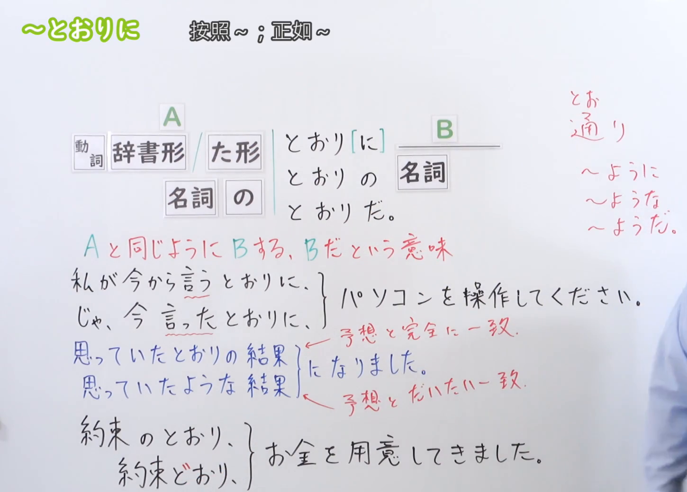
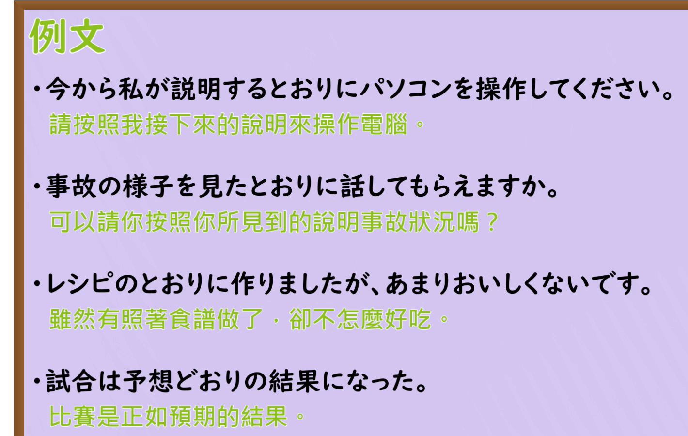

---
{
  "id": "N3-G-0044",
  "kind": "grammar",
  "level": "N3",
  "title": "～とおりに：按照……；正如……",
  "status": "confirmed",
  "card_revision": 1,
  "source": {
    "lesson": "N3 第44个语法",
    "material": "出口日語日语自动字幕、原视频板书与例句画面、独立教学正文",
    "video": "https://www.youtube.com/watch?v=hDmL4cSlRiE",
    "screenshot": "assets/grammar/n3/N3-G-0044-0450.png",
    "screenshot_seconds": 290,
    "screenshot_crop": {
      "x": 0,
      "y": 0,
      "width": 1450,
      "height": 1040
    }
  },
  "tags": [
    "依照",
    "一致",
    "N3"
  ],
  "confusions": [
    "ように",
    "とおり／どおり",
    "とおりの"
  ],
  "schema_version": 1,
  "created_at": "2026-09-12",
  "updated_at": "2026-09-12",
  "next_review": "2026-09-19"
}
---

# N3 第44课｜～とおりに（已入库）

# 视频学习资料整理

根据学习者指定的出口日語课程整理；本次未提供个人理解或例句，不虚构学习者原始输出。已从保存的播放列表第44项核对标题「～とおりに」及视频ID「hDmL4cSlRiE」，整理前未发现同编号正式卡、草稿或确认事件。本卡于2026-09-12确认入库，下次复习为2026-09-19。

主图取自[原视频04:50](https://www.youtube.com/watch?v=hDmL4cSlRiE&t=290s)。原帧1920×1080，固定左上角裁为(0, 0, 1450, 1040)。00:01操作电脑例句右端被人物遮挡；比较02:00、04:00、04:40、05:00后，改用04:50，保留接续、含义、言う／言った、与ような的对照及约定例句。已裁去大部分人像，右缘仍有少量衣袖但不遮主要教学文字。顶部空白受固定左上角规则限制保留，未重绘、抹除或拼接。

补充[原视频05:30例句页](https://www.youtube.com/watch?v=hDmL4cSlRiE&t=330s)，原帧1920×1080，裁为(0, 0, 1420, 900)，保留四句日文及中文，裁去多余右侧与底部装饰，无人像。

# 核心与接续

## **【动词辞书形／た形；名词＋の】＋とおり（通り）に**
## **【名词】＋どおり（通り）に**

**按照……；正如……；与……一样。** 表示动作依照某种说明、方法或指示进行，或结果与预想、计划等相符。本课不是普通形四类通用接续，不套用「普通形（な・の）」。

| 类型 | 接续规则 | 示例 |
|---|---|---|
| 动词 | 辞书形＋とおりに | 言うとおりに／説明するとおりに |
| 动词 | た形＋とおりに | 見たとおりに／教わったとおりに |
| 名词 | 名词＋の＋とおりに | レシピのとおりに／説明書のとおりに |
| 名词 | 名词＋どおりに，常与计划、指示、预测等词搭配 | 予定どおりに／指示どおりに／予想どおりに |

「思っていたとおり」「書いてあるとおり」也自然：前者是「思っている」的过去形式，后者承接持续存在的记载状态，不应因基础表只写辞书形／た形就误判。

| 后续结构 | 写法 | 示例 |
|---|---|---|
| 修饰动作、状态 | とおりに／どおりに；に有时可省略 | 言われたとおり（に）する／予定どおり（に）進む |
| 修饰名词 | とおりの／どおりの＋名词 | 思っていたとおりの結果／予想どおりの結果 |
| 句末判断 | とおりだ／どおりだ；礼貌体用です | そのとおりです／結果は予想どおりです |

前面已经有「の」时读とおり：予定のとおり。名词构成常用复合形式时读どおり：予定どおり。动词后读とおり：言ったとおり，不写成「言ったどおり」。不要把名词＋どおり当作任意名词都能机械套用的规则；先掌握本课常用搭配。

# 语义边界与适用条件

1. 既可指“照着做”的方法一致，也可指“结果正如预料”；后项不必总是命令或请求。「予想どおり雨が降った」就是客观结果。
2. 原课「今から言うとおりに」是按接下来要说的做；「今言ったとおりに」是按刚说过的做。辞书形也能表示平时所说、当前有效的指示，不是看到言う就一律判断为尚未开口。
3. 与「ように／ような」的相似用法相比，「とおり」更强调符合某个具体依据或标准。原课用“完全一致／大体一致”帮助比较；这里的一致是针对话题所关心的内容，不要求所有无关细节都相同，也不能把所有ように用法都解释为“大致一致”。
4. 「レシピのとおりに作ったが、おいしくなかった」不矛盾：按食谱做说明步骤依照食谱，不保证结果美味。
5. 修饰名词用「の」，不是「な」：とおりの結果；与「ような結果」分清。修饰动作通常用に，不说「とおりの作る」。
6. 「そのとおりです」是“正是如此”；「とおり」也有道路、计数等词汇用法，不能把所有「通り」都当成本课句型。

# 课程例句

以下取自原课例句页；中文为整理译文。

1. 今から私が説明するとおりにパソコンを操作してください。
   - 请按我接下来说明的方法操作电脑。
2. 事故の様子を見たとおりに話してもらえますか。
   - 能请你如实讲述看到的事故情况吗？
3. レシピのとおりに作りましたが、あまりおいしくないです。
   - 我按食谱做了，但不怎么好吃。
4. 試合は予想どおりの結果になった。
   - 比赛结果正如预料。

原课板书另有：

- 思っていたとおりの結果になりました。
  - 结果和原先想的一样。
- 約束のとおり、お金を用意してきました。／約束どおり、お金を用意してきました。
  - 我按约定把钱准备好了。
  - 原课用这一对说明名词＋の＋とおり与名词＋どおり；两句这里都省略に。

# 自然例句（自拟）

1. 説明書に書いてあるとおりに、部品を組み立ててください。
   - 请按照说明书上的记载组装零件。
2. 昨日教わったとおりにパンを焼いてみました。
   - 我试着照昨天学的方法烤了面包。
3. 電車は時刻表どおりに到着しました。
   - 电车按时刻表到站了。
4. A：集合は九時ですね。B：はい、そのとおりです。
   - A：九点集合，对吧？B：是的，没错。

# 易混项与JLPT考点

- とおり／どおり：言うとおり、見たとおり、予定のとおり、予定どおり；不要写「予定のどおり」。
- の／に／だ：予想どおりの結果、予想どおりに進む、結果は予想どおりだ。根据后项成分选择。
- 辞书形／た形：结合“接下来说明、刚才说明、长期有效的指示”等语境，不单靠中文时态猜。
- 「ような」强调类似的样子或性质；「とおりの」强调符合某种具体依据，不能无条件互换。
- 阅读需找出依据是什么：指示、实际见闻、食谱、预想或计划；“照做”与“做得成功”是两回事。

# 来源与复核记录

核对日期：2026-09-12。

1. [出口日語第44课](https://www.youtube.com/watch?v=hDmL4cSlRiE)：日语自动字幕全文、00:01及多个讲解时点、04:50板书和05:30例句页。确认辞书形／た形、名词＋の、どおり、に省略、修饰名词用の及句末だ／です。
2. [日本語NET：とおりに](https://nihongokyoshi-net.com/2019/01/15/jlptn3-grammar-toorini/)：日文正文明确三种基本接续，支持言う／言った、计划结果、の修饰名词及です结句的例句。
3. [Langoal：とおりに](https://langoal.com/jlpt/explain-grammar-toorini.html)：日文正文明确“与……相同”、辞书形／た形与名词接续，并有按说明、见闻、学过的方法行事及“照做却失败”的实例。
4. [日本語の例文：とおり／どおり](https://j-nihongo.com/toorini/)：补充核对とおり（に／だ／の）的结构与「書いてあるとおり」、按照当前指示行事等自然用例。

分歧处理：原课用“完全一致”与“大体一致”比较とおり／ような，正文保留更强调符合依据的区别，同时限定为相关方面的一致，不把ように的目的等其他用法混入。外部来源与原课的基本接续一致，没有未解决的关键接续冲突。

字幕校对：「同市／名刺／たk／様方」等根据板书校正为动词、名词、た形、用法；通り读音依据讲解及平假名板书区分とおり／どおり，不能从字幕统一写汉字通り就忽略浊音。

成稿复核：核对动词形式、名词の与浊音、に省略范围、の／だ的后续结构、与ような的边界、课程／自拟例句及中文；目视检查两张最终裁图，教学内容完整可读。图片放在视频学习资料整理，使用可解析的相对链接；现有阅读器尚不显示正文截图，可在Markdown中打开。

缓存：`.firecrawl/n3-playlist-items.json`、`.firecrawl/hDmL4cSlRiE.ja.vtt`、`.firecrawl/n3-43-44-search.json`及视频／原帧。网页检索中的视频转录不是日语版本，课程复核采用另行获取的日语字幕与原画面，不把该转录当独立来源。缓存不提交。已记录2026-09-12确认事件，下次复习为2026-09-19。
