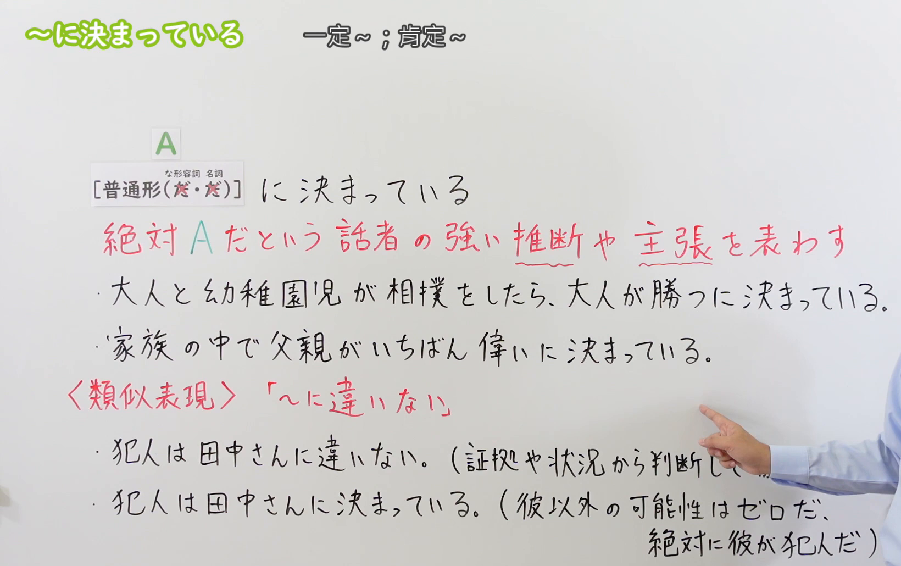
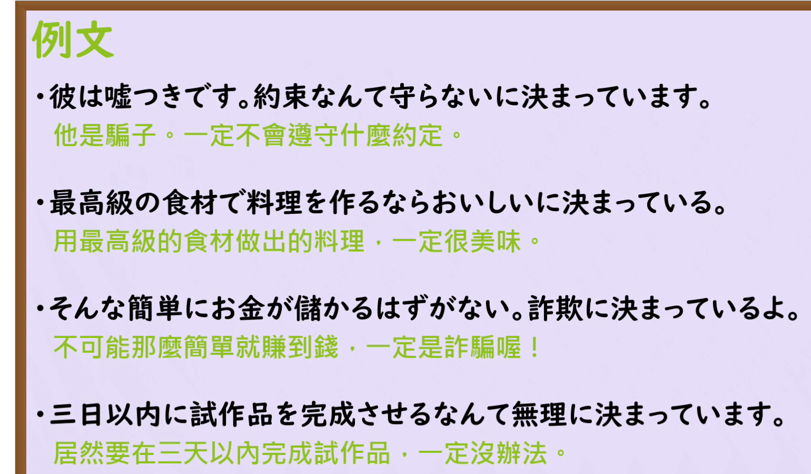

---
{
  "id": "N3-G-0052",
  "kind": "grammar",
  "level": "N3",
  "title": "～にきまっている（に決まっている）：强烈确信与主张",
  "status": "confirmed",
  "card_revision": 1,
  "source": {
    "lesson": "N3 第52个语法",
    "material": "出口日語日语自动字幕、原视频板书与例句画面、独立日文教学正文",
    "video": "https://www.youtube.com/watch?v=wLP_fREK1IU",
    "screenshot": "assets/grammar/n3/N3-G-0052-0120.png",
    "screenshot_seconds": 80,
    "screenshot_crop": {
      "x": 0,
      "y": 0,
      "width": 1640,
      "height": 1030
    }
  },
  "tags": [
    "强烈确信",
    "主观判断",
    "主张",
    "口语",
    "N3"
  ],
  "confusions": [
    "にちがいない",
    "はずだ",
    "はずがない",
    "ことにきまっている",
    "名词与な形容词的だ"
  ],
  "schema_version": 1,
  "created_at": "2026-09-12",
  "updated_at": "2026-09-12",
  "next_review": "2026-09-19"
}
---

# N3 第52课｜～にきまっている（に決まっている）（已入库）

# 视频学习资料整理

按学习者指定范围整理；未提供个人理解或例句，不虚构学习者原始输出。已核对保存的播放列表第52项及原视频元数据：标题「【Ｎ３文法】～に決まっている」、视频ID「wLP_fREK1IU」、时长05:09。整理前未发现本课已有草稿、正式卡或确认事件。本卡已于2026-09-12确认入库，下次复习为2026-09-19。

主图取自[原视频01:20](https://www.youtube.com/watch?v=wLP_fREK1IU&t=80s)。先检查00:01，老师遮挡右侧例句及比较说明；再检查00:30、01:00、01:18—01:25多个时点、01:50、02:10、02:20、02:30、03:00和03:25，选用01:20。原帧1920×1080，固定左上角裁为(0, 0, 1640, 1030)，保留普通形接续及两处去だ标记、含义、两句完整板书例句和下方易混项。

限制：右下方仍有手臂遮住「に違いない」的部分比较说明；已结合02:10画面与原课日语讲解核对。保留比较区域，不为去除全部人像裁成只有接续表的小图；未抹除、补写或拼接。

补充[原视频04:00例句页](https://www.youtube.com/watch?v=wLP_fREK1IU&t=240s)。原帧1920×1080，固定左上角裁为(0, 0, 1540, 900)，保留四句完整日文与中文，裁去右侧、底部多余区域，无人像。

# 核心与接续

## **【普通形（だ不要・だ不要）】＋にきまっている（に決まっている）**

**一定……／肯定……／当然……。** 表示说话人确信“绝对就是这样”，带有很强的主观判断或主张，常有“这还用说吗”的语气；不是客观事实已经得到证实的保证。

括号内两项依次对应**な形容词、名词的现在肯定形**：这两种情况不加だ，也不改成な或の。动词和い形容词按普通形接续。这里与第48课「なんて」的「だ可省略」不同，不能记成「词干＋（だ）＋にきまっている」。

| 类型 | 接续规则 | 示例 |
|---|---|---|
| 动词 | 普通形＋にきまっている | 来る／来ない／来た／来なかった＋にきまっている |
| い形容词 | 普通形＋にきまっている | 高い／高くない／高かった／高くなかった＋にきまっている |
| な形容词 | 普通形＋にきまっている；现在肯定形不加だ，即词干＋にきまっている | 無理にきまっている／暇じゃないにきまっている／大変だったにきまっている |
| 名词 | 普通形＋にきまっている；现在肯定形不加だ，即名词＋にきまっている | 嘘にきまっている／学生じゃないにきまっている／休みだったにきまっている |

否定、过去形保留相应普通形，例如「無理ではなかったにきまっている」「学生ではなかったにきまっている」；不能因现在肯定形去だ就把「だった」删去。上表是词形展示，实际使用需要能支撑强烈确信的上下文。

- 礼貌句尾：**～にきまっています（に決まっています）**。前项仍用上述接续，如「来ないにきまっています」，不是「来ませんにきまっています」。
- 常见口语省略：**～にきまってる（に決まってる）**，省略いる的い，确信语气不变。
- 否定的判断放在前项：**来ないにきまっている＝肯定不会来**。不要用「来るにきまっていない」机械表达“肯定不会来”。

# 语义边界与语气

1. **说话人的确信，不是客观证明**：可以依据经验、常识、眼前状况，也可能是偏见或一厢情愿。不能把“主观”理解成“绝对不能有依据”。
2. **强烈推断与强烈主张**：既能断定某事肯定会发生，也能强烈表达自己的立场，如“当然不行”“这当然最重要”。并非只用于未知事实的推测。
3. **常用于会话、反驳或抱怨**：常与「どうせ」「そんな」「～なんて」「無理」等搭配，但不是必须搭配，也不限于负面内容。「彼女も喜ぶにきまっている」可以表示积极预期。
4. **语气较强**：对不同意见容易显得武断。即使句尾用「います」，也不自动变得委婉；不适合把它当作向上级报告未经确认消息的中性表达。
5. **时间由前项决定**：「来るにきまっている」可判断将来；「来たにきまっている」可推断过去，不是因为末尾有いる就只能说现在。
6. **不要与“已经决定”混淆**：「会場はこのホテルに決まっている」可以是“会场已经定为这家酒店”，其中に标记决定结果，決まる是实义动词。仅凭字面出现「に決まっている」，不能认定一定是本课的确信表达。

# 原课板书例句

以下日文按01:20板书核对，中文为整理译文。

1. 大人と幼稚園児が相撲をしたら、大人が勝つに決まっている。
   - 如果大人和幼儿园小朋友比相扑，那肯定是大人赢。
   - 原课以明显的力量差说明“在说话人看来不必多想”的推断。
2. 家族の中で父親がいちばん偉いに決まっている。
   - 家里当然是父亲最有权威。
   - 这是原课用来展示**说话人的主张**的句子，老师也说明不保证其正确；不是本卡认可的普遍家庭价值判断。

# 课程例句

以下日文来自04:00例句页，中文为整理译文。

1. 彼は嘘つきです。約束なんて守らないに決まっています。
   - 他是个爱撒谎的人，肯定不会守什么约定。
   - 动词否定普通形「守らない」＋に決まっています。
2. 最高級の食材で料理を作るならおいしいに決まっている。
   - 用顶级食材做菜，那肯定好吃。
   - 这是说话人的确信，不表示好食材在现实中一定能保证烹饪成功。
3. そんな簡単にお金が儲かるはずがない。詐欺に決まっているよ。
   - 不可能那么容易就赚到钱。肯定是骗局。
   - 名词「詐欺」后不加だ；「はずがない」在前句否定一种可能性。
4. 三日以内に試作品を完成させるなんて無理に決まっています。
   - 居然要在三天以内完成试作品，肯定办不到。
   - な形容词「無理」的现在肯定形不加だ，也不加な。

# 自然例句（自拟）

1. 田中さんは約束を必ず守る人だから、明日も来るにきまっています。
   - 田中向来说到做到，所以明天也肯定会来。
2. あの店は昨日閉まっていたんだから、休みだったにきまっているよ。
   - 那家店昨天关着门，肯定是休息了呀。
   - 仍然只是说话人的推断，可能另有闭店原因；过去形「だった」保留。
3. 一人で百人分の料理を作ったんだから、大変だったにきまっている。
   - 一个人做了一百人份的饭菜，那肯定很辛苦。
4. おいしいかって？　おいしいにきまってるよ。
   - 你问好不好吃？当然好吃呀。

# 易混项与JLPT考点

| 表达 | 重点 | 对照 |
|---|---|---|
| にきまっている | 强烈确信或主张，常有“当然如此”的断言语气 | 彼が勝つにきまっている |
| にちがいない（に違いない） | 确信程度高的推断，常突出根据线索判断 | あの足跡は彼のものにちがいない |
| はずだ | 根据已知情况得出合理预期 | 時刻表では、もうすぐ着くはずだ |
| はずがない | 根据判断强烈否定可能性 | そんな話を信じるはずがない |
| ことにきまっている | 在具体语境中可表示事情已决定／安排好 | 明日は全員参加することに決まっている |

原课对照「犯人は田中さんに違いない／に決まっている」：前者偏向根据证据、情况判断，后者强调说话人认定“不可能是别人”。**两者都可能是推断，不把に違いない写成“已经证实的事实”，也不把に決まっている写成“绝无任何依据”。** 在强调个人价值立场、反驳“这还用说吗”的句子中，不能仅因中文都是“肯定”就无条件互换。

- 接续题：○ 無理にきまっている、○ 嘘にきまっている；× 無理だにきまっている、× 無理なにきまっている、× 嘘のにきまっている。
- 过去与否定：○ 大変だったにきまっている、○ 来ないにきまっている；当前肯定形的去だ规则不能扩大到全部活用。
- 辨别否定范围：「合格しないにきまっている」肯定不会合格；「合格するはずがない」不可能合格。意思接近，接续和语气结构不同。
- 阅读会话时识别主观断言、抱怨和积极确信，不把这些句子当作新闻式事实陈述。
- 「なんて無理にきまっている」可衔接第48课的なんて：先提出难以接受的事，再强烈断言不可能。

# 来源与复核记录

学习者于2026-09-12提出的修改与确认原文：

> 第51个语法将接续中的“名词＋にかわって，不加の、だ”改为“名词＋にかわって”。然后将51和52确认入库

本课语言内容保持已审核版本不变。已于2026-09-12确认入库，下次复习为2026-09-19。

核对日期：2026-09-12。外部资料均阅读相关教学正文，不只使用搜索摘要。

- [出口日語原视频](https://www.youtube.com/watch?v=wLP_fREK1IU)：四类词普通形、名词与な形容词现在肯定形去だ、强烈推断／主张、に違いない对照、四类词例句及口语情境。
- [たのすけ：〜に決まっている](https://tanosuke.com/nikimatteiru/)：明确列出普通形接续及な形容词／名词去だ；强烈确信、口语性、与にちがいない及はずがない的区别。该站标为N2，本卡依出口日語课程及其他教学资料编入N3，不据此声称存在官方单项语法等级清单。
- [日本語904・ゆーじ：〜に決まっている教案](https://note.com/yy46/n/n58f498c898b5)：四类词例句、强烈确信、口语缩略「に決まってる」和抱怨语境。接续栏对な形容词使用删除な的简写，本卡依原课程明确讲解和另一来源写清“现在肯定形不加だ”，避免混淆词典形与连体形。
- [日本語教師のN1et：に決まっている](https://jn1et.com/nikimatteiru/)：主观主张、会话语体、どうせ及否定前项的例句；其「やったに決まっている」支持过去推断。该页及日本語904比较段将に違いない概括为“確固たる事実”，过于绝对，未照搬；结合原课与たのすけ将其校正为有根据的强烈推断。

字幕校对：自动字幕的「普通系」「同市」「な型押」「名刺」「は者」「出張」「市長や」「ハニー」等，结合板书核对为「普通形」「動詞」「な形容詞」「名詞」「話者」「主張」「父親」「犯人」。原课“主张用法”的说明按典型语气区别整理，不扩展成所有语境的绝对互斥规则。

成稿复核：重新核对普通形总接续、两类词的现在肯定特例、否定与过去、礼貌句尾、主观判断与事实的区分、两种相近推断表达及原课／自拟例句。接续表遵循“一般规则在分号前、特例在分号后”；不把过去和否定压缩成词干接续。两张裁图另作目视检查及链接校验，残余遮挡已明示，关键规则可由原材料及独立来源可靠确认。

缓存：`.firecrawl/n3-playlist-items.json`、`.firecrawl/wLP_fREK1IU.info.json`、日语VTT、原视频、候选原帧及`.firecrawl/n3-52-search.json`，不提交缓存。已创建正式卡及确认事件，复习固定每七天一次。现有阅读器正文图片显示限制沿用项目说明。
