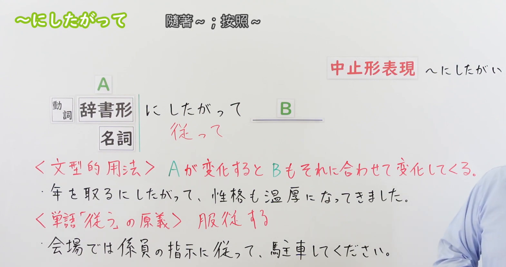
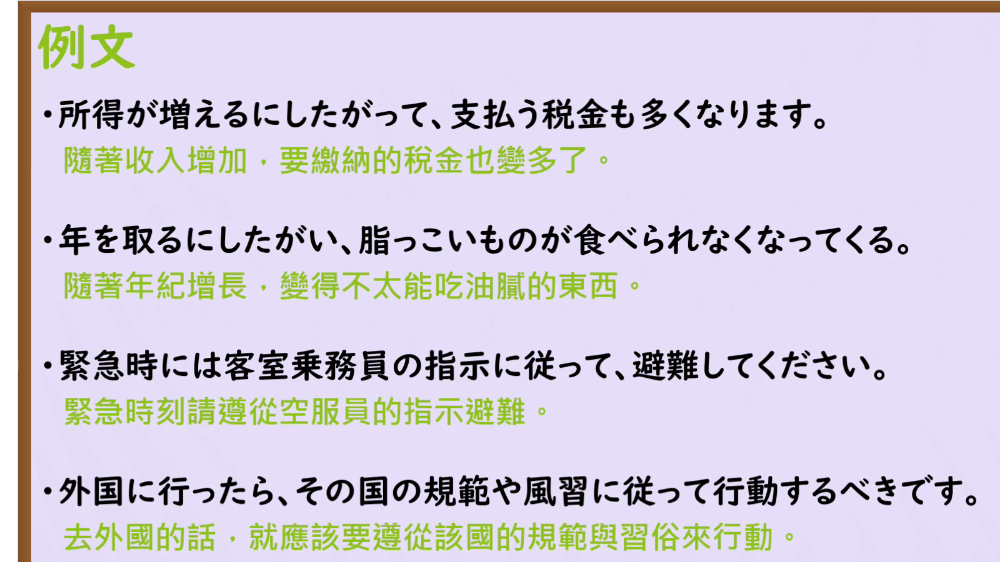

---
{
  "id": "N3-G-0055",
  "kind": "grammar",
  "level": "N3",
  "title": "～にしたがって（に従って）：随着……／按照……",
  "status": "confirmed",
  "card_revision": 1,
  "source": {
    "lesson": "N3 第55个语法",
    "material": "出口日語日语自动字幕、原视频板书与例句页、独立日文教学正文",
    "video": "https://www.youtube.com/watch?v=HhOaWKpx1U8",
    "screenshot": "assets/grammar/n3/N3-G-0055-0220.png",
    "screenshot_seconds": 140,
    "screenshot_crop": {
      "x": 0,
      "y": 0,
      "width": 1570,
      "height": 830
    }
  },
  "tags": [
    "伴随变化",
    "遵循",
    "指示",
    "书面语",
    "N3"
  ],
  "confusions": [
    "につれて",
    "にともなって",
    "に応じて",
    "とおりに",
    "にしたがい",
    "したがって"
  ],
  "schema_version": 1,
  "created_at": "2026-09-13",
  "updated_at": "2026-09-13",
  "next_review": "2026-09-20"
}
---

# N3 第55课｜～にしたがって（に従って）（已入库）

# 视频学习资料整理

按学习者指定范围整理；未提供个人理解或例句，不虚构学习者原始输出。已对照保存的播放列表第55项与本次取得的原视频元数据：标题「【Ｎ３文法】～にしたがって」、视频ID「HhOaWKpx1U8」、时长04:34。整理前未发现本课已有草稿、正式卡或复习事件。本卡已于2026-09-13确认入库，下次复习为2026-09-20。

主图取自[原视频02:20](https://www.youtube.com/watch?v=HhOaWKpx1U8&t=140s)。先检查00:01，再比较01:00、02:00、02:20；00:01右侧中止形和变化说明末尾有遮挡，02:20可看到完整接续、两种用法、两句板书例句及新增「服従する」说明。原帧1920×1080，固定左上角裁为(0, 0, 1570, 830)，裁去右侧大部分人物和底部空白；右侧仍保留少量人物，未遮挡主要教学文字，未抹除、重绘或拼接。

补充[原视频03:30例句页](https://www.youtube.com/watch?v=HhOaWKpx1U8&t=210s)。原帧1920×1080，固定左上角裁为(0, 0, 1600, 900)，保留四句日文及中文，无人物遮挡。

# 核心与接续

## **【动词辞书形／名词】＋にしたがって（に従って）**

本课有两种用法，不能把上面的总接续不加区分地套在每个意思上。

**① 随着A的变化，B也相应变化。**

| 类型 | 接续规则 | 示例 |
|---|---|---|
| 动词 | 动词辞书形＋にしたがって | 年を取るにしたがって／所得が増えるにしたがって |
| 名词 | 表示变化、进展等的名词＋にしたがって | 人口の増加にしたがって／時代の変化にしたがって |

前项需要能表达变化或进展；并不是任意名词、任意动作都可机械套用。名词不加「の／だ」后再接本句型。

形容词所描述的状态变化，先用「なる」构成动词短语，例如「寒い→寒くなるにしたがって」「静かだ→静かになるにしたがって」。不能写成「寒いにしたがって／静かにしたがって」来表达“随着变冷／变安静”。

**② 按照A；遵循A的指示、规则等去做。**

## **【名词】＋にしたがって（に従って）**

| 类型 | 接续规则 | 示例 |
|---|---|---|
| 名词 | 表示指示、规则、计划、引导等的名词＋にしたがって | 係員の指示にしたがって／規則にしたがって／矢印にしたがって |

这个意思来自「したがう（従う）」的本义，后项可以是有意志的行动、请求或命令，如「指示にしたがって、避難してください」。

**共同变体：にしたがい（に従い）**，是「したがいます（従います）」去ます的中止形，较正式。两种用法都可出现。句末使用です／ます时，前项仍按上述接续；「増えますにしたがって」不是本课接法。

# 语义边界与后项限制

1. **伴随变化要有对应关系**。A发生变化，B随之变化，常表现为逐渐发展。原课程说缓慢变化“较多”，不是规定必须达到某个时长，也不是任意两件同时发生的事都适用。
2. **两项不必同向增大**。A增加、B减少也可以；例如「山を登るにしたがって、気温が下がる」。重点是相应变化，不是数学上的正比例。
3. **不限于单向发展（外部补充）**。还可按照增减、好坏变化而相应调整，如「売り上げの増減にしたがって、ボーナスの額も変わる」。这类意思接近“随……而变／根据……调整”。
4. **后项常为自然变化，但不能写成“一律不能表达意志”**。在顺应前项变化而调整的语境中，可以说明安排或意向。ヤトモンキー明确举「学生が増えるにしたがって、教室を増やそうと思っている」。它表达随人数增长逐步增加教室的打算；并不意味着任意无关命令都可接在变化用法后。
5. **遵循用法的后项可明确要求行动**。「指示に従って避難してください」很自然，不违反上一用法的常见倾向。看见「てください」不能不辨词义就排除「に従って」。
6. **字形不是语义判定标准**。原课说文型用法常写平假名、原义用法常写汉字，这是书写倾向；「年を取るに従って」也能表示变化，不能仅凭是否写汉字判定是哪一种用法。
7. **与句首接续词区分**。「したがって（従って）」单独放在句首可表示“因此”，如「今日は休館日だ。したがって、中には入れない」。这是另一用法，不等于「名词＋にしたがって」。

# 原课板书例句

以下按02:20板书与原课日语字幕对应核对，中文为整理译文。

1. 年を取るにしたがって、性格も温厚になってきました。
   - 随着年龄增长，性格也逐渐变得温和了。
   - 「年を取る」和「温厚になる」构成相应变化。它是具体语境中的描述，不是对所有人的必然判断。
2. 会場では係員の指示に従って、駐車してください。
   - 在会场请按照工作人员的指示停车。
   - 遵循用法，前项为「係員の指示」，后项为请求。

# 课程例句

以下四句按03:30的原视频例句页核对，中文为整理译文。

1. 所得が増えるにしたがって、支払う税金も多くなります。
   - 随着收入增加，要缴纳的税金也会增多。
2. 年を取るにしたがい、脂っこいものが食べられなくなってくる。
   - 随着年龄增长，逐渐变得吃不下油腻的东西。
   - 「食べられなくなってくる」是能力或身体适应状况的变化；「にしたがい」是书面变体。
3. 緊急時には客室乗務員の指示に従って、避難してください。
   - 紧急情况下，请按照乘务员的指示避难。
4. 外国に行ったら、その国の規範や風習に従って行動するべきです。
   - 到了外国，应该遵循那个国家的规范和风俗行事。
   - 「規範」不是「規模」；此处说明遵循对象，不表达规范本身在逐渐变化。

# 自然例句（自拟）

1. 試験の日が近づくにしたがって、緊張が高まってきました。
   - 随着考试日期临近，我越来越紧张。
2. 人口の増加にしたがって、住宅の需要も増えています。
   - 随着人口增长，住宅需求也在增加。
3. 売り上げの増減にしたがって、ボーナスの額も変わります。
   - 奖金金额也随着销售额的增减而变化。
4. 画面の指示にしたがって、必要な情報を入力してください。
   - 请按照屏幕提示，输入必要的信息。

# 易混项与 JLPT 考点

| 表达 | 重点 | 区分线索 |
|---|---|---|
| にしたがって① | 随着变化相应变化，也可顺应变化进行调整 | 動詞辞書形／变化名词；可涉及增减两方向 |
| につれて | 随前项发展，后项逐渐自然变化 | 典型为单向发展；不用于“遵循指示”，也不宜机械替换调整意向句 |
| にともなって（に伴って） | 伴随变化或事件而出现另一变化、情况 | 表示随之发生；不等于按照指示做 |
| に応じて | 根据条件、需要等作相应变化或调整 | 条件本身不一定在逐渐变化 |
| にしたがって②／とおりに | 遵循指示、规则／按照所示方式去做 | 「指示に従って」与「指示のとおりに」注意助词不同 |

- **接续题**：○ 所得が増えるにしたがって；× 所得が増えたにしたがって；× 所得が増えるのにしたがって（若表达本课直接接续的伴随变化）。过去的变化可在后项表达，如「増えるにしたがって、税金も多くなった」。
- **词类题**：「人口の増加にしたがって」的「の」连接人口与増加，不是句型要求在名词与に之间加の。
- **意义题**：「指示／規則＋に従って」通常为遵循；「増える／進む／近づく＋にしたがって」通常为变化。必须结合上下文判断。
- **后项题**：区别自然变化与顺应变化的安排，也区别遵循用法；不要死记“にしたがって后面不能有意志”。
- **排序题**：可按「A的变化＋にしたがって＋B的相应变化」或「遵循对象＋に従って＋行动」组织语块。
- **阅读题**：表达相关变化不等于证明严格因果，更不保证两项以相同速度变化。

# 来源与复核记录

核对日期：2026-09-13。外部资料通过Firecrawl取得并阅读教学正文。

- [出口日語原视频](https://www.youtube.com/watch?v=HhOaWKpx1U8)：动词辞书形／名词接续、伴随变化、従う的原义、书写倾向、「にしたがい」及两类课程例句。
- [たのすけ：～にしたがって](https://tanosuke.com/nisitagatte/)：两种用法分别列接续；变化用法后项“多为”自然变化；双向变化、书面形式；遵循用法可接意志、助言或指示。
- [ヤトモンキー：N3文法「にしたがって」](https://yatomonkey-nihongo.com/entry/jlpt-n3-16)：两类接续、自然变化的常见倾向、增减两方向、与「につれて」的区别及「教室を増やそうと思っている」的意向例句。

资料差异处理：ヤトモンキー对个别「時間が経つにしたがって」例句标△，而たのすけ列有多种逐渐变化实例。本卡不据此宣布“时间经过不能用にしたがって”，只提炼双方支持的相应变化核心；「につれて」的单向发展作为典型辨析，不推导为所有真实语境的绝对禁令。后项限制依照来源原文的“多い”与明确意向例句处理，未扩大成禁止一切意志表达。

字幕校对：自动字幕「同市の辞書型」「名刺」「温故／本校」「ご支持」「養蜂」结合板书与上下文校正为「動詞の辞書形」「名詞」「温厚」「指示」「用法」。四句例句以原画面为准；字幕中无完整覆盖的文字未凭自动字幕猜补。

成稿复核：重新核对两种用法各自的接续与后项、形容词通过なる构成变化、名词不加の、书面变体、四句课程例句及译文；图片核对课程、实际时间、裁切后完整文字。正式卡元数据已记录确认日期与七天后的复习日期。正文图片引用以本地文件为依据，未进行iPad实机显示验收。

获取记录：复用`.firecrawl/n3-playlist-items.json`核对序号；本次取得原视频、元数据、日语VTT、候选原帧及`.firecrawl/n3-55-search.json`。缓存不提交；草稿与本课两图保留本地Git历史。学习者已明确确认入库，已创建正式卡及确认事件，复习固定每七天一次。
