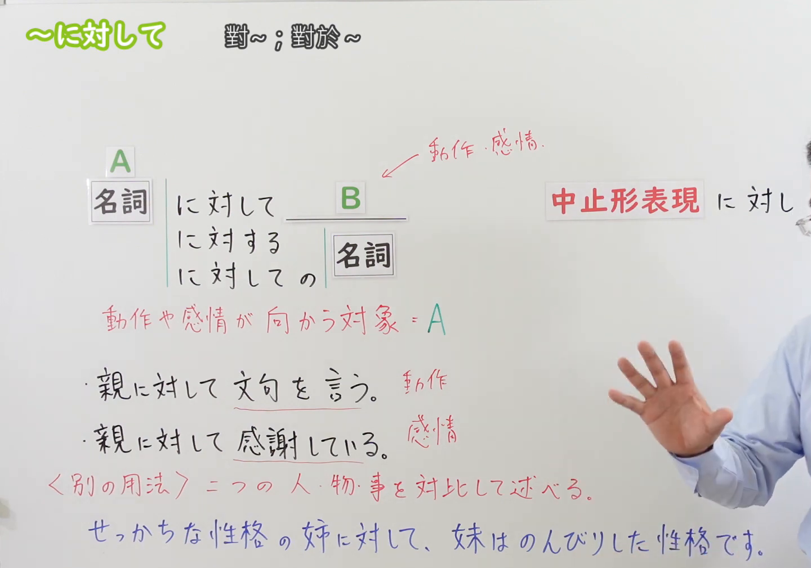
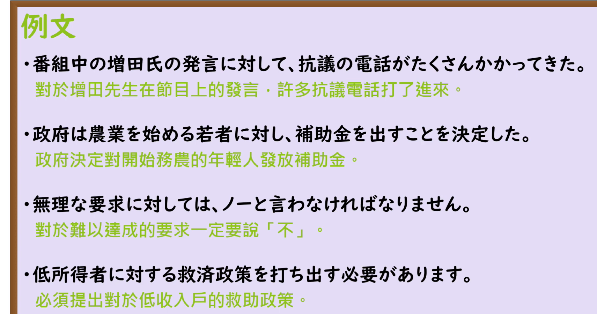

---
{
  "id": "N3-G-0056",
  "kind": "grammar",
  "level": "N3",
  "title": "～にたいして（に対して）：动作、感情的对象",
  "status": "confirmed",
  "card_revision": 1,
  "source": {
    "lesson": "N3 第56个语法",
    "material": "出口日語日语字幕、原视频板书与例句页、独立日文教学正文",
    "video": "https://www.youtube.com/watch?v=0IWbG_0KSjs",
    "screenshot": "assets/grammar/n3/N3-G-0056-0300.png",
    "screenshot_seconds": 180,
    "screenshot_crop": {
      "x": 0,
      "y": 0,
      "width": 1440,
      "height": 1010
    }
  },
  "tags": [
    "对象",
    "态度",
    "感情",
    "对比",
    "N3"
  ],
  "confusions": [
    "にたいする",
    "について",
    "にくらべて",
    "のに対して",
    "に反して"
  ],
  "created_at": "2026-09-13",
  "updated_at": "2026-09-13",
  "next_review": "2026-09-20"
}
---

# N3 第56课｜～にたいして（に対して）

# 视频学习资料整理

学习者指定继续第56、57课，未提供个人理解或例句，不虚构学习者原始输出。已核对保存的播放列表第56项与本次取得的原视频元数据：标题「【Ｎ３文法】～に対して」、视频ID「0IWbG_0KSjs」、时长05:02。整理前未发现本课已有草稿、正式卡或复习事件。本卡未确认入库，不启动复习。

原课程主要讲“动作、感情所指向的对象”，末段板书简要介绍另一种“对比”用法，并说明会另作讲解。本卡保持这个主次，另以外部资料补充对比接续，不扩展生成其他课卡片。

主图取自[原视频03:00](https://www.youtube.com/watch?v=0IWbG_0KSjs&t=180s)。先检查00:01，右侧中止形及底部对比例句被遮挡；再比较01:00、01:40、01:50、02:00、02:05、02:30及03:00，选取文字完整的03:00。原帧1920×1080，固定左上角裁为(0, 0, 1440, 1010)，保留名词接续、三种后接形式、含义、动作／感情例句和底部对比例句。右侧仍有手臂及少量人物，不遮挡主要文字；未抹除、补写或拼接。

补充[原视频03:30例句页](https://www.youtube.com/watch?v=0IWbG_0KSjs&t=210s)。原帧1920×1080，固定左上角裁为(0, 0, 1710, 900)，保留四句日文和中文，裁去右侧、底部空白，无人物遮挡。

# 核心与接续

## **【名词】＋にたいして（に対して）**

**对……；对于……；以……为动作、感情或态度的对象。** 在「AにたいしてB」中，A是B所针对的对象。对象可以是人、团体，也可以是发言、意见、要求等事项。

| 类型 | 接续规则 | 示例 |
|---|---|---|
| 名词 | 名词＋にたいして＋谓语表达 | 親にたいして感謝している |
| 名词 | 名词＋にたいする＋名词 | 親にたいする感謝／低所得者にたいする救済政策 |
| 名词 | 名词＋にたいしての＋名词（原课补充形式） | 親にたいしての感謝 |

- **后接名词优先掌握「にたいする」**。原课也列「にたいしての」，说明前者更常见；不要记成「にたいして＋名词」而漏掉修饰形式的变化。
- **书面中止形：にたいし（に対し）**，如「若者に対し、補助金を出す」。意思仍是针对对象，语体较正式。
- **加は／も**：「にたいしては」可突出或对照某个对象；「誰にたいしても」表示“对任何人都……”。这些助词不改变对象主接续。
- 名词后不加「の／だ」再接：○ 親にたいして；× 親のにたいして；× 親だにたいして。
- 「親にたいして、丁寧に話してください」可用于请求；本课不禁止意志、命令或劝告，关键是后项确实针对该对象。

## 学习者疑问补充：图片中的“中止形表现”

学习者原文：

> N3第56个语法的草稿中图片有“中止形表现”是什么意思

**「中止形表現（ちゅうしけいひょうげん）」指句子在这里暂作停顿，后面继续说下去的连接形式。** 这里的“中止”不是“停止做某事”，也不表示整句话已经结束。

本课具体指 **「にたいし（に対し）」**，与「にたいして（に対して）」意思基本相同，但更常用于书面语、新闻或正式说明。「たいし（対し）」是「たいする（対する）」的连用形，在这里连接后文。

对比例句（自拟）：

> 政府は若者に**対して**、補助金を出す。
>
> 政府は若者に**対し**、補助金を出す。
>
> 政府向年轻人发放补助金。

两句都把年轻人作为发放补助金的对象，第二句语气更正式。先掌握 **「名词＋にたいし、……」≈「名词＋にたいして、……」** 即可；逗号表示便于阅读的停顿，并非必须添加。

**易错点／JLPT 考点**：在阅读和接续题中，要能认出「にたいし」仍表示本课的对象关系；不能据此推断所有「て形」都能直接去掉「て」。

# 语义边界与适用条件

1. **既可表达积极态度，也可表达消极态度**：感謝する、親切だ、敬意を持つ，以及文句を言う、抗議する、反抗する等都可以；不是只有“反对”。
2. **对象不限于人**。课程的「発言に対して抗議する」「無理な要求に対してノーと言う」说明也可以针对事情作出反应。
3. **与话题区别**：「先生について話す」是谈论老师；「先生に対して話す」是向老师说话。前者是说话内容，后者是说话对象。
4. **不能把所有助词に都换成に対して**。「学校に行く」的に表示目的地，不说「学校に対して行く」来表达去学校；「髪に触る」也不能机械换成「髪に対して触る」。
5. **比单独的に更突出对象及针对性**，常见于正式说明、态度评价、政策和回应；并非只有公文才能使用。
6. **对象形式也可以与对照语气共存**：「男の子に対しては厳しいが、女の子に対しては優しい」分别标出态度的对象，同时对照两种态度。不要仅见句中有对照就断定每个「に対して」都是下面的对比句型。

# 对比用法（原课提示＋外部补充）

**把两个人或事项放在一起，突出不同的性质、状态。** 原课例句：

> せっかちな性格の姉に対して、妹はのんびりした性格です。
>
> 姐姐性子急，而妹妹性格悠闲。

这里「姉」不是妹妹态度的对象；是在对照姐姐与妹妹。

对照两个名词性对象时，可用「名词＋にたいして」。对照完整的状态或事实时，外部资料列出以下接续：

## **【普通形（な・な）】＋のにたいして（のに対して）**

括号依次对应な形容词、名词的现在肯定形：だ改为な，接上「のに対して」成为「なのに対して」；两者也可用较正式的「であるのに対して」。这里的名词例外不是「の」；不能套成「普通形（な・の）」。

| 类型 | 接续规则 | 示例（自拟） |
|---|---|---|
| 动词 | 普通形＋のにたいして | 兄は働いているのに対して、弟は大学で勉強している |
| い形容词 | 普通形＋のにたいして | 昼は暑いのに対して、夜は涼しい |
| な形容词 | 现在肯定：词干＋な／である＋のにたいして；其他形式按普通形 | 姉は活発なのに対して、妹はおとなしい |
| 名词 | 现在肯定：名词＋な／である＋のにたいして；其他形式按普通形 | 兄は会社員なのに対して、弟は学生だ |

过去或否定保留相应形式，例如「昨日は静かだったのに対して、今日はにぎやかだ」「兄は料理をしないのに対して、弟は毎日作る」。不要把「だった」一律改为な。

此处的「の」将前项名词化；不能把整个「のに対して」误认成单独的逆接助词「のに」。本课仍以对象用法为重点，对比接续作为辨析补充。

# 原课板书例句

以下按03:00板书与日语字幕互相核对，中文为整理译文。

1. 親に対して文句を言う。
   - 对父母抱怨。
   - 「文句を言う」是动作，父母是动作所针对的对象。
2. 親に対して感謝している。
   - 对父母心怀感激。
   - 「感謝している」表示感情或态度，父母是该感情的对象。

# 课程例句

以下四句来自03:30例句页，中文为整理译文。

1. 番組中の増田氏の発言に対して、抗議の電話がたくさんかかってきた。
   - 针对增田先生在节目中的发言，打来了许多抗议电话。
2. 政府は農業を始める若者に対し、補助金を出すことを決定した。
   - 政府决定向开始务农的年轻人发放补助金。
   - 「農業を始める」修饰「若者」，接续中心仍是名词若者，不是动词辞书形接に対し。
3. 無理な要求に対しては、ノーと言わなければなりません。
   - 对于不合理或难以接受的要求，必须说“不”。
4. 低所得者に対する救済政策を打ち出す必要があります。
   - 有必要出台面向低收入者的救助政策。
   - 后接名词「救済政策」，所以用「に対する」。

# 自然例句（自拟）

1. 彼は誰にたいしても丁寧に話します。
   - 他对任何人说话都很有礼貌。
2. この提案にたいして、いくつか質問があります。
   - 针对这项提案，我有几个问题。
3. 先生にたいする感謝の気持ちを手紙に書きました。
   - 我把对老师的感激之情写进了信里。

# 易混项与 JLPT 考点

| 表达 | 重点 | 对照 |
|---|---|---|
| にたいして（对象） | 行为、感情、态度指向谁或什么 | お客様に対して説明する |
| について | 谈论、调查等的内容或话题 | 商品について説明する |
| にたいする＋名词 | 在名词前修饰，指出对象 | お客様に対する説明 |
| にたいして（对比） | 对照不同对象的性质、状态 | 活発な兄に対して、弟はおとなしい |
| にくらべて | 以某项为基准进行比较 | 去年に比べて今年は暑い |
| に反して | 违背预期、意愿等 | 予想に反して売れなかった |

- **接续题**：对象用法先找名词；后面若接「態度／感謝／政策」等名词，优先检查「に対する」。
- **意义题**：问“对谁抱怨”用に対して；问“谈什么内容”用について。
- **排序题**：「低所得者＋に対する＋救済政策」构成一个名词短语；不要把「に対する」放在句末当作完整谓语。
- **形态题**：识别「に対し」「に対しては」「誰に対しても」，以及原课列出的「に対しての」。
- **对比扩展**：动词、い形容词表达的完整前项后需有名词化の；な形容词、名词现在肯定常为「なのに対して／であるのに対して」。

# 来源与复核记录

核对日期：2026-09-13。通过Firecrawl读取以下独立教学正文，未以搜索摘要代替核对。

- [出口日語原视频](https://www.youtube.com/watch?v=0IWbG_0KSjs)：对象主用法、名词接续、「に対する／に対しての」、中止形「に対し」、对比提示及四句课程例句。
- [日本語NET：〜に対して（対象・対比）](https://nihongokyoshi-net.com/2018/08/07/jlptn3-grammar-nitaishite/)：对象用法的名词接续与后接名词的に対する；对比用法中名词和な形容词的「なのに／であるのに」。网页接续栏「であるのに対してい」多出い，按例句与其他来源校正，不照抄。
- [たのすけ：～に対して](https://tanosuke.com/nitaishite/)：对象与话题的差异，不能机械替换所有に；名词对照与普通形＋のに対して的区别。
- [日本語教師のN1et：に対して](https://jn1et.com/nitaisite/)：对象主接续、に対する／に対し实例；对比接续展开到动词、い形容词、な形容词与名词。

资料范围处理：たのすけ有关比例分配用法的概括不是本课核心，本卡未据此声称に対して绝无比例用法。对比用法保持为补充，不把所有“对象”例句改解成比较。「に対しての」来自本课明确板书，独立资料重点列常用的「に対する」，本卡保留主次。

字幕校对：自动字幕的「名刺」「名滋」「無冠対象」「養蜂」结合画面与语境校正为「名詞」「向かう対象」「用法」。例句页的「増田氏」「補助金」「救済政策」均按原画面核对。

成稿复核：逐项重读名词主表、后接名词变体、对象／话题／对比边界及扩展接续，核对四句课程例句与中文。主图保留完整接续及必要教学板书，未裁成小接续表；实际时间、尺寸及本地图片引用已检查。元数据保持未确认，不设置正式复习日期。未进行iPad实机图片显示验收。

获取记录：复用`.firecrawl/n3-playlist-items.json`；本次下载视频、元数据、日语VTT及候选原帧，独立检索缓存为`.firecrawl/n3-56-search.json`。缓存不提交；草稿与本课两图保存本地Git历史。明确“确认入库”后才创建正式卡，并从确认日启动七天复习。

