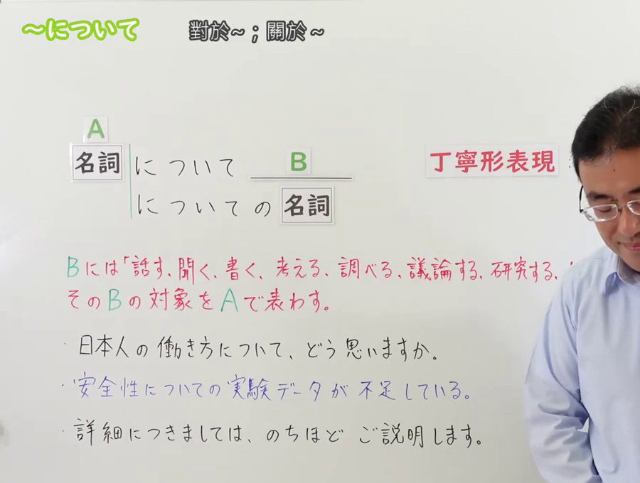
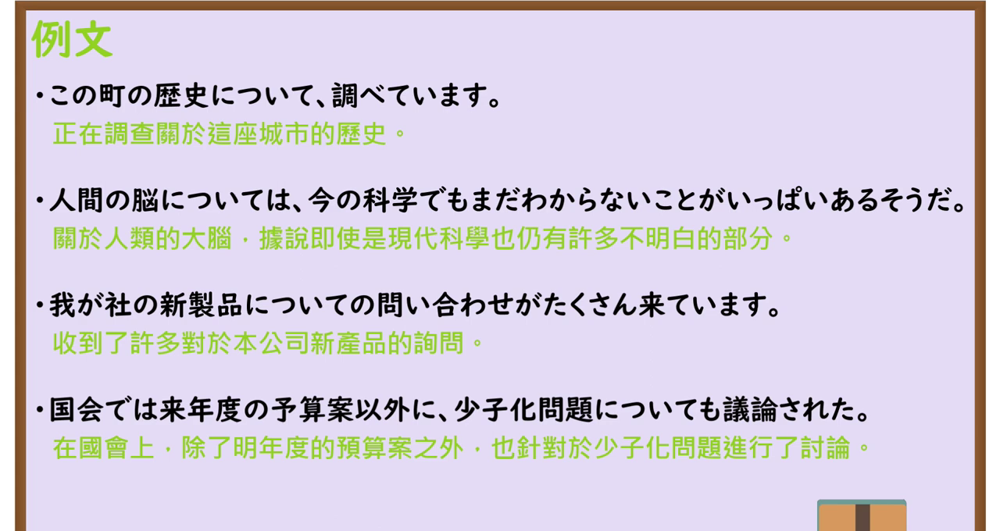

---
{
  "id": "N3-G-0058",
  "kind": "grammar",
  "level": "N3",
  "title": "～について：关于……；就……而言",
  "status": "confirmed",
  "card_revision": 1,
  "source": {
    "lesson": "N3 第58个语法",
    "material": "出口日語日语字幕、原视频板书与例句页、独立日文教学正文",
    "video": "https://www.youtube.com/watch?v=_pvv-aU--5Y",
    "screenshot": "assets/grammar/n3/N3-G-0058-0001.png",
    "screenshot_seconds": 1,
    "screenshot_crop": {"x": 0, "y": 0, "width": 900, "height": 680}
  },
  "tags": ["话题", "内容对象", "关于", "N3"],
  "confusions": ["に関して", "に対して", "を巡って", "につきまして", "についての"],
  "created_at": "2026-09-13",
  "updated_at": "2026-09-13",
  "next_review": "2026-09-20"
}
---

# N3 第58课｜～について

# 视频学习资料整理

按学习者指定范围整理；未提供个人理解或例句，不虚构学习者原始输出。已核对保存的播放列表第58项与原视频元数据：标题「【Ｎ３文法】～について」、视频ID「_pvv-aU--5Y」、时长04:35。学习者于2026-09-13确认入库，本卡从确认日开始七天复习周期。

主图取自[原视频00:01](https://www.youtube.com/watch?v=_pvv-aU--5Y&t=1s)。该时点同时显示名词接续、后接名词的形式、丁寧表現「につきまして」、可搭配的动作／思考动词、含义说明及三条例句；没有只保留接续表。原帧1280×720，固定左上角裁为(0, 0, 900, 680)，收拢右侧人物和底部空白；保留板书文字及必要例句，未抹除、补写或拼接。

补充[原视频03:00例句页](https://www.youtube.com/watch?v=_pvv-aU--5Y&t=180s)。原帧1280×720，固定左上角裁为(0, 0, 1280, 680)，保留四条例句及中文说明，去除底部空白。

# 核心与接续

## **【名词】＋について（は／も）／【名词】＋についての＋名词**

**关于……；就……；以……为话题或内容。** 「AについてB」表示 A 是 B（说、听、写、想、调查、讨论、研究、知道等）的内容或话题，中文可按后项译成“关于 A……”“就 A……”。

| 类型 | 接续规则 | 示例 |
|---|---|---|
| 名词 | 名词＋について，B（B为后续谓语或句子） | 日本人の働き方について，どう思いますか。 |
| 名词 | 名词＋については／についても＋谓语 | 人間の脳については、まだ分からないことが多い。 |
| 名词 | 名词＋についての＋名词 | 安全性についての実験データ／新製品についての問い合わせ |

- 「について」前面接名词，不把动词、い形容词或な形容词普通形直接当作本课的基本接续。若要表达“关于某个动作／状态”，先把内容名词化或改成名词短语，例如「日本へ行くことについて話す」。
- 「についての」中的「の」把前面的主题短语连接到后面的名词；不能写成「について＋名词」。例如「歴史についての本」表示“关于历史的书”。
- 「は」「も」可加在「について」后突出或追加话题：「環境問題については」「日本についても」。
- 礼貌、较正式的形式是 **につきまして**（关于……、就……而言），前面仍接名词；常见于说明、通知和服务用语，例如「詳細につきましては、後ほどご説明します」。这不是「について」的普通词尾变化。

# 语义边界与适用条件

1. **内容／话题，不是动作的对方。**「お客様について説明する」是说明关于顾客的内容；「お客様に対して説明する」是向顾客说明，顾客是听话对象。
2. 常和「話す・聞く・考える・思う・書く・調べる・説明する・議論する・研究する・知っている」等表示言语、思考、调查或知识的表达一起使用；动词清单是典型搭配，不是封闭清单。
3. 「について」的主题可以是人、事物、问题、制度或抽象概念，不限于地点或学术题目。「彼について何でも知っている」中的「彼」也是话题。
4. 「に関して」也表示关于某主题，但通常比「について」更硬、更正式，常见于书面、报告或正式说明；两者不能简单理解成接续不同而意义完全不同。
5. 「を巡って」也涉及某个议题，但常带围绕议题发生争论、对立或多方讨论的语气；个人“思考／调查某事”一般用「について」，不机械替换成「を巡って」。

# 原课板书例句与讲解

以下依原视频板书、日语字幕和例句页核对，中文为整理译文。

1. 日本人の働き方について、どう思いますか。
   - 你对日本人的工作方式有什么看法？
2. 安全性についての実験データが不足している。
   - 关于安全性的实验数据不足。
3. 詳細につきましては、後ほどご説明します。
   - 关于详情，我们稍后再说明。

原视频说明 A 是话题／对象，B 可放入「話す、聞く、書く、考える、調べる、議論する、研究する、知っている」等表达；并以「について」与更高等级的「に関して」作语体提示。

# 课程例句

以下来自原视频约03:00例句页，中文为整理译文。

1. この町の歴史について調べています。
   - 我正在调查这座城镇的历史。
2. 人間の脳については、今の科学でもまだ分からないことがいっぱいあるそうだ。
   - 听说即使以现在的科学，对人类大脑仍有很多不了解的地方。
3. 我が社の新製品についての問い合わせがたくさん来ています。
   - 收到了很多关于我公司新产品的咨询。
4. 国会では来年度の予算案以外に、少子化問題についても議論された。
   - 国会除了明年度预算案之外，也讨论了少子化问题。

# 会话例句（原课）

女：今度、クラスで台湾のことについて話をしてほしいと頼まれたんですが、日本人は台湾のどんなことに関心があるんでしょうか。

男：僕だったら、日本にはない食べ物とか知りたいな。

女：呉さんは台北出身だよね？

男：はい、台北生まれ台北育ちです。

男：じゃあ、台北の観光スポットを紹介するのもいいと思うよ。

- 这段会话中的「台湾のことについて」可理解为“关于台湾的事情”；「台湾について」也可表达同一核心话题，原课保留了「～のことについて」的说法。

# 自然例句（自拟）

1. 来週の発表について、先生に相談しました。
   - 我就下周的发表向老师请教了。
2. そのニュースについて、まだ詳しいことは分かりません。
   - 关于那条新闻，详细情况我还不知道。
3. 日本の歴史についての本を図書館で借りました。
   - 我在图书馆借了一本关于日本历史的书。

# 易混项与 JLPT 考点

| 表达 | 重点 | 对照 |
|---|---|---|
| について | 关于某主题，表示说话、思考、调查等的内容 | 環境問題について考える |
| についての＋名词 | “关于……的……”名词短语 | 環境問題についての本 |
| につきまして | について的礼貌、正式说法 | 詳細につきましては後ほど説明します |
| に関して | 意义近似，语体较硬、正式 | 本件に関して報告する |
| に対して | 行为、态度所针对的对象或对比对象 | お客様に対して説明する |
| を巡って | 围绕议题发生争论、对立或多方讨论 | その問題を巡って議論する |

- **接续题**：○「歴史について調べる」「歴史についての本」；×「歴史につく本」。
- **助词题**：○「日本については」「日本についても」；「は／も」接在「について」后，不把「については」拆成另一套基本句型。
- **对象／内容辨析**：问“谈论的内容是什么”用「について」；问“向谁说／对谁采取态度”检查「に対して」。
- **敬语辨析**：「につきまして」仍然是关于某主题的表达，不是动词「つく」的变形，也不改写成「についてです」来表示所有正式场合。
- **后接名词**：看到「について＋名词」时检查是否应为「についての＋名词」；例如「新製品についての問い合わせ」。

# 来源与复核记录

核对日期：2026-09-13。通过 Firecrawl 读取原视频转录和以下独立日文教学正文，未以搜索摘要代替正文核对。

- [出口日語原视频](https://www.youtube.com/watch?v=_pvv-aU--5Y)：名词接续、についての＋名词、につきまして、典型对象动词、板书和四条例句；视频时长及实际截图时点也由原视频页面和下载帧核对。
- [日本語教師のN1et： 「について」【N3】](https://jn1et.com/nituite/)：N＋について、N＋についての＋N、表示「話す・聞く・調べる」等行为的对象，以及与に関して、に対して、を巡って的区别。
- [たのすけ：N3文法解説「～について」](https://tanosuke.com/n3-nitsuite)：N＋について、后接名词时用NについてのN、话题含义、典型动词及与に関して、に対して的语体和内容／对方区别。
- [日本語904： 「～について」教案](https://note.com/yy46/n/ne37da98a6ee2)：N＋について（は・も～）、N＋についての＋N、关于话题的用法和课堂例句。

资料差异处理：独立资料把「について」的典型后项动词列成不同长度的清单，本卡将其作为常见搭配而非封闭限制；N1et 和たのすけ都把「に関して」说明为较硬／正式，本卡采用“语体倾向”而不写成绝对禁止。「台湾のことについて」来自原课会话，保留其自然表达，同时注明「台湾について」也可表达核心话题。

字幕校对：自动字幕中的「名刺」按板书与语境校正为「名詞」，「丁寧表現」及「につきまして」按画面核对；例句中的「我が社」「少子化問題」「来年度の予算案」以原视频例句页为准。

成稿复核：重新核对名词主接续、についての后接名词、は／も、につきまして、内容／对象边界和三组易混表达；核对主图同时保留接续与含义说明／例句，未裁成只有接续的小图；检查两张本地图片的实际时间、尺寸和引用。学习者已确认入库，确认日为2026-09-13，下次复习为2026-09-20；未进行 iPad 实机图片显示验收。

获取记录：播放列表信息复用`.firecrawl/n3-playlist-items.json`；本次原视频正文保存为`.firecrawl/n3-58-video.md`，独立资料结果及正文保存为`.firecrawl/n3-58-search.json`、`.firecrawl/n3-58-tanosuke.md`和`.firecrawl/n3-58-note.md`。视频帧及裁切过程保留在`.firecrawl/`临时缓存，正式图片已复制到资料库。明确“确认入库”后才创建正式卡，并从确认日启动七天复习。
