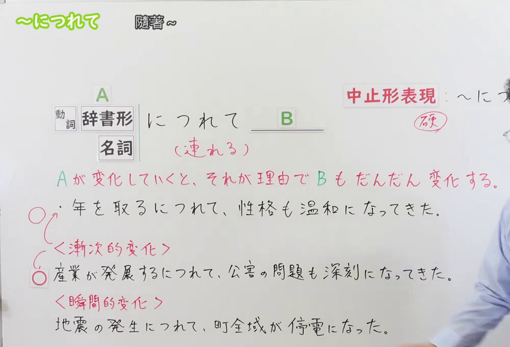
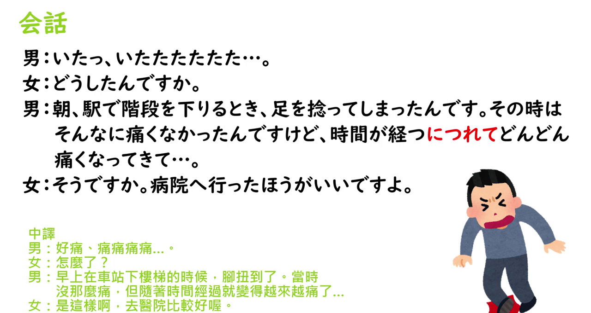

---
{
  "id": "N3-G-0059",
  "kind": "grammar",
  "level": "N3",
  "title": "～につれて（～につれ）：随着……逐渐……",
  "status": "confirmed",
  "card_revision": 1,
  "source": {
    "lesson": "N3 第59个语法",
    "material": "出口日語日语字幕、原视频板书与例句页、独立日文教学正文",
    "video": "https://www.youtube.com/watch?v=NWBRG-5umrc",
    "screenshot": "assets/grammar/n3/N3-G-0059-0180.png",
    "screenshot_seconds": 180,
    "screenshot_crop": {"x": 0, "y": 0, "width": 1000, "height": 680}
  },
  "tags": ["渐次变化", "伴随变化", "随着", "N3"],
  "confusions": ["にしたがって", "とともに", "にともなって", "と同時に", "につれ"],
  "created_at": "2026-09-13",
  "updated_at": "2026-09-13",
  "next_review": "2026-09-20"
}
---

# N3 第59课｜～につれて（～につれ）

# 视频学习资料整理

按学习者指定范围整理；未提供个人理解或例句，不虚构学习者原始输出。已核对保存的播放列表第59项与原视频元数据：标题「【Ｎ３文法】～につれて」、视频ID「NWBRG-5umrc」、时长05:41。学习者于2026-09-13确认入库，本卡从确认日开始七天复习周期。

主图取自[原视频03:00](https://www.youtube.com/watch?v=NWBRG-5umrc&t=180s)。先检查00:01；该时点接续和渐次／瞬间变化板书均有，但人物遮挡右侧部分说明。03:00 时接续、A／B 变化说明、渐次变化例句和瞬间变化的错误示例更完整，选为主图。原帧1280×720，固定左上角裁为(0, 0, 1000, 680)，保留接续和必要教学板书；右侧仍有少量人物，未遮挡主接续及关键例句，未抹除、补写或拼接。

补充[原视频05:00](https://www.youtube.com/watch?v=NWBRG-5umrc&t=300s)会话页。原帧1280×720，固定左上角裁为(0, 0, 1280, 680)，保留「時間が経つにつれて」的自然会话和中文说明，去除底部空白。

# 核心与接续

## **【动词辞书形／名词】＋につれて（につれ），B**

**随着 A 的变化，B 也逐渐发生变化。** A 是先行或伴随变化，B 是随之出现的渐次变化；两边通常都要能表达变化，不能只把「につれて」当作一般的“因为”。

| 类型 | 接续规则 | 示例 |
|---|---|---|
| 动词 | 动词辞书形＋につれて，B | 年を取るにつれて、性格も温和になってきた。 |
| 名词 | 表示变化的名词＋につれて，B | 産業の発展につれて、公害の問題も深刻になってきた。 |

- 名词前面不加「のだ」：「人口の増加につれて」「経済の発展につれて」。独立资料也将名词限制为能表达变化、且通常可理解为「名词＋する」的内容。
- 「につれ」是「につれて」的较简略、偏书面的中止形表现，例如「環境への関心が高まるにつれ、注目が集まっている」。原课说明「につれて」较自然，「につれ」较硬；两者核心意义相同。
- B 通常是自然发生或逐渐形成的变化，不接说话人的意志、命令、请求或邀请。例如「時間が経つにつれて、嫌なことを忘れよう」不自然；表达意志时要另用句型。

# 语义边界与适用条件

1. **强调渐次变化。**「年を取るにつれて性格も変わる」表示随着年龄增长，性格逐渐改变；不是一次事件造成的瞬间结果。
2. **前后项都应有变化。** A 可以是「年を取る」「科学が進歩する」「産業が発展する」等动词或变化名词，B 也应是「深刻になる」「増える」「分かってくる」等变化表达。
3. **通常只用于朝一个方向发展的变化。**「営業成績の増減につれて、ボーナスが変わる」把增减作为双向变化时不适合用「につれて」；可考虑「にしたがって」或「にともなって」等，具体依语境判断。
4. **瞬间变化另用表达。** 原课以「地震の発生につれて、町全域が停電になった」说明地震发生和停电都是瞬间变化，不能用本句型；可改为「地震の発生とともに／に伴って、町全域が停電になった」。这里是原课的错误示例，不是课程正确例句。
5. 「につれて」可用于时间推移、程度变化、成长或社会变化；不把它固定翻译成单一的“因为”。后项是伴随变化的结果，因果关系要由上下文理解。

# 原课板书例句与讲解

以下依原视频板书、日语字幕和画面核对，中文为整理译文。

1. 年を取るにつれて、性格も温和になってきた。
   - 随着年龄增长，性格也逐渐变得温和起来。
2. 産業が発展するにつれて、公害の問題も深刻になってきた。
   - 随着产业发展，公害问题也逐渐严重起来。
3. 地震の発生につれて、町全域が停電になった。×
   - 地震发生后，全市停电。×（两者是瞬间变化，不用「につれて」）
   - 可说：地震の発生とともに／に伴って、町全域が停電になった。

原课把前项 A 解释为“发生变化”，该变化成为理由，使 B 也逐渐变化；并指出「につれて」来自「連れる」的“伴随”概念，但句型中通常写平假名「につれて」。

# 课程例句

以下来自原视频例句页，中文为整理译文。

1. 年を取るにつれて、太りやすく痩せにくい体になってきました。
   - 随着年龄增长，身体逐渐变得容易发胖、难以变瘦。
2. 科学が進歩するにつれて、便利な製品が次々に生み出されていく。
   - 随着科学进步，便利的产品不断被制造出来。
3. 環境への関心が高まるにつれ、環境にやさしい製品に注目が集まっている。
   - 随着人们对环境的关注提高，环保产品越来越受到关注。
4. 途上国では経済の発展につれて、公害の問題も深刻になってきている。
   - 在发展中国家，随着经济发展，公害问题也逐渐严重起来。

# 会话例句（原课）

男：いたっ、いたたたたた……。

女：どうしたんですか。

男：朝、駅で階段を下りるとき、足をひねってしまったんです。その時はそんなに痛くなかったんですけど、時間が経つにつれてどんどん痛くなってきて……。

女：そうですか。病院へ行ったほうがいいですよ。

- 「時間が経つにつれて、どんどん痛くなってきた」表示时间经过这一变化使疼痛逐渐加重，符合本课的渐次变化。

# 自然例句（自拟）

1. 日本で暮らすにつれて、少しずつ日本の生活に慣れてきた。
   - 随着在日本生活，我逐渐习惯了日本的生活。
2. 駅に近づくにつれて、電車の中の人が立ち始めた。
   - 随着接近车站，电车里的人开始站起来。
3. 勉強が進むにつれ、知らない言葉が増えていった。
   - 随着学习深入，不认识的词越来越多。

# 易混项与 JLPT 考点

| 表达 | 重点 | 对照 |
|---|---|---|
| につれて | A 变化时 B 也逐渐变化，通常是一方向的自然变化 | 年を取るにつれて、体力が落ちてきた |
| につれ | につれて的简略、较书面形式 | 時間が経つにつれ、慣れてきた |
| にしたがって | 随着变化／按照某变化趋势；可用于「増減」等双向变化，限制较少 | 売り上げの増減にしたがって、ボーナスが変わる |
| とともに | 随着、与……一起；用法范围较广 | 年齢とともに、考え方が変わった |
| にともなって | 随着某变化而伴随变化，较正式；也可作「に伴う＋名词」 | 人口増加に伴って、問題が増えた |
| と同時に | 与某事件同时、几乎同一时点发生 | 地震の発生と同時に、停電した |

- **接续题**：○「年を取るにつれて」「産業の発展につれて」；×「年を取ったにつれて」「暑いにつれて」。い形容词不能直接接，需改成「暑くなるにつれて」等。
- **意义题**：B 若是说话人的意志、邀请或命令，通常不选「につれて」；若是瞬间同时发生，优先检查「と同時に」「とともに」或「に伴って」。
- **辨析题**：看到「増減」「上がったり下がったり」等双向变化，不把「につれて」当作无条件替换「にしたがって」。
- **形式题**：动词用辞书形，不用た形或ます形；名词用「名词＋につれて」，不要添加「のだ」。
- **阅读题**：先判断 A 和 B 是渐次变化还是瞬间事件，再判断「につれて」表达的是伴随变化，不是单纯原因或时间点。

# 来源与复核记录

核对日期：2026-09-13。通过 Firecrawl 读取原视频转录和以下独立日文教学正文，未以搜索摘要代替正文核对。

- [出口日語原视频](https://www.youtube.com/watch?v=NWBRG-5umrc)：动词辞书形／名词接续、A 与 B 的渐次变化、较书面的「につれ」、渐次变化与瞬间变化的区分、四句例句和会话页。
- [日本語教師のN1et： 「につれて」【N3】](https://jn1et.com/niturete/)：V辞书形／N 接续、前后项均为变化、后项不接意志或劝诱、双向增减限制及「につれ」。
- [たのすけ：N3文法解説「～につれて」](https://tanosuke.com/nitsurete/)：变化名词／动词接续、渐次变化含义、意志表达限制、单方向变化限制，以及与「にともなって」「とともに」「にしたがって」的区别。
- [日本語NET：文法・例文「〜につれて」](https://nihongokyoshi-net.com/2018/09/08/jlptn3-grammar-nitsurete/)：V辞书形接续、随变化逐渐变化的含义和例句复核来源。

资料差异处理：独立资料对「とともに」「にともなって」「にしたがって」的适用范围有教学简化差异，本卡只保留对本课最有用的倾向，不写成绝对互斥规则；「につれて」对双向增减的限制和后项不接意志在 N1et、たのすけ及原课讲解中方向一致。原课把「地震の発生につれて」作为瞬间变化的错误示例，本卡明确标注为×并给出替代表达，未误收为课程正确例句。

字幕校对：自动字幕中的「同市型」「漸次的変化」「瞬間的変化」结合板书和语境校正为「動詞辞書形」「漸次的変化」「瞬間的変化」；例句中的「公害」「途上国」「環境への関心」按画面核对。

成稿复核：重新核对动词辞书形、名词接续、につれ变体、渐次／瞬间变化边界、意志限制和双向变化限制；核对主图同时保留接续、含义说明及两类变化示例，未裁成只有接续的小图；检查两张本地图片的实际时间、尺寸和引用。学习者已确认入库，确认日为2026-09-13，下次复习为2026-09-20；未进行 iPad 实机图片显示验收。

获取记录：播放列表信息复用`.firecrawl/n3-playlist-items.json`；本次原视频正文保存为`.firecrawl/n3-59-video.md`，独立资料结果及正文保存为`.firecrawl/n3-59-search.json`、`.firecrawl/n3-59-n1et.md`、`.firecrawl/n3-59-tanosuke.md`和`.firecrawl/n3-59-nihongonet.md`。视频帧及裁切过程保留在`.firecrawl/`临时缓存，正式图片已保存到资料库。明确“确认入库”后才创建正式卡，并从确认日启动七天复习。
