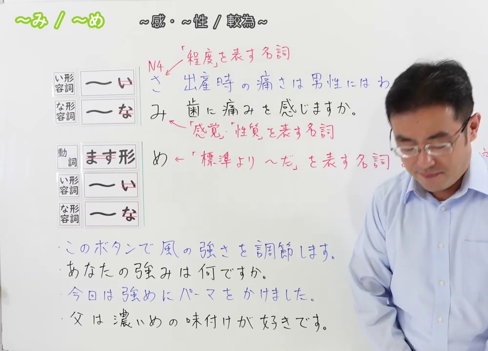
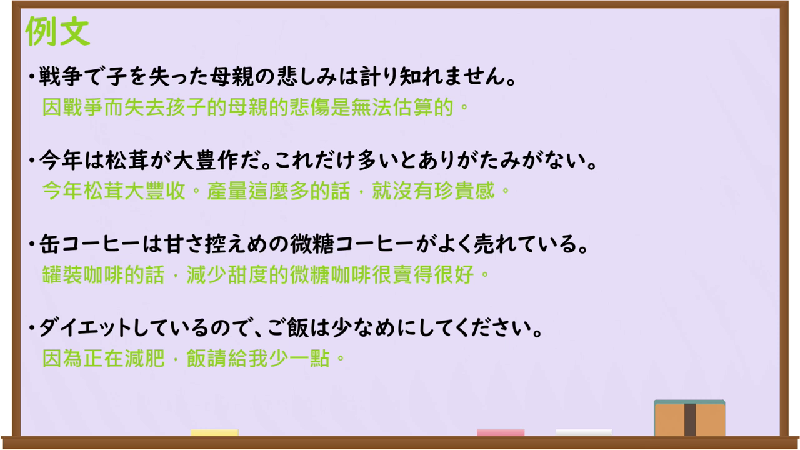

---
{
  "id":"N3-G-0061","kind":"grammar","level":"N3","title":"～み・～め：性质／感觉；偏……、适度……","status":"confirmed","card_revision":1,
  "source":{"lesson":"N3 第61个语法","material":"出口日語原视频板书、日语字幕与独立日文教学正文","video":"https://www.youtube.com/watch?v=8MQuEXzHwSc","screenshot":"assets/grammar/n3/N3-G-0061-0001.png","screenshot_seconds":1,"screenshot_crop":{"x":0,"y":0,"width":1000,"height":720}},
  "tags":["形容词名词化","性质感觉","程度倾向","N3"],"confusions":["～さ","～め","～み的词汇限制","ます形去ます＋め"],"created_at":"2026-09-13","updated_at":"2026-09-13","next_review":"2026-09-20"
}
---

# N3 第61课｜～み・～め

# 视频学习资料整理

按指定范围整理；学习者于2026-09-13确认入库，本卡从确认日开始七天复习周期。已核对播放列表第61项：标题「【Ｎ３文法】～み・～め」、视频ID `8MQuEXzHwSc`、时长09:55。

主图取自原视频00:01，原帧1920×1080，固定左上角裁为(0,0,1000,720)，保留标题、两种接续、性质／感觉／程度说明及课程例句；裁去右侧人物和空白，未重绘文字。

例句图取自原视频08:40（520秒），原帧1280×720，完整显示四句课程例句及中文说明，未裁切、重绘或拼接。

# 核心与接续

## **形容词词干＋み；形容词词干／动词ます形去ます＋め**

**～み**：把部分形容词名词化，表示某种感觉、性质或抽象特征；可用词有限，需按词汇记忆。**～め**：表示“偏……、稍微……、做得较……”，常见于调整程度或状态。

| 类型 | 接续规则 | 示例 |
|---|---|---|
| い形容词 | 去「い」＋み／め | 痛い→痛み；強い→強み／強め |
| な形容词 | 词干＋み（词汇限制）；词干＋め | 真剣→真剣み；控えめ（谨慎、少量） |
| 动词 | ます形去ます＋め（词汇有限） | 控えます→控えめ |

「～み」不是所有形容词都能接；如「痛み、悲しみ、苦み、甘み、強み、重み、深み、温かみ」是常见词。课程中的「痛さ」属于程度，“痛み”则是痛这种感觉／有无疼痛。 「～め」的「め」不是「目」；「強めに」「濃いめ」表示把程度调得偏强、偏浓。

# 语义边界、易混项及 JLPT 考点

- **み与さ**：～さ可广泛表示可测量的程度（高さ、痛さ）；～み词汇受限，偏感觉、性质或抽象特征（痛み、悲しみ）。不能由规则自由造出所有「形容词＋み」。
- 「強み」是“优势、长处”（性质），「強さ」是“强度”（程度）；语境决定译法。
- 「～め」通常表示“稍微偏……／较……”，可作名词或接助词「に」修饰动作：砂糖控えめ、濃いめにする；不是单纯比较级，也不是「もっと」的固定替代。
- 「～み」多为固定词，考试重点是词汇选择和「み／さ」意义辨析；「～め」重点是接续（词干或ます形去ます）及“适度调整”语义。

# 课程例句

1. 出産時の痛さは男性にはわからない。——男性无法理解分娩时的疼痛程度。（课程用来说明「痛さ」的程度。）
2. 歯に痛みを感じますか。——牙齿有疼痛感吗？（「痛み」聚焦感觉是否存在。）
3. このボタンで風の強さを調節します。——用这个按钮调节风力大小。（程度名词「強さ」。）
4. あなたの強みは何ですか。——你的优势是什么？（性质／长处「強み」。）
5. 今回は強めにパーマをかけました。——这次烫了偏卷／较强的烫发。
6. 父は濃いめの味付けが好きです。——父亲喜欢味道偏浓的调味。

# 自然例句（自拟）

- このスープは甘みが足りない。——这汤甜味不足。
- 失敗の悲しみを経験して、彼は強くなった。——经历失败的悲伤后，他变坚强了。
- 今日は少し早めに出発しましょう。——今天稍微早点出发吧。

# 来源与复核记录

核对日期：2026-09-13。原视频出口日語支持标题、板书接续、痛さ／痛み及強さ／強み对照、控えめ和课程例句；日语字幕结合画面校正。独立资料：[日本語教師のN1et「み」](https://jn1et.com/mi-keiyousimeisika/)说明形容词词干＋み、词汇限制及与～さ的抽象／程度区别；[絵でわかる日本語「み」](https://www.edewakaru.com/archives/29217331.html)用于复核接续、感觉／性质例词和例句。两份资料均指出～み不能机械套用所有形容词；本卡将「～め」的动词接续限于课程出现的控えめ等词汇，未扩展成任意动词规则。学习者已确认入库，确认日为2026-09-13，下次复习为2026-09-20。
