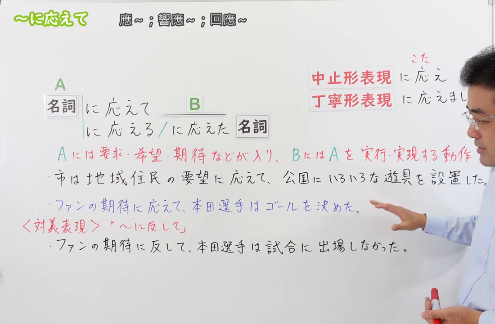
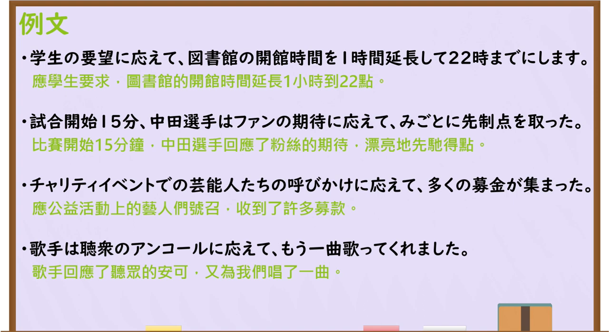

---
{
  "id": "N3-G-0063",
  "kind": "grammar",
  "level": "N3",
  "title": "～にこたえて(応えて)：响应……；满足……",
  "status": "confirmed",
  "card_revision": 1,
  "source": {
    "lesson": "N3 第63个语法",
    "material": "出口日語原视频板书、日语字幕与独立日文教学正文",
    "video": "https://www.youtube.com/watch?v=lFC05D19jxs",
    "screenshot": "assets/grammar/n3/N3-G-0063-0160.png",
    "screenshot_seconds": 160,
    "screenshot_crop": {
      "x": 0,
      "y": 0,
      "width": 1100,
      "height": 720
    }
  },
  "tags": [
    "响应要求",
    "实现期待",
    "书面语",
    "N3"
  ],
  "confusions": [
    "に反して",
    "に応じて",
    "に沿って",
    "応える与答える",
    "に応え"
  ],
  "created_at": "2026-09-13",
  "updated_at": "2026-09-13",
  "next_review": "2026-09-20"
}
---

# N3 第63课｜～にこたえて(応えて)

# 视频学习资料整理

按指定范围整理；学习者未提供个人原始输出或例句，不虚构理解判断。已核对播放列表第63项：标题「【Ｎ３文法】～に応えて」、视频ID `lFC05D19jxs`、时长05:07。学习者于2026-09-13确认入库，本卡从确认日开始七天复习周期。

先检查[原视频00:01](https://www.youtube.com/watch?v=lFC05D19jxs&t=1s)，该时点显示核心接续、含义提示和例句，但右侧人物遮挡 B 的说明及部分例句。主图改取[原视频02:40](https://www.youtube.com/watch?v=lFC05D19jxs&t=160s)：原帧1280×720，固定左上角裁为(0,0,1100,720)，保留名词接续、后接名词形式、中止形／礼貌形、A／B 含义、两句例句及「に反して」对照；尽量裁去右侧人物，仍保留少量未遮挡教学内容的人物区域，未抹除、重绘或拼接。

例句图取自[原视频03:40](https://www.youtube.com/watch?v=lFC05D19jxs&t=220s)，位于视频后半部分的例句页，完整显示四句课程例句及中文说明。原帧1280×720，固定左上角裁为(0,0,1280,700)，仅去除底部少量空白，未重绘或拼接。

# 核心与接续

## **A【名词】＋にこたえて(応えて)，B**

**响应 A 所表达的要求、希望、期待、呼吁等，采取行动或出现相应结果，使其得到实现。** 原视频中的 A 是被响应的内容，B 是为实现 A 而采取的动作或实际出现的响应结果。

| 类型 | 接续规则 | 示例 |
|---|---|---|
| 名词 | 名词＋にこたえて(応えて)，B | 学生の要望に応えて、開館時間を延長する。 |
| 名词 | 名词＋にこたえる(応える)＋名词 | 消費者のニーズに応える商品 |
| 名词 | 名词＋にこたえた(応えた)＋名词 | 要望に応えた改善 |

- 原视频板书还列出较硬的中止形「名词＋にこたえ(応え)，B」，以及很郑重的礼貌形式「名词＋にこたえまして(応えまして)，B」。它们不改变 A 与 B 的关系。
- A 常为「要求、要望、希望、期待、呼びかけ、声援、アンコール、リクエスト、ニーズ」等能被人响应的名词，不是任意名词。
- B 通常是动词句，说明对 A 作出的行动或实现结果。B 不一定是 A 所指对象亲自实施的动作；如课程中的「呼びかけに応えて、多くの募金が集まった」，也可以是人们响应呼吁后形成的结果。
- 后接名词时，原视频严格写作「に応える／に応えた＋名词」，不写「に応えての＋名词」。

# 语义边界与适用条件

1. **不是单纯“回答”。**「質問に答える」通常是回答问题；「期待に応える」「要望に応える」是以行动满足期待或要求。两者都读作「こたえる」，但常用汉字和搭配不同。
2. **重点是 A 得到响应。** 只是听见要求、知道期待，却没有相应行动或结果时，不能说已经「期待に応えた」。不过 B 不必达到完美结果，只要语境明确把行动当作对 A 的响应即可。
3. **常带积极的实现方向，但不等于结果一定成功。**「期待に応えて全力で戦った」说明按期待采取行动，不必保证最终获胜。
4. 「要求」可以表示合理请求，也可以是较强的要求；本句型本身不评价该要求是否正确。
5. 外部教学资料对 JLPT 等级的标注有 N2、N3 差异；JLPT 官方不公布固定语法清单。本资料按出口日語 N3 课程第63课收录，学习时以接续、含义和辨析为重点。

# 原课板书例句与讲解

1. 市は地域住民の要望に応えて、公園にいろいろな遊具を設置した。——市政府响应当地居民的要求，在公园设置了各种游乐设施。
2. ファンの期待に応えて、本田選手はゴールを決めた。——本田选手不负球迷期待，踢进了一球。
3. ファンの期待に反して、本田選手は試合に出場しなかった。——与球迷的期待相反，本田选手没有出场比赛。（原课用于对照第64课的「に反して」。）

# 课程例句

1. 学生の要望に応えて、図書館の開館時間を1時間延長して22時までにします。——应学生要求，图书馆将延长开放一小时，到22点闭馆。
2. 試合開始15分、中田選手はファンの期待に応えて、みごとに先制点を取った。——开赛15分钟，中田选手不负球迷期待，漂亮地取得了首开纪录的一分。
3. チャリティイベントでの芸能人たちの呼びかけに応えて、多くの募金が集まった。——响应艺人们在慈善活动中的号召，募集到了许多捐款。
4. 歌手は聴衆のアンコールに応えて、もう一曲歌ってくれました。——歌手响应听众的安可，又为大家唱了一首。

# 自然例句（自拟）

- 利用者の声に応えて、アプリの文字を大きくしました。——响应用户意见，我们把应用中的文字调大了。
- 地域の要望に応える施設を建設する予定です。——计划建设一座满足当地需求的设施。
- 皆様のご期待に応えまして、新しいサービスを開始いたします。——为回应各位的期待，我们将推出一项新服务。（郑重表达。）

# 易混项与 JLPT 考点

| 表达 | 重点 | 对照例 |
|---|---|---|
| にこたえて(応えて) | 响应要求、期待或呼吁，采取实现它的行动 | 要望に応えて時間を延長する |
| にはんして(反して) | 结果或行为与期待、预测、规则等相违背 | 期待に反して出場しなかった |
| におうじて(応じて) | 按条件、程度或变化作相应调整 | 人数に応じて部屋を変える |
| にそって(沿って) | 沿着方针、顺序、路线等进行 | 計画に沿って進める |

- **接续题**：核心只接名词；不要把动词普通形直接放在「に応えて」前。
- **搭配题**：「期待・要望・要求・呼びかけ・アンコール」常与「応えて」搭配；「人数・状況・予算」等变化条件通常检查「に応じて」。
- **活用题**：连接句子用「に応えて／に応え」；修饰名词用「に応える／に応えた」。
- **汉字题**：响应期待写「期待に応える」；回答问题一般写「質問に答える」。

# 来源与复核记录

核对日期：2026-09-13。原视频[出口日語](https://www.youtube.com/watch?v=lFC05D19jxs)支持名词接续、A 为要求／希望／期待等、B 为实现 A 的动作、修饰名词的「に応える／に応えた」、中止形「に応え」、礼貌形「に応えまして」、「に反して」对照及四句课程例句。自动字幕中的「名刺」按板书校正为「名詞」，「長袖のアンコール」按例句页校正为「聴衆のアンコール」。

独立资料：[たのすけ「～にこたえて」](https://tanosuke.com/nikotaete/)复核「名词＋にこたえて」、期待／要望等有限搭配、后项动词句、修饰名词时用「にこたえる」及与「に応じて」的差异；[日本語教師のN1et「にこたえて」](https://jn1et.com/nikotaete/)复核名词接续、书面中止形「にこたえ」和后接名词形式；[日本語NET「〜に応えて」](https://nihongokyoshi-net.com/2019/06/04/jlptn2-grammar-nikotaete/)复核满足希望、要求、期待的含义以及「お応えして」等实际用例。

资料差异处理：独立资料多将本句型列为 N2，而原课程列为 N3；本卡不把非官方分级差异改写成语法差异。关于 B，资料常概括为动词句，原课募金例句进一步显示 B 也可用动作所形成的结果；本卡据此写作“行动或响应结果”，未扩大为任意结果。

成稿复核：重新核对核心名词接续、修饰名词形式、中止形／礼貌形、A 的词汇限制、B 的响应关系、四句例句原文与译文，以及「応える／答える」「に応じて」「に反して」的边界。图片复核确认本卡恰有两张原视频图片：02:40接续图保留接续、含义、例句和易混项；03:40例句图完整显示四句课程例句。学习者已确认入库，确认日为2026-09-13，下次复习为2026-09-20。
