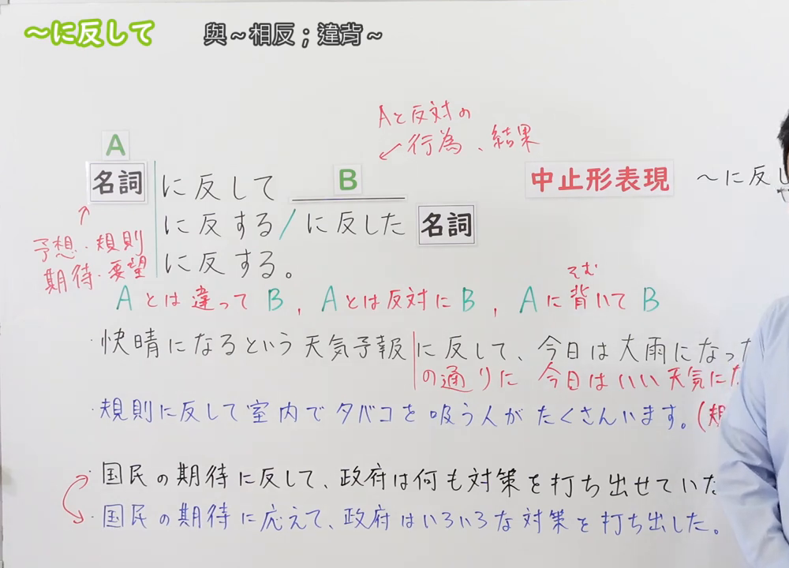
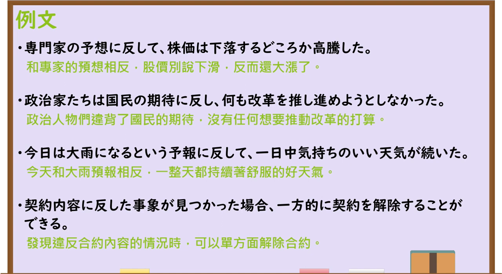

---
{
  "id": "N3-G-0064",
  "kind": "grammar",
  "level": "N3",
  "title": "～にはんして(反して)：与……相反；违背……",
  "status": "confirmed",
  "card_revision": 1,
  "source": {
    "lesson": "N3 第64个语法",
    "material": "出口日語原视频板书、日语字幕与独立日文教学正文",
    "video": "https://www.youtube.com/watch?v=F9uarI-B0i8",
    "screenshot": "assets/grammar/n3/N3-G-0064-0275.png",
    "screenshot_seconds": 275,
    "screenshot_crop": {
      "x": 0,
      "y": 0,
      "width": 1000,
      "height": 720
    }
  },
  "tags": [
    "预期相反",
    "违背规则",
    "书面语",
    "N3"
  ],
  "confusions": [
    "に応えて",
    "に対して（对比）",
    "に比べて",
    "どおりに",
    "に反し"
  ],
  "created_at": "2026-09-13",
  "updated_at": "2026-09-13",
  "next_review": "2026-09-20"
}
---

# N3 第64课｜～にはんして(反して)

# 视频学习资料整理

按指定范围整理；学习者未提供个人原始输出或例句，不虚构理解判断。已核对播放列表第64项：标题「【Ｎ３文法】～に反して」、视频ID `F9uarI-B0i8`、时长06:29。学习者于2026-09-13确认入库，本卡从确认日开始七天复习周期。

先检查[原视频00:01](https://www.youtube.com/watch?v=F9uarI-B0i8&t=1s)，该时点右侧人物遮挡 B、部分中止形和例句。主图改取[原视频04:35](https://www.youtube.com/watch?v=F9uarI-B0i8&t=275s)：原帧1280×720，固定左上角裁为(0,0,1000,720)，保留名词接续、后接名词与句末形式、中止形、A／B 关系、预测／规则／期待等搭配、三类释义、例句及「に応えて」对照；裁去大部分右侧人物，画面右缘仍保留少量人物，未抹除、重绘或拼接。

例句图取自[原视频05:00](https://www.youtube.com/watch?v=F9uarI-B0i8&t=300s)，位于视频后半部分的例句页，完整显示四句课程例句及中文说明。原帧1280×720，固定左上角裁为(0,0,1280,700)，仅去除底部少量空白，未重绘或拼接。

# 核心与接续

## **A【名词】＋にはんして(反して)，B**

**B 的结果、状态或行为与 A 所表达的预测、期待、意志、要求、规则等不同、相反或相违背。** 根据 A 的性质，可译为“与 A 相反／出乎 A 的预料／违背 A”。

| 类型 | 接续规则 | 示例 |
|---|---|---|
| 名词 | 名词＋にはんして(反して)，B | 予想に反して、株価は高騰した。 |
| 名词 | 名词＋にはんする(反する)＋名词 | 法律に反する行為 |
| 名词 | 名词＋にはんした(反した)＋名词 | 契約内容に反した事象 |
| 名词 | 名词＋にはんする(反する) | その行為は規則に反する。 |

- 原视频还列出较硬的中止形「名词＋にはんし(反し)，B」。它与「に反して」含义相同，常见于书面叙述。
- A 常为「予想、予報、期待、希望、要望、意志、意向、規則、法律、契約、教え」等可作为预期或规范基准的名词，不是任意两项对比。
- 「に反する＋名词」着重说明后面的事物违反或不符合 A；「に反した＋名词」把这种相违背关系作为已经成立的事实来修饰名词。实际语境中两者有重叠，不能只凭中文时态机械选择。

# 语义边界与适用条件

1. **预测／期待类**：B 是与原先想象不同的实际结果，常带出乎意料的语气，但“惊讶”是常见语感，不是每句都必须明确表达情绪。
2. **规则／意志类**：B 是违背规则、法律、契约、本人意愿等的行为或状态，重点是“不遵从”，不要求 B 与 A 构成字面上的正反词。
3. **不是普通比较。**「父は厳しいのに対して、母は優しい」是在并列对比两项；若没有被违反的期待、预测或规范，通常不用「に反して」。
4. **「反して」不自动表示坏结果。** 结果也可以好于预测，如「予想に反して株価が高騰した」。是否正面取决于语境。
5. 原视频把「に応えて」作为期待／要望场景中的反向表达：期待得到实现用「期待に応えて」；实际结果背离期待用「期待に反して」。但天气预报、规则等场景的相反项通常分别是「予報どおりに」「規則に従って」，不能把所有「に反して」都机械换成「に応えて」。

# 原课板书例句与讲解

1. 快晴になるという天気予報に反して、今日は大雨になった。——与会放晴的天气预报相反，今天下起了大雨。
2. 規則に反して室内でタバコを吸う人がたくさんいます。——有很多人违反规定在室内吸烟。
3. 国民の期待に反して、政府は何も対策を打ち出せていない。——与国民的期待相反，政府没能提出任何对策。
4. 国民の期待に応えて、政府はいろいろな対策を打ち出した。——政府响应国民期待，提出了各种对策。（原课用于对照第63课的「に応えて」。）

# 课程例句

1. 専門家の予想に反して、株価は下落するどころか高騰した。——与专家预测相反，股价别说下跌了，反而大幅上涨。
2. 政治家たちは国民の期待に反し、何も改革を推し進めようとしなかった。——政治家们辜负国民期待，完全不打算推进改革。
3. 今日は大雨になるという予報に反して、一日中気持ちのいい天気が続いた。——与今天会下大雨的预报相反，一整天都是令人舒适的好天气。
4. 契約内容に反した事象が見つかった場合、一方的に契約を解除することができる。——如果发现违反合同内容的情况，可以单方面解除合同。

# 自然例句（自拟）

- 予想に反して、会場はあまり混んでいなかった。——出乎预料，会场并不太拥挤。
- 本人の意志に反して、写真が公開された。——违背本人意愿，照片被公开了。
- 校則に反する行為には厳しい処分が下される。——违反校规的行为会受到严厉处分。

# 易混项与 JLPT 考点

| 表达 | 重点 | 对照例 |
|---|---|---|
| にはんして(反して) | 实际结果／行为背离预测、期待、意志或规范 | 予想に反して成功した |
| にこたえて(応えて) | 响应并实现要求、期待或呼吁 | 期待に応えて成功した |
| に対して（对比） | 并列呈现两项差异，不必违背预期 | 父は厳しいのに対して、母は優しい |
| にくらべて(比べて) | 以一项为比较标准 | 去年に比べて暑い |
| どおりに(通りに) | 结果或行动符合预测、计划、说明等 | 予報どおりに晴れた |

- **接续题**：本课只接名词；○「予想に反して」；×把动词普通形直接接在前面。
- **形式题**：连接句子用「に反して／に反し」；修饰名词用「に反する／に反した」；句末可用「に反する」。
- **搭配题**：看到「予想・期待・意志・規則・法律」等抽象基准，检查后项是否背离它；仅有两项性质不同，则优先考虑「に対して」。
- **语义题**：结果好于预测也能使用，不要把「に反して」误记成“产生坏结果”。

# 来源与复核记录

核对日期：2026-09-13。原视频[出口日語](https://www.youtube.com/watch?v=F9uarI-B0i8)支持名词接续、A 为预测／规则／期待／要望等、B 为与 A 相反或违背 A 的行为／结果、修饰名词的「に反する／に反した」、句末「に反する」、中止形「に反し」、「に応えて」对照及四句课程例句。自动字幕中的「名刺／明子」按板书校正为「名詞」，「好投した」按例句页与上下文校正为股价「高騰した」。

独立资料：[日本語教師のN1et「に反して」](https://jn1et.com/nihannsite/)复核只接名词、「に反して／に反し／に反する／に反した」等形式、预测／期待／意志等搭配和常带意外感的倾向；[たのすけ「～に反して」](https://tanosuke.com/nihanshite)复核名词接续、预测／法律／规则／意向等常见搭配、书面语性质，以及与「に対して」的差异；[日本語NET「〜に反して／〜に反する」](https://nihongokyoshi-net.com/2018/09/22/jlptn3-grammar-hanshite/)复核句中与修饰名词形式、预测／期待／意图搭配和规则／法律例句。

资料差异处理：资料对是否必有意外感的表述强弱不同，本卡采用“常带出乎意料语气，但不是必须明确表达情绪”；资料均支持名词接续和书面语倾向。原课将 A 扩展到要望，本卡保留该课程范围，同时用“常为”而非封闭词表，避免把搭配误写成绝对限制。

成稿复核：重新核对核心名词接续、修饰名词与句末形式、中止形、预测／期待类和规则／意志类的语义差异、四句例句原文与译文，以及「に応えて」「に対して」「どおりに」的边界。图片复核确认本卡恰有两张原视频图片：04:35接续图保留接续、含义、例句和易混项；05:00例句图完整显示四句课程例句。学习者已确认入库，确认日为2026-09-13，下次复习为2026-09-20。
