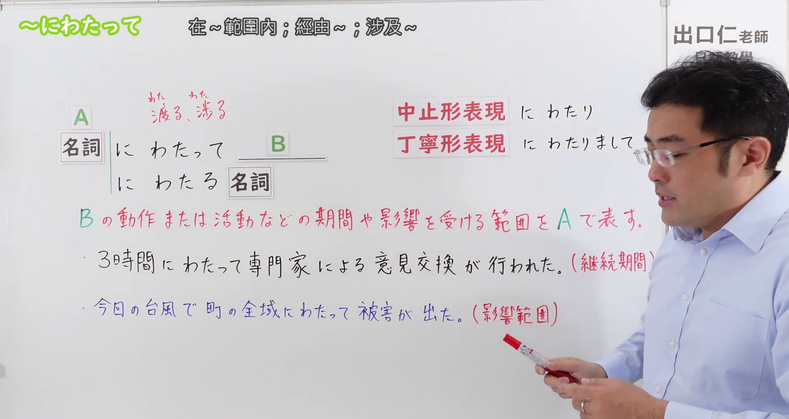
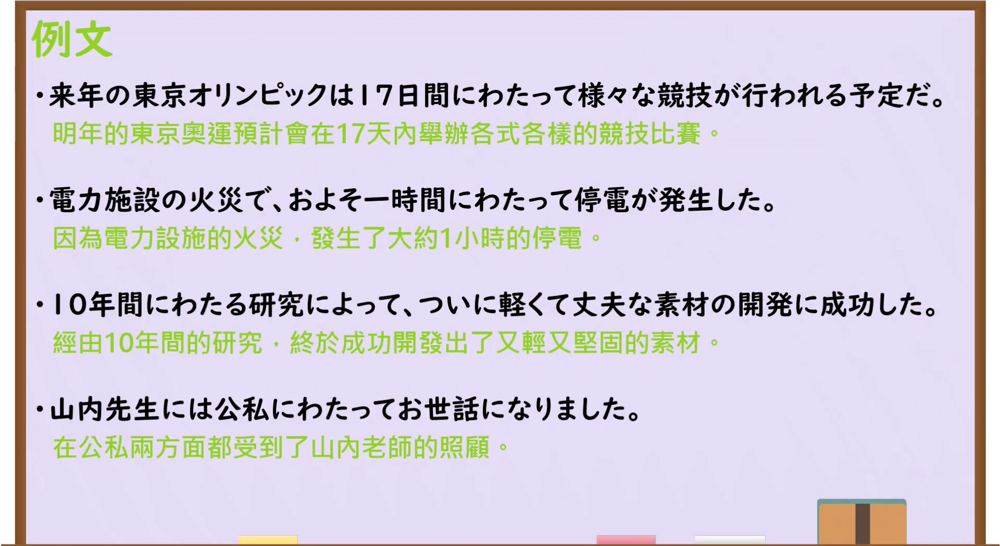

---
{
  "id": "N3-G-0068",
  "kind": "grammar",
  "level": "N3",
  "title": "～にわたって／～にわたる：历经……；遍及……",
  "status": "confirmed",
  "card_revision": 1,
  "source": {
    "lesson": "N3 第68个语法",
    "material": "出口日語原视频板书、日语字幕与独立日文教学正文",
    "video": "https://www.youtube.com/watch?v=yAumoMDB3Y8",
    "screenshot": "assets/grammar/n3/N3-G-0068-0150.png",
    "screenshot_seconds": 110,
    "screenshot_crop": {"x": 0, "y": 0, "width": 1920, "height": 1020}
  },
  "tags": ["期间范围", "空间范围", "影响范围", "持续", "N3"],
  "confusions": ["～から～にかけて", "～をつうじて(通じて)", "～をとおして(通して)", "にわたる与にわたって", "によって"],
  "created_at": "2026-09-13",
  "updated_at": "2026-09-13",
  "next_review": "2026-09-20"
}
---

# N3 第68课｜～にわたって・～にわたる

# 视频学习资料整理

按指定范围整理；学习者未提供个人原始输出或例句，不虚构理解判断。已逐项核对播放列表第68项：标题「【Ｎ３文法】～にわたって」、视频ID `yAumoMDB3Y8`、时长04:17。学习者于2026-09-13确认入库，本卡从确认日开始七天复习周期。

先检查[原视频00:01](https://www.youtube.com/watch?v=yAumoMDB3Y8&t=1s)，该时点人物遮挡中止形、礼貌体及含义说明的一部分。接续图改取[原视频01:50](https://www.youtube.com/watch?v=yAumoMDB3Y8&t=110s)：原帧1920×1080，固定左上角裁为(0,0,1920,1020)，仅裁去底部少量空白；保留名词接续、后接名词形式、中止形、礼貌体、期间／影响范围说明和两句板书例句。人物仍在右侧，为避免裁断教学内容而保留；其身体遮住礼貌体「にわたりまして」最末的一小部分，但该形式可由清晰日语讲解、板书其余文字及独立资料可靠确认。图片未抹除、重绘或拼接。

例句图取自[原视频02:41](https://www.youtube.com/watch?v=yAumoMDB3Y8&t=161s)，位于视频后半部分的例句页，完整显示四句课程例句及中文说明。原帧1920×1080，固定左上角裁为(0,0,1920,1050)，仅裁去底部少量边框，未重绘或拼接。

# 核心与接续

## **A【名词】＋にわたって，B／A【名词】＋にわたる＋名词／A【名词】＋にわたり，B／A【名词】＋にわたりまして，B**

A 表示 B 的动作、活动或状态**持续的期间**，或某件事的作用、影响**遍及的范围**。它把 A 当作一个整体范围来看，常带有期间较长、空间较广、次数较多或涉及多个方面的语感，可译为“历经……／长达……／遍及……／涉及……”。

| 类型 | 接续规则 | 示例 |
|---|---|---|
| 名词 | 名词＋にわたって，B | 17日間にわたって競技が行われる。 |
| 名词 | 名词＋にわたる＋名词 | 10年間にわたる研究 |
| 名词 | 名词＋にわたり，B | 3日間にわたり、会議が開かれた。 |
| 名词 | 名词＋にわたりまして，B | 長年にわたりまして、ご支援をいただきました。 |

- 「にわたり」是原课所列的中止形，较正式；「にわたりまして」是礼貌体连接形式。
- 本语法中的「わたる」通常写平假名。它源于「わたる(渡る／亘る)」的范围扩展意义，但卡片按原课形式使用平假名。
- 后接名词时使用「にわたる＋名词」，不能写成「にわたって＋名词」。

# 语义边界与适用条件

1. **期间范围**：A 表示动作、活动或状态持续、反复发生的整个时段，如「10年間にわたる研究」。不一定表示每分每秒毫无间断；17天内举行多种比赛也可使用。
2. **空间或影响范围**：A 表示事件、作用或影响覆盖的整体区域，如「町の全域にわたって被害が出た」。常与「全域、全体、広い範囲、全国」等体现广度的词搭配。
3. **次数与多方面范围**：可表示多次反复或跨越多个领域、方面，如「数回にわたって話し合う」「公私にわたって世話になる」「多岐にわたる問題」。
4. **带有范围广、期间长或次数多的语感，但不是机械的长度门槛。** 原课有「およそ一時間にわたって停電が発生した」；一小时本身不必绝对很长，但对停电这一事件而言是值得作为完整影响期间来强调的范围。
5. **A 通常是范围名词，不是普通动作原因。**「火災で、一時間にわたって停電した」中火灾用「で」表示原因，一小时才是「にわたって」标示的期间。

# 原课板书例句与讲解

1. 3時間にわたって専門家による意見交換が行われた。——专家们进行了长达三小时的意见交流。（A 是活动持续的期间，原课标注「継続期間」。）
2. 今回の台風で町の全域にわたって被害が出た。——这次台风使整个城镇都遭受了损失。（A 是受影响的范围，原课标注「影響範囲」。）

# 课程例句

1. 来年の東京オリンピックは17日間にわたって様々な競技が行われる予定だ。——明年的东京奥运会预计将在17天内举行各种比赛。（保留原视频制作时的课程原句及其时间表述。）
2. 電力施設の火災で、およそ一時間にわたって停電が発生した。——由于电力设施发生火灾，出现了约一小时的停电。
3. 10年間にわたる研究によって、ついに軽くて丈夫な素材の開発に成功した。——经过长达十年的研究，终于成功开发出轻便而坚固的材料。
4. 山内先生には公私にわたってお世話になりました。——无论公事还是私事，我都受到了山内老师的照顾。

# 自然例句（自拟）

- 三日間にわたって行われた会議が、ようやく終わりました。——持续三天的会议终于结束了。
- 大雨の影響で、県内全域にわたって道路が通行止めになりました。——受大雨影响，县内全境的道路都封闭了。
- この問題は教育、医療、福祉など多岐にわたる分野と関係しています。——这个问题涉及教育、医疗、福利等多个领域。
- 交渉は数回にわたり、最終的に合意に達しました。——谈判进行了多次，最终达成了协议。

# 易混项与 JLPT 考点

| 表达 | 重点 | 对照例 |
|---|---|---|
| にわたって（本课） | 把期间、空间、次数或方面作为整体范围，强调广度或跨度 | 10年間にわたって調査した |
| ～から～にかけて | 从起点到终点的大致范围，边界可以不精确 | 九州から関東にかけて雨が降る |
| ～をつうじて(通じて)／～をとおして(通して) | 在一个完整期间中始终如此；另有“通过某媒介”的用法 | 一年を通じて暖かい |
| によって | 原因、手段、动作主或变化要因，不表示范围本身 | 台風によって電車が止まった |

- **接续题**：接名词；连接句子用「にわたって／にわたり」，修饰名词用「にわたる＋名词」。
- **搭配题**：注意「期間、全域、広い範囲、数回、多岐、公私」等范围词。
- **语义题**：找出 A 是 B 的持续期间、覆盖范围、反复次数还是涉及方面，不能看到「に」就误判为原因。
- **近义辨析**：「一年を通じて暖かい」强调一年始终温暖；「一年にわたって調査した」强调调查跨越一年这一完整期间，不保证每天不间断。

# 来源与复核记录

核对日期：2026-09-13。原视频[出口日語](https://www.youtube.com/watch?v=yAumoMDB3Y8)支持名词接续、「にわたって／にわたる＋名词」、中止形「にわたり」、礼貌体「にわたりまして」、B 的动作或活动持续期间／影响所及范围两类核心解释、两句板书例句和四句课程例句。自动字幕中的「名刺」校正为「名詞」、「中止系／丁寧系」校正为「中止形／丁寧形」，例句字幕中的「協議」依清晰例句页校正为「競技」。

独立资料：[たのすけ「～にわたって」](https://tanosuke.com/m3-niwatatte)复核「名词＋にわたって／にわたる＋名词／にわたり」、整体范围、空间与时间范围、次数较多的语感，以及与「～から～にかけて」「～を通じて／通して」的差别；[日本語教師のN1et「にわたって」](https://jn1et.com/niwatatte/)复核期间或空间范围中后项持续、扩展的用法和「にわたって／にわたり／にわたる」形式；[日本語あれこれ「～にわたって」](https://nihongo-arekore.com/post-5173/)复核时间／场所的全部范围、中止形和后接名词形式，并提供广范围、长期作业等例证。

资料差异处理：部分外部教材把本语法编入N2，出口日語及另一些教学资料编入N3；JLPT官方并不公布逐项语法清单，本卡按学习者指定的N3课程编号归档。外部资料常概括为“长、广、多”，原课还明确用一小时停电说明影响期间；因此本卡将其写成常见语感，不误写成绝对时长门槛。原课板书包含「にわたりまして」，本卡保留该礼貌体，不改写成普通体。

成稿复核：重新核对播放列表序号、视频ID、四种板书形式、持续期间／影响范围的 A／B 关系、六句原课例句及译文，并复查与「～から～にかけて」「～を通じて／通して」「によって」的边界。图片复核确认本卡恰有两张原视频图片：01:50接续图保留接续、变体、含义和板书例句，并如实注明礼貌体末尾的少量人物遮挡；02:41例句图完整显示四句课程例句。学习者已确认入库，确认日为2026-09-13，下次复习为2026-09-20。
